 # 第二章 BIOS与MBR

## 载入内存

- cpu的硬件电路只能运行处于内存中的程序
  - 优点:速度快,容量大,统一不同的存储介质
- 程序载入内存的步骤
  1. 程序被加载器加载到内存某个区域
  2. CPU的cs:ip寄存器指向该程序的起始地址

---

---

## ★★ BIOS

- Base Input & Output System，即基本输入输出系统。
- Intel 8086 有 20 条地址线，可以访问 1MB 的内存空间，即 2 的 20 次方=1048576=1MB，地址范围是 0x00000 到 0xFFFFF
  - 但这20条地址总线**不是全部都给内存条使用**
  - 20条中一部分给外设，一部分给显存，一部分给...剩下的可用地址给内存条，也就是物理内存
  - 所以：32位机，就算安装了4GB内存条，但显示其内存也只有3.8GB左右
- **实模式下的 1MB 内存**布局
  - 
  - 顶部的 0xF0000～0xFFFFF，这 64KB 的内存是 ROM，存的是 **BIOS 的代码**
  - BIOS 的主要工作是**检测、初始化硬件**（硬件自己提供了一些初始化的功能调用，BIOS 直接调用就好了）
  - BIOS 在内存中的 0x000 至 0x3FF 区域**建立中断向量表**，可以通过**int 中断号**来实现相关的**硬件调用**，这是**`对硬件的 IO 操作，也就是输入输出`** ----> （解释了为什么 BIOS 叫做基本输入输出系统）

---

### BIOS的加载过程

1. BIOS是**计算机启动时第一个运行的软件**，它存储在只读存储器（ROM）中
2. **硬件加载**：BIOS 由硬件加载（ ROM 通过地址映射在低端 1MB 内存的顶部（地址 0xF0000 至 0xFFFFF））
3. **入口地址**：BIOS 的入口地址是 0xFFFF0。开机时，CPU 的**段寄存器（cs）和指令指针（ip）被强制初始化为 0xF000 和 0xFFF0**
4. **实模式下的地址计算**：在实模式下，段地址需要乘以 16，0xF000:0xFFF0 的**物理地址为 0xFFFF0**

### BIOS初始化过程

5. **跳转指令**：在 0xFFFF0 处的**跳转指令**（如 `jmp far f000:e05b`）指向 BIOS 代码的**实际位置**
6. **硬件检测**：BIOS 初始化后，会检测内存、显卡等硬件，当检测通过并初始化好硬件后，在内存中的 0x000 至 0x3FF 区域**建立中断向量表（IVT）**

### BIOS最后一项任务

7. 校验启动盘的**MBR**（主引导记录）
8. 检查MBR末尾的两个字节（魔数0x55和0xaa）来确认该扇区中存在可执行程序

---

---

## ★★ MBR

- 一开始位于启动盘**0盘 0道 1扇区**（固定该位置是为了节省启动时间）

- **MBR加载的位置**: 选择32KB内存的**最后1KB（即0x7c00）为MBR的加载地址**，确保不会覆盖系统的其他重要数据。

  - 32KB：**最小内存要求**: 操作系统（如DOS）需要32KB内存。

  - 1KB：MBR 的大小必须是 512 字节（但还要为其所用的栈分配点空间，就干脆给1KB）

    - 所以**0x55 和 0xaa 这两个魔数分别位与510和511字节处**

      ```assembly
      ;mbr.s文件
      SECTION MBR vstart=0x7c00 
      
      	...
      
          message db "hello MBR"      ;定义打印的字符串为hello MBR
          times 510-($-$$) db 0       ;$为本代码行的地址,$$为本section的起始地址,$-$$为本行到本 section的偏移量
                                      ;因为MBR 的最后两个字节是固定的内容，分别是 0x55 和 0xaa，要预留出这 2 个字节
                                      ;故本扇区内前 512-2=510 字节要填满, 所以db 0是用 0 将本扇区剩余空间填充
          db 0x55,0xaa                ;最后两个字节为固定的魔数,BIOS会检查这两个字节来识别这是一个有效的MBR
      ```

  - 0x7c00：与IBM PC 5150的BIOS设计有关，该位置是在BIOS中断处理程序（INT 19H）中硬编码的，旨在为加载MBR提供一个可靠的地址

### ▶ 代码（通过BIOS输出hello MBR）

```assembly
;主引导程序 
SECTION MBR vstart=0x7c00       ;本程序在编译时，告诉编译器，把我的起始地址编译为 0x7c00
    mov ax,cs                   ;此时cs寄存器为0，可以用来将ax寄存器置0
    mov ds,ax
    mov es,ax
    mov ss,ax
    mov fs,ax
    mov sp,0x7c00               ;将栈指针sp寄存器初始化为0x7c00,让栈有足够的空间向低地址方向扩展。

    ;清屏
    ;利用0x06号功能，上卷全部行，则可清屏
    mov ax, 0x600               ;ah中输入功能号
    mov bx, 0x700               ;设置上卷行属性，0x70表示用黑底白字的属性填充空白行
    mov cx, 0                   ;左上角: (0, 0)
    mov dx, 0x184f	            ;右下角: (80,25),
			                    ;VGA文本模式中,一行只能容纳80个字符,共25行,下标从0开始,所以0x18=24,0x4f=79
    int 0x10                    

    ;下面这三行代码是获取光标位置
    mov ah, 3		            ;输入: 3号子功能是获取光标位置,需要存入ah寄存器
    mov bh, 0		            ;bh寄存器存储的是待获取光标的页号

    int 0x10		            ;执行BIOS 0x10号中断,输出: ch=光标开始行,cl=光标结束行,dh=光标所在行号,dl=光标所在列号

    ;打印字符串
    ;还是用10h中断,不过这次是调用13号子功能打印字符串
    mov ax, message 
    mov bp, ax		           
    mov cx, 9		            ;要打印的字符串的长度
    mov ax, 0x1301	            ;ah=13h,al=01h,表示要打印字符串
    mov bx, 0x2		            ;bh存储要显示的页号,此处是第0页,bl中是字符属性, 属性黑底绿字(bl = 02h,07是黑底白字)
    int 0x10		            ;执行BIOS 0x10 号中断,打印字符串

    jmp $		                ;使程序悬停在此,即死循环

    message db "hello MBR"      ;定义打印的字符串为hello MBR
    times 510-($-$$) db 0       ;$为本代码行的地址,$$为本section的起始地址,$-$$为本行到本 section的偏移量.
                                ;因为MBR 的最后两个字节是固定的内容，分别是 0x55 和 0xaa，要预留出这 2 个字节
                                ;故本扇区内前 512-2=510 字节要填满, 所以db 0是用 0 将本扇区剩余空间填充
    db 0x55,0xaa                ;最后两个字节为固定的魔数,BIOS会检查这两个字节来识别这是一个有效的MBR

```

### BIOS与MBR

#### 地址类型

1. **0xFFFF0**（BIOS 入口点）
   - **类型**：物理地址。
   - **说明**：在实模式下，BIOS 的入口地址通常为 0xFFFF0。这是 BIOS 固件在启动时的加载位置。
2. **0x7C00**（MBR）
   - **类型**：物理地址。
   - **说明**：MBR通常在磁盘的第一个扇区，加载到内存时的地址为 0x7C00。

#### 地址关系

- 都在物理内存：在计算机启动时，BIOS 会将 MBR 从磁盘中读取到物理内存的 0x7C00 位置

---

## ★★★计算机启动过程

**电源开启**：计算机通电，BIOS 开始执行。

**BIOS 初始化**：BIOS 执行上电自检（POST），初始化硬件，并查找引导设备。

**BIOS 加载 MBR**：BIOS 读取引导设备的 MBR，将其加载到内存，并将控制权转交给 MBR 中的引导代码。

**MBR 执行引导代码**：MBR 中的引导代码执行，加载操作系统的引导加载程序或操作系统本身。

---

---

---

# 第三章 完善MBR

## ★★★ CPU工作原理


- **控制单元**要取下一条待运行的指令，该指令的地址在**程序计数器 PC** 中，在 x86CPU 上，程序计数器就是 **cs：ip**
- 读取 **ip 寄存器**后，将此地址送上地址总线，CPU 根据此地址便得到了指令，并将其存入到**指令寄存器 IR** 中
- 这时候轮到**指令译码器**上场了，它根据指令格式检查指令寄存器中的指令，先确定操作码是什么，再检查操作数类型，若是在内存中，就将相应**操作数**从内存中取到自己的存储单元，若操作数是在寄存器中就直接用了，免了取操作数这一过程
- 操作码有了，操作数也齐了，**操作控制器**给运算单元下令，开工，于是**运算单元**便真正开始执行指令了。ip 寄存器的值被加上当前指令的大小，于是 ip 又指向了下一条指令的地址
- 接着控制单元又要取下一条指令了，流程回到了本段开头

---

## 实模式下 CPU 内存寻址方式

- 寄存器寻址
- 立即数寻址
- 内存寻址
  - 直接寻址
  - 基址寻址
  - 变址寻址
  - 基址变址寻址

### 寄存器寻址

```assembly
mov ax, 0x10
mov dx, 0x9
mul dx
```

- 第一、二条指令源操作数都是立即数，所以也属于立即数寻址

### 立即数寻址

```assembly
mov ax,0x18
mov ds, ax
mov ax, macro_selector ; 宏
mov ax, label_star 	   ; 标号
```

- 第一条指令中的源操作数 0x18 是立即数，目的操作数 ax 是寄存器，所以它既是立即数寻址，也是寄
  存器寻址

### 内存寻址

- 前面两种寻址方式，**操作数一个是在寄存器中，一个是在指令中直接给出，它们都不在内存中**。操作
  数在内存中的寻址方式称为内存寻址。
- ~~寄存器寻址弊端：CPU 给程序员用的寄存器并不是很多，所以操作数一多起来的时候，基本就倒腾不开了~~
- ~~立即数寻址弊端：得提前知道立即数是多少。而且，大多数时候操作数位于内存中的某个位置，只知道操作数所在的内存地址，不知道操作数的值~~

#### 直接寻址

- **数字作为内存地址**，通过中括号的形式告诉 CPU，取此地址中的值作为操作数

```assembly
mov ax, [0x1234]
mov ax, [fs:0x5678]
```

- 0x1234 是**段内偏移地址，默认的段地址是 DS**。这条指令是将内存地址 DS：0x1234 处的值写入 ax 寄存器
- 第二条指令中，由于使用了**段跨越前缀 fs**，0x5678 的**段基址则变成了 gs 寄存器**。最终的内存地址是gs 寄存器的值*16+0x5678，CPU 到此内存地址取值再存入 ax 寄存器

#### 基址寻址

- 使用 **BX** 或 **BP** 寄存器作为基址，进行内存地址的计算（实模式下只能用这两个，保护模式不限）
- **BX寄存器**：
  - 默认段寄存器为 **DS**（数据段）。
  - 例如：指令 `ADD WORD [BX], 0x1234` 意味着将内存地址 `DS:BX` 处的值与 `0x1234` 相加，并存回 `DS:BX`。
- **BP寄存器**：
  - 默认段寄存器为 **SS**（栈段）。
  - 主要用于栈的访问，尤其在函数调用和局部变量管理中。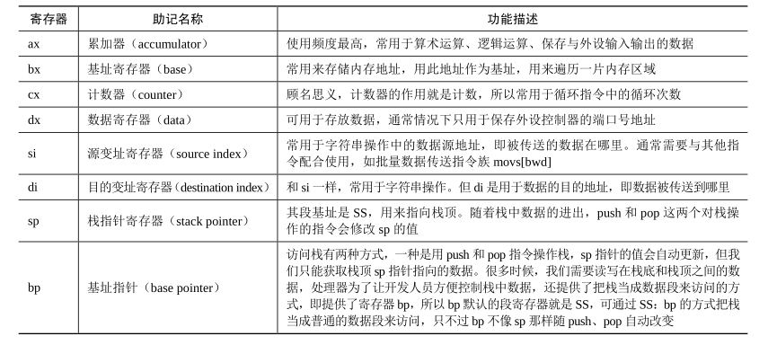
- 堆栈框架

#### 变址寻址

- 和基址寻址类似，只是寄存器由 bx、bp 换成了 si 和 di，默认段寄存器是 ds

  ```assembly
  mov [di]，ax  		;将 AX 寄存器的值存储到由 DI 寄存器指向的内存地址
  mov [si+0x1234], ax  ;将 AX 寄存器的值存储到由 SI 寄存器加上偏移量 0x1234 计算得出的内存地址
  ```

#### 基址变址寻址

- 基址寄存器 bx 或 bp 加一个变址寄存器 si 或 di，默认段寄存器是 ds

  ```assembly
  mov [bx+di], ax  ;将 ax 中的值送入以 ds 为段基址，bx+di 为偏移地址的内存
  add [bx+si], ax  ;将 ax 与[ds：bx+si]处的值相加后存入内存[ds：bx+si]
  ```

---

## 实模式下的ret

### 近返回ret

1. ret（return）指令的功能：在栈顶（寄存器 ss：sp 所指向的地址）弹出 **2 字节**的内容来替换 **IP** 寄存器，并会使 sp 指针+2
2. 如果 call 是**近调用**，在目标函数中就要用 ret 来返回，因为**近调用的 call 只在栈中留下了 2 字节的返回地址**（IP 寄存器的值），ret 只是从栈顶取得 2 个字节作为偏移地址载入 IP 寄存器

### 远返回retf

1. retf（return far）：从栈顶取得 **4 字节**，栈顶处的 2 字节用来替换 **IP** 寄存器，另外的 2 字节用来替换**CS** 寄存器
2. 如果 call 是**远调用**，在目标函数中就要用 retf（ret far）来返回，因为**远调用的 call 指令在栈中留下了段基址和段内偏移地址**，retf 指令只会从栈中弹出 2 字节的偏移地址和 2 字节的段基址

---

## 实模式下的call

- 调用函数

### 16 位实模式相对近调用

**1. 相对近调用概述**

- 相对近调用是指在同一个代码段内（即同一个 64KB 空间内）进行函数调用。
- 由于目标函数和当前指令位于同一个段，因此只需要给出目标函数的段内偏移地址，无需给出段基址。
- 这种调用方式使用 `call near` 指令，其中 `near` 可以省略。
- 指令格式为 `call near 立即数地址`，操作数为立即数。

**2. 相对近调用的操作数**

- 操作数不是目标函数的绝对地址，而**是目标函数地址相对于当前 `call` 指令地址的偏移量，即地址差**。
- 具体计算方法为：**目标函数地址 - 当前 `call` 指令地址 - 指令长度（3 字节）**。
- 操作数是一个有符号数，范围为 -32768 到 32767。

**3. 相对近调用的执行过程**

- **CPU 遇到 `call near` 指令时，会将当前 IP 寄存器值（即当前指令地址）压入堆栈，然后将操作数（相对地址增量）加到 IP 寄存器值上，并将结果作为新的 IP 寄存器值，从而跳转到目标函数的地址。**
- **目标函数执行完毕后，使用 `ret` 指令返回。`ret` 指令会从堆栈中弹出之前保存的 IP 寄存器值，并将其赋值给 IP 寄存器，从而返回到 `call` 指令的下一条指令处继续执行。**

**4. 相对近调用的优势**

- 由于操作数是相对地址，因此代码位置的改变不会影响指令的执行，提高了代码的可移植性。
- 相对地址的计算由编译器完成，简化了开发人员的工作。

**5. 示例代码分析**

```assembly
call near near_proc
jmp $
addr dd 4
near_proc：
	mov ax， 0x1234
	ret
```

`call near_proc` 指令的机器码为 `e8 06 00`。

- `e8` 是 `call near` 指令的操作码。
- `06 00` 是操作数，表示目标函数 `near_proc` 的地址相对于当前 `call` 指令地址的偏移量为 6。

bochs 的反汇编结果验证了这一点：

- 当前指令地址为 `0x900`。
- 目标函数地址为 `0x909`。
- 操作数为 `0x06`，即 `0x909 - 0x900 - 3 = 0x06`。

### 16 位实模式间接绝对近调用

**1. 间接绝对近调用概述**

- 间接绝对近调用是指通过寄存器或内存地址间接获取目标函数的绝对地址，并在同一个代码段内进行函数调用。
- 与“16 位相对近调用”不同，这种调用方式**不使用相对地址，而是直接使用目标函数的绝对地址**。
- 由于是近调用，目标函数和当前指令位于同一个代码段，因此只需要给出目标函数的段内偏移地址，无需给出段基址。

**2. 指令格式**

- 指令格式为 `call 寄存器寻址` 或 `call 内存寻址`。
- `call 寄存器寻址` 指令使用寄存器存放目标函数的地址，例如 `call ax`。
- `call 内存寻址` 指令使用内存地址存放目标函数的地址，例如 `call [0x1234]`。

**3. 操作码**

- `call 内存寻址` 指令的操作码为 `ff16`，机器码为 `ff16 + 16 位内存地址`。
- 寄存器寻址的机器码与寄存器名称有关，例如 `call ax` 的机器码为 `ffd0`，`call cx` 的机器码为 `ffd1`。

**4. 执行过程**

- **CPU 遇到 `call` 指令时，会将当前 IP 寄存器值（即当前指令地址）压入堆栈。**
- **然后根据指令格式，从寄存器或内存中获取目标函数的地址，并将其赋值给 IP 寄存器。**
- **最后，CPU 跳转到目标函数地址执行。**

**5. 示例代码分析**

```assembly
section call_test vstart=0x900
mov word [addr], near_proc
call [addr]
mov ax, near_proc
call ax
jmp $
addr dd 4
near_proc:
	mov ax, 0x1234
	ret
```

`call [addr]` 和 `call ax` 分别演示了间接绝对近调用的两种方式。

- 第 3 行 `call [addr]` 使用内存地址 `addr` 存放目标函数 `near_proc` 的地址。
- 第 5 行 `call ax` 使用 `ax` 寄存器存放目标函数 `near_proc` 的地址。

### 16 位实模式直接绝对远调用

### 16 位实模式间接绝对远调用


---

## 实模式下的 jmp

- `相对于call：jmp有去无返`

1. **短相对跳转 (jmp short)**：这种跳转类型使用一个有符号 8 位立即数作为偏移量，允许在当前指令的 -128 到 +127 字节内进行相对跳转。这条指令的操作码是 0xEB。

   ```assembly
   jmp short start
   ...
   start：
   	...
   ```

2. **近相对跳转 (jmp near)**：这种跳转类型使用一个有符号 16 位立即数作为偏移量，允许在当前指令的 -32,768 到 +32,767 字节内进行相对跳转。这条指令的操作码是 0xE9。

   ```assembly
   jmp near start
   ...
   start:
   	...
   ```

3. **近寄存器间接跳转 (jmp near reg)**：这种跳转类型使用一个寄存器中的 16 位值，例如 AX。这条指令的操作码是 0xFF。

   ```assembly
   mov ax， start
   jmp near ax
   ...
   start:
   	...
   ```

4. **直接绝对远转移 (jmp far)**：这种跳转类型直接提供目标地址的段基址和段内偏移地址。操作数是立即数形式的。操作数会被直接加载到 CS 寄存器和 IP 寄存器中，从而实现转移。

   ```assembly
   jmp 0：start
   ...
   start:
   	...
   ```

5. **间接绝对远转移 (jmp far mem)**：这种跳转类型的操作数在内存中。当不使用段跨越前缀时，段基址寄存器默认为 DS。操作数需要访问内存才能得到，因此需要知道寻址方式。操作数包含 4 个字节：段内偏移地址（2 字节）和段基址（2 字节）。由于是远转移，因此 CPU 的 CS 寄存器和 IP 寄存器都要被修改成操作数中指定的值。

   ```assembly
   jmp far [addr]
   ...
   addr dw start，0
   start:
   	...
   ```

---

## 标志寄存器 flags


- 第 0 位的是 CF 位，即 Carry Flag，意为进位。它可用于检测**无符号**数加减法**是否有溢出**，因为 CF 为 1 时，也就是最高位有进位或借位，肯定是溢出。
- 第 2 位为 PF 位，即 Parity Flag，意为奇偶位。用于标记结果低 8 位中 1 的个数，如果为偶数，PF 位为 1，否则为 0。
- 第 4 位为 AF 位，即 Auxiliary carry Flag，意为辅助进位标志，用来记录运算结果低 4 位的进、借位情况，即若低半字节有进、借位，AF 为 1，否则为 0。
- 第 6 位为 ZF 位，即 Zero Flag，意为零标志位。若计算结果为 0，此标志为 1，否则为 0。
- 第 7 位为 SF 位，即 Sign Flag，意为符号标志位。若运算结果为负，则 SF 位为 1，否则为 0。
- 第 8 位为 TF 位，即 Trap Flag，意为陷阱标志位。此位若为 1，用于让 CPU 进入单步运行方式，若为0，则为连续工作的方式。(debug 程序，在单步调试时，原理上就是让 TF 位为 1)
- 第 9 位为 IF 位，即 Interrupt Flag，意为中断标志位。若 IF 位为 1，表示中断开启，CPU 可以响应外部可屏蔽中断。若为 0，表示中断关闭，CPU 不再响应来自 CPU 外部的可屏蔽中断，但 CPU 内部的异常还是要响应的.
- 第 10 位为 DF 位，即 Direction Flag，意为方向标志位。此标志位用于字符串操作指令中，当 DF 为1 时，指令中的操作数地址会自动减少一个单位，当 DF 为 0 时，指令中的操作数地址会自动增加一个单位，意即给地址的变化提供个方向。
- 第 11 位为 OF 位，即 Overflow Flag，意为溢出标志位。若 OF 为 1，表示有溢出，为 0 则未发生溢出。专门用于检测**有符号数**运算结果**是否有溢出**现象。
- ...

---

## 有条件转移


a表示 above
b表示 below
c表示 carry
e表示 equal
g表示 great
j表示 jmp
l表示 less
n表示 not
o表示 overflow
p表示 parity

---

## 实模式的缺点

1. 实模式下没有特权级，用户程序和操作系统平起平坐
2. 程序可以随意修改自己的段基址，可以随意访问任意物理内存，包括访问操作系统所在的内存数据

----

## IO接口（in/out指令)

### 背景

CPU 与外部设备通信的挑战：

- 外部设备种类繁多，特性各异，数据格式、工作时序、信号电平等方面都存在差异。
- CPU 速度远高于外部设备，直接与每个设备交互会造成 CPU 等待时间过长，效率低下。

### 概述

IO 接口的引入：

- 作用： **CPU 和外部设备之间的代理，负责协调双方之间的差异，简化 CPU 的操作**。
- IO 接口可以是电路板、芯片或插槽，负责速度匹配、信号转换、数据格式转换、时序控制等功能。
- IO 接口可以分为硬件和软件两部分：
  - 硬件部分负责实际的协调转换工作。
  - 软件部分包括驱动程序和数据传输程序，控制接口电路的运作。

IO 接口的分类：

- 可编程接口芯片：可以根据需要设置工作模式，支持多种功能，允许多个设备共享同一个接口。
- 不可编程接口芯片：功能简单，不需要设定即可使用。

具体例子：

- ###### USB 接口：用于连接外部设备，如键盘、鼠标、打印机等。

- ###### PCI/PCIe 插槽：用于连接各种扩展卡，如显卡、网卡、声卡等。


### ★★IO 接口的控制编程

- 通过软件指令控制 IO 接口的功能和工作模式，实现定制化的功能。

- 使用端口读写指令 (in/out) 来实现 IO 接口的控制编程。

  #### `in` 指令

  - **作用**: 从指定端口读取数据到寄存器。
  - **语法**: `in al, dx` 或 `in ax, dx` 或 `in eax, dx`
    - `al`, `ax`, 或 `eax` 是目标寄存器。
    - `dx` 是端口号。

  #### `out` 指令

  - **作用**: 将寄存器中的数据写入指定端口。
  - **语法**: `out dx, al` 或 `out dx, ax` 或 `out dx, eax`
    - `al`, `ax`, 或 `eax` 是源寄存器。
    - `dx` 是端口号。

 ```assembly
 mov dx, 0x3F8    ; 设置端口号，通常是串口
 in al, dx        ; 从端口读取一个字节到al
 out dx, al       ; 将al中的字节写回到端口
 ```


### 功能

- 设置数据缓冲区，解决速度不匹配问题。
- 设置信号电平转换电路，解决信号电平差异问题。
- 设置数据格式转换电路，解决数据格式差异问题。
- 设置时序控制电路，同步 CPU 和外部设备的工作时序。
- 提供地址译码，实现对多个端口的访问。

### 其他

总线：

- 作用：**连接 CPU 和外部设备的物理链路，是一组电线，用于传输信号**。
- 主板上的各种插槽都是连接到总线上的。
- 总线可以分为不同的类型，如地址总线、数据总线、ISA 总线等。

南桥芯片：

- 作用：**仲裁 IO 接口的竞争，连接各种内部总线**。

- 南桥芯片负责连接各种低速设备，如硬盘、USB、PCI 设备等。

- 南桥芯片内部集成了一些 IO 接口，并提供 PCI 接口用于扩展其他设备。

  

端口：

- 作用：**是 IO 接口内部的寄存器，用于与 CPU 进行数据交互**。
- 为了区别于 CPU 内部的寄存器，IO 接口中的寄存器称为端口。
- in 指令用于从端口读取数据。
- out 指令用于向端口写入数据。

### ★★★ IO接口，cpu，外部设备，总线，南桥芯片，端口之间的关系

 IO 接口是连接 CPU 和硬件的桥梁，一端是 CPU，另一端是硬件。IO接口通过总线连接CPU和外部设备。当同时有很多的IO接口想与CPU通信时，需要南桥芯片来协调各个IO接口。而IO接口被设计成需要使用寄存器才能与CPU 通信，因此IO接口中的寄存器被称为端口，用于与 CPU 进行数据交互

---

## 显存、显卡、显示器

- 关系：**显卡（硬件组件，包括GPU）通过显存（显卡里的物理内存）进行图形数据的存取和处理，然后通过 I/O 接口（如PCI/PCIe 插槽）将处理后的图像输出到显示器**

- 黑白图形模式: 显存中的对应位置为 1，屏幕上的相应像素就被点亮，呈现的是白色。若该位为 0，该像素就不会被点亮，只要不管该像素就是黑色

- 真彩色: 24 个 bit 表示一个颜色，即24 位对应一个像素

### ▶ 代码（通过显卡输出hello MBR）

```assembly
;主引导程序 
SECTION MBR vstart=0x7c00      
    mov ax,cs                  
    mov ds,ax
    mov es,ax
    mov ss,ax
    mov fs,ax
    mov sp,0x7c00       

    ;往gs寄存器中存入段基址
    mov ax,0xb800   ;由于显存文本模式中，其内存地址是 0xb8000，实模式下内存分段访问策略是“段基址*16+段内偏移地址”
    mov gs,ax       ;所以由0xb8000得到的段基址是其除以16,也就是右移4位，得：0xb800

    mov ax, 0x600              
    mov bx, 0x700              
    mov cx, 0                  
    mov dx, 0x184f	           
			                   
    int 0x10
    
    ; 输出背景色绿色，前景色红色，并且跳动的字符串"1 MBR"
    mov byte [gs:0x00],'h'              ; gs为段跨越前缀，指定gs为段基址
    mov byte [gs:0x01],0xA4             ; A表示绿色背景闪烁，4表示前景色为红色

    mov byte [gs:0x02],'e'
    mov byte [gs:0x03],0xA4

    mov byte [gs:0x04],'l'
    mov byte [gs:0x05],0xA4   

    mov byte [gs:0x06],'l'
    mov byte [gs:0x07],0xA4

    mov byte [gs:0x08],'o'
    mov byte [gs:0x09],0xA4

    mov byte [gs:0x0a],' '
    mov byte [gs:0x0b],0xA4

    mov byte [gs:0x0c],'M'
    mov byte [gs:0x0d],0xA4

    mov byte [gs:0x0e],'B'
    mov byte [gs:0x0f],0xA4

    mov byte [gs:0x10],'R'
    mov byte [gs:0x11],0xA4

    jmp $

    times 510-($-$$) db 0
    db 0x55,0xaa
```


---

## bochs

### 简介

1. 是一个开源 x86 虚拟机软件，支持硬件级别上的调试
2. bochs 的调试风格参照 gdb 来设计
3. 八进制（零开头）：011
   十进制：11
   十六进制（0x开头）：0x11

### Bochs 调试命令分类

- **Debugger control** 类：控制调试器行为，例如退出调试状态、设置寄存器值、显示模式信息等。
- **Execution control** 类：控制程序执行，例如继续执行、单步执行、执行下一条指令等。
- **Breakpoint management** 类：管理断点，例如设置断点、删除断点、禁用/启用断点等。
- **CPU and memory contents** 类：查看 CPU 和内存内容，例如查看内存内容、查看寄存器值、查看堆栈信息等。

### 常用调试命令介绍

#### Debugger control类

- `q|quit|exit`: 退出调试状态，关闭虚拟机。
- `set`: 设置寄存器值或其他选项，例如 `set reg = val` 设置寄存器值，`set u on|off` 设置是否反汇编指令。
- `show`: 显示信息，例如 `show mode` 显示模式信息，`show int` 显示中断信息，`show call` 显示函数调用信息。
- `traceon|off`: 设置是否在单步调试时反汇编代码。
- `u|disasm`: 反汇编代码。
- `ctrl+c`: 中断执行，回到 Bochs 控制台。

#### Execution control类

- `c|cont|continue`: 继续执行。
- `s|step`: 单步执行。
- `p|n|next`: 执行下一条指令。

#### Breakpoint management类

- `vb|vbreak`: 设置虚拟地址断点。
- `lb|lbreak`: 设置线性地址断点。
- `pb|pbreak|b|break`: 设置物理地址断点。
- `sb`: 设置指令数断点。
- `sba`: 设置 CPU 执行指令数断点。
- `watch`: 设置读写断点。
- `blist`: 显示所有断点信息。
- `bpd|bpe`: 禁用/启用断点。
- `d|del|delete`: 删除断点。

#### CPU and memory contents类

- `x`: 显示线性地址的内容。
- `xp`: 显示物理地址的内容。
- `setpmem`: 设置物理内存内容。
- `r|reg|regs|registers`: 显示寄存器值。
- `ptime`: 显示 Bochs 自启动之后，总执行指令数。
- `print-stack`: 显示堆栈信息。
- `?|calc`: 内置计算器。
- `info`: 显示信息，例如 `info pb` 查看断点信息，`info CPU` 显示 CPU 所有寄存器值，`info idt` 显示中断向量表 IDT，`info gdt` 显示全局描述符表 GDT，`info flags` 显示状态寄存器，`info tab` 显示页表信息。

### 常见调试步骤

> 调试 `#GP General Protection Exception` 的步骤如下

1. 启动调试

   - 使用 `show int` 命令查看中断状态。

   - 运行程序，使用 `c` 命令继续执行。


2. 查找异常
   - 观察控制台输出，注意到 `exception (not softint)` 行，确定异常发生的位置（如 `0008:c0001e1b`）。


3. 确定中断处理函数

   - 使用 `nm` 命令查找中断处理函数的符号信息：
     ```bash
     nm build/kernel.bin | grep 1e1b
     ```

   - 确认函数名（如 `intr##0x0d##entry`），这表明是 GP 异常的处理。


4. 设置断点

   - 在异常处理函数入口设置断点：
     ```bash
     lb 0xc0001e1b
     ```

   - 使用 `c` 命令继续执行，捕获到断点。


5. 查看寄存器状态
   - 使用 `r` 命令查看寄存器状态，特别是 `ebx` 和 `gs` 的值，检查是否存在无效的内存访问。


6. 检查内存

   - 使用 `sreg` 查看段寄存器的状态，确认 `gs` 段的基址和限制。

   - 使用 `x gs:ax` 检查内存，观察是否有超出范围的访问。


7. 分析段描述符
   - 使用 `info gdt 3` 查看 GDT 中的段描述符，确认段的 `limit` 是否足够。


8. 执行并验证

   - 逐步执行引发异常的指令：
     ```bash
     s
     ```

   - 如果再次触发 GP 异常，回到中断处理函数，分析错误原因。


9. 修复错误
   - 根据调试信息，修正代码中的越界访问错误，确保访问的内存地址在合法范围内。


10. 重复测试
    - 重新编译并测试程序，确保问题已解决，不再引发 GP 异常。


---

## 硬盘

- **硬盘控制器属于 IO 接口**，cpu通过硬盘控制器来与硬盘交流
- 因此硬盘控制器拥有端口，也就是它里面的寄存器。让硬盘工作，我们就需要读写硬盘控制器的端口

### ★★ 硬盘操作方法

- **硬盘读或写操作**的基本顺序
  1. **选择通道**：指定要操作的硬盘通道。
  2. **写入扇区数**：将待操作的扇区数写入 sector count 寄存器。
  3. **设置 LBA 地址**：将扇区起始地址的低 24 位写入 LBA 寄存器，并在 device 寄存器中设置 LBA 模式及选择硬盘。
  4. **写入命令**：将具体的操作命令（如读或写）写入 command 寄存器。
  5. **检查状态**：读取 status 寄存器，判断硬盘是否完成操作。
  6. **判断操作类型**：如果是读操作，继续下一步；如果是写操作，则结束。
  7. **读取数据**：从硬盘将数据读出。

- 硬盘工作完成后，它已经准备好了数据，通过下面**五种方式进行数据传送**

  （1）**无条件传送方式**：随时准备好了数据，CPU 随时取随时拿都没问题（如：寄存器、内存）

  （2）**查询传送方式**：也称为程序 I/O、PIO，传输之前，每次都由程序先去检测设备的状态（CPU花在查询上的时间多，效率低）

  （3）**中断传送方式**：也称为中断驱动 I/O，当数据源设备准备好数据后，硬盘控制器通过发中断来通知 CPU 来拿数据（避免CPU浪费时间在查询上，效率较高。但中断时，CPU就需要压栈出栈，浪费其资源）

  （4）**直接存储器存取方式（DMA）**：“直接”体现在 不让 CPU参与传输，完全由数据源设备和内存直接传输。CPU 直接到内存中拿数据就好了。（和中断比，它方便快捷。但DMA由硬件实现，需要DMA控制器）

  （5）**I/O 处理机传送方式**：在DMA基础上再引入I/O 处理机，专门用于处理 IO。（CPU彻底不用管了）

---

## 让MBR使用硬盘

### ▶ 代码

mbr.s

```assembly
;主引导程序 
%include "boot.inc"     ;nasm 编译器中的预处理指令,让编译器在编译之前把 boot.inc 文件包含进来
SECTION MBR vstart=0x7c00         
    mov ax,cs      
    mov ds,ax
    mov es,ax
    mov ss,ax
    mov fs,ax
    mov sp,0x7c00
    mov ax,0xb800
    mov gs,ax

    ; 清屏
    mov ax, 0600h
    mov bx, 0700h
    mov cx, 0                      
    mov dx, 184fh		           		                   
				                   
    int 10h                        

    ; 输出字符串:MBR
    mov byte [gs:0x00],'1'
    mov byte [gs:0x01],0xA4

    mov byte [gs:0x02],' '
    mov byte [gs:0x03],0xA4

    mov byte [gs:0x04],'M'
    mov byte [gs:0x05],0xA4	        ;A表示绿色背景闪烁，4表示前景色为红色

    mov byte [gs:0x06],'B'
    mov byte [gs:0x07],0xA4

    mov byte [gs:0x08],'R'
    mov byte [gs:0x09],0xA4
	 
    ;下面三行为rd_disk_m_16 函数传递参数（用寄存器传递，这里用到eax、bx、cx 寄存器）
    mov eax,LOADER_START_SECTOR	    ; 待读入的起始扇区lba地址
    mov bx,LOADER_BASE_ADDR         ; 数据从硬盘读进来后，将其写入的内存地址
    mov cx,1			            ; 待读入的扇区数，因为此时大小不会512字节，因此1扇区即可

    call rd_disk_m_16		        ; ★★★调用函数 rd_disk_m_16 读取硬盘的一个扇区，从硬盘读取 loader 程序到指定的内存地址
  
    jmp LOADER_BASE_ADDR            ; ★★★跳转到 loader 的起始地址，执行 loader 程序
       

; 功能: 读取硬盘 n 个扇区的函数
rd_disk_m_16:
    ; eax = LBA 扇区号
    ; ebx = 将数据写入的内存地址
    ; ecx = 读入的扇区数

    mov esi, eax  ; 备份 EAX 寄存器的值（LBA 扇区号）
    mov di, cx    ; 备份 ECX 寄存器的值（待读入的扇区数）

    ; 通过下面五步进行磁盘读取
    ; 第一步：选择特定通道的寄存器，设置要读取的扇区数
    mov dx, 0x1f2  ; 选择端口 0x1f2
    mov al, cl     ; 设置要读取的扇区数
    out dx, al     ; 写入到端口

    mov eax, esi   ; 恢复 EAX 寄存器的值

    ; 第二步：将 LBA 地址的各部分写入端口 0x1f3 ~ 0x1f6
    mov dx, 0x1f3  ; 设置 LBA 地址的低 8 位
    out dx, al     ; 写入到端口

    mov cl, 8      ; 将 EAX 寄存器右移 8 位，设置 LBA 地址的 15~8 位
    shr eax, cl
    mov dx, 0x1f4
    out dx, al

    shr eax, cl    ; 将 EAX 寄存器右移 8 位，设置 LBA 地址的 23~16 位
    mov dx, 0x1f5
    out dx, al

    shr eax, cl    ; 将 EAX 寄存器右移 8 位，设置 LBA 地址的 27~24 位
    and al, 0x0f   ; 只保留低 4 位
    or al, 0xe0    ; 设置高 4 位为 1110，表示 LBA 模式
    mov dx, 0x1f6
    out dx, al

    ; 第三步：向 0x1f7 端口写入读命令，0x20
    mov dx, 0x1f7
    mov al, 0x20  ; 设置读命令
    out dx, al   ; 写入到端口

    ; 第四步：检测硬盘状态，等待硬盘准备好数据传输
.not_ready:
    nop         ; 相当于 sleep，等待
    in al, dx   ; 从端口读取硬盘状态
    and al, 0x88  ; 检查第 4 位和第 7 位
    cmp al, 0x08  ; 如果第 4 位为 1，表示硬盘控制器已准备好数据传输
    jnz .not_ready  ; 如果未准备好，继续等待

    ; 第五步：从 0x1f0 端口读数据
    mov ax, di  ; 获取待读入的扇区数
    mov dx, 256  ; 每个扇区 512 字节，一次读取 2 字节，共需读取 256 次
    mul dx      ; 计算总读取次数
    mov cx, ax  ; 将总读取次数存入 CX 寄存器
    mov dx, 0x1f0  ; 设置数据端口

.go_on_read:
    in ax, dx    ; 从端口读取数据
    mov [bx], ax  ; 将数据写入内存
    add bx, 2    ; 增加内存地址指针
    loop .go_on_read  ; 循环读取，直到 CX 为 0

    ret  ; 返回，回到调用 rd_disk_m_16 的地方

    times 510-($-$$) db 0  ; 填充到 510 字节
    db 0x55, 0xaa  ; MBR 签名
```

loader.s

```assembly
%include "boot.inc"
section loader vstart=LOADER_BASE_ADDR  ; 定义代码段的起始地址为 LOADER_BASE_ADDR

; 输出背景色绿色，前景色红色，并且跳动的字符串"2 LOADER"
mov byte [gs:0x00],'2'
mov byte [gs:0x01],0xA4             ; A表示绿色背景闪烁，4表示前景色为红色

mov byte [gs:0x02],' '
mov byte [gs:0x03],0xA4

mov byte [gs:0x04],'L'
mov byte [gs:0x05],0xA4   

mov byte [gs:0x06],'O'
mov byte [gs:0x07],0xA4

mov byte [gs:0x08],'A'
mov byte [gs:0x09],0xA4

mov byte [gs:0x0a],'D'
mov byte [gs:0x0b],0xA4

mov byte [gs:0x0c],'E'
mov byte [gs:0x0d],0xA4

mov byte [gs:0x0e],'R'
mov byte [gs:0x0f],0xA4

jmp $		                        ; 通过死循环使程序悬停在此

```

boot.inc

```assembly
; loader和kernel
LOADER_BASE_ADDR equ 0x900 ;相当于c语言的#define LOADER_BASE_ADDR 0x900
                           ;定义了 loader 在内存中的位置,MBR 要把 loader 从硬盘读入后放到此处
                           ;即后面 loader 会存在内存地址 0x900 处
LOADER_START_SECTOR equ 0x2 ;loader 程序在硬盘上的起始扇区
```


### ★★★ 代码讲解

> `mbr.s` 的作用主要是引导计算机的启动过程。它位于硬盘的第一个扇区（MBR，主引导记录），由 BIOS 加载并执行。
>
> `mbr.s` **成功将 loader 程序从硬盘读取到内存中，并跳转到 loader 程序的起始地址开始执行**

1. **初始化硬件环境**：

   - 设置段寄存器（CS、DS、ES、SS、FS）和栈指针（SP），确保程序可以正确访问内存和使用栈。

2. **清屏操作**：

   - 使用 BIOS 中断清除屏幕，并设置屏幕显示的模式，以便后续的输出操作。

3. **输出信息**：

   - 在屏幕上显示一个简单的字符串（如 "1 MBR"），用于表明 MBR 程序已经成功加载并开始执行。

4. **准备读取 loader**：

   - 设置 `eax` 为 `LOADER_START_SECTOR`（loader 在硬盘上的起始扇区），`bx` 为 `LOADER_BASE_ADDR`（将数据从硬盘读入的内存地址），`cx` 为 `1`（待读入的扇区数）。

5. **★★★调用 `rd_disk_m_16` 函数**：

   - 调用 

     ```
     rd_disk_m_16
     ```

      函数读取硬盘上的 loader 程序。该函数执行以下步骤：

     - 设置待读取的扇区数。
     - 将 LBA 地址写入相应端口。
     - 向硬盘发送读命令。
     - 等待硬盘准备好数据传输。
     - 从硬盘读取数据并写入内存。

6. **★★★跳转到 loader 程序**：

   - 读取完成后，使用 `jmp LOADER_BASE_ADDR` 跳转到 loader 程序的起始地址（`0x900`）执行。

---

---

---

 # 第四章 保护模式入门

- 实模式，指的是 32 位的 CPU 运行在 16 位模式下的状态
- 开机时，32 位的 CPU 是先处于实模式，之后再进入保护模式的
- 加入保护模式的三个步骤：

  **（1）打开 A20。**
  **（2）加载 gdt。**
  **（3）将 cr0 的 pe 位置 1。**

## 保护模式相对于实模式的拓展

### 寄存器拓展


#### 80286

- 80286是8086的下一代，但**有了保护模式**
- 因为有保护模式，所以引入数据结构：**全局描述符表**
  - 表中至少有一个表项，其中每一个表项称为段描述符，其大小为 64 字节，用来描述各个内存段的起始地址、大小、
    权限等信息。
  - 但：段描述符是**在内存中**，访问内存对 CPU 来说是比较慢的动作，**效率不高**。
  - 但：段描述符的格式很奇怪，一个**数据要分三个地方存**，所以将这些数据拼起来很**费时间**。
  - 综上：为了提高获取段信息的效率，引入**段描述符缓冲寄存器**，将段信息用一个寄存器来缓存。以后每次访问相同的段时，就直接读取该段寄存器对应的段描述符缓冲寄存器。该缓存内容的失效时间为：只要往段寄存器中赋值（即更新选择子），CPU 就会重新访问全局描述符表，再将获取的段信息重新放回段描述符缓冲寄存器
- 偏移地址和实模式一样
- 段寄存器中保存的不是段基址，而是**“选择子”**，该选择子就是个**数**，用这个数来**索引全局描述符表中的段描述符**（把全局描述符表当成数组，选择子就像数组下标一样）

#### ★★★ 8086、80286以及80386

| CPU型号 | 位数 | 地址线位数 | 内存大小              | 段基址位数 | 寄存器位宽 |
| ------- | ---- | ---------- | --------------------- | ---------- | ---------- |
| 8086    | 16位 | 20条       | 1 MB（20位地址空间）  | 16位       | 16位       |
| 80286   | 16位 | 24条       | 16 MB（24位地址空间） | 24位       | 16位       |
| 80386   | 32位 | 32条       | 4 GB（32位地址空间）  | 32位       | 32位       |

- 8086与80286被淘汰
  - **是 24 位段基址，段内相对偏移地址还是必不可少的。用于寻址的通用寄存器还是 16 位，即单独的一个寄存器还是只能访问 64KB 的空间。如果用寄存器作为段内偏移地址，段的大小还是 64KB，这就白白浪费了 24 位段基址的优势，要是想访问完整的 16MB 内存，依然要不断地变换段基址**，所以 80286 很快就被淘汰了
  -  **寻址限制**
    - **段大小限制**：在 80286 和 8086 的 16 位架构中，**段内偏移地址最大为 64KB**（因为寄存器位宽都为16位）。每个段的地址范围从 0 到 65535（2^16 - 1），这意味着**每个段无法超过 64KB**。
    - **影响大型应用**：对于现代应用程序，尤其是需要大量数据或执行复杂算法的程序，64KB 的限制显得非常狭窄。开发者必须分割数据和代码到多个段中，导致内存管理变得繁琐。
    - **额外的复杂性**：程序必须设计为跨多个段工作，这可能导致代码的复杂性增加。
  -  **频繁变换段基址**
    - **频繁调整段基址**：为了访问超过单个段的 64KB 内存，程序必须通过**改变段寄存器的值来访问不同的段**。
    - **性能开销**：每次变换段基址需要 CPU 执行额外的指令，消耗处理时间，降低性能。
    - **不适应多任务处理**：在多任务操作系统中，频繁切换段基址会导致上下文切换的效率降低，影响系统性能和速度。
- 80386的平坦模式
  - **段基址是 32 位，单独的一个寄存器也是 32 位，任意一个段都可以访问到 4GB 空间，不用再变化段基**
    **址了。**
  - 甚至段基址可以是 0，光用段内偏移就可以指向 4GB 空间任意角落。这就开启了“平坦模式”

---

### 寻址方式拓展


- 保护模式下：基址寄存器不再只是 bx、bp，而是所有 32 位的通用寄存器
- 变址寄存器也是一样，不再只是 si、di，而是除 esp 之外的所有 32 位通用寄存器
- 偏移量由实模式的 16 位变成了 32 位。并且，还可以对变址寄存器乘以一个比例因子

---

### 运行模式反转

#### bits 伪指令指定运行模式

- bits 的指令格式是[bits 16]或[bits 32]。
  [bits 16]是告诉编译器，下面的代码帮我编译成 16 位的机器码。
  [bits 32]是告诉编译器，下面的代码帮我编译成 32 位的机器码。


#### 0x66：操作数大小反转前缀

- 16 位实模式下可以用 32 位保护模式下的寄存器，需要**在指令前添加指令前缀 0x66**

  

  - 第 3 行用到了 32 位寄存器 eax，属于 32 位操作数，由于当前模式是 16 位，要用 0x66 将操作数大小转为
    32 位，故机器码是 66B834120000。其中 34120000 是另一操作数，B8 是操作码，0x66 便是操作数反转前缀。

#### 0x67：寻址方式反转前缀

- 使用对方模式下的寻址方式

  

  - 第 2 行的指令，从操作数和寻址方式来看，本身符合 16 位模式，无需添加任何反转前缀。
  - 第 3 行把eax 寄存器作为基址寻址，eax 寄存器不属于实模式，所以在机器码前添加了寻址方式反转前缀 0x67。
  - 第4 行同样是用 eax 寄存器作为基址寻址，并且用到了伪指令 dword，表示在 eax 所表示的内存处，连续写入 4 字节大小的数据。操作数大小也由默认的 2 字节变成了 4 字节，就会添加 0x66 的前缀

---

### 指令扩展

- 在实模式环境下：
  当压入 8 位立即数时，由于实模式下默认操作数是 16 位，CPU 会将其扩展为 16 位后再将其入栈，sp-2。
  当压入 16 位立即数时，CPU 会将其直接入栈，sp-2。
  当压入 32 位立即数时，CPU 会将其直接入栈，sp-4。

- 在保护模式下：
  当压入 8 位立即数时，由于保护模式下默认操作数是 32 位，CPU 将其扩展为 32 位后入栈，esp 指针减 4。
  当压入 16 位立即数时，CPU 直接压入 2 字节，esp 指针减 2。
  当压入 32 位立即数时，CPU 直接压入 4 字节，esp 指针减 4。

- 对于段寄存器入栈：

  即 cs、ds、es、fs、gs、ss，无论在哪种模式下，都是按当前模式的默认操作数大小压入的。例如，在 16 位模式下，CPU 直接压入 2 字节，栈指针 sp 减 2。在 32 位模式下，CPU 直接压入 4 字节，栈指针 esp 减 4。

- 对于通用寄存器和内存：无论是在实模式或保护模式
  y 如果压入的是 16 位数据，栈指针减 2。
  y 如果压入的是 32 位数据，栈指针减 4。

---

---

## 全局描述符表GDT（从实模式进入保护模式前做的准备）	

全局描述符表（Global Descriptor Table，GDT）是**保护模式下内存段的登记表**，这是不同于实模式的显著特征之一。

### 段描述符


- **段描述符**：用于描述内存段（如数据段、代码段等）的属性，结构大小为8字节（64位），分为低32位和高32位两部分，但必须连续存储。**CPU读取段描述符以获取段的正确信息，并缓存到段描述符缓冲寄存器中**。

  ```assembly
                                                          ;-------构建全局描述符表，并直接在里面填充段描述符-----------
  GDT_BASE:                                               ;GDT 的起始地址是标号 GDT_BASE所在的地址
      dd 0x00000000                                       ;下面定义了三个段描述符，每个描述符8字节
  	dd 0x00000000                                       ;因为第0个描述符不可用，所以前8个字节用0填充，因此下面段描述符是从第一个开始
  
  CODE_DESC:                                              ;---第一个：代 码 段 描 述 符 CODE_DESC
      dd 0x0000FFFF                                       ;低 4 字节中：低 2 字节是段界限的 0～15 位，高 2 字节是段基址的 0～15 位
  	dd DESC_CODE_HIGH4                                  ;高 4 字节中:复杂的字段已经在boot.inc文件里以宏的形式定义好了，这里直接用即可（下面两个同理）
  
  DATA_STACK_DESC:                                        ;---第二个：数 据 段 和 栈 段 描 述 符 DATA_STACK_DESC
      dd 0x0000FFFF
      dd DESC_DATA_HIGH4
  
  VIDEO_DESC:                                             ;---第三个：显存段描述符 VIDEO_DESC
      dd 0x80000007	                                    
      dd DESC_VIDEO_HIGH4                                 
  ```

  

#### ★★★ 段基址和段界限

- 段基址：表示**内存段的起始地址**，通常为32位地址（在段描述符中被拆成了三段）。
- 段界限：表示**段的大小和范围**，用20位二进制数表示（在段描述符中被拆成了两段）。它的作用是**限制段内偏移地址的范围**。段界限可以表示的单位量为1B（G位为0）或4KB（G位为1）。段的实际大小计算公式为：
  - G位为0时：实际段界限 = （描述符中段界限+1）*1 -1 = 描述符中段界限
  - G位为1时：实际段界限 = （描述符中段界限+1）*4KB -1
- 例：G位为1时，如果是平坦模型，描述符段界限为 0xFFFFF，那么实际段界限边界值=0x100000*0x1000-1=0xFFFFFFFF。
  - 这意味着段的地址范围从0到0xFFFFFFFF（即4GB）


#### 内存访问

- 内存访问需要提供“段基址：段内偏移地址”，其中段界限用来限制段内偏移地址的范围。如果偏移地址超过段界限的范围，CPU会抛出异常。

#### 段描述符结构

低32位

- 前16位：存储段界限的低16位（0-15位）
- 后16位：存储段基址的低16位（0-15位）

高32位

- 0-7位：存储段基址的中间8位（16-23位）
- 8-11位：Type字段，指定描述符类型
- 12位：S字段，指示是否是系统段（0）或非系统段（1）
- 13-14位：DPL字段，描述符特权级，表示内存段的特权级
- 15位：P字段，指示段是否存在（1表示存在，0表示不存在）
- 16-19位：存储段界限的高4位（16-19位）
- 20位：AVL字段，用户可用位
- 21位：L字段，设置是否是64位代码段（1表示64位，0表示32位）
- 22位：D/B字段，指示有效地址和操作数的大小
- 23位：G字段，粒度，决定段界限的单位大小（0为1B，1为4KB）
- 24-31位：存储段基址的高8位（24-31位）

#### Type字段（Type字段和S字段组合确定描述符类型）

- 系统段类型（S为0）
  - 各种“门”结构，如调用门、任务门、中断门、陷阱门等
- 非系统段类型（S为1）
  - 代码段
    - X: 可执行位（1表示可执行，0表示不可执行）
    - R: 可读位（1表示可读，0表示不可读）
    - C: 一致性代码段（1表示一致性，0表示非一致性）
  - 数据段
    - E: 段扩展方向（0表示向上扩展，1表示向下扩展）
    - W: 可写位（1表示可写，0表示不可写）

#### 特权级（DPL字段）

- 保护模式下，将计算机世界按权力划分成不同等级，分别为0、1、2、3级，**数字越小特权级越大。保护模式下的操作系统处于最高的0特权级，用户程序通常处于最低的3特权级。**

#### 粒度（G字段）

- 段界限的单位大小：
  - G为0：单位为1字节，段最大为1MB（2的 20 次方*1 字节）
  - G为1：单位为4KB，段最大为4GB（2 的 20 次方*4KB 字节）

---

### 全局描述符表 GDT、局部描述符表 LDT 及选择子

#### 段描述符的定义

在保护模式下，段描述符用于描述内存段的属性，包括基地址、段界限、段类型等。每个内存段（如代码段、数据段、栈段等）都需要一个段描述符。

#### 全局描述符表（GDT）

段描述符被存储在全局描述符表（Global Descriptor Table, GDT）中。GDT 是一个数组，其中每个元素都是一个8字节的段描述符。GDT 可以被多个程序共享，因此称为“全局”描述符表。第0个段描述符不可用。

#### GDT 寄存器（GDTR）

GDT 位于内存中，CPU 通过一个专用寄存器 GDTR（GDT Register）来指向 GDT。GDTR 是一个48位的寄存器，前16位存储GDT的大小（以字节为单位），后32位存储GDT的起始地址。我们用 `lgdt` 指令来加载 GDTR。


```assembly
gdt_ptr dw GDT_LIMIT      	;定义加载进入GDTR的数据，前2字节是gdt界限，后4字节是gdt起始地址
	    dd  GDT_BASE
...
lgdt [gdt_ptr]				;加载GDT（进入保护模式的其中一步）
```


#### 选择子（Selector）

段寄存器（如CS、DS、ES、FS、GS、SS）在保护模式下存储的是选择子，而不是段基地址。选择子用于在段描述符表（GDT或LDT）中索引段描述符。


选择子是16位的，包含：

- 低2位：请求特权级（RPL, Request Privilege Level）。
- 第2位：表指示位（TI, Table Indicator），0表示GDT，1表示LDT。
- 高13位：描述符索引，用于在GDT或LDT中索引段描述符。

```assembly
SELECTOR_CODE equ (0x0001<<3) + TI_GDT + RPL0 
SELECTOR_DATA equ (0x0002<<3) + TI_GDT + RPL0
SELECTOR_VIDEO equ (0x0003<<3) + TI_GDT + RPL0
```


#### 保护模式下的内存分段

即使在保护模式下，IA-32架构仍然使用段基址和段内偏移地址的形式访问内存。但由于32位地址线和32位寄存器可以直接提供32位地址，**不需要再将段基址乘以16后与段内偏移地址相加**。选择子指向的段描述符中的段基址**直接加**上段内偏移地址就构成了实际的内存地址。

#### LDT（局部描述符表）

LDT（Local Descriptor Table）是为了支持多任务，每个任务可以有自己的LDT。LDT的地址存储在LDTR寄存器中，使用`lldt`指令加载。与GDT不同，LDT中的第0个段描述符是可用的，因为TI位指示选择子是在LDT中索引段描述符。

---

### ★★★ GDTR、GDT、选择子、段描述符、段描述符缓冲寄存器、内存段的关系


- GDTR寄存器（数组指针）存的是GDT的内存地址及大小，GDT（数组）的内容是段描述符（数组元素），通过选择子（数组下标）对全局描述符表进行下标索引，找到相应的段描述符，而段描述符里存的是内存段的各种信息（数组中每个元素都是一个结构体，这个结构体代表一段的内存区域）

- 即：★★★ **`通过GDTR寄存器定位GDT，通过选择子索引到GDT中的具体段描述符，将段描述符的内容缓存到段描述符缓冲寄存器中，从段描述符中取得内存段的各种信息，从而完成对内存的访问和管理。`**

- 例子：内存访问过程

  假设选择子为 `0x8` 并加载到 DS 寄存器：

  1. 低2位（RPL）为 `00`。
  2. 第2位（TI）为 `0`，表示在GDT中索引段描述符。
  3. 高13位为 `0x1`，表示在GDT中索引第1个段描述符（GDT中的第0个段描述符不可用）。

  假设第1个段描述符的段基址为 `0x1234`。访问内存地址 `ds:0x9` 的过程如下：

  1. 如果选择子 `0x8` 已加载到 DS 寄存器，CPU检查段描述符缓冲寄存器，发现段基址 `0x1234` 已缓存，则直接从段描述符缓冲寄存器中取出段描述符，到第三步。若无，则到第二步。
  2. CPU使用选择子 `0x8` 在GDT中索引第1个段描述符，得到其段描述符，获得段基址 `0x1234`。CPU将段描述符的内容（如段基址 `0x1234`、段界限、属性等）缓存到 DS 寄存器的段描述符缓冲寄存器中（段寄存器DS的隐藏部分）。
  3. 将段基址 `0x1234` 与段内偏移地址 `0x9` 相加，得到实际内存地址 `0x123d`。
  
  ```assembly
      ;选择子被加载到段寄存器（如DS寄存器）是发生在程序显式执行以下指令时
      mov ax,SELECTOR_DATA
      mov ds,ax
      mov es,ax
      mov ss,ax
      mov esp,LOADER_STACK_TOP
      mov ax,SELECTOR_VIDEO
      mov gs,ax
  ```

---

### A20 地址线

在实模式下，内存访问采用“段基址：段内偏移地址”的形式，段基址需要乘以16再加上段内偏移地址。由于寄存器是16位的，段基址和段内偏移地址的最大值均为0xFFFF。这样计算出的最大地址为：

0xFFFF0+0xFFFF=0x10FFEF

但实模式下的地址线是20位，最大寻址空间是1MB，即0x00000～0xFFFFF。因此，**超过1MB的部分在逻辑上是正常的，但物理内存中没有与之对应的部分**。为了让这种地址计算方式继续可用，CPU**采用地址回绕的方法，将超过1MB的部分自动回绕到0地址，继续从0地址开始映射，即将地址对1MB求模**。

> 在实模式下，是真有可能回绕后的地址位置上本来就有别人的地址。
>
> 为了最大程度上保证系统运行的稳定，减少地址回绕时对低地址产生的影响，设计时，特意将核心的代码和内容放在了高地址的地方。

#### 地址回绕的实现

地址回绕有两种情况：

1. **只有20位地址线的CPU（如8086/8088）**：

   - 8086/8088只有20位地址线（A0～A19），最大内存空间是1MB（0x0～0xFFFFF）。
   - 当地址进位到1MB以上，如0x100000，由于没有第21位地址线，进位的1被丢掉，地址变成0x00000。

   

   2 . **80286及其后的CPU**：

   - 80286及以后的CPU有24位地址线（A0～A23），可以访问16MB的内存。
   - 但为了兼容8086/8088，80286在实模式下应表现得与8086/8088一样，只使用20条地址线（即A20线是关闭的）。这意味着如果访问0x100000～0x10FFEF之间的内存，系统应该回绕到0地址。

   为了解决此问题，IBM设计了一种通过键盘控制器上的输出线来控制A20地址线有效性的机制，称为A20Gate：

   - **A20Gate打开**：当访问0x100000～0x10FFEF之间的地址时，CPU**将访问实际的物理内存**。
   - **A20Gate关闭**：当访问0x100000～0x10FFEF之间的地址时，CPU**将采用8086/8088的地址回绕**。

#### 保护模式中的A20Gate

在保护模式下，需要突破20条地址线（A20）以访问更大的内存空间。这需要关闭地址回绕，即打开A20Gate。

打开A20Gate的步骤非常简单，通过设置端口0x92的第1位为1即可，具体步骤如下：

```assembly
;进入保护模式的其中一步
in al, 0x92
or al, 0000_0010B
out 0x92, al
```

---

### CR0 寄存器的 PE 位

- CR0寄存器的第 0 位，即 PE 位，Protection Enable，此位用于启用保护模式，是保护模式的开关


- PE 为 0 表示在实模式下运行，PE 为 1 表示在保护模式下运行

  ```assembly
  ;进入保护模式的其中一步
  mov eax, cr0			;将 cr0 写入 eax
  or eax, 0x00000001		;通过或运算 or 指令将 eax 的第 0 位置 1
  mov cr0, eax			;将 eax 写回 cr0，这样 cr0 的 PE 位便为 1 了
  ```
  
  

---

### 从实模式进入保护模式

#### ▶ 代码

mbr.S

- 注：由于 loader.bin 超过了 512 字节，故将扇区数直接扩为。其他内容同"让MBR使用硬盘"

```assembly
...
mov cx,4; 待读入的扇区数
...
jmp LOADER_BASE_ADDR ;跳转到 loader 的起始地址，执行 loader 程序
...
```


boot.inc

**定义了模块化段描述符字段宏和模块化选择子字段宏**

```assembly
                            ;-------------	 loader和kernel   ----------
LOADER_BASE_ADDR equ 0x900  ;相当于c语言的#define LOADER_BASE_ADDR 0x900
                            ;定义了 loader 在内存中的位置,MBR 要把 loader 从硬盘读入后放到此处
                            ;即将来 loader 会在内存地址 0x900 处
LOADER_START_SECTOR equ 0x2 ;loader 程序在硬盘上的起始扇区

                                                    ;--------------   模块化的gdt描述符字段宏-------------
DESC_G_4K   equ	  1_00000000000000000000000b        ;设置段界限的单位为4KB
DESC_D_32   equ	   1_0000000000000000000000b        ;设置代码段/数据段的有效地址（段内偏移地址）及操作数大小为32位，而非16位
DESC_L	    equ	    0_000000000000000000000b	    ;64位代码段标记位，我们现在是在编写32位操作系统，此处标记为0便可。
DESC_AVL    equ	     0_00000000000000000000b	    ;此标志位是为了给操作系统或其他软件设计的一个自定义位，
                                                    ;可以将这个位用于任何自定义的需求。
                                                    ;比如，操作系统可以用这个位来标记这个段是否正在被使用，或者用于其他特定的需求。
                                                    ;这取决于开发者如何使用这个位。但从硬件的角度来看，AVL位没有任何特定的功能或意义，它的使用完全由软件决定。
DESC_LIMIT_CODE2  equ 1111_0000000000000000b        ;定义代码段要用的段描述符高32位中16~19段界限为全1
DESC_LIMIT_DATA2  equ DESC_LIMIT_CODE2              ;定义数据段要用的段描述符高32位中16~19段界限为全1
DESC_LIMIT_VIDEO2  equ 0000_000000000000000b        ;定义我们要操作显存时对应的段描述符的高32位中16~19段界限为全0
DESC_P	    equ		  1_000000000000000b            ;定义了段描述符中的P标志位，表示该段描述符指向的段是否在内存中
DESC_DPL_0  equ		   00_0000000000000b            ;定义DPL为0的字段
DESC_DPL_1  equ		   01_0000000000000b            ;定义DPL为1的字段
DESC_DPL_2  equ		   10_0000000000000b            ;定义DPL为2的字段
DESC_DPL_3  equ		   11_0000000000000b            ;定义DPL为3的字段
DESC_S_CODE equ		     1_000000000000b            ;无论代码段，还是数据段，对于cpu来说都是非系统段，所以将S位置为1，见书p153图
DESC_S_DATA equ	  DESC_S_CODE                       ;无论代码段，还是数据段，对于cpu来说都是非系统段，所以将S位置为1，见书p153图
DESC_S_sys  equ		     0_000000000000b            ;将段描述符的S位置为0，表示系统段
DESC_TYPE_CODE  equ	      1000_00000000b	        ;x=1,c=0,r=0,a=0 代码段是可执行的,非依从的,不可读的,已访问位a清0.  
DESC_TYPE_DATA  equ	      0010_00000000b	        ;x=0,e=0,w=1,a=0 数据段是不可执行的,向上扩展的,可写的,已访问位a清0.


                                                    ;定义代码段，数据段，显存段的高32位--->在loader.s里面定义段描述符时用到
DESC_CODE_HIGH4 equ (0x00 << 24) + DESC_G_4K + DESC_D_32 + DESC_L + DESC_AVL + DESC_LIMIT_CODE2 + DESC_P + DESC_DPL_0 + DESC_S_CODE + DESC_TYPE_CODE + 0x00
DESC_DATA_HIGH4 equ (0x00 << 24) + DESC_G_4K + DESC_D_32 + DESC_L + DESC_AVL + DESC_LIMIT_DATA2 + DESC_P + DESC_DPL_0 + DESC_S_DATA + DESC_TYPE_DATA + 0x00
DESC_VIDEO_HIGH4 equ (0x00 << 24) + DESC_G_4K + DESC_D_32 + DESC_L + DESC_AVL + DESC_LIMIT_VIDEO2 + DESC_P + DESC_DPL_0 + DESC_S_DATA + DESC_TYPE_DATA + 0x0b

                                                    ;--------------   模块化的选择子字段宏  ---------------
RPL0  equ   00b                                     ;定义选择字的RPL为0
RPL1  equ   01b                                     ;定义选择子的RPL为1
RPL2  equ   10b                                     ;定义选择字的RPL为2
RPL3  equ   11b                                     ;定义选择子的RPL为3
TI_GDT	 equ   000b                                 ;定义段选择子请求的段描述符是在GDT中
TI_LDT	 equ   100b                                 ;定义段选择子请求的段描述符是在LDT中
```


loader.S

准备并进入保护模式后利用初始化的GDT表中的显存段描述符来对显存寻址后操作以显示字符

```assembly
%include "boot.inc"
section loader vstart=LOADER_BASE_ADDR
LOADER_STACK_TOP equ LOADER_BASE_ADDR
    jmp loader_start					                ;loader一进来是下面一大堆GDT段描述符数据，无法执行，所以要跳过
                                                        ;虽然代码在执行时跳过了定义部分，但定义部分的数据已经被加载到内存中，并可以通过相关的指令来访问和使用
   
                                                        ;-----------------   保护模式前的准备过程   -------------------
                                                        
                                                        ;-------构建全局描述符表，并直接在里面填充段描述符-----------
GDT_BASE:                                               ;GDT 的起始地址是标号 GDT_BASE所在的地址
    dd 0x00000000                                       ;下面定义了三个段描述符，每个描述符8字节
	dd 0x00000000                                       ;因为第0个描述符不可用，所以前8个字节用0填充，因此下面段描述符是从第一个开始

CODE_DESC:                                              ;---第一个：代 码 段 描 述 符 CODE_DESC
    dd 0x0000FFFF                                       ;低 4 字节中：低 2 字节是段界限的 0～15 位，高 2 字节是段基址的 0～15 位
	dd DESC_CODE_HIGH4                                  ;高 4 字节中:复杂的字段已经在boot.inc文件里以宏的形式定义好了，这里直接用即可（下面两个同理）

DATA_STACK_DESC:                                        ;---第二个：数 据 段 和 栈 段 描 述 符 DATA_STACK_DESC
    dd 0x0000FFFF
    dd DESC_DATA_HIGH4

VIDEO_DESC:                                             ;---第三个：显存段描述符 VIDEO_DESC
    dd 0x80000007	                                    ;limit=(0xbffff-0xb8000)/4k=0x7
    dd DESC_VIDEO_HIGH4                                 ; 此时dpl已改为0

    GDT_SIZE equ $ - GDT_BASE                           ;--------计算gdt的界限--------
    GDT_LIMIT equ GDT_SIZE - 1 

    times 60 dq 0					                    ;--------此处预留60个描述符的空间--------

                                                        ;--------构建代码段、数据段、显存段的选择子-----------
    SELECTOR_CODE equ (0x0001<<3) + TI_GDT + RPL0       ; 相当于(CODE_DESC - GDT_BASE)/8 + TI_GDT + RPL0
    SELECTOR_DATA equ (0x0002<<3) + TI_GDT + RPL0	    ; 同上
    SELECTOR_VIDEO equ (0x0003<<3) + TI_GDT + RPL0	    ; 同上 

                                                        ;-------定义全局描述符表 GDT 的指针(用于 lgdt 加载 GDT 到 gdtr 寄存器)-----------
gdt_ptr dw GDT_LIMIT                                    ;定义加载进入GDTR的数据，前2字节是gdt界限，后4字节是gdt起始地址，
	    dd  GDT_BASE
loadermsg db '2 loader in real.'

loader_start:
                                                        ;----------------------------------------------------------
                                                        ;INT 0x10    功能号:0x13    功能描述:打印字符串“2 loader in real.”
                                                        ;---------------------------------------------------------- 
    mov sp,LOADER_BASE_ADDR
    mov	bp,loadermsg                                    
    mov	cx,17			                                
    mov	ax,0x1301		                                
    mov	bx,0x001f		                                
    mov	dx,0x1800		                                
    int	0x10                                            

                                                        ;-----------------   准备进入保护模式   ----------------------
                                                        ;1 打开A20
                                                        ;2 加载gdt
                                                        ;3 将cr0的pe位置1

                                                        ;-----------------  打开A20  ----------------
    in al, 0x92
    or al, 0000_0010B
    out 0x92,al

                                                        ;-----------------  加载GDT  ----------------
    lgdt [gdt_ptr]


                                                        ;-----------------  cr0第0位置1  ----------------
    mov eax,cr0
    or eax,0x00000001
    mov cr0,eax

                                                        ;jmp dword SELECTOR_CODE:p_mode_start	    
    jmp  SELECTOR_CODE:p_mode_start	                    ; 刷新流水线，避免分支预测的影响。这种cpu优化策略，最怕jmp跳转，
					                                    ; 这将导致之前做的预测失效，从而起到了刷新的作用。

[bits 32]
p_mode_start:
                                                        ;---------用构29行的选择子初始化成各段寄存器----------
    mov ax,SELECTOR_DATA
    mov ds,ax
    mov es,ax
    mov ss,ax
    mov esp,LOADER_STACK_TOP
    mov ax,SELECTOR_VIDEO
    mov gs,ax

    mov byte [gs:160], 'P'

    jmp $

```

#### 代码解释

- loader.S 中第 4 行的“jmp loader_start”，其机器码是 E91702，共 3 字节大小。其中的 E9 是操作码，1702 是操作数，由于是小端字节序，所以其十六进制是 0x217，这是 16 位相对近转移。此指令直接跳过 GDT 定义相关部分，直接到第 32 行。第 32 行的标号 loader_start 在文件内的地址是“jmp loader_start”的 3 字节机器码+4 个段描述符大小+预留的 60 个描述符大小+gdt_ptr 的 6 字节+loadermsg 的 17 个字节=3+32+480+6+17=538=0x21a。再加上 loader 被加载到的地址 0x900，在内存中的实际地址为 0x900+0x21a=0xb1a。

  - 如果不包括第 4 行的 jmploader_start，那么 loader_start 的地址将是 0xb1a-3=0xb17。也就是说，如果把mbr 中跳入 loader 的语句 jmp LOADER_BASE_ADDR，改成 jmp LOADER_BASE_ADDR+ 0xb17，其结果也是一样的，直接跳转到 loader.S 中的 loader_start
  
  

  

- loader.S文件打印了：左下角的字符串“2 loader in real”是在实模式下用 BIOS 中断 0x10 打印的。左上角第 2 行的字符'P'，这是咱们在保护模式下输出的

- mbr.S文件打印了：左上角第一行的“1 MBR”

- loader.S文件逻辑：[点击](https://blog.csdn.net/kanshanxd/article/details/130749718)

---

---

## 处理器微架构（提升执行效率的策略）

### 流水线


​	流水线是指**将指令的执行过程分成多个步骤，并且每个步骤由不同的硬件单元独立执行**。比如，我们可以将“砸钉子”这一过程分为两个步骤：“取钉子”和“砸钉子”，每个步骤分别需要1秒。如果按照顺序执行，每2秒能完成一个钉子。若将取钉子和砸钉子两个步骤重叠执行，每秒就能完成一个钉子。应用到CPU中，指令的执行可以分为取指令、译码和执行三个步骤，这样在**同一时钟周期内，CPU可以同时执行三条不同指令的不同步骤**，大大提高了效率。

​	CPU 是按照程序中指令顺序来填充流水线的，也就是说按照程序计数器 PC（x86中是 cs：ip）中的值来装载流水线的，当前指令和下一条指令在空间上是挨着的。如果当前执行的指令是jmp，下一条指令已经被送上流水线译码了，第三条指令已经被送上流水线取指了。而CPU 早已经跳到别处去执行了，第二、三条指令用不上了，**所以 CPU 在遇到无条件转移指令 jmp 时，需要清空流水线。**


#### 使用远跳转指令清空流水线，更新段描述符缓冲寄存器

在**进入保护模式时**，我们需要解决两个问题：**更新段描述符缓冲寄存器和清空流水线**。我们使用的指令是：

```assembly
jmp dword SELECTOR_CODE:p_mode_start
```

更新段描述符缓冲寄存器

- **问题**：段描述符缓冲寄存器未更新，仍包含实模式的值。
- **解决**：在进入保护模式后，立即更新段描述符缓冲寄存器，加载正确的选择子。
- **原因**：保护模式需要正确的段描述符，而实模式的值会导致错误。

清空流水线

- **问题**：指令译码错误，导致16位和32位指令混用。
- **解决**：使用远跳转指令清空流水线。
- **原因**：保护模式下指令是32位，而流水线中已存在的16位指令会导致错误。

---

### 乱序执行

乱序执行是指CPU不按照代码中的顺序执行指令，而是根据指令之间的依赖关系和硬件资源的空闲状态来安排指令的执行顺序。例如，以下代码中第1行和第2行不能乱序执行，因为第2行依赖第1行的结果：

```assembly
mov eax, [0x1234]
add eax, ebx
```

但如果修改为以下代码，第2行可以在第1行内存访问的等待过程中执行：

```assembly
mov eax, [0x1234]
add ecx, ebx
```

这种策略利用指令之间的独立性，提高了流水线的效率。

### 缓存

缓存是用来缓解存储设备访问速度较慢的问题的一种机制。CPU中通常有一级缓存（L1）、二级缓存（L2）和三级缓存（L3）。缓存利用程序的局部性原理，最近访问的数据和靠近当前访问的数据在将来一段时间内也会被频繁访问，通过将这些数据加载到缓存中，可以减少CPU对内存的访问次数，从而提高效率。

### 分支预测

分支预测是在处理器遇到分支指令时，预测哪条路径更可能被执行，并提前将预测路径的指令放入流水线中执行。例如，在以下代码中：

```c
if (condition) {
    // do something
} else {
    // do something else
}
```

CPU会预测`condition`是true还是false，从而决定加载哪部分指令到流水线中。如果预测正确，程序会更快地执行。

---

---

## 对内存段的保护（保护模式保护了什么）

### 段寄存器加载选择子时的保护

当引用一个内存段时，需要将选择子加载到段寄存器。为了防止非法引用内存段，处理器在以下几个方面进行检查：


1. **选择子是否超越界限**：
   - 选择子的高13位是段描述符的索引值（第0～1位是RPL，第2位是TI位）。
   - 处理器验证选择子的索引值是否在描述符表（GDT或LDT）的界限内。
2. **描述符表基地址和界限值检查**：
   - 如果TI位是0，从全局描述符表寄存器（GDTR）中获取GDT基地址和界限值。
   - 如果TI位是1，从局部描述符表寄存器（LDTR）中获取LDT基地址和界限值。
   - 处理器检查选择子的索引值是否在描述符表的界限内。如果不满足条件，处理器抛出异常。

### 段类型检查

在选择子检查后，处理器还要检查段的类型。主要原则如下：

- 只有具备可执行属性的段（代码段）才能加载到CS段寄存器中。
- 只具备执行属性的段（代码段）不允许加载到除CS外的段寄存器中。
- 只有具备可写属性的段（数据段）才能加载到SS栈段寄存器中。
- 至少具备可读属性的段才能加载到DS、ES、FS、GS段寄存器中。

### 段存在性检查

处理器通过段描述符中的P位检查段是否存在：

- 如果P位为1，表示段存在，可以将选择子载入段寄存器，同时更新段描述符缓冲寄存器。
- 如果P位为0，表示段不存在，处理器抛出异常并执行异常处理程序。

### 代码段和数据段的保护

对于代码段和数据段，处理器在每次访问内存地址时，确保地址在段内的有效范围内：


1. **代码段检查**：
   - EIP（段内偏移地址）+ 指令长度 - 1 ≤ 实际段界限大小
   - 如果指令不完全在段内，处理器抛出异常。
2. **数据段检查**：
   - 偏移地址 + 数据长度 - 1 ≤ 实际段界限大小
   - 如果数据不完全在段内，处理器抛出异常。

### ★★ 栈段的保护

栈段可以是向上扩展或向下扩展的数据段。对于向下扩展的段，实际段界限是段内不可访问的第一个字节。处理器确保栈指针（ESP）在栈段内的有效范围内：


- 实际段界限 + 1 ≤ **ESP - 操作数大小** ≤ 0xFFFFFFFF
  - 例：
  - 假设现在 esp 指针为 0xFFFFE002，段描述符的 G 位为 1，描述符中的段界限为 0xFFFFD。
  - 压栈前检查：实际段界限为0x1000*FFFFD+0xFFF=0xFFFFDFFF。当执行 push ax，压入 2 字节的操作数，即 esp-2=0xFFFFE000，新的 esp 值≥实际段界限 0xFFFFDFFF +1。如果执行 push eax，压入 4 字节的数据，esp-4=0xFFFFDFFE，小于实际段界限0xFFFFDFFF，故 CPU 会抛出异常。
  - 压栈后算物理地址：由于 esp 只是栈段内的偏移地址，其真正物理地址还要加上段基址。

> 关于为什么有栈段基址了，还要引入段界限来限制栈段的大小：
>
> 段描述符中定义了段基址和段界限等内存段的信息，分别表示段的内存起始地址和段的大小。段界限和栈底之间的内容为栈段的大小。因为一个地址是由段基址+偏移地址构成，这意味着可能栈段基址下面的段可能会由于（非法）加了一个很大的偏移地址，使其跨越了原本它那个段的范围，而定位到栈段。（或者说栈段的段基址本身就位于其他内存段的里边）所以栈段基址到段界限+1的位置都有可能是其他段的部分。因此栈仍需要一个段界限来限制栈向下拓展的范围。

---

---

---

# 第五章 保护模式进阶，向内核迈进

## 获取物理内存容量

在 Linux 系统中，有多种方法可以获取内存容量。如果一种方法失败，可以尝试其他方法。

例如，在 Linux 2.6 内核中，通过 `detect_memory` 函数获取内存容量。这个函数通过调用 BIOS 中断 0x15 实现，主要使用 BIOS 中断 0x15 的以下三个子功能：

1. **EAX=0xE820**：遍历主机上全部内存。
2. **AX=0xE801**：检测低于 15MB 和 16MB~4GB 的内存，最大支持 4GB。
3. **AH=0x88**：最多检测 64MB 内存，实际内存超过此容量也按 64MB 返回。

这些方法**都在实模式下使用**。若所有方法均失败，系统无法获取内存信息，只能挂起停止运行。

BIOS 中断通过连续调用硬件的 API 获取内存信息。调用 BIOS 中断有代价，因此尽量在一次中断中返回尽可能多的信息，由用户程序挑选重点内容。

###  利用 BIOS 中断 0x15 子功能 0xE820 获取内存

BIOS 中断 0x15 的子功能 0xE820 能获取系统内存布局，以类型属性划分系统内存。每次调用此中断返回一种类型的内存信息，直到所有类型返回完毕。此方法返回丰富的内存信息，包括多个属性字段。

#### 地址范围描述符结构 ARDS

- Address Range Descriptor Structure

- 内存信息的内容是用地址范围描述符来描述的，用ARDS存储地址范围描述符
- ARDS 结构总大小为 20 字节
- **每次 int 0x15 之后，BIOS就返回这样一个结构的数据**。
- 注意，ARDS 结构中用 64 位宽度的属性来描述这段内存基地址（起始地址）及其长度

| 字节偏移量 | 属性名称     | 描述                             |
| ---------- | ------------ | -------------------------------- |
| 0          | BaseAddrLow  | 内存基地址的低 32 位             |
| 4          | BaseAddrHigh | 内存基地址的高 32 位             |
| 8          | LengthLow    | 内存长度的低 32 位，以字节为单位 |
| 12         | LengthHigh   | 内存长度的高 32 位               |
| 16         | Type         | 内存类型                         |

- 地址范围描述符结构的 Type 字段如下：

| Type 值 | 名称                 | 描述                                          |
| ------- | -------------------- | --------------------------------------------- |
| 1       | AddressRangeMemory   | 可被操作系统使用的内存                        |
| 2       | AddressRangeReserved | 被系统保留，不可用的内存                      |
| 其他    | 未定义               | 保留，将来可能使用，视为 AddressRangeReserved |

#### ★★★地址范围描述符和段描述符的区别（物理内存和逻辑内存的区别）

- 地址范围描述符: 主要用于**描述系统物理内存的布局和状态**，特别是在系统启动时，通过 BIOS 获取内存信息。地址范围描述符的结构通常包括内存块的起始地址、长度和类型。
- 段描述符: 用于**分段内存管理**，主要在x86架构中使用，涉及到保护模式下的内存管理。段描述符在段选择器中定义一个段的基地址、长度、类型、特权级等信息。

| **特性**     | **地址范围描述符** (Address Range Descriptor) | **段描述符** (Segment Descriptor)              |
| ------------ | --------------------------------------------- | ---------------------------------------------- |
| **作用范围** | 用于描述物理内存布局                          | 用于描述逻辑内存布局                           |
| **使用时机** | 系统启动时通过BIOS获取                        | 操作系统启动和运行时用于内存管理               |
| **用途**     | 告诉操作系统哪些物理内存可用，哪些需要保留    | 设置和管理代码段、数据段等的访问权限和地址范围 |


| **特性**     | **物理内存** (Physical Memory)                       | **逻辑内存** (Logical Memory)                              |
| ------------ | ---------------------------------------------------- | ---------------------------------------------------------- |
| **定义**     | 实际存在于硬件中的内存模块，即RAM                    | 操作系统为每个进程提供的虚拟地址空间                       |
| **地址空间** | 固定的地址范围，从0开始到内存条的最大容量            | 每个进程的地址空间独立且连续                               |
| **访问方式** | CPU通过操作系统直接访问                              | 通过内存管理单元（MMU）将逻辑地址映射到物理地址            |
| **独立性**   | 所有进程共享同一物理内存，需要操作系统管理           | 每个进程拥有独立的逻辑地址空间                             |
| **安全性**   | 操作系统协调管理以确保安全性                         | 提供进程间的地址空间隔离，防止互相干扰                     |
| **扩展性**   | 物理内存容量有限，扩展需要增加硬件                   | 逻辑内存可以通过页面交换机制扩展，使用比物理内存大的空间   |
| **描述符**   | 使用地址范围描述符（Address Range Descriptor, ARDS） | 使用段描述符（Segment Descriptor）                         |
| **主要用途** | 描述实际物理内存的布局和可用性                       | 管理和保护进程的地址空间，设置代码段、数据段等             |
| **管理机制** | 通过BIOS中断获取内存信息，操作系统管理物理内存       | 操作系统分配和管理虚拟地址空间，通过段和页表映射到物理内存 |
| **示例**     | BIOS中断0x15获取内存布局信息                         | 操作系统启动时为每个进程分配虚拟地址空间                   |


#### BIOS 中断 0x15 子功能 0xE820 

| 调用或返回 | 寄存器或状态位 | 用途                                             |
| ---------- | -------------- | ------------------------------------------------ |
| 调用前输入 | EAX            | 子功能号：0xE820                                 |
|            | EBX            | ARDS 后续值，第一次调用置 0，之后 BIOS 更新此值  |
|            | ES             | ARDS 缓冲区，BIOS 写入内存信息的地址             |
|            | ECX            | ARDS 结构的字节大小，默认为 20 字节              |
|            | EDX            | 签名标记 0x534d4150 ("SMAP")                     |
| 返回后输出 | CF 位          | 0 表示调用成功，1 表示调用出错                   |
|            | EAX            | 签名标记 0x534d4150 ("SMAP")                     |
|            | ES             | ARDS 缓冲区地址，返回的内存信息                  |
|            | ECX            | ARDS 结构字节数，最小 20 字节                    |
|            | EBX            | 下一个 ARDS 的位置，若为 0 表示这是最后一个 ARDS |

调用步骤如下：

1. 填写调用前输入的寄存器。
2. 执行中断调用 `int 0x15`。
3. 若 CF 位为 0，返回后输出的寄存器包含结果。

---

### 利用 BIOS 中断 0x15 子功能 0xE801 获取内存

BIOS 中断 0x15 的子功能 0xE801 识别最大 4GB 内存。检测结果分别存放在两组寄存器中。低于 15MB 的内存以 1KB 为单位存放在 AX 和 CX 中；16MB~4GB 的内存以 64KB 为单位存放在 BX 和 DX 中。

| 调用或返回 | 寄存器或状态位 | 用途                           |
| ---------- | -------------- | ------------------------------ |
| 调用前输入 | AX             | 子功能号：0xE801               |
| 返回后输出 | CF 位          | 0 表示调用成功，1 表示调用出错 |
|            | AX             | 低于 15MB 的内存容量，单位 1KB |
|            | BX             | 16MB~4GB 的内存容量，单位 64KB |
|            | CX             | 同 AX                          |
|            | DX             | 同 BX                          |

调用步骤如下：

1. 将 AX 寄存器写入 0xE801。
2. 执行中断调用 `int 0x15`。
3. 若 CF 位为 0，返回后输出的寄存器包含结果。

---

### 利用 BIOS 中断 0x15 子功能 0x88 获取内存

BIOS 中断 0x15 的子功能 0x88 只能识别最大 64MB 内存。检测结果存放在 AX 中，单位为 1KB。

| 调用或返回 | 寄存器或状态位 | 用途                           |
| ---------- | :------------- | ------------------------------ |
| 调用前输入 | AH             | 子功能号：0x88                 |
| 返回后输出 | CF 位          | 0 表示调用成功，1 表示调用出错 |
|            | AX             | 1MB 以上的内存容量，单位 1KB   |

调用步骤如下：

1. 将 AX 寄存器写入 0x88。
2. 执行中断调用 `int 0x15`。
3. 若 CF 位为 0，返回后输出的寄存器包含结果。

---

### ▶ 代码（获取物理内存容量）

mbr.S

```assembly
...
jmp LOADER_BASE_ADDR + 0x300	;★★★跳转到 loader.S 文件中的 loader_start:位置。
...
```

- **★★★ 注：0x300是loader_start:相对于loader.S起始地址的偏移量**
- 计算如下：
- total_mem_bytes 前面有 4 个段描述符的定义，还有预留 60 个段描述槽位 times 60 dq 0。段描述符大小是 8 字节，dq 也是 8 字节，所以 total_mem_bytes 偏移量是 (4+60)*8=512=0x200 字节。（本程序的加载地址是 0x900，0x900+0x200=0xb00，所以 0xb00是变量 total_mem_bytes 加载到内存中的地址）
- total_mem_bytes是 4 字节，gdt_ptr 是 6 字节，ards_buf 是 244 字节，ards_nr 是 2 字节，加起来的和是 256 字节，即 0x100。加上 total_mem_bytes 在文件内偏移地址是 0x200，所以 loader_start 在文件内的偏移地址是 0x100+0x200=0x300。


loader.S

**在实模式下调用BIOS中断获得内存容量，然后将信息存储在内存中**

```assembly
%include "boot.inc"                                     
section loader vstart=LOADER_BASE_ADDR                  
LOADER_STACK_TOP equ LOADER_BASE_ADDR                   				                    

;jmp loader_start	;★★★由于mbr.S中调用该程序时，直接跳转到loader_start:位置，故不需要它再次跳转了

;-----------------   保护模式前的准备过程   ------------------------------------------
;-------构建全局描述符表，并直接在里面填充段描述符-----------
GDT_BASE:                                               
    dd 0x00000000                                       
	dd 0x00000000                                       

CODE_DESC:                                              
    dd 0x0000FFFF                                       
	dd DESC_CODE_HIGH4                                  

DATA_STACK_DESC:                                        
    dd 0x0000FFFF                                       
    dd DESC_DATA_HIGH4                                  

VIDEO_DESC:                                             
    dd 0x80000007	                                    
    dd DESC_VIDEO_HIGH4                                 

GDT_SIZE equ $ - GDT_BASE                               
GDT_LIMIT equ GDT_SIZE - 1                              

times 60 dq 0					                        

;--------构建代码段、数据段、显存段的选择子-----------
SELECTOR_CODE equ (0x0001<<3) + TI_GDT + RPL0           
SELECTOR_DATA equ (0x0002<<3) + TI_GDT + RPL0	        
SELECTOR_VIDEO equ (0x0003<<3) + TI_GDT + RPL0	        

total_mem_bytes dd 0				                    ; ★★★用于保存内存容量，偏移 0x200 字节

gdt_ptr dw GDT_LIMIT                                    ; 定义加载到 GDTR 的数据，前 2 字节是 GDT 界限
	    dd  GDT_BASE                                    ; 后 4 字节是 GDT 起始地址

ards_buf times 244 db 0                                 ; 预留 244 字节的 ARDS 缓冲区
ards_nr dw 0		                                    ; 用于记录 ARDS 结构体数量

loader_start:                                           ; ★★★从 mbr.S 直接跳转到这边，偏移 ox300字节

;-------  int 15h eax = 0000E820h ,edx = 534D4150h ('SMAP') 获取内存布局 -------
xor ebx, ebx		                                    ; 第一次调用时，ebx 值为 0
mov edx, 0x534d4150	                                    ; edx 赋值为 'SMAP' 标志
mov di, ards_buf	                                    ; di 指向 ARDS 缓冲区
.e820_mem_get_loop:	                                    ; 循环获取每个 ARDS 内存范围描述结构
mov eax, 0x0000e820	                                    ; 设置 E820 功能号
mov ecx, 20		                                        ; ARDS 结构大小是 20 字节
int 0x15                                                ; 调用 BIOS 中断 0x15 获取内存信息
add di, cx		                                        ; di 增加 20 字节，指向下一个 ARDS 结构位置
inc word [ards_nr]	                                    ; 增加 ARDS 数量
cmp ebx, 0		                                        ; 如果 ebx 为 0 且 cf 不为 1，则说明所有 ARDS 都已返回
jnz .e820_mem_get_loop                                  ; 如果 ebx 不为 0，则继续循环

;-------- 在所有 ARDS 结构中，找出 (base_add_low + length_low) 的最大值，即内存容量 --------
mov cx, [ards_nr]	                                    ; 将 ARDS 数量存入 cx
mov ebx, ards_buf                                       ; ebx 指向 ARDS 缓冲区
xor edx, edx		                                    ; edx 清零，用于保存最大内存容量
.find_max_mem_area:	                                    ; 遍历每一个 ARDS 结构体
mov eax, [ebx]	                                        ; 取出 base_add_low
add eax, [ebx+8]	                                    ; 加上 length_low，得到该段内存的结束地址
add ebx, 20		                                        ; 指向下一个 ARDS 结构
cmp edx, eax		                                    ; 比较 edx 和 eax，找出最大值
jge .next_ards                                          ; 如果 edx >= eax，则跳到 next_ards
mov edx, eax		                                    ; 如果 eax > edx，则将 edx 赋值为 eax
.next_ards:
loop .find_max_mem_area                                 ; 循环查找最大内存块

mov [total_mem_bytes], edx	                            ; 将最大内存容量存入 total_mem_bytes

;-----------------   准备进入保护模式   ------------------------------------------
;1 打开 A20
;2 加载 GDT
;3 将 CR0 的 PE 位设为 1

;-----------------  打开 A20  ----------------
in al, 0x92                                            
or al, 0000_0010B                                      
out 0x92, al                                           

;-----------------  加载 GDT  ----------------
lgdt [gdt_ptr]                                         

;-----------------  CR0 第 0 位设为 1  ---------------
mov eax, cr0                                           
or eax, 0x00000001                                     
mov cr0, eax                                           

jmp SELECTOR_CODE:p_mode_start	                       

.error_hlt:		                                       
hlt

[bits 32]
p_mode_start:
mov ax, SELECTOR_DATA                                  
mov ds, ax                                             
mov es, ax                                             
mov ss, ax                                             
mov esp, LOADER_STACK_TOP                              
mov ax, SELECTOR_VIDEO                                 
mov gs, ax                                             

mov byte [gs:160], 'P'                                 

jmp $                                                  

```

- 代码步骤：
  1. 按照BIOS中断返回类型的数据结构来开辟内存空间来存储中断获取到的信息
  2. 查询中断使用用法，**调用BIOS中断0x15子功能0xe820获得内存的ARDS结构体**
  3. **遍历获得的ARDS结构体，将所有结构体中的BaseAddrLow与LengthLow相加**（得到的是每个内存区域的结束地址），冒泡选择**值最大的就是内存的大小**（最大的内存区域的结束地址就是这块内存所能访问到的最大的地址，也就是内存的大小）

- 变量 total_mem_bytes 的地址是 0xb00，所以咱们在 bochs 控制台中用 xp 0xb00 指令来查看该地址

  

- 查看 bochs 虚拟机的配置文件 bochsrc.disk，megs 参数用来指定内存大小，图中为32，即内存为32M

  

- 0x2000000 换算成十进制正是 32MB，可见检测结果是正确的!!!

---

---

## 内存分页机制（页表）

### 一级页表

​	分页机制其实是在分段机制的基础上构建的。虽然分页机制并不依赖于分段机制，但由于Intel IA32架构的设计，分页机制不可避免地与分段机制相关联。

#### ★★ 分段机制与分页机制（线性地址与逻辑地址、物理地址）

​	在保护模式下，段寄存器中的内容是选择子，而选择子最终指向段基址。内存访问的核心机制依然是**“段基址：段内偏移地址”，这两个地址相加后得到的绝对地址称为线性地址。在分段机制下，CPU认为线性地址就是物理地址，并直接将其送上地址总线**。分段机制下的地址访问过程如图所示：


​	分页机制建立在分段机制之上。**开启分页机制后，段部件输出的线性地址被称为虚拟地址，它不再是物理地址。CPU必须通过页表将虚拟地址转换成物理地址**（访问一个线性地址时，实际上是访问页表项中记录的物理内存地址）。分页机制下的地址访问过程如图所示：


#### 分页机制的原理与页表结构

​	分页机制的核心是通过页表将线性地址转换成物理地址，并用大小相等的页替代大小不等的段。线性地址通过映射，可以与任意物理内存地址相关联，逻辑上连续的线性地址对应的物理地址可以不连续。分页机制的主要作用如下：

1. **将线性地址转换成物理地址。**
2. **用大小相等的页代替大小不等的段。**

如图所示：


#### 分页机制下操作系统加载进程的过程

在分页机制下，**每个进程**都有自己的**4GB虚拟地址空间**。**操作系统为每个进程分配逻辑内存段，并在虚拟地址空间中分配内存块**。这些虚拟内存块在页表中映射到实际的物理内存页。每个进程都认为自己独享4GB地址空间。


#### 页表的原理与结构

为了存储地址映射关系，需要页表（Page Table）。**页表中每个单元格称为页表项**（Page Table Entry，PTE），用于**存储内存物理地址**，一个页表项大小为4字节。当访问一个线性地址时，实际上是访问页表项中记录的物理内存地址。


#### ★★★地址转换过程

32位地址可以分为高位部分和低位部分。**高位部分表示页数量，低位部分表示页内偏移**。标准页大小为4KB，4GB地址空间被划分为1M个页，每个页对应一个页表项。一级页表模型如图所示：


地址转换的关键是通过线性地址找到对应的页表项。具体步骤如下：

1. **用线性地址的高20位作为页表项索引。**
2. **页表项索引乘以4后，得到该页表项相对于页表物理地址的字节偏移量。加上页表的物理地址，得到页表项的物理地址，此时才能访问页表项。**
3. **从页表项中读取物理页地址。**
4. **用线性地址的低12位与物理页地址相加，得到最终的物理地址。**

> 1.如果采用线性地址与物理地址一一映射的方案，则表中有 4G 个页表项，32 位的地址要用 4 字节的页表项来存储，页表总共大小是 4Byte*4G =16GB。光页表就占了16GB内存，得不偿失。
>
> 2.标准的页大小为4KB，那么每个进程都有的4GB虚拟地址空间就被划分成1M个页（4GB/4KB=1M)
>
> 3.页是地址空间的计量单位，并不是专属物理地址或线性地址，只要是 4KB 的地址空间都可以称为一页，所以线性地址的一页也要对应物理地址的一页（但物理内存地址可能小于4GB*（因为cpu32位地址线带来的4GB的地址空间不仅仅用于物理内存，还包括了各种内存映射的I/O区域和固件区域）*，因此可能小于1M个页，而虚拟地址是实打实的4GB）。因为4GB的虚拟地址被分为了1M个页，因此页表中也要有1M个页表项。
>
> 4.1M=2的20次方，即线性地址（也就是逻辑地址）的高20位来表示页的数量，因为编号为0～1M-1,所以高20位也作为页表的页表项索引（相当于：页表为数组，页表项为数组元素，线性地址的高20位为数组下标）

示例如下：

假设指令 `mov ax, [0x1234]` 在平坦模型下工作，段基址为0，段内偏移地址为0x1234，线性地址为0x1234。分页机制下，线性地址0x1234被送入页部件，页部件分析高20位（0x00001），将其作为页表项索引，索引乘以4得到该页表项相对于页表物理地址的字节偏移量，用 cr3 寄存器中的页表物理地址加上此偏移量得到页表项的物理地址，通过页表项地址访问页表项，得到映射到的物理页地址（0x9000），与线性地址低12位（0x234）相加，得到最终物理地址（0x9234）。

完整的地址转换过程如下图所示：


---

---

### 二级页表

一级页表的缺点：

1. 内存占用大：一级页表最多可以容纳 1M (1048576) 个页表项，每个页表项 4 字节，如果页表项全满的话，页表大小为 4MB。
2. 提前构建：一级页表的所有页表项必须提前建好，因为操作系统需要占用 4GB 虚拟地址空间的高 1GB，用户进程需要占用低 3GB。
3. 多进程情况下的内存浪费：每个进程都有自己的页表，当进程数量多时，仅页表占用的空间就非常可观。

二级页表的**优点**：

- **动态创建页表项**，减少内存浪费。

- 更好地管理内存分配，提高内存利用效率。

  - 动态创建页表项主要体现在：
  - 只有在需要访问特定虚拟地址时，才会创建相应的页表项。
  - 当访问一个未映射的虚拟地址时，会触发缺页异常（page fault）。操作系统捕获这个异常后，会动态分配一个新的页表项，并将其映射到物理内存。

  

#### 介绍

无论页表级别，标准页的大小都是 4KB。这意味着 4GB 线性地址空间最多包含 1M 个标准页。

- **一级页表**：将这 1M 个标准页放置在一个页表中。
- **二级页表**：将这 1M 个标准页平均分配到 1K 个页表中。每个页表包含 1K 个页表项，每个页表项 4 字节，因此每个页表大小为 4KB。

​	为了管理这些页表，每个页表的物理地址在**页目录表**中都以**页目录项**（Page Directory Entry， PDE）的形式存储，**页目录项大小和页表项一样**，都用来描述一个物理页的物理地址，其大小**都是 4 字节**，而且最多有 1024 个页表，所以页目录表也是 4KB 大小，同样也是标准页的大小。

**页目录表和页表所占用的物理页也混迹于物理内存中**，如图所示。


>页目录表中共 1024 个页表，也就是有 1024 个页目录项。每个页目录项中是一个页表物理页地址，物理页地址是指页的物理地址。
>
>每个页表中有 1024 个页表项，每个页表项中是一个物理页地址，最终数据写在这页表项中指定的物理页中。页表项中分配的物理页地址在真正物理内存中离散分布。
>
>页大小都是 0x1000，即 4096字节，因此页地址是以 000 为结尾的十六进制数字。

---

#### ★★★ 地址转换过程

一级页表将 32 位虚拟地址拆分成高 20 位用于定位一个物理页，低 12 位用于页内偏移量。

二级页表中，32 位虚拟地址被拆分为三部分：

1. 高 10 位（第 31～22 位）：在页目录表中定位一个页目录项（PDE），PDE 中有页表物理地址。
2. 中间 10 位（第 21～12 位）：在页表中定位一个页表项（PTE），PTE 中有分配的物理页地址。
3. 低 12 位（第 11～0 位）：页内偏移量。

地址转换步骤如下：

1. **定位页目录项：**
   - **用虚拟地址的高 10 位乘以 4，作为页目录表内的偏移地址，加上页目录表的物理地址，得到页目录项的物理地址。读取该页目录项，获取页表的物理地址。**
2. **定位页表项：**
   - **用虚拟地址的中间 10 位乘以 4，作为页表内的偏移地址，加上在第一步中得到的页表物理地址，得到页表项的物理地址。读取该页表项，获取分配的物理页地址。**
3. **定位最终物理地址：**
   - **用虚拟地址的低 12 位加上第二步中得到的物理页地址，得到最终的物理地址。**


示例如下：

平坦模型下段基址为 0，指令 mov ax，[0x1234567]，经过段部件处理，输出的线性地址为 0x1234567，
由于是在分页机制下，此地址被认为是虚拟地址，需要被页部件转换。首先进行地址拆分：

- 高 10 位：0000000100（二进制）= 0x4（十六进制）
- 中间 10 位：1000110100（二进制）= 0x234（十六进制）
- 低 12 位：010101100111（二进制）= 0x567（十六进制）

转换步骤：

1. 页目录项地址：0x4 * 4 + 页目录表地址（通过查寻cr3寄存器得到） = 0x10+ 页目录表地址

   拿着页目录项地址来定位页面录项在页目录表中的位置。按偏移地址+0x10得到页目录项中存的地址为0x1000。

   意味着要找物理地址为0x1000的页表。
2. 页表项地址：0x234 * 4 + 页表地址 = 0x8d0 + 0x1000 = 0x18d0

   拿着页表项地址来定位页表项在页表中的位置。得到页表项中的地址为0xfa00。

   意味着要找物理地址为0xfa000的物理页。
3. 最终物理地址： 0x567 + 物理页地址 = 0x567 + 0xfa000 = 0xfa567。

> 0x4 * 4相当于二进制里的左移2位。因为2的2次方是4。如果乘以8,则左移3位。


---


#### 页表项结构


页目录项和页表项都是 4 字节大小，但其内容并不全是物理地址，只有第 12～31 位才是物理地址，高 20 位。低 12 位用于存储其他属性，如存在位（P）、读写位（RW）、用户/超级用户位（US）等。

> 为什么20位就够了？
>
> 因为页目录项和页表项中的都是物理页地址，标准页大小是 4KB，故地址都是 4K 的倍数，也就是地址的低 12位是 0，所以只需要记录物理地址高 20 位就可以啦。

---

#### cr3寄存器


页表同描述符表一样，是个内存中的数据结构，处理器要使用它们，必须要知道它们的物理地址，所以页表也有个专门的寄存器来存储其地址。**控制寄存器 cr3 用于存储页表物理地址**，所以 cr3 寄存器又称为页目录基址寄存器（Page Directory Base Register，PDBR）

---

#### 启用分页机制的步骤

1. **准备页目录表和页表**。
2. **将页表地址写入控制寄存器 cr3**。
3. **设置 cr0 的 PG 位为 1**。

> 在将 PG 位置 1 之前，**系统都是在内存分段机制下工作**，**段部件输出的线性地址便直接是物理地址**，也就意味着在第 2 步中，cr3 寄存器中的页表地址是真实的物理地址。
>
> cro的第PE位置1是进入保护模式的其中一步。

---

---

### 操作系统与用户进程的关系

1. 用户的代码加上所需要的操作系统中的部分代码才算完整的程序。而用户进程能用哪些功能，是由操作系统决定的。
2. 进程可以有无限多个，而操作系统只有一个，所以，操作系统必须“**共享**”给所有用户进程。
   - 在页表中实现共享，只要操作系统属于用户进程的虚拟地址空间。
   - 即把 4GB 虚拟地址空间分成两部分，3～4GB专门划给操作系统，0～3GB用户进程使用

---

---

### 启用分页机制

#### ▶ 代码（启用分页、创建页目录及页表）

boot.inc

```assembly
;------------loader 和 kernel--------
...
 PAGE_DIR_TABLE_POS equ 0x100000
...
;---------------- 页表相关属性 --------------
PG_P equ 1b
PG_RW_R equ 00b
PG_RW_W equ 10b
PG_US_S equ 000b
PG_US_U equ 100b
```


loader.S

```assembly
%include "boot.inc"
section loader vstart=LOADER_BASE_ADDR
LOADER_STACK_TOP equ LOADER_BASE_ADDR
   
;-----------------   保护模式前的准备过程   -------------------
...
;-----------------   准备进入保护模式   ----------------------
...

[bits 32]
p_mode_start:
    mov ax,SELECTOR_DATA
    mov ds,ax
    mov es,ax
    mov ss,ax
    mov esp,LOADER_STACK_TOP
    mov ax,SELECTOR_VIDEO
    mov gs,ax

;----------------------------   分页模式准备及进入分页模式   -------------------------------

    call setup_page                                     ;先调用创建页目录表的函数,我们的页目录表必须放在1M开始的位置，所以必须在开启保护模式后运行（且分页模式是在创建好页目录及页表后才开启）

                                                        ;以下两句是将gdt描述符中视频段描述符中的段基址+0xc0000000
    mov ebx, [gdt_ptr + 2]                              ;ebx中存着GDT_BASE
    or dword [ebx + 0x18 + 4], 0xc0000000               ;视频段是第3个段描述符,每个描述符是8字节,故0x18 = 24，然后+4，是取出了视频段段描述符的高4字节。然后or操作，段基址最高位+c
                
    add dword [gdt_ptr + 2], 0xc0000000                 ;将gdt的基址加上0xc0000000使其成为内核所在的高地址

    add esp, 0xc0000000                                 ; 将栈指针同样映射到内核地址

    mov eax, PAGE_DIR_TABLE_POS                         ; 把页目录地址赋给cr3
    mov cr3, eax
                         
    mov eax, cr0                                        ; 打开cr0的pg位(第31位)
    or eax, 0x80000000  
    mov cr0, eax
                   
    lgdt [gdt_ptr]                                      ;在开启分页后,用gdt新的地址重新加载

    mov byte [gs:160], 'V'                              ;视频段段基址已经被更新,用字符v表示virtual addr

    jmp $


 ;--------------------------------   创建页目录及页表  ----------------------------------     
 
setup_page:                                            
                                                        ;--------以下6行是将1M开始的4KB置为0，将页目录表初始化(循环清空页目录表所占的内存)
    mov ecx, 4096                                       ;创建4096个byte 0，循环4096次
    mov esi, 0                                          ;用esi来作为偏移量寻址
.clear_page_dir:
    mov byte [PAGE_DIR_TABLE_POS + esi], 0
    inc esi
    loop .clear_page_dir                                ;每循环一次ecx会被loop减一，当ecx为0时，退出循环


                                                        ;----- ★★★初始化页目录表，让0号项与768号指向同一个页表，该页表管理从0开始4M的空间-----
.create_pde:				                            ;一个页目录表项可表示4MB内存,这样0xc03fffff以下的地址和0x003fffff以下的地址都指向相同的页表，这是为将地址映射为内核地址做准备
    mov eax, PAGE_DIR_TABLE_POS                         ; eax中存着页目录表的位置
    add eax, 0x1000 			                        ; 在页目录表位置的基础上+4K（页目录表的大小），现在eax中第一个页表的起始位置
    mov ebx, eax				                        ; 此处为ebx赋值，现在ebx存着第一个页表的起始位置
    or eax, PG_US_U | PG_RW_W | PG_P	                ; 页目录项的属性RW和P位为1,US为1,表示用户属性,所有特权级别都可以访问.
                                                        ; 现在eax中的值符合一个页目录项的要求了，高20位是一个指向第一个页表的4K整数倍地址，低12位是相关属性设置
    mov [PAGE_DIR_TABLE_POS + 0x0], eax                 ; 页目录表0号项写入第一个页表的位置(0x101000)及属性(7)
    mov [PAGE_DIR_TABLE_POS + 0xc00], eax               ; 页目录表768号项写入第一个页表的位置(0x101000)及属性(7)
					                                    
					                                    
					                                    
    sub eax, 0x1000                                     ;-----★★★使最后一个目录项1023号指向页目录表自己的地址，为的是将来动态操作页表做准备-----
    mov [PAGE_DIR_TABLE_POS + 4092], eax	            ;属性包含PG_US_U是为了将来init进程（运行在用户空间）访问这个页目录表项
                                                        
                                                        
                                                        
    mov ecx, 256				                        ;-----★★初始化第一个页表，因为我们的操作系统不会超过1M，所以只用初始化256项，每个页表项映射4KB物理内存，总共映射前1MB的物理内存空间。（每项4KB，256项即1MB，而一个页表有1024个项，剩下的768项暂时不用管）-----
    mov esi, 0                                          ; esi来做寻址页表项的偏移量
    mov edx, PG_US_U | PG_RW_W | PG_P	                ; 属性为7,US=1,RW=1,P=1
.create_pte:				                            ; 创建Page Table Entry
    mov [ebx+esi*4],edx			                        ; 此时的ebx已经在上面通过eax赋值为0x101000,也就是第一个页表的地址 
    add edx,4096                                        ; edx指向下一个4kb空间，且已经设定好了属性，故edx中是一个完整指向下一个4kb物理空间的页表表项
    inc esi                                             ; 寻址页表项的偏移量+1
    loop .create_pte                                    ;循环设定第一个页表的256项


                                                        ;-----★★初始化页目录表769号-1022号项，769号项指向第二个页表的地址（此页表紧挨着上面的第一个页表），770号指向第三个，以此类推-----
    mov eax, PAGE_DIR_TABLE_POS                         ; eax存页目录表的起始位置
    add eax, 0x2000 		                            ; 此时eax为第二个页表的位置
    or eax, PG_US_U | PG_RW_W | PG_P                    ; 设置页目录表项相关属性，US,RW和P位都为1，现在eax中的值是一个完整的指向第二个页表的页目录表项
    mov ebx, PAGE_DIR_TABLE_POS                         ; ebx现在存着页目录表的起始位置
    mov ecx, 254			                            ; 要设置254个表项
    mov esi, 769                                        ; 要设置的页目录表项的偏移起始
.create_kernel_pde:
    mov [ebx+esi*4], eax                                ; 设置页目录表项
    inc esi                                             ; 增加要设置的页目录表项的偏移
    add eax, 0x1000                                     ; eax指向下一个页表的位置，由于之前设定了属性，所以eax是一个完整的指向下一个页表的页目录表项
    loop .create_kernel_pde                             ; 循环设定254个页目录表项
    ret
 
```

- 代码思路步骤

  A、先在boot.inc中定义页目录表的起始位置（放在内存1MB开始的位置），与定义模块化的页目录项与页表项字段；在上一版所写的loader.S中加入我们的创建页表函数。

  B、在页目录表的位置初始化0。

  C、页目录表0号项与768号项均指向第一个页表——0号项指向第一个页表（loader这个程序会运行在0-4M空间内，且跨越了段机制与页机制，顺序映射（第一个页表映射0开始4MB，第二个页表映射紧挨着下一个4MB空间）可以保证之前段机制下的线性地址和分页后的虚拟地址对应的物理地址一致，在这4M空间内，分段下的线性地址=分页后的虚拟地址=物理地址），768号项指向第一个页表是为了让分页机制下3GB开始的4MB虚拟地址空间（虚拟地址0-3G空间用户用，3-4G空间操作系统用）对应到了0-4M实际物理空间，因为这里放着我们的操作系统。这是为了所有进程共享操作系统做准备。页目录表最后一项1023号项指向自己——为的是将来动态操作页表做准备。

  D、初始化第一个页表（非页目录表）——因为这个页表管理着0—4M的物理地址空间，我们的操作系统就在这个空间内。

  E、初始化页目录表769号-1022号项，769号项指向第二个页表（此页表紧挨着上面的第一个页表），770号指向第三个，以此类推，——为将来用户进程做准备，使所有用户进程共享内核空间（从768号项—1022号项的页目录表项会被拷贝到所有用户进程的页目录表项中）。


- mbr.S文件打印了：左上角第一行的“1 MBR”
- loader.S文件打印了：当启用分页机制后，打印 “ v ”


> 为什么只初始化了映射到物理地址低端4MB的0号和768号页目录项、769～1022号页目录项、指向页目录表自己地址的1023号目录项，剩下的1～767号为什么不用初始化？
>
> 答：
>
> 1. 初始化页目录表的0号项和768号项是为了**映射低4MB的物理内存到虚拟地址空间的低4MB和高4MB区域**。这种映射允许内核使用虚拟地址访问这些物理地址，并确保操作系统的启动和基本功能。
>
> 2. 769～1022号项的初始化是为了**给内核预留更多的虚拟内存空间**，**用于映射更多的物理内存或设备寄存器**。（这部分属于**虚拟地址空间中3～4GB的内核空间**）
> 3. 1023号指向页目录表自己的地址，**为将来动态操作页表做准备**。
> 4. 1～767号项未初始化是因为这些项主**要用于用户空间的虚拟地址**，操作系统可以**在运行时动态管理这些地址的映射**，避免不必要的资源浪费。

---

---

### ★★ 用虚拟地址访问页表

​	进入分页机制后，所有对内存的访问都是将虚拟地址通过页表进行地址转换后，得到的物理地址。**但页表本身也存在于内存中，且页表是一种动态的数据结构，需要动态增减，那么修改页表就需要得到页表的内存地址，所以我们就需要“用虚拟地址访问页表”**。

---

#### 页目录表映射到虚拟地址空间

为了能够通过虚拟地址访问页表，我们**在页目录表的最后一个页目录项中填入了页目录表的物理地址**。**这样做的目的是让虚拟地址高 10 位为 0x3FF 时指向页目录表本身，使得页目录表可以作为页表使用**。这个过程如下：

1. 高 10 位为 0x3FF：
   - 虚拟地址的高 10 位为 0x3FF（即 1111111111b），则访问的是页目录表的最后一个目录项。这个目录项中存储的是页目录表的物理地址。
2. 中间 10 位：
   - 虚拟地址的中间 10 位用于在页目录表中定位一个页表项。如果中间 10 位为 0x0，则定位到页目录表的第一个页目录项。这个项中记录的是页表的物理地址。
3. 低 12 位：
   - 虚拟地址的低 12 位用于页内偏移量。它直接加在物理页地址上，形成最终的物理地址。

---

#### 地址映射实例

`info tab 命令看到页表中虚拟地址到物理地址的映射关系`


左边列出的是 32 位虚拟地址范围，右边是虚拟地址对应的物理地址

1. 第一行，虚拟地址 0x00000000～0x000fffff，这是虚拟空间低端 1M 内存，其对应的物理地址是0x000000000000～0x0000000fffff。这是咱们的**第 0 个页表起的作用**。

2. 第二行，虚拟地址 0xc0000000～0xc00fffff，这是咱们**第 768 个页表起的作用**。由于**第 0 个页目录项和 第 768 个 页 目 录 项 指 向 的 是 同 一 个 页 表** ， 所 以 其 映 射 的 物 理 地 址 依 然 是 0x000000000000 ～0x0000000fffff。

> 问：
>
> 为什么第0个页目录项所指向的页表，其表示的物理地址空间为**0～0x3fffff**（低端4MB，包括了低端1MB，即0～0xfffff）？
>
> 答：
>
> 在实模式或保护模式下，**系统在低端1MB的物理内存中运行loader**（启动加载器）。这个内存区域包括了BIOS、中断向量表、操作系统引导代码等重要数据。
>
> 在**操作系统从实模式（或者是没有启用分页的保护模式）切换到分页机制的保护模式**时，需要保证以下两点：
>
> - **一致性**：段机制下的线性地址和分页机制下的虚拟地址需要映射到同一个物理地址，这样可以确保在切换分页机制时，正在运行的代码和数据不会出错。尤其是loader运行在1MB物理地址之内，在启用分页后，虚拟地址需要正确映射到原来的物理地址。
> - **平滑过渡**：在启用分页前，系统是通过段机制访问内存的，线性地址就是物理地址。在启用分页后，虚拟地址需要映射到相应的物理地址，这样在切换分页机制时，代码和数据访问不会发生变化，确保系统运行的连续性和稳定性。

> 问：
>
> 为什么第768个页目录项所指向的页表，其表示的物理地址空间也是0～0x3fffff
>
> 答：
>
> 由于操作系统内核放在低端1MB物理内存空间，但开启分页机制后，每个进程都有4GB的虚拟内存空间，而3GB以上（也就是虚拟地址0xc0000000以上）的空间属于操作系统。刚好0xc0000000以上的第1MB地址是属于第768个页目录项，因此将第768个页目录项对应的4MB映射到物理地址的低端4MB中。

3. 第三到五行：

第一个奇怪的虚拟地址映射

- **虚拟地址范围**：0xFFC00000 - 0xFFC00FFF
- **物理地址范围**：0x000000101000 - 0x000000101FFF

解释：

- 高 10 位为 0x3FF，即最后一个页目录项，其物理地址是页目录表的地址。
- 中间 10 位为 0x0，定位到页目录表的第一个页目录项，记录的是第一个页表的物理地址（0x101000）。
- 低 12 位为页内偏移量，范围 0x000 - 0xFFF。

因此，虚拟地址 0xFFC00000 - 0xFFC00FFF 映射到物理地址 0x000000101000 - 0x000000101FFF。

即该地址范围表示的是第一个页表，0x000000101000为第一个页表的第一个页表项的地址，0x000000101FFF为第一个页表的最后一个页表项的地址。

第二个奇怪的虚拟地址映射

- **虚拟地址范围**：0xFFF00000 - 0xFFF00FFF
- **物理地址范围**：0x000000101000 - 0x000000101FFF

解释：

- 高 10 位为 0x3FF，中间 10 位为 0x300，定位到第 768 个页目录项，该项指向第一个页表。
- 低 12 位为页内偏移量。

因此，虚拟地址 0xFFF00000 - 0xFFF00FFF 映射到物理地址 0x000000101000 - 0x000000101FFF。

第三个奇怪的虚拟地址映射

- **虚拟地址范围**：0xFFFFF000 - 0xFFFFFFFF
- **物理地址范围**：0x000000100000 - 0x000000100FFF

解释：

- 高 10 位为 0x3FF，中间 10 位为 0x3FF，定位到页目录表的最后一个页目录项。
- 低 12 位为页内偏移量。

因此，虚拟地址 0xFFFFF000 - 0xFFFFFFFF 映射到物理地址 0x000000100000 - 0x000000100FFF。

即该地址范围表示的是最后一个页表的地址范围

---

#### 通过虚拟地址访问页表和页目录表的方法

1. **获取页目录表物理地址**：
   - 虚拟地址高 20 位为 0xFFFFF，低 12 位为 0x000，即虚拟地址为 0xFFFFF000，这也是页目录表中第 0 个页目录项自身的物理地址。
2. **访问页目录中的页目录项，即获取页表物理地址**：
   - 虚拟地址高 20 位为 0xFFFFF，低 12 位为页目录项的索引乘以 4（如 0xFFFFF000 + 索引 * 4），即虚拟地址为0xfffffxxx。
3. **访问页表中的页表项**：
   - 虚拟地址高 10 位为 0x3FF（为了获取页目录表物理地址），中间 10 位为页表的索引，低 12 位为页表项的偏移地址（如 0xFFC00000 + 索引 * 4）。

---

---

### 快表TLB

由于每次虚拟地址到物理地址的转换都很复杂，处理器和内存之间频繁交互，导致效率低下。

**TLB（Translation Lookaside Buffer）**：

- 为提高地址转换速度，处理器引入了 TLB 缓存。

- TLB 存放了虚拟地址页框与物理地址页框的映射关系。

- 处理器在寻址时，先查找 TLB，如果命中，直接获取物理地址；若未命中，再查询内存中的页表并更新 TLB。

  

**TLB 的维护**：

- TLB 数据只存放部分页表项，且只有 P 位为 1 的页表项才会被存入 TLB。
- TLB 需要保持与内存中页表同步，当页表发生修改时，开发人员需手动更新 TLB。

**更新 TLB 的方法**：

- **重新加载 CR3**：使整个 TLB 失效。
- **invlpg 指令**：针对某个虚拟地址对应的条目进行更新，确保地址有效性。

---

---

## 加载内核

### ★★★ 简单的内核程序（编译与链接过程）

- **c代码  ->（编译成）汇编代码  ->（汇编成）二进制目标文件  ->（链接成）二进制可执行文件**

- 示例代码：`main.c`
  
  ```c
  int main(void) {
      while(1);
      return 0;
  }
  ```
  - 该程序通过死循环保持 CPU 停止在此位置，以便演示 ELF 文件解析及加载内核。
  
  

#### 编译和链接步骤

1. **编译 C 语言代码为目标文件（gcc命令）**

   ```bash
   gcc -c -o kernel/main.o kernel/main.c
   ```
   - `-c`: 仅编译生成目标文件，不进行链接。
   - `-o`: 指定输出文件名为`kernel/main.o`。

   - 该步骤得到main.o的目标文件，也就是待**重定位文件**，此时文件里中所调用的函数及变量还**未安排地址**。编址一定是在链接阶段完成的。

   

   - 图中可得`main`函数的地址未被指定，故地址显示为全零; 查看`main.o`文件的属性，发现是relocatable，即未定位的。

2. **链接目标文件为可执行内核文件（ld命令）**

   ```bash
   ld kernel/main.o -Ttext 0xc0001500 -e main -o kernel/kernel.bin
   ```
   - `-Ttext 0xc0001500`: 指定起始虚拟地址为 0xc0001500。
   - `-e main`: 指定程序的入口地址为 `main` 函数。
   - `-o kernel/kernel.bin`: 输出链接后的可执行文件。

3. **查看目标文件和可执行文件属性（file命令）**

   - 使用 `file kernel/main.o` 查看目标文件状态（例如“可重定位”属性）。
   - 使用 `file kernel/kernel.bin` 查看最终生成的内核文件状态（应为可执行文件）。
   - 

4. **查看符号地址（nm命令）**

   - 通过 `nm kernel/main.o` 检查目标文件中的符号是否已确定地址（编译后通常未确定地址）。
   - 链接后再次检查符号地址，确保已正确定位。
   - 

5. **tree一下**

​		

---

#### 链接器与程序入口

- **程序入口符号 `_start`**
  - 默认情况下，链接器使用 `_start` 作为程序入口符号。
  - 若不指定入口符号，则会引发警告。
  - 可通过 `-e` 参数指定入口符号，例如使用 `main` 作为入口


- 直接gcc进行编译链接，不加-c参数，查看生成的二进制可执行文text，由于默认情况，所以用_start作为程序入口地址。
- 而像上面一样一步步地编译、链接，并指定main为入口地址，则不会出现_main，且代码量会少很多。

---

---

### elf格式的二进制文件

#### **文件头与程序体**


- **文件头的作用**：
  - 记录程序的入口地址、程序尺寸大小等信息，便于主调程序加载。
  - 文件头中的信息属于元数据，不应被 CPU 执行。

- **文件格式**：
  - 程序文件由文件头和文件体组成，文件头记录元数据，文件体包含程序的指令和数据。
  - 例子：火车站的列车时刻表（相当于文件头）与实际的火车（相当于文件体）。

#### **自定义程序文件头的实现**

- **示例代码**：
  - 汇编程序 `header.S` 用于演示自定义程序文件头：
    ```asm
    header:
    program_length  dd  program_end-program_start
    start_addr      dd  program_start
    
    body:
    program_start:
        mov ax, 0x1234
        jmp $
    program_end:
    ```

- **编译命令**：
  - 使用 `nasm` 编译生成二进制文件 `header.bin`：
    ```bash
    nasm -o header.bin header.S
    ```

- 查看header.bin
  
  
  
  - `05000000`: 程序长度（5 字节，小端字节序）。
  - `08000000`: 程序入口地址（第 8 字节，小端字节序）。
  - `B83412EB FE`: 程序指令 `mov ax, 0x1234` 和 `jmp $`。

---

#### **ELF文件**
**ELF文件是Linux下可执行文件的标准格式，与Windows的PE（Portable Executable）格式相对应**。(EXE是扩展名，属于文件名的一部分，只是名字的后缀，不是真正的格式)

**文件类型**

- ELF文件的类型包括：
  - **待重定位文件（Relocatable File）**：如Linux下的.o文件，编译后但未完成链接，用于与其他目标文件合并。
  - **共享目标文件（Shared Object File）**：即动态链接库，程序运行时动态加载。
  - **可执行文件（Executable File）**：编译链接后的可执行程序。
  
  

**文件结构**


- ELF文件具有层次化的结构，主要由段（Segment）和节（Section）组成：
  - **段（Segment）**：程序的基本单位，如代码段、数据段。
  - **节（Section）**：段的组成部分，多个节通过链接形成段。
- 主要结构包括：
  - **ELF Header**：位于文件开头，描述整个文件的结构，包括程序头表和节头表的位置及大小。
  - **Program Header Table（程序头表）**：描述程序的段信息。
  - **Section Header Table（节头表）**：描述程序的节信息。
  
  

 **ELF Header**

- ELF Header是ELF文件的全局描述，包含以下字段：
  - **e_ident**：标识信息，包括魔数（0x7f、'E'、'L'、'F'）以及文件的位数、字节序等。
  - **e_type**：文件类型，如可执行文件、重定位文件等。
  - **e_machine**：文件适用的体系结构类型，如Intel 80386、SPARC等。
  - **e_entry**：程序的入口点，即操作系统将控制权转交的地址。
  - **e_phoff**和**e_shoff**：程序头表和节头表在文件中的偏移量。
  - **e_phentsize**和**e_shentsize**：程序头表和节头表中每个条目的大小。
  - **e_phnum**和**e_shnum**：程序头表和节头表中的条目数量。
  
  

**Program Header（程序头）**

- Program Header用于描述段的信息，包括：
  - **p_type**：段的类型，如可加载段、动态链接信息等。
  - **p_offset**：段在文件中的偏移量。
  - **p_vaddr**：段在内存中的虚拟地址。
  - **p_filesz**和**p_memsz**：段在文件和内存中的大小。
  - **p_flags**：段的权限标志，如可读、可写、可执行。


**使用xxd.sh脚本逐字节查看**

xxd.sh

```sh
# usage: sh xxd.sh 文件 起始地址 长度
xxd -u -a -g 1 -s $2 -l $3 $1
```

查看main.c生成的可执行文件

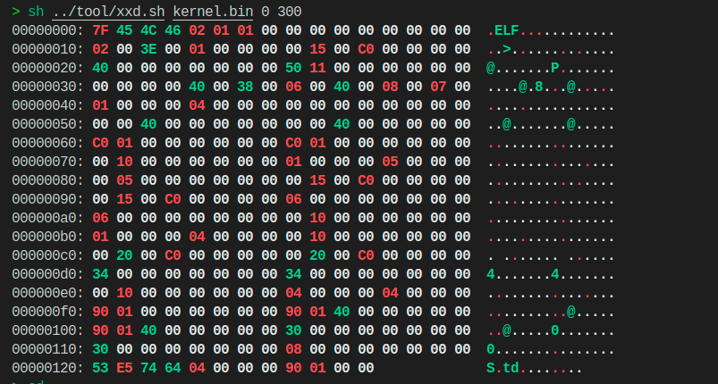

举例：第一行是 e_ident 数组，前 4 字节是固定的 elf 魔数，正如您看到的，它们是 0x7f 和字符 ELF 的 ASCII：0x45、0x4c、0x46。所以您**在显示区看到了 ELF 的三个字符**。紧跟其后的三个 1 分别是 e_ident[4]、e_ident[5]、e_ident[6]三个成员，代表的意义是 32 位 elf 文件、小端字节序、当前版本。后面的 9 个 00 是 e_ident[7]～e_ident[15]，这些确实都已经初始化为 0。

---

### ★★★ 将内核载入内存（从磁盘加载内核文件，根据elf创建内核映像，执行内核代码）

#### ▶ 代码


★★★ 功能：**loader.S从磁盘中加载编译好的kernel.bin二进制文件（elf格式），按照elf文件头的信息创建内核映像，然后执行内核代码。**

- kernel.bin文件来自于main.c经过gcc -o编译、ld链接后生成的可执行文件。（kernel.bin表示的是内核的二进制elf文件，虽说是可执行文件，但有文件头，不能直接运行，这就需要loader对该elf文件进行解析了）


- 因为内核被加载到内存后，loader需要根据elf结构将其展开到新的位置，所以内核在低端1M的内存中有两份，一份为解析前elf格式的kernel.bin源文件，一份为解析后在内存中生成的内核映像（这个映像为真正运行的内核，且有了内核映像后，解析前的源文件就没用了）。因此在框框的较高地址`0x70000`放刚加载进来的源文件，较低地址`0x1500`放解析后的内核映像，这样在后续内核往高地址拓展中也能正常地把位于它上面的源文件给覆盖了。（MBR在加载loader后就没用了，因此框框中间的512B此时也是可用的）

  

★★★ 实现原理：先把kernel.bin从磁盘复制到内存指定位置，由于这个二进制文件kernel.bin是被编译好了的，是按照elf文件布局分布的，**加载到内存中不能直接运行（有文件头）**。我们要**根据elf文件头的信息，将kernel.bin文件中的各种段复制到内存中**。(通过elf header得到program header table信息，然后根据program header table信息找到program header信息，该结构描述了各个段的起始偏移，大小，目的虚拟地址，根据这些信息将各个段复制到内存的指定位置。这个位置是由我们指定的内核可执行代码入口地址0xc0001500后编译器根据实际代码情况自己指定的)。***即，将一开始加载到内存的kernel.bin文件再在内存中进行信息的移动，把解析后的内核映像放到相应的虚拟内存地址***，**最后跳过去执行内核代码**，此时loader.S 的任务就完成了。

> 为什么内核的入口虚拟地址是0xc0001500
>
> 答：因为在内存中选择 0x1500 作为内核映像的入口地址，页表中低端 1MB 的虚拟内存与物理内存是一一对应的，所以物理地址是 0x1500，对应的虚拟地址是 0xc0001500（这是4GB虚拟地址空间中3GB以上的地方）


main.c

一个简单到不能再简单的内核。

```c
int main(void){
    while(1);
    return 0;
} 
```


boot.inc

```assembly
...
LOADER_STACK_TOP equ LOADER_BASE_ADDR               ;这一条之前是在loader.S中定义，现在搬过来了
...
KERNEL_BIN_BASE_ADDR equ 0x70000                    ;★★定义内核在内存中的缓冲区，也就是将编译好的内核文件暂时存储在内存中的位置
KERNEL_START_SECTOR equ 0x9                         ;定义内核在磁盘的起始扇区
KERNEL_ENTRY_POINT equ 0xc0001500                   ;★★定义内核可执行代码的入口地址
...
```


loader.S

```assembly
%include "boot.inc"
section loader vstart=LOADER_BASE_ADDR
    ; jmp loader_start					                ;loader一进来是下面一大堆GDT段描述符数据，无法执行，所以要跳过
                                                        ;虽然代码在执行时跳过了定义部分，但定义部分的数据已经被加载到内存中，并可以通过相关的指令来访问和使用
   
;-----------------   保护模式前的准备过程   -------------------
...
;-----------------   准备进入保护模式   ----------------------
...

; ----------------------------------   ★★★从磁盘加载kernel.bin到内存中  ---------------------------------------
    mov eax, KERNEL_START_SECTOR                        ; kernel.bin所在的扇区号
    mov ebx, KERNEL_BIN_BASE_ADDR                       ; 从磁盘读出后，写入到ebx指定的地址
    mov ecx, 200			                            ; 读入的扇区数
    call rd_disk_m_32									; 调用“读取硬盘n个扇区”函数


;--------------------   启用分页机制  ----------------------
 	call setup_page										; 调用“创建页目录及页表”函数
...


; --------------------------  解析kernel.bin的elf文件头，创建内核映像，跳入内核代码执行  ----------------------------------
enter_kernel:
    call kernel_init									; ★★★调用“解析kernel.bin的elf文件头，创建内核映像”函数
    mov esp, 0xc009f000
    jmp KERNEL_ENTRY_POINT                              ; ★★★使CPU跳转到内核的入口地址0xc0001500，开始执行内核代码

                           
;-------------   解析kernel.bin的elf文件头，创建内核映像（将kernel.bin中的各种段拷贝到编译的地址）   -----------
kernel_init:
    xor eax, eax                                        ;清空eax
    xor ebx, ebx		                                ;清空ebx, ebx记录程序头表地址
    xor ecx, ecx		                                ;清空ecx, cx记录程序头表中的program header数量
    xor edx, edx		                                ;清空edx, dx 记录program header尺寸

    mov dx, [KERNEL_BIN_BASE_ADDR + 42]	                ; 偏移文件42字节处的属性是e_phentsize,表示program header table中每个program header大小
    mov ebx, [KERNEL_BIN_BASE_ADDR + 28]                ; 偏移文件开始部分28字节的地方是e_phoff,表示program header table的偏移，ebx中是第1 个program header在文件中的偏移量
					                                    ; 其实该值是0x34,不过还是谨慎一点，这里来读取实际值
    add ebx, KERNEL_BIN_BASE_ADDR                       ; 现在ebx中存着第一个program header的内存地址
    mov cx, [KERNEL_BIN_BASE_ADDR + 44]                 ; 偏移文件开始部分44字节的地方是e_phnum,表示有几个program header
.each_segment:
    cmp byte [ebx + 0], PT_NULL		                    ; 若p_type等于 PT_NULL,说明此program header未使用。
    je .PTNULL

                                                        ;为函数memcpy压入参数,参数是从右往左依然压入.函数原型类似于 memcpy(dst,src,size)
    push dword [ebx + 16]		                        ; program header中偏移16字节的地方是p_filesz,压入函数memcpy的第三个参数:size
    mov eax, [ebx + 4]			                        ; 距程序头偏移量为4字节的位置是p_offset，该值是本program header 所表示的段相对于文件的偏移
    add eax, KERNEL_BIN_BASE_ADDR	                    ; 加上kernel.bin被加载到的物理地址,eax为该段的物理地址
    push eax				                            ; 压入函数memcpy的第二个参数:源地址
    push dword [ebx + 8]			                    ; 压入函数memcpy的第一个参数:目的地址,偏移程序头8字节的位置是p_vaddr，这就是目的地址
    call mem_cpy				                        ; ★★★调用mem_cpy完成段的复制
    add esp,12				                            ; 清理栈中压入的三个参数
.PTNULL:
   add ebx, edx				                            ; edx为program header大小,即e_phentsize,在此ebx指向下一个program header 
   loop .each_segment
   ret

                                                        ;----------  逐字节拷贝 mem_cpy(dst,src,size) ------------
                                                        ;功能：将段内容复制到指定位置
                                                        ;输入:栈中三个参数(dst,src,size)
                                                        ;输出:无
                                                        ;---------------------------------------------------------
mem_cpy:		      
    cld                                                 ;将FLAG的方向标志位DF清零，rep在执行循环时候si，di就会加1
    push ebp                                            ;这两句指令是在进行栈框架构建
    mov ebp, esp
    push ecx		                                    ; rep指令用到了ecx，但ecx对于外层段的循环还有用，故先入栈备份
    mov edi, [ebp + 8]	                                ; dst，edi与esi作为偏移，没有指定段寄存器的话，默认是ss寄存器进行配合
    mov esi, [ebp + 12]	                                ; src
    mov ecx, [ebp + 16]	                                ; size
    rep movsb		                                    ; 逐字节拷贝

                                                        ;恢复环境
    pop ecx		
    pop ebp
    ret
       
       
;-----------   创建页目录及页表  --------------
setup_page:
...
 
                                                        
;-------------------------------  读取硬盘n个扇区  ----------------------------------------
rd_disk_m_32:	                                             
				                                        ; eax=LBA扇区号
				                                        ; ebx=将数据写入的内存地址
				                                        ; ecx=读入的扇区数
    mov esi,eax	                                        ;备份eax
    mov di,cx		                                    ;备份cx
                                                        ;读写硬盘:
                                                        ;第1步：选择特定通道的寄存器，设置要读取的扇区数
    mov dx,0x1f2
    mov al,cl
    out dx,al                                           ;读取的扇区数

    mov eax,esi	                                        ;恢复ax

                                                        ;第2步：在特定通道寄存器中放入要读取扇区的地址，将LBA地址存入0x1f3 ~ 0x1f6
                                                        ;LBA地址7~0位写入端口0x1f3
    mov dx,0x1f3                       
    out dx,al                          

                                                        ;LBA地址15~8位写入端口0x1f4
    mov cl,8
    shr eax,cl
    mov dx,0x1f4
    out dx,al

                                                        ;LBA地址23~16位写入端口0x1f5
    shr eax,cl
    mov dx,0x1f5
    out dx,al

    shr eax,cl
    and al,0x0f	                                        ;lba第24~27位
    or al,0xe0	                                        ; 设置7～4位为1110,表示lba模式
    mov dx,0x1f6
    out dx,al

                                                        ;第3步：向0x1f7端口写入读命令，0x20 
    mov dx,0x1f7
    mov al,0x20                        
    out dx,al

                                                        ;第4步：检测硬盘状态
.not_ready:
                                                        ;同一端口，写时表示写入命令字，读时表示读入硬盘状态
    nop
    in al,dx
    and al,0x88	                                        ;第4位为1表示硬盘控制器已准备好数据传输，第7位为1表示硬盘忙
    cmp al,0x08
    jnz .not_ready	                                    ;若未准备好，继续等。

                                                        ;第5步：从0x1f0端口读数据
    mov ax, di                                          ;di当中存储的是要读取的扇区数
    mov dx, 256                                         ;每个扇区512字节，一次读取两个字节，所以一个扇区就要读取256次，与扇区数相乘，就等得到总读取次数
    mul dx                                              ;8位乘法与16位乘法知识查看书p133,注意：16位乘法会改变dx的值！！！！
    mov cx, ax	                                        ; 得到了要读取的总次数，然后将这个数字放入cx中
    mov dx, 0x1f0
.go_on_read:
    in ax,dx
    mov [ebx],ax                                        ;与rd_disk_m_16相比，就是把这两句的bx改成了ebx
    add ebx,2		        
                                                        ; 由于在实模式下偏移地址为16位,所以用bx只会访问到0~FFFFh的偏移。
                                                        ; loader的栈指针为0x900,bx为指向的数据输出缓冲区,且为16位，
                                                        ; 超过0xffff后,bx部分会从0开始,所以当要读取的扇区数过大,待写入的地址超过bx的范围时，
                                                        ; 从硬盘上读出的数据会把0x0000~0xffff的覆盖，
                                                        ; 造成栈被破坏,所以ret返回时,返回地址被破坏了,已经不是之前正确的地址,
                                                        ; 故程序出会错,不知道会跑到哪里去。
                                                        ; 所以改为ebx代替bx指向缓冲区,这样生成的机器码前面会有0x66和0x67来反转。
                                                        ; 0X66用于反转默认的操作数大小! 0X67用于反转默认的寻址方式.
                                                        ; cpu处于16位模式时,会理所当然的认为操作数和寻址都是16位,处于32位模式时,
                                                        ; 也会认为要执行的指令是32位.
                                                        ; 当我们在其中任意模式下用了另外模式的寻址方式或操作数大小(姑且认为16位模式用16位字节操作数，
                                                        ; 32位模式下用32字节的操作数)时,编译器会在指令前帮我们加上0x66或0x67，
                                                        ; 临时改变当前cpu模式到另外的模式下.
                                                        ; 假设当前运行在16位模式,遇到0X66时,操作数大小变为32位.
                                                        ; 假设当前运行在32位模式,遇到0X66时,操作数大小变为16位.
                                                        ; 假设当前运行在16位模式,遇到0X67时,寻址方式变为32位寻址
                                                        ; 假设当前运行在32位模式,遇到0X67时,寻址方式变为16位寻址.
    loop .go_on_read
    ret

```

代码步骤：

A、在boot.inc中定义内核文件加载到内存中的位置：0x70000；定义内核文件在磁盘中的起始盘区：0x9；定义内核可执行代码的入口地址0xc0001500；把栈顶位置的宏定义从loader.S中移到boot.inc中。

B、写一个32位环境下读取磁盘的函数（这个函数我们直接去修改mbr.S中实现的16位读取磁盘的函数），然后传参调用此函数完成从磁盘中加载elf格式的内核文件到内存指定地址。

C、实现拷贝函数，用于将信息在内存中进行移动。

D、在boot.inc中定义program header type字段为空的宏，用此宏来判断program header描述的段是否需要被加载。

E、写一个解析elf文件的函数，该函数的功能：从指定位置的elf header中取出：1、program header table的偏移位置（加上内核文件在内存的起始位置就是物理地址），这为的是找到第一个program header；2、program header table中的program header（对于每个段的描述符）数量；3、program header table每个program header的大小。这三个信息为的是遍历每一个program header，如果该program header描述的段不是空段就从program header取出每个段的：1、段的大小；2、本段的偏移（加上内核文件在内存的起始位置就是物理地址）；3、段在内存中的虚拟地址（编译内核时我们会指定一个程序入口虚拟地址，编译器会根据指定的程序入口虚拟地址，计算出每个段虚拟地址。由于我们指定的虚拟地址就是真实加载的物理地址，所以取出的虚拟地址就是的段目的物理地址）。然后传参调用mem_cpy函数将段内容复制到指定位置。

F、调用E写的函数，完成内核映像的创建。然后跳入内核执行。

---

---

## 特权级（Privilege Level）

保护模式模式下，系统通过特权级来区分不同级别的操作权限，确保系统资源和数据的安全。

特权级将程序和数据分为不同的访问等级。特权级分为4个级别：0、1、2、3，其中**0级最高，3级最低。**


- **0级特权**：操作系统内核运行在这个级别，拥有对所有资源的访问权限。
- **1级特权**：通常由系统服务和驱动程序使用，具有一定的硬件访问权限。
- **2级特权**：较少使用，可以作为某些特定服务的运行级别。
- **3级特权**：用户程序运行在这个级别，访问权限受到严格限制。

### 任务状态段（TSS）
TSS（Task State Segment）是处理器**用于任务切换的数据结构**，它保存了任务的寄存器状态和特权级栈信息。TSS中**记录了不同特权级下的栈指针和段选择子**(<u>在发生中断，需要调整特权级时，在TSS中找对应特权级下的SS和ESP</u>），确保在任务切换时能够正确地保存和恢复任务状态。


### CPL、DPL和RPL
- **CPL（Current Privilege Level）**：当前特权级，表示当前正在执行的代码的特权级别。
- **DPL（Descriptor Privilege Level）**：描述符特权级，用于内存段描述符中，定义了访问该段的最低特权要求。
- **RPL（Request Privilege Level）**：请求特权级，通常位于段选择子中，表示请求访问资源的程序的实际特权级。

### 特权级检查过程
当程序尝试访问资源时，处理器会进行特权级检查，确保访问者有足够的权限。检查规则如下：
- 对于代码段，CPL必须等于RPL，且**CPL必须 ≤ 目标代码段的DPL**。
- 对于数据段，**CPL和RPL都必须 ≤ 目标数据段的DPL**。

### IO特权级
IO特权级由eflags寄存器中的IOPL位和TSS中的IO位图共同决定。IOPL位定义了执行IO操作的最小特权级，而IO位图则提供了对特定IO端口的访问控制。

### I/O位图
I/O位图是一个位数组，每个位对应一个IO端口。位值为0表示允许访问该端口，为1则表示禁止访问。I/O位图允许在当前特权级高于IOPL的情况下，对特定端口进行访问控制。


### 调用门和系统调用

用门提升特权级，就像站在高处的台子上往蹦床上跳一样，人会被蹦床弹得比台子还高。门的“门槛”是访问者特权级的下限，访问者的特权级再低也不能比门描述符的特权级 DPL 低，否则访问者连门都进不去，更谈不上使用调用门。


调用门是一种特殊的门描述符，用于实现从低特权级到高特权级的转移。

系统调用通常通过调用门来实现，用户程序通过调用门请求操作系统服务，操作系统在高特权级下执行相应的服务程序。


### 系统调用的执行流程
1. 用户程序通过调用门请求系统服务。
2. 处理器进行特权级检查，确保请求合法。
3. 如果检查通过，处理器将CPL提升到调用门目标代码段的DPL。
4. 处理器切换到相应的特权级栈，并将用户程序的参数复制到新栈。
5. 处理器加载目标代码段的选择子和偏移量，开始执行系统服务程序。
6. 系统服务程序执行完成后，使用retf指令返回用户程序，处理器进行特权级检查并恢复用户程序的执行环境。

---

---

---

# GAP

## 地址映射关系变化

| **模式**                 | **线性地址计算方式**                       |      |      |
| ------------------------ | ------------------------------------------ | ---- | ---- |
| **实模式**               | 线性地址 = 物理地址                        |      |      |
| **保护模式（段机制）**   | 线性地址 = 段基址 + 段内偏移               |      |      |
| **保护模式（分页机制）** | 线性地址通过页目录表和页表映射到物理地址。 |      |      |
|                          |                                            |      |      |

实模式：CPU直接使用物理地址，地址空间为20位，最大可访问1MB内存。

保护模式段机制：段选择子和段描述符一起定义了段基址和段限长。

保护模式分页机制：每个进程有了独立的4GB的虚拟内存空间。

- **高10位**：页目录索引（指向页目录表中的一个表项）
- **中10位**：页表索引（指向页表中的一个表项）
- **低12位**：页内偏移（指向具体的物理地址）

- **线性地址 -> 页目录表 -> 页表 -> 物理地址**：通过页目录表和页表的查找，将线性地址映射到物理地址。

---

## 虚拟地址访问页表、第0和第768页目录项大讨论


一个页表4KB，有1024个页表项，能索引1024×4KB=4MB的物理地址空间

一个页表项4字节，指向一个4KB的物理内存页

每个进程都有一个页目录表，一个页目录表可以索引4GB的大小

---

## （内核）页目录表和页表在物理内存中的位置

​	页目录表和页表都存在于物理内存之中，它总该有个“安身”的地址。我们把它们安装在哪里呢？
​	**页目录表的位置**，我们就放在物理地址 0x100000 处（它**位于内核的低端1M之上**）。为了让页表和页目录表紧凑一些（这不是必须的），咱们让**页表紧挨着页目录表**。页目录本身占 4KB，所以第一个页表的物理地址是 0x101000。

> 当然，**计算机一开始启动的时候是只有内核的**，也就是对应**只加载虚拟空间中3～4GB的内核部分**。此时页目录表放在0x100000处，在页目录表上只有有关于内核部分的页表，即页目录表中第0和第768个页目录项共同对应的1个页表、第769～1022个页目录项对应的共254个页表。
>
> 因为页目录表和页表的物理内存中的大小均为4K，所以此时页目录表和页表一共占的物理内存大小为（1+1+254）*4K=1M。他们对应在物理内存中的地址范围为0x100000～0x1FFFFF。
>
> 而页目录表中第1～767个页目录项在物理内存中的位置则要通过后续用户的使用情况来动态分配。（内核页目录表中的第1～767个页目录项可以认为就没用）
>
> 综上：在一开始时，32M的物理内存中，0～1M部分是内核的，1～2M部分是页目录表及内核对应的页表的。

> - 更多：见第八章-内存管理系统-代码（内存池的构建）


### **多份页表和独立性**

- **内核页表**：启动时存在于物理地址 `0x100000` 以上，映射内核的虚拟地址空间，==不同进程在执行内核代码时共用这一部分的映射==。
- **进程页表**：==每个进程在创建时拥有独立的页目录表和页表，这些表在物理内存中各自独立==，管理用户空间的虚拟地址映射。当切换进程时，通过更新 CR3 寄存器来使用不同的页表。
- **共享和独立的结合**：内核部分的映射是共享的（所有页目录表中的 768 号及以上项），但用户部分的页表完全独立，确保进程的安全和隔离性。

> 上图中页目录表在0x100000的位置，指的是只有内核的页目录表在这个位置，其他用户进程的页目录表是随机分布在内核的任何位置。毕竟是通过get_kernel_pages(1)申请的。

``` c
//用于为进程创建页目录表，并初始化，成功返回页目录表虚拟地址
uint32_t* create_page_dir(void) {
   uint32_t* page_dir_vaddr = get_kernel_pages(1);  // 申请 1 页（4 KB）的内存空间，用于存放新进程的页目录表。
   if (page_dir_vaddr == NULL) {
        console_put_str("create_page_dir: get_kernel_page failed!");
        return NULL;
   }
   //将内核页目录表的768号项到1022号项复制过来
   memcpy((uint32_t*)((uint32_t)page_dir_vaddr + 768*4), (uint32_t*)(0xfffff000 + 768 * 4), 255 * 4);
   uint32_t new_page_dir_phy_addr = addr_v2p((uint32_t)page_dir_vaddr);     //将进程的页目录表的虚拟地址，转换成物理地址
   page_dir_vaddr[1023] = new_page_dir_phy_addr | PG_US_U | PG_RW_W | PG_P_1;   //页目录表最后一项填自己的地址，为的是动态操作页表
   return page_dir_vaddr;
}
```

内核空间的页表在所有进程中共享，因此**无需**为每个进程重复创建。

所以在这下面的代码：

```c
memcpy((uint32_t*)((uint32_t)page_dir_vaddr + 768*4), (uint32_t*)(0xfffff000 + 768 * 4), 255 * 4);
```

==**将内核的页目录项直接复制到新进程的页目录表中**==


---

---

---

# 第六章 完善内核

## ★★★ 函数调用约定（esp、ebp在调用函数前后的变化）

函数调用约定（Calling Conventions）是指在调用函数时所遵循的一套规则或协议。这些规则规定了如何传递参数、返回值以及如何管理调用过程中使用的栈空间和寄存器。不同的调用约定在处理这些问题时可能会有所不同，尤其是在不同的编程语言、编译器或操作系统之间。

在 C 语言默认的 **`cdecl`（C Declaration）调用约定**中：

1. 参数传递	

   - **参数是从右到左依次压入栈中。**例如，上述代码中，`subtract(3, 2)` 的参数 `b`（即 2）会先被压入栈，然后是参数 `a`（即 3）。

   - 函数返回值通常存储在寄存器 `EAX` 中。

2. 寄存器的保存

   - 调用者需要保存通用寄存器的状态。

   - 寄存器 `EAX`、`ECX` 和 `EDX` 通常由调用者保存，其余的寄存器由被调用者负责保存。


3. 栈空间管理

   - **由调用者负责在函数调用后清理栈空间**。这意味着在函数返回后，调用者必须将栈顶指针调整回函数调用前的状态。

   

c语言代码：

```c
int subtract(int a, int b) {  // 被调用者
    return a - b;
}

int main() {
    int sub = subtract(3, 2); // 主调用者
    return 0;
}
```

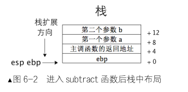

cdecl 调用约定下产生的汇编代码：

```assembly
; 调用者
push 2            ; 将参数 b 压入栈
push 3            ; 将参数 a 压入栈
call subtract     ; 调用函数 subtract（★★当call一个函数时，cpu会自动把主调函数的返回地址入栈，当ret时将其出栈）
add esp, 8		  ; 回收清理栈空间（★★栈中只剩下a和b，共占用8字节，将栈顶指针esp+8,就相当于把ab给push了）


; 被调用者
subtract:
    push ebp      		; 保存旧的栈帧指针（★因为在调用subtract前，栈中也存在着ebp，作为前某段代码的基址，且ebp不会像esp一样一直指向栈顶）
    mov ebp, esp  		; 建立新的栈帧（★将 esp 赋值给 ebp，用 ebp 作为基址来访问栈中参数）
    
    mov eax, [ebp+8]  	; 将参数 a 载入 eax（偏移 8 字节处为第 1 个参数 a）
    sub eax, [ebp+12] 	; 用 eax 减去参数 b（偏移 12 字节处是第 2 个参数 b）
    
    mov esp,ebp			; 防止中间有入栈操作，用ebp恢复esp（因为在ebp入栈后没有push东西，所以该代码中没啥用）
    
    pop ebp      		; 恢复旧的栈帧指针（★将ebp恢复到调用subtract前的值）
    ret           		; 返回，调用者负责清理栈（★★把函数的返回地址出栈，此时栈中只剩下a和b）
```

在这个过程中，如果采用了不同的调用约定，例如 `stdcall`，那么栈的清理可能会由被调用者负责，而不是调用者。

---

---

## 汇编语言和 C 语言混合编程

​	汇编语言和 C 语言混合编程可分为两大类。
​	（1）单独的汇编代码文件与单独的 C 语言文件分别编译成目标文件后，一起链接成可执行程序。（本节内容）
​	（2）在 C 语言中嵌入汇编代码，直接编译生成可执行程序。

### 系统调用

​	系统调用是操作系统提供的功能接口，用于实现一些在用户态无法或不易实现的功能，如文件读写。**Linux系统调用通过一个统一的入口实现，即第0x80号中断**，并通过eax寄存器指定具体的子功能号。（BIOS 中断走的是中断向量表，所以有很多中断号给它用，而系统调用走的是中断描述符表中的一项而已，所以只用了第 0x80 项中断）

- 调用“系统调用”有两种方式。

​	（1）**将系统调用指令封装为 c 库函数，通过库函数进行系统调用**，操作简单。
​	（2）**不依赖任何库函数，直接通过汇编指令 int 与操作系统通信**。

- 在Linux系统中，系统调用定义在`/usr/include/asm/unistd_32.h`文件中，如第4号调用（即`__NR_write`）为write系统调用。


#### **第一种系统调用**

```c
#include <unistd.h>
int main(){
write(1,"hello,world\n",4);
return 0;
}
```


#### **★★ 第二种系统调用**（mov eax; int ox80)

跨过库函数直接与系统内核通信，这样最终的程序不需要与任何库文件链接

**步骤：**

1. **设置系统调用号**：通过 `eax` 寄存器传递。

   ```assembly
   mov eax, <syscall_number>
   ```

2. **参数传递**：通过 `ebx`、`ecx`、`edx` 等寄存器传递。

   ```assembly
   mov ebx, <arg1>  ; 第一个参数
   mov ecx, <arg2>  ; 第二个参数
   mov edx, <arg3>  ; 第三个参数
   ```

3. **触发系统调用**：通过 `int 0x80`（32 位）或 `syscall`（64 位）指令完成。

   ```assembly
   int 0x80  ; 触发中断，执行系统调用
   ```

   - 例子见下面的方式2  (下面两种都属于第二种系统调用)

```assembly
section .data
    str_c_lib: db "c library says: hello world!", 0xa  ; 0xa 为 LF ASCII 码
    str_c_lib_len equ $-str_c_lib

    str_syscall: db "syscall says: hello world!", 0xa
    str_syscall_len equ $-str_syscall

section .text
    global _start

_start:
    ; ----------------------方式 1: 模拟 C 语言中系统调用库函数 write------------------
    push str_c_lib_len          ; 按照 C 调用将 write 的三个参数（文件描述符、字符串地址、字符串长度）压入栈中
    push str_c_lib
    push 1
    call simu_write             ; 调用下面定义的 simu_write
    add esp, 12                 ; 回收栈空间

    ;----------------------- 方式 2: 跨过库函数，直接进行系统调用------------------------
    mov eax, 4                  ; 第 4 号子功能是 write 系统调用（不是 C 库函数 write）
    mov ebx, 1					; ebx=1 是文件描述符
    mov ecx, str_syscall		; ecx 是字符串地址
    mov edx, str_syscall_len	; edx 是字符串长度
    int 0x80                    ; 发起中断，通知 Linux 完成请求的功能

    ; ----------------------------------退出程序------------------------------------
    mov eax, 1                  ; 第 1 号子功能是 exit
    int 0x80                    ; 发起中断，通知 Linux 完成请求的功能


; --------------------下面自定义的 simu_write 用来模拟 C 库中系统调用函数 write----------------
simu_write:
    push ebp                    ; 备份 ebp
    mov ebp, esp
    mov eax, 4                  ; 第 4 号子功能是 write 系统调用（不是 C 库函数 write）
    mov ebx, [ebp+8]            ; 第 1 个参数
    mov ecx, [ebp+12]           ; 第 2 个参数
    mov edx, [ebp+16]           ; 第 3 个参数
    int 0x80                    ; 发起中断，通知 Linux 完成请求的功能
    pop ebp                     ; 恢复 ebp
    ret

```


---

### ★★ 汇编语言和 C 语言相互调用

不同编程语言通过编译器和链接器转换为机器码，这些机器码是所有编程语言的“共同语言”。因此，**汇编语言和 C 语言之间的互相调用本质上是它们都最终转换为机器码后进行的**。这个过程就像不同语言的人通过共同理解的“形象”来沟通一样。


汇编代码 C_with_S_S.S

```assembly
section .data
str: db "asm_print says hello world!", 0xa, 0
str_len equ $-str		; 计算并定义字符串的长度，长度为当前地址 ($) 减去字符串起始地址 (str)。


section .text
extern c_print			; ★★声明外部函数 c_print，这个函数在 C 代码中定义，汇编代码需要调用它。
global _start			; 将 _start 定义为全局符号，作为程序的入口点，使得链接器能够识别。

_start:
; ------------------------------ 调用c代码中的函数c_print ---------------------------------
    push str			; 将字符串的地址压入栈中，作为参数传递给 c_print 函数。
    call c_print		; ★★调用外部的 c_print 函数，c_print 会从栈中弹出字符串地址，并调用 asm_print。
    add esp, 4			; 调用 c_print 后，栈中还存留着我们传入的参数（字符串地址），
    					; 这里使用 add 指令调整栈指针，清理传入的参数，回收栈空间。

; ------------------------------------- 退出程序 ---------------------------------------
    mov eax, 1			; 第 1 号子功能是 exit 系统调用
    int 0x80			; 触发中断 0x80，调用内核的系统调用服务，此时会执行 exit 调用，终止程序。


; ---------------------------------- ★★定义asm_print函数 ------------------------------------
global asm_print		; 将 asm_print 函数导出为全局符号，使其可以被 C 代码调用。
asm_print:
    push ebp			; 保存当前的基址指针寄存器 (ebp)，为后续函数调用保存堆栈帧。
    mov ebp, esp		; 将当前的栈指针 (esp) 复制到基址指针 (ebp)，建立新的堆栈帧。

    mov eax, 4			; 第 4 号子功能是 write 系统调用
    mov ebx, 1			; 文件描述符 1 代表标准输出 (stdout)，即输出到屏幕。

    mov ecx, [ebp+8]	; 将字符串的地址（第 1 个参数）
    mov edx, [ebp+12]	; 将字符串的长度（第 2 个参数）
    
    int 0x80			; 发起中断，通知 Linux 完成请求的功能

    pop ebp				; 恢复之前保存的基址指针 (ebp)，还原栈帧。

    ret
```


c语言代码 C_with_S_c.c

```c
extern void asm_print(char*, int);		// ★★声明了一个外部函数 asm_print，该函数接收一个字符指针和一个整数。这个声明告诉编译器 asm_print 函数在其他文件中定义。

//---------------------------------- ★★定义c_print函数 ------------------------------------
void c_print(char* str) {
    int len = 0;
    while (str[len++]);
    asm_print(str, len);				// ★★ 调用asm_print函数
}
```


总结：

**在汇编代码中导出符号**：使用 `global` 关键字，使符号可以被外部文件引用。

**在汇编代码中引用外部符号**：使用 `extern` 关键字，声明外部符号供汇编代码使用。

**在 C 代码中引用外部符号**：使用 `extern` 关键字声明外部符号，并定义为全局变量或函数，使其能够被外部文件引用。

---

---

## 实现自己的打印函数

### 显卡的端口控制

**显卡的基本操作模式**

- **文本模式**：在文本模式下，显存直接映射到内存地址，通过向显存地址写入字符的 ASCII 码和属性（如颜色）即可实现字符显示。
- **图形模式**：在图形模式下，操作显卡则复杂得多，需要通过对多个寄存器和端口进行操作来控制图形的显示。这里不再是简单的 `mov` 操作，而需要用到特定的 I/O 指令 `in` 和 `out`。

**显卡寄存器的分组**

显卡寄存器根据其功能和位置被分为多个分组，主要包括：
- Graphics Registers
- Sequencer Registers
- Attribute Controller Registers
- CRT Controller Registers

这些寄存器分别对应不同的功能，如控制图形输出的参数、时钟、颜色属性等。

**寄存器的操作**

由于显卡上寄存器数量众多，设计上采用了分组的方式，并且使用了两个寄存器来实现对整个寄存器组的操作：
- **★ Address Register**：用于指定具体要操作的寄存器（类似数组的索引）。

- **★ Data Register**：用于读写指定的寄存器（通过 Address Register 指定）。

  


**示例操作**

**★★★ 假设你需要对某个 CRT Controller Register 进行操作，首先需要通过 `Address Register` 指定寄存器索引，然后通过 `Data Register` 对该寄存器进行读写操作。**

例如，CRT Controller Registers 的端口地址根据 `Miscellaneous Output Register` 的 `Input/Output Address Select (I/OAS)` 字段来决定：
- 如果 `I/OAS` 为 0，`Address Register` 和 `Data Register` 的端口地址为 `0x3B4` 和 `0x3B5`。
- 如果 `I/OAS` 为 1，端口地址则为 `0x3D4` 和 `0x3D5`。

通过设置 `Address Register` 和 `Data Register`，可以访问和控制特定的 CRT 寄存器，如下是一个简单的流程：
1. 设置 `Address Register`，指定要操作的寄存器索引。

2. 通过 `Data Register` 进行数据读写。

   

---

### 实现单个字符打印（put_char()）

功能：写一个实现打印功能的汇编代码编译进入内核，来实现我们常见的显示字符功能。

实现原理：

​	A、通过对显存段操作，我们能够在屏幕上显示字符

​	B、通过与显卡寄存器打交道，我们可以获得光标位置（光标位置需要与VAG寄存器（显卡的寄存器）中CRT Controller Registers组中索引号为0Eh与0Fh寄存器来打交道）

​	C、结合A，能够实现我们平常见的那种先在光标处显示字符，然后光标向后移动的效果。

​	

#### ▶ 代码

为了开发方便，我们先要定义一些数据类型 (**myos/lib/stdint.h**)

```c
#ifndef __LIB_STDINT_H
#define __LIB_STDINT_H
typedef signed char int8_t;
typedef signed short int int16_t;
typedef signed int int32_t;
typedef signed long long int int64_t;
typedef unsigned char uint8_t;
typedef unsigned short int uint16_t;
typedef unsigned int uint32_t;
typedef unsigned long long int uint64_t;
#endif
```


**/lib/kernel/print.S**

注：在文本模式 80×25 (80列，25行）下的显存可以显示 80×25=2000 个字符，每个字符占 2 字节，低字节是字符的 ASCII 码，高字节是前景色和背景色属性，所以在 4000 字节的显存空间中，只要起始地址为偶数的任意 2 字节我们都可以写入字符。

故：光标位置与显存地址的关系(`见代码退格部分的注释`)

```assembly
TI_GDT equ  0                                               ;从这里开始三步是在定义显存段段描述符的选择子
RPL0  equ   0
SELECTOR_VIDEO equ (0x0003<<3) + TI_GDT + RPL0

[bits 32]                                                   ;采用32位编译
section .text                                               ;表明这是个代码段

;------------------------   put_char   -----------------------------
;功能描述:把栈中的1个字符写入光标所在处
;-------------------------------------------------------------------   
global put_char                                             ;将put_char导出为全局符号，这样其他文件也可以使用
put_char:
    pushad	                                                ;备份32位寄存器环境（指令将所有 32 位通用寄存器EAX、ECX、EDX、EBX、ESP、EBP、ESI、EDI压入栈中,以便在函数结束时恢复寄存器状态）
                                                            
    mov ax, SELECTOR_VIDEO	                                ;需要保证gs中为正确的视频段选择子,为保险起见,每次打印时都为gs赋值（不能直接把立即数送入段寄存器）
    mov gs, ax

                                                            ;-------------  获取当前光标位置 -------------
                                                            ;---先获得高8位
    mov dx, 0x03d4                                          ;★★设置 dx 寄存器为 CRT 控制器的索引寄存器端口地址(Address Register)
    mov al, 0x0e	                                        ;指定要读取光标位置的高 8 位
    out dx, al												;★★将光标高 8 位索引输出到端口
    mov dx, 0x03d5                                          ;★★设置 dx 寄存器为 CRT 控制器的数据寄存器端口地址(Data Register)
    in al, dx	                                            ;★★从端口读取光标位置的高8位
    mov ah, al												;保存高8位到 AH

                                                            ;---再获取低8位
    mov dx, 0x03d4
    mov al, 0x0f
    out dx, al
    mov dx, 0x03d5 
    in al, dx                                                  
    mov bx, ax	                                            ;---现在bx中存的是光标的位置
    
    														;-----------获取待打印字符并判断其类型----------
                                                            ;下面这行是在栈中获取待打印的字符
    mov ecx, [esp + 36]	                                    ;★ pushad压入4×8＝32字节,加上主调函数的返回地址4字节,故esp+36字节,现在ecx中是要打印的字符
    cmp cl, 0xd				                                ;判断是否是CR(回车)0x0d
    jz .is_carriage_return
    cmp cl, 0xa                                             ;判断是否是LF(换行)0x0a
    jz .is_line_feed

    cmp cl, 0x8				                                ;判断是否是BS(backspace退格)的asc码8
    jz .is_backspace
    jmp .put_other	   


;--------------------------------------------------------------------------------------------
;★★★光标位置与显存地址的关系
;bx 存储的是光标的位置，表示的是字符在屏幕上的索引。这个索引是基于字符的数量，而不是字节的数量。
;每个字符在显存中占用两个字节：一个字节用于存储字符的 ASCII 码，另一个字节用于存储字符的颜色属性。
;因此，当我们需要根据 bx 所指示的光标位置来操作显存中的字符时，需要将 bx 的值乘以 2，这样才能得到该字符在显存中的确切字节位置。
;--------------------------------------------------------------------------------------------
                                                            ;--------------退格键处理-------------
.is_backspace:		
                                                            ; 当为backspace时,本质上只要将光标移向前一个显存位置即可.后面再输入的字符自然会覆盖此处的字符
                                                            ; 但有可能在键入backspace后并不再键入新的字符,这时在光标已经向前移动到待删除的字符位置,但字符还在原处
                                                            ; 这就显得好怪异,所以此处添加了空格或空字符0
    dec bx                                                  ;★★ 使光标回退一个位置
    shl bx,1                                                ;★★ 将光标位置转换为显存中的地址偏移量（bx值左移1位，即×2）
    mov byte [gs:bx], 0x20		                            ;将待删除的字节补为0或空格皆可, 0x20是空格符的ascii码值 
    inc bx                                                  ;★★ bx+1, 指向这个字符的属性位置, 也就是设定背景色, 字符颜色
    mov byte [gs:bx], 0x07                                  ;0x07, 就是黑底白字
    shr bx,1                                                ;★★ bx虽然指向这个字符的颜色属性字节，但是除以2还是变回这个字符的光标位置（bx值右移一位，即/2）
    jmp .set_cursor                                         ;去设置光标位置, 这样光标位置才能真正在视觉上更新


															;--------------可见字符处理-------------
 .put_other:
    shl bx, 1				                                ; 光标位置是用2字节表示,将光标值乘2,表示对应显存中的偏移字节
    mov [gs:bx], cl			                                ; ascii字符本身
    inc bx
    mov byte [gs:bx],0x07		                            ; 字符属性
    shr bx, 1				                                ; 恢复老的光标值
    inc bx				                                    ; 下一个光标值
    cmp bx, 2000		   
    jl .set_cursor			                                ; 若光标值小于2000,表示未写到显存的最后,则去设置新的光标值
					                                        ; 若超出屏幕字符数大小(2000)则换行处理
					                                        
															;--------------回车换行处理-------------
 .is_line_feed:				                                ; 是换行符LF(\n)
 .is_carriage_return:			                            ; 是回车符CR(\r)
					                                        ; 如果是CR(\r),只要把光标移到行首就行了。
    xor dx, dx				                                ;要进行16位除法，高16位置会放在dx中，要先清零
    mov ax, bx				                                ;ax是被除数的低16位.
    mov si, 80				                                ;用si寄存器来存储除数80 由于是效仿linux，linux中\n便表示下一行的行首，所以本系统中，
    div si				                                    ; 把\n和\r都处理为linux中\n的意思，也就是下一行的行首。ax/80后，ax中存商，dx中存储的是余数,汇编除法https://blog.csdn.net/loovejava/article/details/7044242
    sub bx, dx				                                ; 光标值减去除80的余数便是取整
					                                        ; 以上4行处理\r的代码

 .is_carriage_return_end:		                            ; 回车符CR处理结束
    add bx, 80
    cmp bx, 2000
 .is_line_feed_end:			                                ; 若是LF(\n),将光标移+80便可。  
    jl .set_cursor

                                                            ;★★屏幕行范围是0~24,滚屏的原理是将屏幕的1~24行搬运到0~23行,再将第24行用空格填充
.roll_screen:				                                ; 若超出屏幕大小，开始滚屏
    cld                                                     
    mov ecx, 960				                            ; ★★一共有2000-80=1920个字符要搬运,共1920*2=3840字节.一次搬4字节,共3840/4=960次 
    mov esi, 0xb80a0			                            ; 第1行行首
    mov edi, 0xb8000			                            ; 第0行行首
    rep movsd				                                ;rep movs word ptr es:[edi], word ptr ds:[esi] 简写为: rep movsw

                                                            ;将最后一行填充为空白
    mov ebx, 3840			                                ; 最后一行首字符的第一个字节偏移= 1920 * 2
    mov ecx, 80				                                ;一行是80字符(160字节),每次清空1字符(2字节),一行需要移动80次
 .cls:
    mov word [gs:ebx], 0x0720		                        ;0x0720是黑底白字的空格键
    add ebx, 2
    loop .cls 
    mov bx,1920				                                ;将光标值重置为1920,最后一行的首字符.


															;------- 设置光标位置（将光标设为bx值）----------
.set_cursor:
                                                            ;---先设置高8位
    mov dx, 0x03d4          								; 设置 dx 为 CRT 控制器的索引寄存器端口地址
    mov al, 0x0e           								 	; 指定索引：用于设置光标位置的高8位
    out dx, al              								; 将索引输出到端口
    mov dx, 0x03d5          								; 设置 dx 为数据寄存器端口地址
    mov al, bh              								; 将光标位置的高8位放入 al
    out dx, al              								; 输出高8位到端口

                                                            ;---再设置低8位
    mov dx, 0x03d4
    mov al, 0x0f            								; 指定索引：用于设置光标位置的低8位
    out dx, al
    mov dx, 0x03d5 
    mov al, bl              								; 将光标位置的低8位放入 al
    out dx, al              								; 输出低8位到端口
    
.put_char_done: 
    popad
    ret
```

步骤：

A、保存调用者的执行环境

B、定义并加载显存段选择子，显示字符就是对显存进行操作

C、通过与显卡寄存器打交道，获得光标位置

D、通过栈来取出传入的参数（调用者传入的字符）

E、判断D取出的字符：

​	**a、回车，光标位置移置行首**
**​	b、换行，光标位置移置下一行行首**
**​	c、退格，光标位置向前移动，并且显示一个空格（来实现我们期待的删除一个字符的功能）**
**​	d、其他，根据当前光标位置确定显存位置，然后显示后光标后移**
F、E中A，B，D都有可能造成字符超出第一页显示范围，所以我们需要实现滚屏功能（采取p270方案2）

G、恢复调用者执行环境


**为了方便其他函数调用我们写的print，我们为其建立一个头文件/lib/kernel/print.h**

```c
#ifndef __LIB_KERNEL_PRINT_H
#define __LIB_KERNEL_PRINT_H
#include "stdint.h"     				//我们的stdint.h中定义了数据类型，包含进来
void put_char(uint8_t char_asci);      	//在stdint.h中uint8_t得到了定义，就是unsigned char
#endif
```


**验证我们的打印函数是否能正常工作，编写一个内核文件 myos/kernel/main.c**

```c
#include "print.h"
void main(void)
{
    put_char('T');
    put_char('i');
    put_char('n');
    put_char('y');
    put_char('O');
    put_char('S');
    put_char('\n');
    put_char('1');
    put_char('2');
    put_char('\b');
    put_char('3');
    while(1);
    
}
```


---

### 实现字符串打印（put_str()）

打印字符串中每个字符，到结尾就结束

- C语言我们定义字符串时，会为字符串最后加上ascii 为0的字符表示字符串的结尾，我们可以通过传入字符串首地址，然后通过字符串首地址取出字符，不断判断这是不是ascii码为0的字符来判断是不是结尾，如果不是就打印字符

#### ▶ 代码

**/lib/kernel/print.S**

```assembly
;-------------  定义VIDEO段的选择子 -------------
...

[bits 32]
section .text

;------------------------------  put_str  -------------------------------
;通过put_char来打印以0字符结尾的字符串
;------------------------------------------------------------------------
global put_str
put_str:
                                                            ;由于本函数中只用到了ebx和ecx,只备份这两个寄存器
   push ebx													;ebx作为字符串的指针，存字符串的地址
   push ecx													;ecx相当于char，存的是ebx当前指向的字符串的某个字符
   
   xor ecx, ecx		                                        ; 准备用ecx存储参数,清空
   mov ebx, [esp + 12]	                                    ; 从栈中得到待打印的字符串地址 
.goon:
   mov cl, [ebx]                                            ; ★ebx是字符串的地址，对地址进行取地址操作，然后取出一字节的数据，就是取出了字符串的第一个字符
   cmp cl, 0		                                        ; ★如果处理到了字符串尾,跳到结束处返回
   jz .str_over
   
   push ecx		                                            ; 为put_char函数传递参数
   call put_char											; ★★调用put_char函数，打印刚刚从字符串中取出的单个字符
   add esp, 4		                                        ; 回收参数所占的栈空间
   
   inc ebx		                                            ; ★使ebx指向下一个字符
   jmp .goon
.str_over:
   pop ecx
   pop ebx
   ret

;------------------------   put_char   -----------------------------
;功能描述:把栈中的1个字符写入光标所在处
;-------------------------------------------------------------------   
...
;-------------  获取当前光标位置 -------------
...
;-----------获取待打印字符并判断其类型----------
...
;--------------退格键处理-------------
...
;--------------可见字符处理-------------
...
;--------------回车换行处理-------------
...
;------- 设置光标位置（将光标设为bx值）----------
...
```

步骤：

**A**、保存执行环境

**B**、从栈中取出调用者传入的字符串首字符地址

**C**、判断B取出的首地址，取出字符串字符，判断是不是ascii码为0的字符，如果不是就调用之前写好的打印字符的函数，如果是就结束

**D**、恢复执行环境


**/lib/kernel/print.h**

```c
#ifndef __LIB_KERNEL_PRINT_H
#define __LIB_KERNEL_PRINT_H
#include "stdint.h"                 
void put_char(uint8_t char_asci);
void put_str(char* messags);
#endif
```


**/kernel/main.c**

``` c
#include "print.h"
void main(void) {
   put_str("hello TinyOS\n");
   while(1);
}
```


---

### 实现整数打印（put_int()）

将一个值转换成字符显示出来

- 数值的9需要转换成字符9对应的ASCII码值，才能用于显示。用待转换的数值减去各自的起始数字（如0或10）获得其对应字符相对于0字符或A字符的偏移量，再用此偏移量加上对应字符所在类别的起始字符ASCII码（如0或A的ascii码值），就是该数字对应的字符的ascii码值。

#### ▶ 代码

**/lib/kernel/print.S**

```assembly
;-------------  定义VIDEO段的选择子 -------------
...

section .data
put_int_buffer dq 0                                         ; 定义8字节缓冲区用于数字到字符的转换

[bits 32]
section .text

;------------------------------  put_str  -------------------------------
;通过put_char来打印以0字符结尾的字符串
;------------------------------------------------------------------------
...

;------------------------   put_char   ----------------------------------
;功能描述:把栈中的1个字符写入光标所在处
;------------------------------------------------------------------------
...
;-------------获取当前光标位置-------------
...
;-----------获取待打印字符并判断其类型----------
...
;--------------退格键处理-------------
...
;--------------可见字符处理-------------
...
;--------------回车换行处理-------------
...
;------- 设置光标位置（将光标设为bx值）----------
...


;--------------------   将小端字节序的数字变成对应的ASCII后，倒置   ------------------------
;输入：栈中参数为待打印的数字
;输出：在屏幕上打印16进制数字，不会打印前缀0x，如打印10进制15时，只会直接打印f，不会显示0xf
;-------------------------------------------------------------------------------------

global put_int
put_int:
   pushad                                                   ; 保存所有通用寄存器
   mov ebp, esp                                             ; 设置栈帧指针
   mov eax, [ebp+4*9]                                       ; 获取函数参数，即要显示的32位数值，call的返回地址占4字节+pushad的8个4字节
   mov edx, eax                                             ; 将eax的值备份到edx，开始处理
   mov edi, 7                                               ; ★★指定在put_int_buffer中初始的偏移量为7，即从高位开始存储字符
   mov ecx, 8                                               ; 32位数字以16进制表示，最多有8位
   mov ebx, put_int_buffer                                  ; 将缓冲区的起始地址放入ebx


;--------------------   将32位数字按照16进制的形式从低位到高位逐个处理，共处理8个16进制数字   ------------------------
.16based_4bits:                                            
   and edx, 0x0000000F                                      ; ★★解析16进制数字的每一位，and操作后，edx只有低4位有效（即每次提取最低的四位二进制数）
   cmp edx, 9                                               ; ★判断数字是0～9还是A～F，分别处理
   jg .is_A2F 
   add edx, '0'                                             ; ★将数字0～9转换为对应的ASCII码
   jmp .store
.is_A2F:
   sub edx, 10                                              ; ★将A~F转换为对应的ASCII码：先减去10，再加上字符A的ASCII码
   add edx, 'A'


;--------------------   将每一位数字转换成对应的字符后，按照类似“大端”的顺序存储到缓冲区put_int_buffer   ---------------------
.store:
   mov [ebx+edi], dl                                        ; 此时dl中是数字对应字符的ASCII码，存储到缓冲区
   dec edi                                                  ; ★★edi减1，向前移动到缓冲区的下一个位置（因为倒序存，所以缓冲区指针向前移动）
   shr eax, 4                                               ; ★★eax右移4位，处理下一个4位二进制表示的16进制数字
   mov edx, eax                                             ; 把eax中的值送入edx，继续处理下一个字符
   loop .16based_4bits                                      ; 循环处理所有的16进制位


;------------   缓冲区put_int_buffer中已全是字符，打印之前跳过缓冲区中前面的0字符，只打印有效数字部分   ---------------------
.ready_to_print:
   inc edi                                                  ; 此时edi为-1(0xffffffff)，加1使其为0，指向最高位字符
.skip_prefix_0:                                             ; 跳过前缀的连续多个0字符
   cmp edi, 8                                               ; 如果已经比较到第9个字符，表示待打印的字符串为全0 
   je .full0 
.go_on_skip:   
   mov cl, [put_int_buffer+edi]                             ; 获取缓冲区中的字符到cl
   inc edi                                                  ; edi指向下一个字符
   cmp cl, '0'                                              ; ★判断当前字符是否为'0'
   je .skip_prefix_0                                        ; ★如果是'0'，继续跳过
   dec edi                                                  ; ★如果不是'0'，恢复edi指向当前字符		       
   jmp .put_each_num

.full0:
   mov cl,'0'                                               ; 输入的数字为全0时，则只打印0
.put_each_num:
   push ecx                                                 ; 将可打印的字符压入栈
   call put_char                                            ; ★★调用put_char函数打印字符
   add esp, 4                                               ; 平衡栈
   inc edi                                                  ; 使edi指向下一个字符
   mov cl, [put_int_buffer+edi]                             ; 获取下一个字符到cl寄存器
   cmp edi, 8                                               ; 当edi=8时，虽然不会去打印，但实际上已经越界访问缓冲区
   jl .put_each_num                                         ; 如果还未到缓冲区的终点，继续打印
   popad                                                    ; 恢复所有通用寄存器
   ret                                                      ; 返回调用者

```

步骤：

A、定义一个8字节的缓冲区，8字节是因为一个完整的32位值每次取四位转换成一个字符（1字节），需要8次。

B、保存执行现场

C、通过逐次右移和与运算，**将32位数字分成8个4位的部分**，每个部分对应一个16进制字符。从最低4位开始取，转换成对应字符的ASCII码值，然后**倒着存在缓冲区put_int_buffer中**

D、对于C的结果，跳过缓冲区put_int_buffer中前面的0字符，只打印有效数字部分，如00123，显示123；如果是全0，则需要只显示一个0

E、恢复执行现场

> 问：为什么要将数字拆分成8个4位的部分？
>
> 答：
>
> 一个32位的数字在16进制表示法中，最多由8个16进制字符组成。每个16进制字符代表4位二进制。例如，32位数字`0x12345678`在16进制表示中是`12345678`，其中每个字符（1、2、3、4、5、6、7、8）对应4位二进制。
>
> 通过将32位数字拆分成8个4位部分，**可以逐个处理每个16进制字符，依次将它们转换为对应的ASCII字符**。

>问：为什么字符倒着存在缓冲区中？
>
>答：
>
>在把一个数字打印成字符串时，字符的存储顺序需要和最终显示的顺序一致。由于我们是从**最低位开始逐步提取并转换为字符**，这些字符需要按从低到高的顺序存储在缓冲区中，确保最后打印时数字的顺序正确。
>
>假设我们处理的数字是`0x12345678`。从低位开始提取后，缓冲区会先存`8`，然后`7`，直到`1`。但是打印时，我们希望输出的顺序是`12345678`，这意味着**我们需要倒置字符的存储顺序，缓冲区中的低地址存储最高位字符**。


**/lib/kernel/print.h**

```c
#ifndef __LIB_KERNEL_PRINT_H
#define __LIB_KERNEL_PRINT_H
#include "stdint.h"
void put_char(uint8_t char_asci);
void put_str(char* messags);
void put_int(uint32_t num);	        // 以16进制打印
#endif
```


**/kernel/main.c**

``` c
#include "print.h"
void main(void) {
    put_str("hello TinyOS\n");
    put_int(0);
    put_char('\n');
    put_int(9);
    put_char('\n');
    put_int(0x00021a3f);
    put_char('\n');
    put_int(0x12345678);
    put_char('\n');
    put_int(0x00000000);
    while (1)
        ;
}
```


---

---

## 内敛汇编

> ★★★内敛函数inline关键字的用法 ---> ==见第七章-编写中断处理程序-第一节的代码的最后一部分代码 io.h==

下面是 Intel 汇编语法和 AT&T 汇编语法的对比表格：

| **区别**                 | **Intel 语法**                                      | **AT&T 语法**                                     |
| ------------------------ | --------------------------------------------------- | ------------------------------------------------- |
| **寄存器前缀**           | 无前缀 (`eax`)                                      | 有 `%` 前缀 (`%eax`)                              |
| **操作数顺序**           | 目的操作数在左，源操作数在右 (`mov eax, 1`)         | 源操作数在左，目的操作数在右 (`movl $1, %eax`)    |
| **操作数指定大小**       | 使用关键词指定大小 (`mov byte [0x1234], eax`)       | 指令后缀表示大小 (`movl %eax, var`)               |
| **立即数前缀**           | 无前缀 (`mov eax, 6`)                               | 有 `$` 前缀 (`movl $6, %eax`)                     |
| **内存地址表示**         | 使用中括号 (`mov eax, [0x1234]`)                    | 数字默认表示内存地址 (`movl $255, 0xc00008F0`)    |
| **远跳转和远调用**       | `jmp far segment:offset`、`call far segment:offset` | `ljmp $segment:$offset`、`lcall $segment:$offset` |
| **内存寻址格式**         | `segreg:[base+index*size+offset]`                   | `segreg:base_address(offset_address,index,size)`  |
| **立即数与内存地址区分** | 立即数无前缀，如 `6`                                | 立即数前加 `$`，如 `$6`                           |


扩展内联汇编中的各种约束符号及其具体功能：

| **类别**       | **约束符号** | **描述**                                            | **示例**              |
| -------------- | ------------ | --------------------------------------------------- | --------------------- |
| **寄存器约束** | `a`          | 使用 `eax`/`ax`/`al` 寄存器                         | `"a"(in_a)`           |
|                | `b`          | 使用 `ebx`/`bx`/`bl` 寄存器                         | `"b"(in_b)`           |
|                | `c`          | 使用 `ecx`/`cx`/`cl` 寄存器                         | `"c"(in_c)`           |
|                | `d`          | 使用 `edx`/`dx`/`dl` 寄存器                         | `"d"(in_d)`           |
|                | `D`          | 使用 `edi`/`di` 寄存器                              | `"D"(out_di)`         |
|                | `S`          | 使用 `esi`/`si` 寄存器                              | `"S"(out_si)`         |
|                | `r`          | 使用任意通用寄存器                                  | `"r"(var)`            |
| **内存约束**   | `m`          | 任意内存位置为操作数                                | `"m"(in_mem)`         |
|                | `o`          | 内存操作数使用偏移地址                              | `"o"(in_offset)`      |
| **立即数约束** | `i`          | 使用整数立即数                                      | `"i"(4)`              |
|                | `F`          | 使用浮点数立即数                                    | `"F"(float_const)`    |
|                | `I`          | 使用0-31之间的立即数                                | `"I"(num)`            |
|                | `J`          | 使用0-63之间的立即数                                | `"J"(num)`            |
|                | `N`          | 使用0-255之间的立即数                               | `"N"(num)`            |
|                | `O`          | 使用0-32之间的立即数                                | `"O"(num)`            |
|                | `X`          | 使用任意类型的立即数                                | `"X"(any_const)`      |
| **通用约束**   | `0`-`9`      | 使用与 `output` 或 `input` 中相同的寄存器或内存位置 | `"0"(same_as_output)` |


---

---

---

# 第七章 中断


1. **PID**: 第 1 列是进程号（PID）。
2. **命令**: 第 2 列是启动该进程的命令及其参数。
3. **PSR**: 第 3 列是进程当前运行的 CPU 核心编号（Processor ID）

- 例如，PID 为 `2683` 的进程 `/usr/share/typora/Typora` 当前在 CPU 核心 `8` 上运行。

- 进程 `2704` 的命令为 `/usr/share/typora/Typora --`，它在核心 `16` 上运行。


## 外部中端与内部中断

### 外部中断

- **外部中断**指的是来自CPU外部的中断信号，一般由硬件设备（如网卡、硬盘等）触发，也称为**硬件中断**。

- CPU通过

  INTR（Interrupt Request）和NMI（Non-Maskable Interrupt）两条信号线接收外部中断信号。

  - **INTR信号**: 可屏蔽中断，CPU可以选择处理或忽略。大多数外设的中断信号通过INTR进入CPU。
  - **NMI信号**: 不可屏蔽中断，通常代表系统发生了致命错误，必须处理，不处理可能导致系统宕机。

  

#### 可屏蔽中断INTR信号的处理

- CPU可以通过标志寄存器（`eflags`）中的`IF`位屏蔽可屏蔽中断。

- 可屏蔽中断可以通过操作系统的

  上半部和下半部

  来处理：

  - **上半部**: 处理紧急部分，通常是立即需要执行的任务。
  - **下半部**: 处理不紧急的部分，可以在后续适当时机执行。

#### 不可屏蔽中断NMI信号

- 不可屏蔽中断通过NMI进入CPU，通常代表系统发生了无法挽回的错误，必须立即处理，可能导致系统宕机。
- 不可屏蔽中断无法被`IF`位屏蔽，因为它们通常是硬件故障或其他致命问题。

---

### 内部中断

由CPU内部产生，分为软中断和异常。

- **软中断**: 由软件主动发起，比如通过`int`指令，主要用于系统调用。
- **异常**: 指令执行期间发生的错误，例如除零错误或无效指令。
  - **Fault**（故障）: 可以被修复，允许程序重试执行。
  - **Trap**（陷阱）: 通常用于调试，在中断处理程序返回后继续执行后续指令。
  - **Abort**（终止）: 无法修复的严重错误，通常导致程序终止。

---

### ★★ 关系

```scss
中断
│
├── 外部中断 (硬件中断)		---> ★下一节讲的“中断处理过程及保护”
│   │
│   ├── 可屏蔽中断 (通过 INTR 引脚)
│   │
│   └── 不可屏蔽中断 (通过 NMI 引脚)
│
└── 内部中断
    │
    ├── 软中断 (由软件发起)
    │   │
    │   ├── int n (int 8位立即数指令) ---> ★int 0x80,第六章中的第二种系统调用
    │   │
    │   ├── int3 (断点调试)
    │   │
    │   ├── into (溢出)
    │   │
    │   └── bound (数组边界检查)
    │
    └── 异常 (由CPU在指令执行期间产生)
        │
        ├── Fault (故障)
        │   ├── Divide Error (除法错误，#DE)
        │   ├── Debug (调试，#DB)
        │   ├── Bound Range Exceeded (超出边界，#BR)
        │   ├── Invalid Opcode (无效指令，#UD)
        │   └── Device Not Available (设备不可用，#NM)
        │
        ├── Trap (陷阱)
        │   ├── Breakpoint (断点，#BP)
        │   ├── Overflow (溢出，#OF)
        │   └── Debug (调试，#DB)
        │
        └── Abort (终止)
            └── Double Fault (双重故障，#DF)

```


---

---

## 中断描述符表IDT

IDT 实质上是中断处理程序地址数组，而中断向量号是数组的索引。

### 概述（描述符表和向量表的区别、各种门）

**1. 中断描述符表（IDT）的作用:**

- 中断描述符表（Interrupt Descriptor Table，IDT）是保护模式下用于存储中断处理程序入口的表。
- 当CPU接收到一个中断请求时，会根据中断向量在IDT中查找对应的描述符，获取中断处理程序的起始地址，然后执行该中断处理程序。

**2. 中断描述符表与实模式的中断向量表（IVT）的区别:**

| 特性           | 中断描述符表（IDT）                                          | 实模式中断向量表（IVT）                    |
| :------------- | :----------------------------------------------------------- | :----------------------------------------- |
| 存储位置       | 位置不固定，可以放在内存的**任意位置**                       | 实模式下内存地址0x0到0x3FF（**固定位置**） |
| 结构           | 每个描述符占**8字节**<br />（每个描述符包含中断处理程序地址和特权级） | 每个向量占 **4 字节**                      |
| 中断数量       | 支持 256 个中断向量                                          | 支持 256 个中断向量                        |
| 适用模式       | **保护模式**和虚拟 8086 模式                                 | **实模式**                                 |
| 中断处理灵活性 | 可以定义不同的中断处理程序和优先级                           | 处理程序固定，简单                         |
| 中断类型       | 支持外部中断、异常和软件中断                                 | 仅为硬件中断和软件中断                     |
| 可扩展性       | 可扩展，允许更多中断类型                                     | 不可扩展                                   |


---

**3. IDT中的描述符种类:**

- **★★★IDT中的描述符被称为“门（Gate）”，用于指向中断处理程序**。门描述符可以是以下几种：

  1. 任务门（Task Gate）:
     - 包含任务状态段（TSS）的选择子，用于任务切换。
     - Type值：0101（二进制）。
  2. **中断门**（Interrupt Gate）:
     - 包含**中断处理程序**所在**段的选择子和段内偏移地址**。
     - 进入中断时，标志寄存器`eflags`中的`IF`位自动置0，**关闭中断，防止中断嵌套**。
     - Type值：1110（二进制）。
  3. 陷阱门（Trap Gate）:
     - 与中断门类似，但进入中断后，`eflags`中的`IF`位不会自动置0。
     - Type值：1111（二进制）。
  4. 调用门（Call Gate）:
     - 允许用户进程进入特权级0的方式。DPL值为3，仅供`call`和`jmp`指令调用。
     - Type值：1100（二进制）。

  

  

  ---

**4. 中断描述符表寄存器（IDTR）:**

- IDTR结构:

   包含两个部分：

  - 表界限（16位）：表示IDT的大小减1，最大范围为0xFFFF（64KB）。
  - 基地址（32位）：IDT的线性基地址。


- 作用:

  - ★★★**IDTR指向IDT的位置，CPU通过IDTR中的地址和中断向量号来查找中断处理程序的入口地址。**
  - 注：中断向量号不在IDTR中。

- 加载IDTR的指令:

  ```
  lidt
  ```

   用于加载IDTR寄存器。

  - 语法：`lidt 48位内存数据`
  - 前16位为表界限，后32位为基地址。

  

---

---

### ★★★ 中断处理过程及保护

完整的中断过程分为 CPU 外和 CPU 内两部分：

- CPU 外：外部设备的中断由中断代理芯片接收，处理后将该中断的中断向量号发送到 CPU。==--->Intel 8259A==
- CPU 内：CPU 执行该中断向量号对应的中断处理程序。 ==--->下面讲的部分**↓↓↓**==


#### 1. 中断向量号定位

- 当外部设备触发中断时，它通过中断代理芯片（如Intel 8259A）向CPU发送中断向量号。
- CPU接收到中断向量号后，利用此向量号在中断描述符表（IDT）中找到对应的中断描述符。
- 因为每个描述符占用8字节，CPU将中断向量号乘以8，得到IDT中该中断描述符的偏移量。然后将此偏移量与IDTR寄存器中的基地址相加，得到中断门描述符的地址。
- 中断门描述符中有两个关键字段：目标代码段选择子、中端处理程序的偏移地址。这两个字段描述的是中断处理程序的入口地址，在特权级检查通过后，CPU将利用这两个字段内容找到其入口地址。

#### 2. 特权级检查

- 检查 CPL 与 DPL:
  - 如果中断是由软件指令（如 `int n`、`int3`、`into`）引发的，CPU会检查当前特权级（CPL）与门描述符中的DPL。
  - 若CPL小于等于门描述符的DPL，则特权级检查通过，进入下一步。
  - 若CPL大于门描述符的DPL，CPU将引发异常。
- 检查 CPL 与目标段DPL:
  - 接下来，CPU会检查CPL与目标代码段的DPL。如果CPL小于目标代码段的DPL，检查通过。
  - 如果中断是由外部设备或异常引发的，则只进行此步检查。

#### 3. 中断处理程序的执行

- 特权级检查通过后，CPU将目标代码段选择子加载到CS寄存器，并将中断处理程序的偏移地址加载到EIP寄存器，开始执行中断处理程序。
- 如果中断是通过中断门进入的，EFLAGS寄存器中的IF位将被清零，防止中断嵌套，即处理中断时不会被其他中断打断。
- 如果中断通过陷阱门或任务门进入，CPU不会清零IF位，这允许其他中断在处理中断时嵌套。

#### 4. 从中断返回

- 中断处理程序完成后，CPU通过 `iret` 指令返回。
- `iret`指令会从栈中恢复CS、EIP和EFLAGS寄存器的值，从而恢复到中断发生前的状态。
- 如果特权级发生了变化，`iret`还会从栈中弹出旧的SS和ESP寄存器的值，恢复原先的栈。

#### 其他相关操作

- **IF位控制**: 可以通过 `cli` 和 `sti` 指令直接控制IF位，分别关中断和开中断。
- **NT位的作用**: 如果中断是在任务嵌套环境下发生的（NT位为1），`iret`指令会返回到上一个任务。否则，`iret`会按照普通的中断返回逻辑执行。

---

---

### ★★中断发生时的压栈

#### 1. 中断发生时的操作

1. **查找中断描述符表（IDT）：**
   中断发生时，处理器会根据中断向量号在中断描述符表（IDT）中找到相应的中断门描述符。中断门描述符包含了中断处理程序所在代码段的选择子和偏移量。
2. **特权级检查和栈切换：**
   - 处理器会比较当前特权级（CPL）和目标代码段的特权级（DPL）。
   - 如果CPL > DPL（意味着中断需要从低特权级切换到高特权级），处理器会切换到高特权级栈。在这个过程中，处理器会：
     - 临时保存当前栈段寄存器（SS）和栈指针（ESP）的值为`SS_old`和`ESP_old`。
     - **从任务状态段（TSS）中找到对应于目标代码段特权级的新栈，并加载到寄存器`SS`和`ESP`中**（★因为TSS中记录了不同特权级下的栈指针和段选择子）。
     - **将`SS_old`和`ESP_old`压入新栈中**，以便返回时恢复原来的栈。==--->A==
   - 如果CPL <= DPL（无特权级变化），处理器继续使用当前栈，无需进行栈切换。
3. **寄存器保存：**
   - 处理器将当前的**EFLAGS寄存器、CS和EIP寄存器的值依次压入当前栈中**。对于CS寄存器，由于它是16位，处理器会将其扩展为32位（高16位填充0）后入栈。==--->BC==
   - 如果中断是由于异常产生，并且有错误码，**错误码会被压入栈中**。==--->D==


---

#### 2. 中断处理程序的执行

中断处理程序在新的栈环境下开始执行。（处理器会根据IDT中查找到的中断门描述符中保存的目标代码段选择子和偏移量，更新CS和EIP寄存器，从而跳转到中断处理程序的入口处开始执行。）

> ★★★说明**在** “从中断门描述符中得到目标代码段的选择子和偏移量，并将其更新CS和EIP寄存器” **之前**，就**已经实现了**“特权级检查、段切换、寄存器保存”这些步骤了，**此时栈是新的，旧的栈信息、旧的代码段信息等内容均已压入到新的栈中**。此时也才能谈及“更新CS和EIP寄存器”，**否则如果旧的寄存器没保存就直接赋新值的话，在处理完中断，准备返回时，就彻底回不去了**。

---

#### 3. 中断处理程序结束后的返回

1. **恢复寄存器：**
   中断处理程序结束后，需要返回到被中断的进程。处理器通过执行`iret`指令来实现这个过程。`iret`指令会：
   - 依次从栈中弹出EIP、CS和EFLAGS的值，恢复到这些寄存器中。
   - 如果涉及特权级变化，还会从栈中弹出ESP和SS，恢复栈指针和栈段寄存器。
2. **特权级检查：**
   在弹出CS和EIP时，处理器会再次进行特权级检查，以确保返回的代码段特权级符合安全要求。
3. **处理段寄存器：**
   如果返回时需要改变特权级，处理器还会检查数据段寄存器（DS、ES、FS、GS）的内容。如果某个段寄存器中选择子的DPL高于返回后的CPL（即选择子权限过高），处理器会将该段寄存器的值置为0，导致后续访问抛出异常，从而确保系统安全。

---

#### 4. 中断返回指令（`iret`）

- **`iret`指令功能：**
  `iret`用于从中断处理程序返回，被设计用于32位模式下。它会根据栈中保存的值恢复EIP、CS和EFLAGS的值，并在需要时恢复ESP和SS。
- **栈指针调整：**
  - 在没有特权级变化的情况下，`iret`指令会调整栈指针`esp`，跳过保存的EIP、CS和EFLAGS（总共12字节）。
  - 如果有错误码，还需要手动调整栈指针，以确保`iret`指令正确返回。
  
  

---

#### 压栈中压入的错误码

作用类似于“临终遗言”，为调试和诊断提供线索，指明中断发生在哪个段上


| 位位置  | 名称                     | 描述                                                         |
| ------- | ------------------------ | ------------------------------------------------------------ |
| 位0     | **EXT (External Event)** | 1: 中断源来自处理器外部（如NMI或外部设备） <br />0: 中断源自处理器内部 |
| 位1     | **IDT**                  | 1: 选择子指向中断描述符表（IDT）<br />0: 选择子指向GDT或LDT  |
| 位2     | **TI (Table Indicator)** | 1: 选择子指向LDT <br />0: 选择子指向GDT (仅在IDT=0时有效)    |
| 位3-15  | **索引**                 | 在指定的描述符表中定位描述符的索引                           |
| 位16-31 | **保留位**               | 全部为0                                                      |


---

---

## 可编程中断控制器 8259A

​	在计算机系统中，为了让 CPU 获得每个外部设备的中断信号，直接在 CPU 上为每一个外设准备一个独立引脚是不现实的。随着外部设备数量的增加，这种方式将导致引脚数量爆炸，体积增加。因此，需要一种有效的中断管理方案。

​	大多数外部设备（如打印机、声卡等）发出的中断信号都是可屏蔽中断，它们通过共享的 INTR 信号线进入 CPU。由于 CPU 任务是串行执行的，若同时有多个外设发出中断信号，CPU 必须决定优先响应哪个中断。**为避免中断丢失以及减少 CPU 负担，中断代理（如 8259A）被引入来管理这些中断**。

​	**8259A 的作用是负责所有来自外设的中断**，其中就包括来自时钟的中断，以后我们要通过它完成进程调度。（即负责中断过程中 “cpu外” 的部分）


### 功能

1. 中断管理与控制

- **屏蔽外设中断**：通过编程设置，可以屏蔽特定外设的中断。
- **优先级判决**：当多个中断发生时，决定哪个中断优先被 CPU 处理。
- **提供中断向量号**：8259A 通过中断向量号告知 CPU 需要处理哪个中断。

2. 级联与扩展

​	单个 8259A 芯片只能管理 8 个中断信号线（IRQ0～IRQ7），但 Intel 提供了级联的解决方案，通过**将多个 8259A 芯片串联**，可以支持最多 64 个中断信号源。通常在个人计算机中，使用 2 片 8259A 芯片来管理 16 个 IRQ 接口。


3. 级联的原理与限制

​	在级联模式下，最多可以串联 9 片 8259A，每个 8259A 都被称为一片。**级联时，必须有一片作为主片（master），其余为从片（slave）。从片的中断只能传递给主片，由主片再向 CPU 传递**。由于级联时**从片需要占用主片的一个 IRQ 接口**，2 片 8259A 实际上最多只能**支持 15 个**中断。


---

### ★★8259A 的内部结构与工作流程

1. 内部结构

​	8259A 的内部由以下关键组件组成：

- **INT 信号**：当 8259A 选出优先级最高的中断请求后，发送 INTR 信号通知 CPU。（8259A---INTR--->CPU)
- **INTA 信号**：CPU 通过 INTA 信号响应 8259A 的中断请求。（CPU---INTA--->8259A)
- **IMR（Interrupt Mask Register，中断屏蔽寄存器）**：用于屏蔽特定外设的中断。
- **IRR（Interrupt Request Register，中断请求寄存器）**：存储经过 IMR 过滤后的中断信号，相当于未处理的中断队列。
- **PR（Priority Resolver，优先级仲裁器）**：在多个中断同时发生时，决定优先级更高的中断。
- **ISR（In-Service Register，中断服务寄存器）**：记录当前正在处理的中断。


2. ★★★工作流程

​	当某个外设发出中断信号时，信号通过主板的电路进入 8259A 的某个 IRQ 接口。8259A 检查 IMR 寄存器，决定是否屏蔽该中断。若未屏蔽，中断信号将被送入 IRR 寄存器。随后，PR 将挑选优先级最高的中断，并通过 INT 接口向 CPU 发送 INTR 信号，通知 CPU 处理该中断。

​	在 CPU 通过 INTA 信号响应 8259A 后，8259A 会在 ISR 寄存器中记录该中断，并将其从 IRR 寄存器中移除。然后，CPU 再次发送 INTA 信号，要求获取中断向量号。8259A 根据起始中断向量号和 IRQ 接口号计算出中断向量号，并通过系统数据总线发送给 CPU。CPU 使用中断向量号查找中断描述符表中的相应中断处理程序并执行。

​	若 EOI 通知（End Of Interrupt）被设置为手动模式，中断处理程序结束时必须手动向 8259A 发送 EOI 信号，8259A 在收到 EOI 后，将 ISR 寄存器中相应的 BIT 置 0。若设置为自动模式，8259A 会自动清除 ISR 中的 BIT。

> 整个过程就像皇帝上早朝一样，
>
> 皇帝起床洗漱完毕后到了金銮殿（相当于 CPU 开机运行后），说了句：“众位爱卿，有本启奏，无本退朝”。
>
> 8259A 带着几本重要奏折说：“老臣有本要奏”，用声音向皇上的耳朵发了个信号。
>
> 皇上听到后回复一句：“8259A，有何事啊？”也是用声音向 8259A 的耳朵传了个应答信号。
>
> 8259A 一听，这表示皇上现在心情不错有时间处理奏折，于是把心里最重要的那个奏折挑了出来，剩下的几个奏折准备一会再启奏。
>
> 这时候皇上说：“呈上来”，
>
> 于是 8259A 便把奏折交给了数据总线太监，皇上从太监那里拿到了奏折后，开始处理。


---

### 编程与设置

- 外部设备只负责发出中断信号，中断向量号由 8259A 分配，并通过编程来控制。在收到 8259A 送来的中断向量号后，CPU 将其乘以 8，加上 IDT 的起始地址，从而定位到目标中断处理程序。

- 编程设置的要点

  - **构造 IDT。**

  - **提供中断向量号。**

  - **设置 8259A 的相关寄存器，确保中断能够正确传递并被 CPU 处理。**


#### 8259A 的寄存器 ( ICW, OCW ) 

8259A 主要由两组寄存器组成：

1. **初始化命令寄存器组（ICW）**：
   
   - 用于初始化 8259A，设置级联方式、起始中断向量号和工作模式。
   
   - 包含 4 个命令字：ICW1、ICW2、ICW3、ICW4。
   
   - 必须按照顺序写入，某些设置之间存在依赖关系。
   
     | **ICW**  | **描述**                                     | **功能**                                                     | **设置方式**                         |
     | -------- | -------------------------------------------- | ------------------------------------------------------------ | ------------------------------------ |
     | **ICW1** | 初始化 8259A 的连接方式和中断信号的触发方式  | - 设置是否级联工作（单片或多片） <br> - 设置中断信号的触发方式（边沿触发或电平触发） <br> - 指定是否需要写入 ICW4 | 写入 0x20（主片）和 0xA0（从片）端口 |
     | **ICW2** | 设置起始中断向量号                           | - 映射硬件 IRQ 接口到中断向量号 <br> - 设置 IRQ0 的起始中断向量号，其他 IRQ 顺延 | 写入 0x21（主片）和 0xA1（从片）端口 |
     | **ICW3** | 仅在级联模式下使用，设置主片和从片的级联方式 | - 设置主片和从片通过哪个 IRQ 接口连接 <br> - 指定从片连接到主片的哪个 IRQ 接口 | 写入 0x21（主片）和 0xA1（从片）端口 |
     | **ICW4** | 设置 8259A 的工作模式                        | - 设置是否使用缓冲模式 <br> - 设置是否自动结束中断 <br> - 设置微处理器类型 | 写入 0x21（主片）和 0xA1（从片）端口 |
   
     ```assembly
     ICW1 = 0x11  // 级联模式，边沿触发，需要 ICW4
     ICW2 主片 = 0x20  // 主片的 IRQ0 对应中断向量号 0x20
     ICW2 从片 = 0x28  // 从片的 IRQ8 对应中断向量号 0x28
     ICW3 主片 = 0x04  // 主片的 IRQ2 连接从片
     ICW3 从片 = 0x02  // 从片连接到主片的 IRQ2 端口
     ICW4 = 0x01  // x86 模式，手动结束中断，非缓冲模式
     ```
   
     
   
2. **操作命令寄存器组（OCW）**：
   
   - 用于在运行过程中控制 8259A，如中断屏蔽和中断结束。
   
   - 包含 3 个命令字：OCW1、OCW2、OCW3。
   
   - 写入顺序不固定，可根据需要随时写入。
   
     | **OCW**  | **描述**                           | **功能**                                                     | **设置方式**                         |
     | -------- | ---------------------------------- | ------------------------------------------------------------ | ------------------------------------ |
     | **OCW1** | 控制中断屏蔽寄存器（IMR）          | - 屏蔽或允许各个 IRQ 的中断信号 <br> - 设置哪些 IRQ 信号被屏蔽（不被处理） | 写入 0x21（主片）和 0xA1（从片）端口 |
     | **OCW2** | 控制中断请求处理的优先级和结束中断 | - 设置优先级旋转模式 <br> - 结束某个中断 <br> - 指定下一个需要处理的中断 | 写入 0x20（主片）和 0xA0（从片）端口 |
     | **OCW3** | 控制 8259A 的工作模式和状态读取    | - 设置读取 ISR 或 IRR <br> - 设置轮询模式 <br> - 设置中断处理显示方式 | 写入 0x20（主片）和 0xA0（从片）端口 |
   
     ```assembly
     OCW1 主片 = 0xFD  // 仅允许 IRQ1（键盘中断）和 IRQ2（级联）通过
     OCW2 = 0x20  // EOI=1，通知 8259A 当前中断处理结束
     OCW2 = 0x60  // R=1，设置循环优先级
     OCW2 = 0x63  // EOI=1，SL=1，L2-L0=3，结束 IRQ3 的中断
     OCW3 = 0x0A  // 启用读取命令，选择读取 ISR 寄存器
     ```
   
   - 其中，OCW2的R位可以设置优先级控制方式
   
     - R 为 0，表示固定优先级方式，即 IRQ 接口号越低，优先级越高
     - R 为 1，表明用循环优先级方式
     - 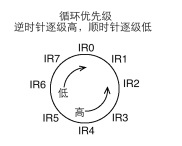
     - 例：当前 IR3 为最高级别中断请求，处理完成后，IR3 将变成最低级别，IR4 变成最高级别，这一组循环之后的优先级变成了：IR4>IR5>IR6>IR7>IR0>IR1>IR2>IR3

---

#### 初始化与操作步骤

**初始化步骤**：

1. **写入 ICW1**：设置连接方式和触发方式。
2. **写入 ICW2**：设置起始中断向量号。
3. **（可选）写入 ICW3**：当在级联模式下，设置主片和从片的连接关系。
4. **写入 ICW4**：设置工作模式，如自动结束中断、处理器类型等。
5. **设置 OCW1**：根据需要屏蔽或启用特定的 IRQ 中断。

**操作步骤**：

- **处理中断结束**：在中断处理程序结束时，发送 EOI 信号通知 8259A，可以通过 OCW2 实现。
- **动态调整优先级**：根据实际需求，使用 OCW2 调整中断优先级模式。
- **查询中断状态**：使用 OCW3 读取 8259A 的 IRR 或 ISR 寄存器，获取当前中断请求和处理中断的信息。

**注意事项**：

- 初始化过程中，必须严格按照顺序写入 ICW。
- 在级联模式下，主片和从片都需要进行初始化配置。
- 操作命令字（OCW）的写入顺序不受限制，可根据实际需求随时调整。

---

---

## 编写中断处理程序

### 每发生一次时钟中断就打印一次interrupt occur！（发生中断时各个函数之间的调用）


- init_all函数用来初始化所有的设备及数据结构，我们打算在主函数中调用它来完成初试化工作。init_all首先调用idt_init，它用来初始化中断相关的内容，其初始化也要分成几部分来做（pic_init用来初始化可编程中断控制器8259A，idt_desc_init用来初始化中断描述符表IDT），最后再加载IDT。


★★★代码核心逻辑：

1. 创建33个中断处理函数 --->==/kernel/kernel.S==

2. 写函数构建中断描述符表---> ==/kernel/interrupt.c==
3. 写函数初始化中断控制器8259A，并只打开时钟中断---> ==/kernel/interrupt.c==
4. 把2和3封装进入中断始化函数idt_init，调用idt_init函数完成中断描述符表初始化与中断控制器初始化，并加载idtr寄存器的值（存的是idt的起始地址和界限）---> ==/kernel/interrupt.c==
5. 把4封装进入总初始化函数init_all，调用这个函数完成中断初始化 --->==/kernel/init.c==
6. 在main中打开中断测试


#### ▶ 代码

**/kernel/kernel.S**

创建33个中断处理函数

每个中断处理程序都一样，执行该程序后打印字符串“interrupt occur!”，之后直接退出中断

```assembly
[bits 32]
%define ERROR_CODE nop		                ; 有些中断进入前CPU会自动压入错误码（32位）,为保持栈中格式统一,这里不做操作.
%define ZERO push 0		                    ; 有些中断进入前CPU不会压入错误码，对于这类中断，我们为了与前一类中断统一管理，就自己压入32位的0
extern put_str			                    ;声明外部函数，为的是调用put_str

section .data
intr_str db "interrupt occur!", 0xa, 0      ;★★打印字符串。第二个是一个换行符，第三个定义一个ascii码为0的字符，用来表示字符串的结尾
global intr_entry_table
intr_entry_table:                           ;编译器会将之后所有同属性的section合成一个大的segment，所以这个标号后面会聚集所有的中断处理程序的地址

%macro VECTOR 2                             ;汇编中的宏用法见书p320
section .text                               ;中断处理函数的代码段
intr%1entry:		                        ; 每个中断处理程序都要压入中断向量号,所以一个中断类型一个中断处理程序，自己知道自己的中断向量号是多少,此标号来表示中断处理程序的入口
    %2                                      ;这一步是根据宏传入参数的变化而变化的
    push intr_str
    call put_str
    add esp,4			                    ; 抛弃调用put_str压入的字符串地址参数

                                            ; 如果是从片上进入的中断,除了往从片上发送EOI外,还要往主片上发送EOI 
    mov al,0x20                             ; 中断结束命令EOI
    out 0xa0,al                             ;向主片发送OCW2,其中EOI位为1，告知结束中断，详见书p317
    out 0x20,al                             ;向从片发送OCW2,其中EOI位为1，告知结束中断

    add esp,4			                    ;对于会压入错误码的中断会抛弃错误码（这个错误码是执行中断处理函数之前CPU自动压入的），对于不会压入错误码的中断，就会抛弃上面push的0
    iret				                    ; 从中断返回,32位下等同指令iretd

section .data                               ;这个段就是存的此中断处理函数的地址
    dd    intr%1entry	                    ; 存储各个中断入口程序的地址，形成intr_entry_table数组,定义的地址是4字节，32位
%endmacro

VECTOR 0x00,ZERO                            ;调用之前写好的宏来批量生成中断处理函数，传入参数是中断号码与上面中断宏的%2步骤，这个步骤是什么都不做，还是压入0看p303
VECTOR 0x01,ZERO
VECTOR 0x02,ZERO
VECTOR 0x03,ZERO 
VECTOR 0x04,ZERO
VECTOR 0x05,ZERO
VECTOR 0x06,ZERO
VECTOR 0x07,ZERO 
VECTOR 0x08,ERROR_CODE
VECTOR 0x09,ZERO
VECTOR 0x0a,ERROR_CODE
VECTOR 0x0b,ERROR_CODE 
VECTOR 0x0c,ZERO
VECTOR 0x0d,ERROR_CODE
VECTOR 0x0e,ERROR_CODE
VECTOR 0x0f,ZERO 
VECTOR 0x10,ZERO
VECTOR 0x11,ERROR_CODE
VECTOR 0x12,ZERO
VECTOR 0x13,ZERO 
VECTOR 0x14,ZERO
VECTOR 0x15,ZERO
VECTOR 0x16,ZERO
VECTOR 0x17,ZERO 
VECTOR 0x18,ERROR_CODE
VECTOR 0x19,ZERO
VECTOR 0x1a,ERROR_CODE
VECTOR 0x1b,ERROR_CODE 
VECTOR 0x1c,ZERO
VECTOR 0x1d,ERROR_CODE
VECTOR 0x1e,ERROR_CODE
VECTOR 0x1f,ZERO 
VECTOR 0x20,ZERO
```


**★★★/kernel/interrupt.c**

定义idt_init()、idt_desc_init()、pic_init()函数，

idt_init()函数通过调用idt_desc_init()、pic_init()，实现有关中断的所有初始化工作

```c
#include "interrupt.h"      //里面定义了intr_handler类型
#include "stdint.h"         //各种uint_t类型
#include "global.h"         //里面定义了选择子
#include "io.h"             
#include "print.h"


#define PIC_M_CTRL 0x20	       // 这里用的可编程中断控制器是8259A,主片的控制端口是0x20
#define PIC_M_DATA 0x21	       // 主片的数据端口是0x21
#define PIC_S_CTRL 0xa0	       // 从片的控制端口是0xa0
#define PIC_S_DATA 0xa1	       // 从片的数据端口是0xa1


#define IDT_DESC_CNT 0x21	   //支持的中断描述符个数33

//按照中断门描述符格式定义结构体
struct gate_desc {
   uint16_t    func_offset_low_word;        //函数地址低字
   uint16_t    selector;                    //选择子字段
   uint8_t     dcount;                      //此项为双字计数字段，是门描述符中的第4字节。这个字段无用
   uint8_t     attribute;                   //属性字段
   uint16_t    func_offset_high_word;       //函数地址高字
};

// 静态函数声明,非必须
static void make_idt_desc(struct gate_desc* p_gdesc, uint8_t attr, intr_handler function);
static struct gate_desc idt[IDT_DESC_CNT];   //中断门描述符（结构体）数组，名字叫idt

extern intr_handler intr_entry_table[IDT_DESC_CNT];	    //引入kernel.s中定义好的中断处理函数地址数组，intr_handler就是void* 表明是一般地址类型


/*----------------------------★★★中断描述符表的构建-----------------------*/
//此函数用于将传入的中断门描述符与中断处理函数建立映射，三个参数：中断门描述符地址，属性，中断处理函数地址
static void make_idt_desc(struct gate_desc* p_gdesc, uint8_t attr, intr_handler function) { 
   p_gdesc->func_offset_low_word = (uint32_t)function & 0x0000FFFF;
   p_gdesc->selector = SELECTOR_K_CODE;
   p_gdesc->dcount = 0;
   p_gdesc->attribute = attr;
   p_gdesc->func_offset_high_word = ((uint32_t)function & 0xFFFF0000) >> 16;
}

//此函数用来循环调用make_idt_desc函数来完成中断门描述符与中断处理函数映射关系的建立,传入三个参数：中断描述符表某个中段描述符（一个结构体）的地址
//属性字段，中断处理函数的地址
static void idt_desc_init(void) {
   int i;
   for (i = 0; i < IDT_DESC_CNT; i++) {
      make_idt_desc(&idt[i], IDT_DESC_ATTR_DPL0, intr_entry_table[i]); 
   }
   put_str("   idt_desc_init done\n");
}


/* --------------------★★★初始化可编程中断控制器8259A（只接受来自时钟中断的信号）---------------- */
static void pic_init(void) {

   /* 初始化主片 */
   outb (PIC_M_CTRL, 0x11);   // ICW1: 边沿触发,级联8259, 需要ICW4.
   outb (PIC_M_DATA, 0x20);   // ICW2: 起始中断向量号为0x20,也就是IR[0-7] 为 0x20 ~ 0x27.
   outb (PIC_M_DATA, 0x04);   // ICW3: IR2接从片. 
   outb (PIC_M_DATA, 0x01);   // ICW4: 8086模式, 正常EOI

   /* 初始化从片 */
   outb (PIC_S_CTRL, 0x11);	// ICW1: 边沿触发,级联8259, 需要ICW4.
   outb (PIC_S_DATA, 0x28);	// ICW2: 起始中断向量号为0x28,也就是IR[8-15] 为 0x28 ~ 0x2F.
   outb (PIC_S_DATA, 0x02);	// ICW3: 设置从片连接到主片的IR2引脚
   outb (PIC_S_DATA, 0x01);	// ICW4: 8086模式, 正常EOI

   /* 打开主片上IR0,也就是目前只接受时钟产生的中断 */
   outb (PIC_M_DATA, 0xfe);
   outb (PIC_S_DATA, 0xff);

   put_str("   pic_init done\n");
}


/*--------------------------★★★完成有关中断的所有初始化工作----------------------------------*/
/*--------------------------这个函数调用上面定义的两个函数----------------------------------*/
void idt_init() {
   put_str("idt_init start\n");
   idt_desc_init();	   //调用上面写好的函数完成中段描述符表的构建
   pic_init();		  //设定化中断控制器，只接受来自时钟中断的信号

   /* 加载idt */
   uint64_t idt_operand = ((sizeof(idt) - 1) | ((uint64_t)(uint32_t)idt << 16));    //定义要加载到IDTR寄存器中的值
   asm volatile("lidt %0" : : "m" (idt_operand));
   put_str("idt_init done\n");
}

```


**/kernel/init.c**

定义init_all()函数，它调用上面文件里定义的idt_init()函数

```c
#include "init.h"
#include "print.h"
#include "interrupt.h"

/*负责初始化所有模块 */
void init_all() {
   put_str("init_all\n");
   idt_init();   //★★★初始化中断
}
```


**/kernel/global.h**

定义中断门描述符的各个字段

```c
#ifndef __KERNEL_GLOBAL_H
#define __KERNEL_GLOBAL_H
#include "stdint.h"

//选择子的RPL字段
#define	 RPL0  0
#define	 RPL1  1
#define	 RPL2  2
#define	 RPL3  3

//选择子的TI字段
#define TI_GDT 0
#define TI_LDT 1

//定义不同的内核用的段描述符选择子
#define SELECTOR_K_CODE	   ((1 << 3) + (TI_GDT << 2) + RPL0)
#define SELECTOR_K_DATA	   ((2 << 3) + (TI_GDT << 2) + RPL0)
#define SELECTOR_K_STACK   SELECTOR_K_DATA 
#define SELECTOR_K_GS	   ((3 << 3) + (TI_GDT << 2) + RPL0)

//定义模块化的中断门描述符attr字段，attr字段指的是中断门描述符高字第8到16bit
#define	 IDT_DESC_P 1 
#define	 IDT_DESC_DPL0 0
#define	 IDT_DESC_DPL3 3
#define	 IDT_DESC_32_TYPE 0xE   // 32位的门
#define	 IDT_DESC_16_TYPE 0x6   // 16位的门，不用，定义它只为和32位门区分


#define	 IDT_DESC_ATTR_DPL0  ((IDT_DESC_P << 7) + (IDT_DESC_DPL0 << 5) + IDT_DESC_32_TYPE)  //DPL为0的中断门描述符attr字段
#define	 IDT_DESC_ATTR_DPL3  ((IDT_DESC_P << 7) + (IDT_DESC_DPL3 << 5) + IDT_DESC_32_TYPE)  //DPL为3的中断门描述符attr字段

#endif
```


**/lib/kernel/io.h**

用内联汇编实现端口 I/O 函数，这样在/kernel/inerrupt.c中对8259A的初始化是就可以直接调用对应函数了。

```c
#ifndef __LIB_IO_H
#define __LIB_IO_H
#include "stdint.h"

 //一次送一字节的数据到指定端口，static指定只在本.h内有效，inline是让处理器将函数编译成内嵌的方式，就是在该函数调用处原封不动地展开
 //此函数有两个参数，一个端口号，一个要送往端口的数据
static inline void outb(uint16_t port, uint8_t data) {
/*********************************************************
 a表示用寄存器al或ax或eax,对端口指定N表示0~255, d表示用dx存储端口号, 
 %b0表示对应al,%w1表示对应dx */ 
   asm volatile ( "outb %b0, %w1" : : "a" (data), "Nd" (port));    
}

//利用outsw（端口输出串，一次一字）指令，将ds:esi指向的addr处起始的word_cnt(存在ecx中)个字写入端口port,ecx与esi会自动变化
static inline void outsw(uint16_t port, const void* addr, uint32_t word_cnt) {
/*********************************************************
   +表示此限制即做输入又做输出.
   outsw是把ds:esi处的16位的内容写入port端口, 我们在设置段描述符时, 
   已经将ds,es,ss段的选择子都设置为相同的值了,此时不用担心数据错乱。*/
   asm volatile ("cld; rep outsw" : "+S" (addr), "+c" (word_cnt) : "d" (port));
}                                       //S表示寄存器esi/si

/* 将从端口port读入的一个字节返回 */
static inline uint8_t inb(uint16_t port) {
   uint8_t data;
   asm volatile ("inb %w1, %b0" : "=a" (data) : "Nd" (port));
   return data;
}

/* 将从端口port读入的word_cnt个字写入addr */
static inline void insw(uint16_t port, void* addr, uint32_t word_cnt) {
/******************************************************
   insw是将从端口port处读入的16位内容写入es:edi指向的内存,
   我们在设置段描述符时, 已经将ds,es,ss段的选择子都设置为相同的值了,
   此时不用担心数据错乱。*/
   asm volatile ("cld; rep insw" : "+D" (addr), "+c" (word_cnt) : "d" (port) : "memory");
}                                   //D表示寄存器edi/di                       //通知编译器，内存已经被改变了

#endif

```

> ★★★为什么把函数实现写在.h文件里？
>
> 答：
>
> 在直接操作底层硬件的函数中，将函数实现放在 `.h` 文件中并使用 `static inline` 是为了提高对硬件的操作效率，减少函数调用开销，快速响应用户需求。
>
> 其中：**使用 `inline` 关键字，编译器将函数体直接嵌入调用位置，消除了`call` 指令，虽然这会让程序大一些，但减少了函数调用及返回时的现场保护及恢复工作，提升了效率。**


/kernel/main.c

```c
#include "print.h"
#include "init.h"
void main(void) {
   put_str("I am kernel\n");
   init_all();
   asm volatile("sti");	     // 为演示中断处理,在此临时开中断
   while(1);
}
```


第一列是中断门描述符的序号，这里共 0x20 个。

**★★target 是门描述符中所指向的中断处理程序地址**，用**选择子：偏移量**的形式给出，**所有中断处理程序所在段的选择子都是 0x0008，段内偏移地址各不相同**，也就是中断门描述符中记录的目标程序的选择子及选择子所在段的偏移量。


---

---

### 改进中断处理程序（中断处理程序由汇编改为C语言）

之前所做的无非是为了演示中断机制的原理，非常简单。现在要完善中断处理机制，主要就是让每个中断都有自己对应的处理函数，而不是像我们之前那样只是打印一个字符串。

>  但是我们不太可能采取在汇编中（kernel.S）直接定义中断处理函数
>
> 原因：1、汇编编写太麻烦；2、用一个kernel.S来维护所有中断处理函数很不方便
>
> 所以我们需要这样一种机制：1、**用C语言编写中断处理函数**；2、**当中断发生的时候，从我们之前写好的kernel.S中跳到我们C语言编写的中断处理函数中执行。**

- 代码逻辑：在C语言中定义中断处理函数，然后形成地址数组管理C语言中的中断处理函数；汇编语言kernel.S通过C语言形成的地址管理数组去调用C语言中的中断处理函数
- 

#### ▶ 代码

**/kernel/interrupt.c**

A、建立一个地址数组用来存储中断处理函数的地址，一个字符串指针数组用来存储中断的名字

B、我们先写一个通用的中断处理函数，功能是打印中断向量号，参数是中断号码

C、将地址数组中每个元素初始化为B写的中断处理函数地址（后面再改）；将字符串指针数组对照中断号填入中断名字（书p303），并封装成一个函数execption_init()

D、在idt_init（用来完成中断初始化的函数）中，调用exception_init；

```c
...

//按照中断门描述符格式定义结构体
struct gate_desc {
	...
};

...   

char* intr_name[IDT_DESC_CNT];		         //存储中断/异常的名字
intr_handler idt_table[IDT_DESC_CNT];	     // ★★★定义中断处理程序数组.在kernel.S中定义的intrXXentry只是中断处理程序的入口,最终调用的是ide_table中的处理程序


/* ---------------------★★★通用的中断处理函数,用于初始化,一般用在异常出现时的处理 --------------------*/
static void general_intr_handler(uint8_t vec_nr) {
   if (vec_nr == 0x27 || vec_nr == 0x2f) {	//伪中断向量，无需处理。详见书p337
      return;		
   }
   put_str("int vector: 0x");				//该中断处理程序的作用是打印调用该中断处理程序的中断向量号
   put_int(vec_nr);
   put_char('\n');
}


/* -----------------------完成一般中断处理函数注册及异常名称注册------------------------------ */
static void exception_init(void) {			   
   int i;
   for (i = 0; i < IDT_DESC_CNT; i++) {

/* idt_table数组中的函数是在进入中断后根据中断向量号调用的,
 * 见kernel/kernel.S的call [idt_table + %1*4] */
      idt_table[i] = general_intr_handler;		    // ★★★中断处理程序数组的每个元素对应一个中断处理程序，这里简单写为general_intr_handler函数，即这些中断都对应一个中断处理程序
							    				// 以后会由register_handler来注册具体处理函数。
      intr_name[i] = "unknown";				    // 先统一赋值为unknown 
   }
   intr_name[0] = "#DE Divide Error";
   intr_name[1] = "#DB Debug Exception";
   intr_name[2] = "NMI Interrupt";
   intr_name[3] = "#BP Breakpoint Exception";
   intr_name[4] = "#OF Overflow Exception";
   intr_name[5] = "#BR BOUND Range Exceeded Exception";
   intr_name[6] = "#UD Invalid Opcode Exception";
   intr_name[7] = "#NM Device Not Available Exception";
   intr_name[8] = "#DF Double Fault Exception";
   intr_name[9] = "Coprocessor Segment Overrun";
   intr_name[10] = "#TS Invalid TSS Exception";
   intr_name[11] = "#NP Segment Not Present";
   intr_name[12] = "#SS Stack Fault Exception";
   intr_name[13] = "#GP General Protection Exception";
   intr_name[14] = "#PF Page-Fault Exception";
   // intr_name[15] 第15项是intel保留项，未使用
   intr_name[16] = "#MF x87 FPU Floating-Point Error";
   intr_name[17] = "#AC Alignment Check Exception";
   intr_name[18] = "#MC Machine-Check Exception";
   intr_name[19] = "#XF SIMD Floating-Point Exception";
}


/*----------------------------中断描述符表的构建-----------------------*/
static void idt_desc_init(void) {
	...
}


/* --------------------初始化可编程中断控制器8259A（只接受来自时钟中断的信号）---------------- */
static void pic_init(void) {
    ...
}

/*--------------------------完成有关中断的所有初始化工作----------------------------------*/
void idt_init() {
   put_str("idt_init start\n");
   idt_desc_init();	   
   exception_init();	// ★★异常名初始化并注册通常的中断处理函数
   pic_init();		  	

/* -------------加载idt---------------- */
...
}

```


**kernel/kernel.S**

A、引入interrupt.c中定义的中断处理程序地址数组

B、中断处理函数模板中删除打印字符串的部分

C、中断处理函数模板中加入保存上下文代码

D、中断处理函数模板中加入压入中断号代码（方便调试）与调用C中形成的中断地址数组找到中断处理函数地址的代码

E、定义恢复上下文环境并退出中断的代码，并在D中调用

```assembly
[bits 32]
%define ERROR_CODE nop		                ; 有些中断进入前CPU会自动压入错误码（32位）,为保持栈中格式统一,这里不做操作.
%define ZERO push 0		                    ; 有些中断进入前CPU不会压入错误码，对于这类中断，我们为了与前一类中断统一管理，就自己压入32位的0
extern idt_table		                    ;★★★idt_table是C中注册的中断处理程序数组

section .data
global intr_entry_table
intr_entry_table:                           ;编译器会将之后所有同属性的section合成一个大的segment，所以这个标号后面会聚集所有的中断处理程序的地址

%macro VECTOR 2                             ;汇编中的宏用法见书p320
section .text                               ;中断处理函数的代码段
intr%1entry:		                        ; 每个中断处理程序都要压入中断向量号,所以一个中断类型一个中断处理程序，自己知道自己的中断向量号是多少,此标号来表示中断处理程序的入口
    %2                                      ;这一步是根据宏传入参数的变化而变化的
                                    
    push ds                                 ; 以下是保存上下文环境
    push es
    push fs
    push gs
    pushad

                                            ; 如果是从片上进入的中断,除了往从片上发送EOI外,还要往主片上发送EOI 
    mov al,0x20                             ; 中断结束命令EOI
    out 0xa0,al                             ;向主片发送OCW2,其中EOI位为1，告知结束中断，详见书p317
    out 0x20,al                             ;向从片发送OCW2,其中EOI位为1，告知结束中断

    push %1			                        ; 不管idt_table中的目标程序是否需要参数,都一律压入中断向量号,调试时很方便
    call [idt_table + %1*4]                 ; 调用idt_table中的C版本中断处理函数
    jmp intr_exit

section .data                               ;这个段就是存的此中断处理函数的地址
    dd    intr%1entry	                    ; 存储各个中断入口程序的地址，形成intr_entry_table数组,定义的地址是4字节，32位
%endmacro

section .text
global intr_exit
intr_exit:	     
                                            ; 以下是恢复上下文环境
    add esp, 4			                    ; 跳过中断号
    popad
    pop gs
    pop fs
    pop es
    pop ds
    add esp, 4			                    ;对于会压入错误码的中断会抛弃错误码（这个错误码是执行中断处理函数之前CPU自动压入的），对于不会压入错误码的中断，就会抛弃上面push的0                    
    iretd				                    ; 从中断返回,32位下iret等同指令iretd

VECTOR 0x00,ZERO                            ;调用之前写好的宏来批量生成中断处理函数，传入参数是中断号码与上面中断宏的%2步骤，这个步骤是什么都不做，还是压入0看p303
VECTOR 0x01,ZERO
VECTOR 0x02,ZERO
VECTOR 0x03,ZERO 
VECTOR 0x04,ZERO
VECTOR 0x05,ZERO
VECTOR 0x06,ZERO
VECTOR 0x07,ZERO 
VECTOR 0x08,ERROR_CODE
VECTOR 0x09,ZERO
VECTOR 0x0a,ERROR_CODE
VECTOR 0x0b,ERROR_CODE 
VECTOR 0x0c,ZERO
VECTOR 0x0d,ERROR_CODE
VECTOR 0x0e,ERROR_CODE
VECTOR 0x0f,ZERO 
VECTOR 0x10,ZERO
VECTOR 0x11,ERROR_CODE
VECTOR 0x12,ZERO
VECTOR 0x13,ZERO 
VECTOR 0x14,ZERO
VECTOR 0x15,ZERO
VECTOR 0x16,ZERO
VECTOR 0x17,ZERO 
VECTOR 0x18,ERROR_CODE
VECTOR 0x19,ZERO
VECTOR 0x1a,ERROR_CODE
VECTOR 0x1b,ERROR_CODE 
VECTOR 0x1c,ZERO
VECTOR 0x1d,ERROR_CODE
VECTOR 0x1e,ERROR_CODE
VECTOR 0x1f,ZERO 
VECTOR 0x20,ZERO
```

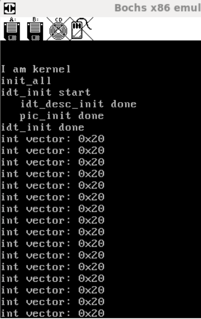

- 由于我们只打开了时钟中断，并且时钟的中断向量号是 0x20，所以我们成功啦。


---

---

### 调试实战：处理器进入中断时压栈出栈完整过程

> 注：详细内容见《真相还原》P339

以下是详细的表格，其中包含了具体操作步骤、使用的命令、以及每个步骤的解释和示例说明：

| 步骤  | 操作描述                     | 命令                        | 示例说明                                                     |
| ----- | ---------------------------- | --------------------------- | ------------------------------------------------------------ |
| **1** | 设置断点并开始执行           | `b 0x1500`<br>`c`           | **设置断点**：命令`b 0x1500`在物理地址`0x1500`处设置断点。<br>**继续执行**：命令`c`继续执行程序，直到在断点处停止。此步骤用于准备在程序特定位置暂停，以便后续调试。 |
| **2** | 监控中断的发生               | `show int`                  | **显示中断信息**：命令`show int`显示当前虚拟机中发生的中断信息，包括中断类型和发生的指令数时间戳。此命令帮助确定中断何时发生。 |
| **3** | 执行大量指令以等待中断       | `s 70000`                   | **单步执行大量指令**：命令`s 70000`一次性执行70000条指令。这用于快速推进程序执行，以便在合理时间内观察中断发生。 |
| **4** | 设置精确的中断断点           | `sba 18240477`<br>`c`       | **设置绝对指令数断点**：命令`sba 18240477`设置一个断点，当处理器执行到第`18240477`条指令时停下来。这是在中断发生前一条指令设置断点，以便精准捕捉中断。<br>**继续执行**：命令`c`继续执行程序，直到到达设定的断点。 |
| **5** | 查看中断发生前的栈情况       | `print-stack`               | **查看栈内容**：命令`print-stack`显示当前栈顶的16个单位的数据。这一步用于记录中断前栈中的数据，以便与中断后的栈状态进行比较。 |
| **6** | 查看寄存器内容               | `r`                         | **查看寄存器状态**：命令`r`显示当前所有寄存器的值。特别关注`eflags`、`cs`和`eip`，因为这些寄存器将在中断时被自动压入栈中。 |
| **7** | 执行单步操作并查看栈变化     | `s`<br>`print-stack`        | **单步执行**：命令`s`单步执行一条指令。此处单步执行是为了让中断实际发生，观察中断过程中的栈变化。<br>**查看栈内容**：再次使用`print-stack`命令查看栈，以确认寄存器内容是否已被压入栈中。 |
| **8** | 执行中断处理程序并保存上下文 | `s`<br>`print-stack 20`     | **继续单步执行**：继续使用命令`s`逐步执行中断处理程序，观察中断过程中栈的变化。<br>**查看更大范围的栈内容**：命令`print-stack 20`显示栈顶的20个单位的数据，以确认中断处理程序保存了哪些寄存器内容。这一步确保整个中断上下文（如通用寄存器）都已正确保存。 |
| **9** | 中断处理完成后的返回         | `s`<br>`r`<br>`print-stack` | **执行iret指令返回**：通过命令`s`继续执行，直到返回指令`iret`。<br>**查看寄存器**：命令`r`查看寄存器，确保`iret`返回后，寄存器恢复到中断前的状态。<br>**检查栈状态**：使用`print-stack`确认栈顶恢复到中断前的状态，确保中断处理完成。 |


---

---

## 可编程计数器/定时器 8253

​	在计算机系统中，时钟的作用是确保所有设备之间的通信井然有序，提供统一的节奏，避免发生冲突。时钟分为内部时钟和外部时钟两种：

- **内部时钟**：控制处理器内部元件的工作时序，由晶体振荡器产生，经过分频后成为外频，进而决定主频。内部时钟通常以纳秒为单位，不可改变。
- **外部时钟**：用于处理器与外部设备通信时的时序，通常以毫秒或秒为单位，与内部时钟独立运行。

​	定时器是解决时序配合问题的关键硬件，分为软件实现和硬件实现两种方式。硬件定时器如8253可编程间隔定时器（Programmable Interval Timer, PIT），可以提高处理器利用率，因为它独立于处理器工作。

### 简介

​	8253是一个可编程定时计数器，内部包含三个独立的计数器，每个计数器都有自己的工作节拍和频率。计数器0在个人计算机中专用于产生实时时钟信号，而计数器1和2分别用于DRAM定时刷新控制和内部扬声器声音控制。

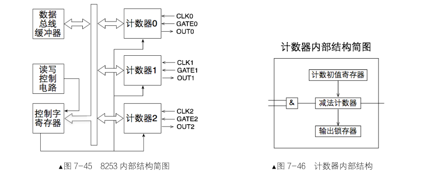

### 8253 控制字

8253的控制字决定了计数器的工作方式、读写格式及数制。控制字由8位二进制组成，包括选择计数器位、读写操作位、工作方式选择位和数制位。控制字寄存器位于0x43端口。


### 8253 工作方式

8253共有六种工作方式：

| 工作方式 | 名称                             | 功能描述                                                     | 典型应用           |
| -------- | -------------------------------- | ------------------------------------------------------------ | ------------------ |
| 方式 0   | 计数结束中断方式                 | 计数器从装载的初值倒数到0后，输出信号发生翻转，并保持这种状态直到下次装载。 | 事件计数器         |
| 方式 1   | 硬件可重触发单稳方式             | 当GATE信号为低时，计数器开始计数，倒数到0时OUT输出一个脉冲，然后OUT恢复到高电平。可以通过GATE信号重新触发。 | 产生单稳脉冲       |
| 方式 2   | 比率发生器                       | 计数器从初值倒数到0后立即重新加载初值，OUT产生一系列脉冲，输出频率为输入频率的N分之一（N为初值）。 | 分频               |
| 方式 3   | 方波发生器                       | 类似方式2，但OUT输出方波，周期为初值的两倍，适用于产生连续方波信号。 | 产生连续方波       |
| 方式 4   | 软件触发选通，单次计数           | 当控制字装载后，计数器开始倒数，倒数到0时OUT输出低电平。OUT仅输出一个脉冲，直到下次装载。 | 单次计数           |
| 方式 5   | 硬件触发选通，硬件启动的单次计数 | 与方式4类似，但需要通过GATE信号来启动计数，OUT输出低电平脉冲。 | 硬件启动的单次计数 |

### 8253 初始化步骤

初始化8253的步骤如下：

1. 向控制字寄存器端口0x43写入控制字，设置计数器的控制模式。
2. 在指定计数器的端口（如0x40、0x41或0x42）写入计数初值。计数初值是16位的，可以分两次写入，先低8位，再高8位。

通过初始化8253，可以根据需要调整时钟中断信号的频率，以适应不同的应用场景。


---

---

## 提高时钟中断频率

通过指定端口号，设置可编程定时器，提高时钟中断的频率

步骤：

A、往控制寄存器端口0x43中写入控制字（设置方法详见书p350）

1. ​	SCI1位与SCI0位置为00，意为操作定时器0。因为个人计算机中，定时器0专用于时钟中断

2. ​	RW1位与RW0位置为11，意为选择读写方式，这里选择先写入低字节，然后写入高字节

3. ​	M2位、M1位与M0位置为10，意为设置工作方式，这里设置为比率发生器（p352）
4. BCD位置为0，意为指计数器的计数方式是二进制

B、在所指定使用的计数器端口（0x40）中写入计数初值，因为我们要设定每秒100个中断，所以初值为1193180/100

C、A与B封装成一个函数frequency_set，定义一个timer_init调用前者

D、然后将在init_all中调用timer_init

### ▶ 代码

**/device/timer.c**

```c
#include "timer.h" 
#include "io.h"
#include "print.h"

#define IRQ0_FREQUENCY	    100    //定义我们想要的中断发生频率，100HZ                         
#define INPUT_FREQUENCY	    1193180     //计数器0的工作脉冲信号评率
#define COUNTER0_VALUE	    INPUT_FREQUENCY / IRQ0_FREQUENCY
#define CONTRER0_PORT	    0x40        //要写入初值的计数器端口号
#define COUNTER0_NO	        0   //要操作的计数器的号码
#define COUNTER_MODE	    2   //用在控制字中设定工作模式的号码，这里表示比率发生器
#define READ_WRITE_LATCH    3   //用在控制字中设定读/写/锁存操作位，这里表示先写入低字节，然后写入高字节
#define PIT_CONTROL_PORT    0x43    //控制字寄存器的端口

/* 把操作的计数器counter_no、读写锁属性rwl、计数器模式counter_mode写入模式控制寄存器并赋予初始值counter_value */
static void frequency_set(uint8_t counter_port, \
			  uint8_t counter_no, \
			  uint8_t rwl, \
			  uint8_t counter_mode, \
			  uint16_t counter_value) {
/* 往控制字寄存器端口0x43中写入控制字 */
   outb(PIT_CONTROL_PORT, (uint8_t)(counter_no << 6 | rwl << 4 | counter_mode << 1));
/* 先写入counter_value的低8位 */
   outb(counter_port, (uint8_t)counter_value);
/* 再写入counter_value的高8位 */
   //outb(counter_port, (uint8_t)counter_value >> 8); 作者这句代码会先将16位的counter_value强制类型转换为8位值，也就是原来16位值只留下了低8位，然后
   //又右移8未，所以最后送入counterj_port的counter_value的高8位是8个0，这会导致时钟频率过高，出现GP异常
   outb(counter_port, (uint8_t) (counter_value>>8) );
}

/* 初始化PIT8253 */
void timer_init() {
   put_str("timer_init start\n");
   /* 设置8253的定时周期,也就是发中断的周期 */
   frequency_set(CONTRER0_PORT, COUNTER0_NO, READ_WRITE_LATCH, COUNTER_MODE, COUNTER0_VALUE);
   put_str("timer_init done\n");
}

```


**/device/timer.h**

```c
#ifndef __DEVICE_TIME_H
#define __DEVICE_TIME_H
void timer_init(void);
#endif
```


**/kernel/init.c**

修改init.c，调用计时器的初始化函数

```c
#include "init.h"
#include "print.h"
#include "interrupt.h"
#include "timer.h"

/*负责初始化所有模块 */
void init_all() {
   put_str("init_all\n");
   idt_init(); 
   timer_init(); // here
}
```


- 结果就是，相比于前一个代码，中断在终端中打印的更快了


---

---

---

# GAP

## 中断描述符表IDT与中断门描述符

```c
#define IDT_DESC_CNT 0x21	   //支持的中断描述符个数33

//按照中断门描述符格式定义结构体
struct gate_desc {
   uint16_t    func_offset_low_word;        //中断处理函数地址低字（低32位：0～15位）
   uint16_t    selector;                    //选择子字段  （低32位：16～31位）
   uint8_t     dcount;                      //这个字段无用（高32位：0～7位）
   uint8_t     attribute;                   //属性字段	 （高32位：8～15位）
   uint16_t    func_offset_high_word;       //中断处理函数地址高字（高32位：16～31位）
};

// 将传入的中断门描述符与中断处理函数建立映射（即为上面结构体里的每个元素赋值，确保后续能通过该描述符找到中断处理程序）
static void make_idt_desc(struct gate_desc* p_gdesc, uint8_t attr, intr_handler function);

//中断门描述符（结构体）数组，名字叫idt
static struct gate_desc idt[IDT_DESC_CNT];
```

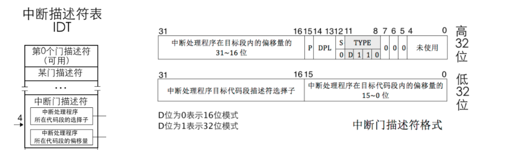


> **中断门描述符**是一个**结构体**，里面包括了各种的字段。
>
> 而**中断描述符表IDT**就是若干个描述符所组成的一个**数组**（假设数组起名为idt），即idt数组里的每个元素都是结构体类型。
>
> ​	所以当有一个中断来时，首先在IDTR中找到IDT的地址，然后将中断向量号×8作为访问IDT的数组下标。当在IDT中找到对应的中断门描述符后，通过访问描述符（结构体）中相应的字段（结构体元素），得到中断处理程序所在的代码段的**段选择子**和**段内偏移**。
>
> ​	得到段选择子和段内偏移后，通过GDTR找到全局描述符表GDT的地址，**段选择子**作为GDT的数组下标，访问对应的段描述符。在得到需要的段描述符后，通过访问其中的相应字段，得到我们需要的段信息（如**段在内存中的起始地址**）。
>
> 现在中断处理程序所在的代码段的**段地址**和**段内偏移**都得到了，那就可以顺理成章地得到中断处理程序的地址了。


> 由IDTR找IDT的地址，由中断向量号×8定位中断门描述符（中断门描述符中有中断处理程序所在的代码段的选择子和段内偏移量）
>
> 由GDTR找GDT的地址，由选择子定位内核代码段描述符（段描述符中有内核代码段的起始地址和其他段信息）
>
> 由内核代码段的起始地址找内核代码在内存中的地址，由段内偏移量定位中断处理程序


---

---

---

# 第八章 内存管理系统

## assert断言

c语言中的断言：

```c
#include <assert.h>

assert(expression);
```

`assert` 会检查给定的表达式（`expression`）是否为真。如果为假，则程序会输出错误信息并终止运行。

```c
#include <stdio.h>
#include <assert.h>

void divide(int a, int b) {
    assert(b != 0);  // 确保 b 不为 0
    printf("Result: %d\n", a / b);
}

int main() {
    divide(10, 2);  // 正常
    divide(10, 0);  // 触发断言
    return 0;
}
```
运行结果：

```bash
Result: 5
a.out: /home/ZMR/Desktop/ZMR-C-Cpp/Scratch_paper/Scratch_paper.c:2385: divide: Assertion `b != 0' failed.
zsh: IOT instruction (core dumped)  ./a.out
```

---

### ▶ 代码（实现开关中断函数）

内核运行时，为了通过时钟中断定时调度其他任务，大部分情况下中断是打开的。而断言在输出报错信息时，屏幕输出不应该被其他进程干扰，这样咱们才能专注于报错信息。所以使用ASSERT 排查出错误后，最好在**关闭中断**的情况下打印报错信息。

所以需要有自由开关中断的函数。

**/kernel/interrupt.c**

```c
...

//按照中断门描述符格式定义结构体
struct gate_desc {
	...
};

...   

#define EFLAGS_IF   0x00000200       // eflags寄存器中的if位为1
#define GET_EFLAGS(EFLAG_VAR) asm volatile("pushfl; popl %0" : "=g" (EFLAG_VAR))
//pop到了eflags_var所在内存中，该约束自然用表示内存的字母，但是内联汇编中没有专门表示约束内存的字母，所以只能用
//g 代表可以是任意寄存器，内存或立即数


/*---------------中断描述符表的构建--------------*/
static void idt_desc_init(void) {
	...
}


/* ----------------初始化可编程中断控制器8259A（只接受来自时钟中断的信号）------------ */
static void pic_init(void) {
    ...
}


/* ----------------完成一般中断处理函数注册及异常名称注册----------------- */
static void exception_init(void) {
	...
}


/* ------------------------★★★4个控制中断开关的函数实现------------------------ */
/* 获取当前中断状态 */
enum intr_status intr_get_status() {
   uint32_t eflags = 0; 
   GET_EFLAGS(eflags);
   return (EFLAGS_IF & eflags) ? INTR_ON : INTR_OFF;
}

/* 开中断并返回开中断前的状态*/
enum intr_status intr_enable() {
   enum intr_status old_status;
   if (INTR_ON == intr_get_status()) {
      old_status = INTR_ON;
      return old_status;
   } else {
      old_status = INTR_OFF;
      asm volatile("sti");	 // 开中断,sti指令将IF位置1
      return old_status;
   }
}

/* 关中断,并且返回关中断前的状态 */
enum intr_status intr_disable() {     
   enum intr_status old_status;
   if (INTR_ON == intr_get_status()) {
      old_status = INTR_ON;
      asm volatile("cli" : : : "memory"); // 关中断,cli指令将IF位置0
      return old_status;
   } else {
      old_status = INTR_OFF;
      return old_status;
   }
}

/* 将中断状态设置为status */
enum intr_status intr_set_status(enum intr_status status) {
   return status & INTR_ON ? intr_enable() : intr_disable();   //enable与disable函数会返回旧中断状态
}

/*---------------------完成有关中断的所有初始化工作-----------------------*/
void idt_init() {
   put_str("idt_init start\n");
   idt_desc_init();	   
   exception_init();	
   pic_init();		

/* -------------加载idt---------------- */
...

```


**/kernel/interrupt.h**

```c
#ifndef __KERNEL_INTERRUPT_H
#define __KERNEL_INTERRUPT_H
#include "stdint.h"
typedef void* intr_handler;		
void idt_init(void);

/* ★★★定义中断的两种状态:
 * INTR_OFF值为0,表示关中断,
 * INTR_ON值为1,表示开中断 */
enum intr_status {		 // 中断状态
    INTR_OFF,			 // 中断关闭
    INTR_ON		         // 中断打开
};

/* ------------------------★★★控制中断开关的函数定义------------------------ */
enum intr_status intr_get_status(void);
enum intr_status intr_set_status (enum intr_status);
enum intr_status intr_enable (void);
enum intr_status intr_disable (void);
#endif
```


### ▶ 代码（实现assert）

ASSERT 是用宏来定义的，其原理是判断传给 ASSERT 的表达式是否成立，若表达式成立则什么都不做，否则打印出错信息并停止执行。

**/kernel/debug.h**

```c
#ifndef __KERNEL_DEBUG_H
#define __KERNEL_DEBUG_H
void panic_spin(char* filename, int line, const char* func, const char* condition);

/* ----------------------------★★★定义PANIC宏---------------------------- */
//	“...” 是可变参数，也就是随便你传多少个参数，然后原封不动地传到__VA_ARGS_那里去
/*PANIC(...)：这个宏封装了panic_spin函数，它传入了四个参数：
__FILE__：当前被编译的源文件名。
__LINE__：当前代码所在的行号。
__func__：当前函数的名称。
__VA_ARGS__：传递给宏的可变参数（即ASSERT中的条件表达式）。*/
#define PANIC(...) panic_spin (__FILE__, __LINE__, __func__, __VA_ARGS__)


/* -------------------------★★★条件编译和ASSERT宏定义--------------------------- */
//1.使用条件编译来控制ASSERT宏的启用与禁用。
//（如果定义了NDEBUG,那么下面定义的ASSERT就是个空。这样我们可以便捷的让所有ASSERT宏失效。）
//2.在ASSERT宏中检查条件表达式，如果为假则调用PANIC打印错误信息。
#ifdef NDEBUG
   #define ASSERT(CONDITION) ((void)0)
#else
#define ASSERT(CONDITION)   \
    if(CONDITION){}         \
    else{PANIC(#CONDITION);}    //★★PANIC宏在这边被assert调用。 加#后，传入的参数变成字符串

#endif  //结束#ifdef NDEBUG

#endif  //结束#define __KERNEL_DEBUG_H

```


**/kernel/debug.c**

```c
#include "debug.h"
#include "print.h"
#include "interrupt.h"  //关闭中断函数在里面

/* --------------★★★发生断言时打印的信息（打印文件名,行号,函数名,条件并使程序悬停）-------------- */
// PANIC宏定义的函数
void panic_spin(char* filename, int line, const char* func, const char* condition) 
{
   intr_disable();	//发生错误时打印错误信息，不应该被打扰，★★调用前面定义的“关闭中断的函数”
   put_str("\n\n\n!!!!! error !!!!!\n");
   put_str("filename:");put_str(filename);put_str("\n");
   put_str("line:0x");put_int(line);put_str("\n");
   put_str("function:");put_str((char*)func);put_str("\n");
   put_str("condition:");put_str((char*)condition);put_str("\n");
   while(1);
}
```


**/kernel/main.c**

```c
#include "print.h"
#include "init.h"
#include "debug.h"
int main(void) {
   put_str("I am kernel\n");
   init_all();
   ASSERT(1==2); // 测试断言
   while(1);
   return 0;
}
```

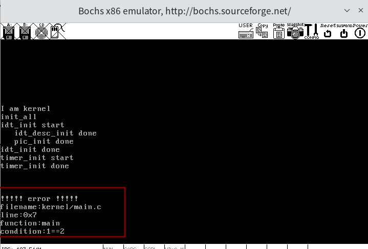

- 结果没问题，**断言发生在main.c文件的第7行，断言所在的函数是main函数，发生断言的条件是1==2**


---

---

## 各种字符串操作函数

以下是关于这些字符串操作函数的表格，列出了函数名称、参数、功能以及实现原理：

| 函数名称  | 参数                                            | 功能                                   | 实现原理                                                     |
| --------- | ----------------------------------------------- | -------------------------------------- | ------------------------------------------------------------ |
| `memset`  | `void* dst_, uint8_t value, uint32_t size`      | 将指定内存区域的每个字节设置为给定的值 | 逐字节地将 `value` 写入从 `dst_` 开始的 `size` 个字节中      |
| `memcpy`  | `void* dst_, const void* src_, uint32_t size`   | 将一段内存中的数据复制到另一段内存中   | 逐字节地将 `src_` 开始的 `size` 个字节复制到 `dst_`          |
| `memcmp`  | `const void* a_, const void* b_, uint32_t size` | 比较两段内存中的数据                   | 比较 `a_` 和 `b_` 开始的 `size` 个字节，返回对应的比较结果   |
| `strcpy`  | `char* dst_, const char* src_`                  | 将源字符串复制到目标地址               | 逐字符复制 `src_` 到 `dst_`，直到遇到字符串结束符 `'\0'`     |
| `strlen`  | `const char* str`                               | 计算字符串的长度                       | 遍历字符串直到遇到 `'\0'`，返回字符的数量                    |
| `strcmp`  | `const char* a, const char* b`                  | 比较两个字符串的大小                   | 逐字符比较 `a` 和 `b`，直到找到不同的字符或遇到 `'\0'`       |
| `strchr`  | `const char* str, const uint8_t ch`             | 查找字符串中首次出现的指定字符         | 从左到右遍历字符串 `str`，找到第一个 `ch` 并返回其地址       |
| `strrchr` | `const char* str, const uint8_t ch`             | 查找字符串中最后一次出现的指定字符     | 从左到右遍历字符串 `str`，记录 `ch` 最后一次出现的位置并返回 |
| `strcat`  | `char* dst_, const char* src_`                  | 拼接两个字符串                         | 将 `src_` 的内容附加到 `dst_` 的结尾，并返回 `dst_`          |
| `strchrs` | `const char* str, uint8_t ch`                   | 计算指定字符在字符串中出现的次数       | 遍历字符串 `str`，每遇到 `ch` 增加计数                       |

### ▶ 代码

**/lib/string.c**

```c
#include "string.h"
#include "global.h"
#include "debug.h"  //定义了ASSERT

/*---------------------将dst起始的size个字节置为value-------------------------*/
//这个函数最常用的用法就是来初始化一块内存区域，也就是置为ASCII码为0
void memset(void* dst_, uint8_t value, uint32_t size) {
    ASSERT(dst_ != NULL);            //一般开发都有这个习惯，传入进来个地址，判断不是空
    uint8_t* dst = (uint8_t*)dst_;   //强制类型转换，将对地址的操作单位变成一字节
    while (size-- > 0)               //先判断size是否>0，然后再减，然后执行循环体，size是多少，就会循环多少次
        *dst++ = value;               //*的优先级高于++，所以是先对dst指向的地址进行操作(*dst=value)，然后地址+1
}

/*----------------将src地址起始处size字节的数据移入dst，用于拷贝内存数据--------------*/
//src起始是有数据的，所以用const void*，const修饰void*，意味着地址内的数据是只读
void memcpy(void* dst_, const void* src_, uint32_t size) {
    ASSERT(dst_ != NULL && src_ != NULL);
    uint8_t* dst = dst_;
    const uint8_t* src = src_;
    while (size-- > 0)
        *dst++ = *src++;
}

/*--------------------比较两个地址起始的size字节的数据是否相等----------------*/
//如果相等，则返回0；如果不相等，比较第一个不相等的数据，>返回1，<返回-1
int memcmp(const void* a_, const void* b_, uint32_t size) {
    const char* a = a_;
    const char* b = b_;
    ASSERT(a != NULL || b != NULL);
    while (size-- > 0) {
        if(*a != *b) {
	        return *a > *b ? 1 : -1; 
        }
    a++;
    b++;
    }
   return 0;
}

/*-------------------将字符串从src拷贝到dst,并返回目的字符串的起始地址-----------------*/
char* strcpy(char* dst_, const char* src_) {
    ASSERT(dst_ != NULL && src_ != NULL);
    char* r = dst_;		       // 用来返回目的字符串起始地址
    while((*dst_++ = *src_++));  //1、*dst=*src  2、判断*dst是否为'\0'，然后决定是否执行循环体，本步骤真假值不影响3   3、dst++与scr++，谁先谁后不知道
    return r;                    //上面多出来的一对括号，是为了告诉编译器，我这里的=就是自己写的，而不是将==错误写成了=
}

/* ------------------------返回字符串长度------------------------ */
uint32_t strlen(const char* str) {
    ASSERT(str != NULL);
    const char* p = str;
    while(*p++);                 //1、先取*p的值来进行2的判断     2、判断*p,决定是否执行循环体     3、p++(这一步的执行并不依赖2的判断为真) 
    return (p - str - 1);        //p最后指向'\0'后面第一个元素
}

/*---------------------------比较两个字符串----------------------------*/
//若a_中的字符与b_中的字符全部相同，则返回0，如果不同，那么比较第一个不同的字符，如果a_>b_返回1，反之返回-1
int8_t strcmp (const char* a, const char* b) {
    ASSERT(a != NULL && b != NULL);
    while (*a != 0 && *a == *b) {
        a++;
        b++;
    }
/* 如果*a小于*b就返回-1,否则就属于*a大于等于*b的情况。在后面的布尔表达式"*a > *b"中,
 * 若*a大于*b,表达式就等于1,否则就表达式不成立,也就是布尔值为0,恰恰表示*a等于*b */
    return *a < *b ? -1 : *a > *b;
}

/* ---------从左到右查找字符串str中首次出现字符ch的地址(不是下标,是地址)---------- */
char* strchr(const char* str, const uint8_t ch) {
    ASSERT(str != NULL);
    while (*str != 0) {
        if (*str == ch) {
	        return (char*)str;	    // 需要强制转化成和返回值类型一样,否则编译器会报const属性丢失,下同.
        }
        str++;
    }
    return NULL;
}

/* ---------从后往前查找字符串str中首次出现字符ch的地址(不是下标,是地址)---------- */
char* strrchr(const char* str, const uint8_t ch) {
    ASSERT(str != NULL);
    const char* last_char = NULL;
    /* 从头到尾遍历一次,若存在ch字符,last_char总是该字符最后一次出现在串中的地址(不是下标,是地址)*/
    while (*str != 0) {
        if (*str == ch) {
	        last_char = str;
        }
        str++;
    }
    return (char*)last_char;
}

/* ------------------将字符串src_拼接到dst_后,将回拼接的串地址--------------- */
char* strcat(char* dst_, const char* src_) {
    ASSERT(dst_ != NULL && src_ != NULL);
    char* str = dst_;
    while (*str++);
    --str;                       // 别看错了，--str是独立的一句，并不是while的循环体。这一句是为了让str指向dst_的最后一个非0字符
    while((*str++ = *src_++));	//1、*str=*src  2、判断*str     3、str++与src++，这一步不依赖2
    return dst_;
}

/* ------------在字符串str中查找指定字符ch出现的次数---------------- */
uint32_t strchrs(const char* str, uint8_t ch) {
    ASSERT(str != NULL);
    uint32_t ch_cnt = 0;
    const char* p = str;
    while(*p != 0) {
        if (*p == ch) {
            ch_cnt++;
        }
        p++;
    }
    return ch_cnt;
}
```


---

---

## 位图 bitmap 

==位图就是用字节中的 1 位来映射其他单位大小的资源==

若位图在代码中用一个字节数组表示，数组中的每一个元素都是一字节，每 1 字节含有 8 位，因此==位图的 1 字节对等表示 8 个资源单位。==

###  概念

- 位图 (bitmap) 是一种常见的资源管理方式，通过**用二进制位 (bit) 来表示和管理计算机资源，如内存或硬盘空间。**
- **位 (bit)** 是计算机中最小的数据单位，而 **图 (map)** 则指映射关系。位图就是用一组位来映射对应的资源单位。

- 每个二进制位可以表示资源的一个状态（如已占用或未占用）。

  - 例如，在内存管理中，位图中的每一位可以对应内存的一个页 (通常是 4KB)，通过位图可以轻松追踪每一页是否被分配。

  

### ▶ 代码 

- **数据结构**: 位图在代码中通常用一个字节数组来表示，数组中的每一个字节包含 8 个位。`struct bitmap` 是一个结构体，它包含了位图的字节长度 (btmp_bytes_len) 和指向位图起始地址的指针 (bits)。

- 位图操作函数:

  - `bitmap_init` 用于初始化位图，将位图的所有位设置为 0。
  - `bitmap_scan_test` 判断某个位是否为 1，返回相应的布尔值。
  - `bitmap_scan` 在位图中查找连续的可用位，返回起始位置。
  - `bitmap_set` 用于设置某个位的值为 0 或 1。

- **★★★代码核心：给一个位在位图中的位置（偏移量），要得到该位在管理位图的字节数组中的位置**

  ```c
  // ★★★该代码是为了判断函数传入的bit_idx位是否为1
  bool bitmap_scan_test(struct bitmap* btmp, uint32_t bit_idx) {
      
     //★★★确定要判断的位所在字节的偏移（在字节数组中的数组下标）
     uint32_t byte_idx = bit_idx / 8;   
      
     //★★★确定要判断的位在某个字节中的偏移（数组中每个元素都有8位，因此需要确定在8位中的哪个位置）
     uint32_t bit_odd  = bit_idx % 8;    
      
     // ★★★
     // btmp->bits[byte_idx]这是取出要判断的bit_idx位所在数组的那8位的字节元素（假设为①1001 0010,②1001 1010 --->着重看不一样的那位，也是我们要判断是否为0的那位）
     // BITMAP_MASK这个宏定义为1,即：0000 0001
     // BITMAP_MASK << bit_odd，若在字节中的偏移为3,则结果为0000 1000
     // ①1001 0010 & 0000 1000 = 0000 0000 全为0,说明我们要得到的那位为0
     // ②1001 1010 & 0000 1000 = 0000 1000 非0,说明我们要得到的那位为1
     return (btmp->bits[byte_idx] & (BITMAP_MASK << bit_odd));
  }
  ```

  ```bash
  10011010  (btmp->bits[byte_idx])
  00001000  (BITMAP_MASK << bit_odd)
  --------
  00001000  (结果)
  return 1
  ```

  

**/lib/kernel/bitmap.h**

```c
#ifndef __LIB_KERNEL_BITMAP_H
#define __LIB_KERNEL_BITMAP_H
#include "global.h"
#define BITMAP_MASK 1

struct bitmap {                 //★★★这个数据结构就是用来管理整个位图
   uint32_t btmp_bytes_len;     //记录整个位图的大小，字节为单位
   uint8_t* bits;               //用来记录位图的起始地址，我们未来用这个地址遍历位图时，操作单位指定为最小的字节
};

void bitmap_init(struct bitmap* btmp);
bool bitmap_scan_test(struct bitmap* btmp, uint32_t bit_idx);
int bitmap_scan(struct bitmap* btmp, uint32_t cnt);
void bitmap_set(struct bitmap* btmp, uint32_t bit_idx, int8_t value);
#endif

```

**/lib/kernel/bitmap.c**

完成一系列与位图有关的函数，包含位图初始化（所有位全部置0），判断某位是0还是1，找到连续cnt个0（表示找到了某大小的连续内存），设置位图的某位。

```c
#include "bitmap.h"
#include "stdint.h"
#include "string.h"
#include "print.h"
#include "interrupt.h"
#include "debug.h"

/* -------------------------将位图btmp初始化----------------------- */
void bitmap_init(struct bitmap* btmp) {
   memset(btmp->bits, 0, btmp->btmp_bytes_len);   
}


/*------------------------用来确定位图的某一位是1，还是0--------------------*/
//若是1，返回真（返回的值不一定是1）。否则，返回0。
//传入两个参数，指向位图的指针，与要判断的位的偏移
bool bitmap_scan_test(struct bitmap* btmp, uint32_t bit_idx) {
   uint32_t byte_idx = bit_idx / 8;    //确定要判断的位所在字节的偏移
   uint32_t bit_odd  = bit_idx % 8;    //确定要判断的位在某个字节中的偏移
   return (btmp->bits[byte_idx] & (BITMAP_MASK << bit_odd));
}


/*---------用来在位图中找到cnt个连续的0，以此来分配一块连续未被占用的内存--------*/
//参数有指向位图的指针与要分配的内存块的个数cnt
//成功就返回起始位的偏移（如果把位图看做一个数组，那么也可以叫做下标），不成功就返回-1
int bitmap_scan(struct bitmap* bitmap, uint32_t cnt){
    uint32_t area_start = 0, area_size = 0;    //用来存储一个连续为0区域的起始位置, 存储一个连续为0的区域大小
    while(1){                   
        while( bitmap_scan_test(bitmap, area_start) && area_start / 8 < bitmap->btmp_bytes_len) //当这个while顺利结束1、area_start就是第一个0的位置；2、area_start已经越过位图边界
            area_start++;
        if(area_start / 8 >= bitmap->btmp_bytes_len)    //上面那个循环跑完可能是area_start已经越过边界，说明此时位图中是全1，那么就没有可分配内存
            return -1;
        area_size = 1;  //来到了这一句说明找到了位图中第一个0，那么此时area_size自然就是1
        while( area_size < cnt ){
            if( (area_start + area_size) / 8 < bitmap->btmp_bytes_len ){    //确保下一个要判断的位不超过边界
                if( bitmap_scan_test(bitmap, area_start + area_size) == 0 ) //判断区域起始0的下一位是否是0
                    area_size++;
                else
                    break;  //进入else，说明下一位是1，此时area_size还没有到达cnt的要求，且一片连续为0的区域截止，break
            }
            else
                return -1;  //来到这里面，说面下一个要判断的位超过边界，且area_size<cnt，返回-1
        }
        if(area_size == cnt)    //有两种情况另上面的while结束，1、area_size == cnt；2、break；所以要判断
            return area_start;
        area_start += (area_size+1); //更新area_start，判断后面是否有满足条件的连续0区域
    }
}


/*------------------------将位图某一位设定为1或0-------------------------*/
//传入参数是指向位图的指针与这一位的偏移，与想要的值
void bitmap_set(struct bitmap* btmp, uint32_t bit_idx, int8_t value) {
   ASSERT((value == 0) || (value == 1));
   uint32_t byte_idx = bit_idx / 8;    //确定要设置的位所在字节的偏移
   uint32_t bit_odd  = bit_idx % 8;    //确定要设置的位在某个字节中的偏移

/* 一般都会用个0x1这样的数对字节中的位操作,
 * 将1任意移动后再取反,或者先取反再移位,可用来对位置0操作。*/
   if (value) {		      // 如果value为1
      btmp->bits[byte_idx] |= (BITMAP_MASK << bit_odd);
   } else {		      // 若为0
      btmp->bits[byte_idx] &= ~(BITMAP_MASK << bit_odd);
   }
}
```

---

---

## 内存管理系统

程序是一堆指令的合集，而内存是程序的舞台。

==因为处理器需要到内存中取指令，所以程序要在计算机中能运行，就必须加载到内存中。==

所以CS和EIP存的是指令所在的内存地址。

而程序所占用的内存空间是由操作系统分配的，所以我们的TinyOS操作系统要对内存进行操作的话，就得实现一个**内存管理系统。**

### 内存池（管理与分配地址）

- **内存池**：内存池是一种内存管理技术，其本质是将可用的内存地址集中放到一个“池子”中，**当系统或进程需要分配内存时，可以直接从内存池中取出需要的内存地址**。内存池提高了内存分配的效率，并且方便集中管理。


- **物理内存池与虚拟内存池**：
  - **物理内存池**：管理实际的物理内存，**分为用户物理内存池和内核物理内存池**。用户物理内存池用于分配给用户进程，而内核物理内存池则仅供操作系统使用。
  - **虚拟内存池**：管理虚拟内存地址，用于在虚拟地址空间中分配地址，**分为用户虚拟内存池和内核虚拟内存池**。每个任务（包括用户进程和内核）都有自己独立的虚拟地址空间，因此每个任务也需要有一个虚拟内存池。


---

### ★★★内存池和位图的关系

**内存池是一个结构体，记录了内存池管理的内存起始地址和大小。而如何知道所管理的那些内存是否被使用，则使用位图这个数据结构来记录。**

```c
// 物理内存池，生成两个实例用于管理内核物理内存池和用户物理内存池
struct pool {
   struct bitmap pool_bitmap;	// ★★★本内存池用到位图结构,用于管理物理内存
   uint32_t phy_addr_start;	    // 本内存池所管理物理内存的起始地址
   uint32_t pool_size;		    // 本内存池字节容量
};

struct pool kernel_pool, user_pool;      //为kernel与user分别建立物理内存池
```

---

### （内存池的构建，★★★32M物理内存的分布情况）

**实现原理**：

​	由于段页机制的存在，使得程序的地址变成了虚拟地址，这个虚拟地址需要经过转换变成真实的物理地址才能实际可用。所以分配内存，既是一个分配虚拟内存空间的过程（在进程自己独享的整个虚拟地址空间中分配），又是一个分配真实物理空间的过程。而地址分配都需要通过内存池，所以我们需要初始化三个内存池来管理地址空间。

**代码逻辑**：

**A**、建立**虚拟内存池**的数据结构，建立**物理内存池**的数据结构；并创建管理内核可用虚拟地址空间的内存池变量，管理内核可用物理地址空间的内存池变量，管理用户进程可用物理地址空间的内存池变量。

**B**、初始化上面建立的三个内存池变量。

**C**、将B封装成一个函数，并在总初始化函数中调用


**/kernel/memory.h**

```c
#ifndef __KERNEL_MEMORY_H
#define __KERNEL_MEMORY_H
#include "stdint.h"
#include "bitmap.h"

//★★★核心数据结构，虚拟内存池，有一个位图与其管理的起始虚拟地址
struct virtual_addr {
   struct bitmap vaddr_bitmap;      // 虚拟地址用到的位图结构 
   uint32_t vaddr_start;            // 虚拟地址起始地址
};

//另一个核心数据结构，物理内存池，分为内核物理内存池和用户物理内存池（定义在.c代码中)
extern struct pool kernel_pool, user_pool;

void mem_init(void);

#endif

```

**/kernel/memory.c**

```c
#include "memory.h"
#include "stdint.h"
#include "print.h"

#define PG_SIZE 4096    //一页的大小4K
#define MEM_BITMAP_BASE 0xc009a000  //★★★这个地址是位图的起始地址，1MB内存布局中，9FBFF是最大一段可用区域的边界，而我们计划这个可用空间最后的位置将来用来放PCB，
        //而PCB占用内存是一个自然页，所以起始地址必须是0xxxx000这种形式，离0x9fbff最近的符合这个形式的地址是0x9f000。我们又为了将来可能的拓展，
        // 所以让位图可以支持管理512MB的内存空间，所以预留位图大小为16KB，也就是4页，所以选择0x9a000作为位图的起始地址

//★定义内核堆区起始地址，堆区就是用来进行动态内存分配的地方，咱们的系统内核运行在c00000000开始的1MB虚拟地址空间，所以自然要跨过这个空间，
//堆区的起始地址并没有跨过256个页表，没关系，反正使用虚拟地址最终都会被我们的页表转换为物理地址，我们建立物理映射的时候，跳过256个页表就行了
#define K_HEAP_START 0xc0100000

//---------------------------------------------------------------------------------
/* ★★★核心数据结构，物理内存池，生成两个实例用于管理内核物理内存池和用户物理内存池 */
struct pool {
   struct bitmap pool_bitmap;	 // 本内存池用到的位图结构,用于管理物理内存
   uint32_t phy_addr_start;	     // 本内存池所管理物理内存的起始地址
   uint32_t pool_size;		    // 本内存池字节容量
};

struct pool kernel_pool, user_pool;      //为kernel与user分别建立物理内存池，让用户进程只能从user内存池获得新的内存空间，以免申请完所有可用空间,内核就不能申请空间了
struct virtual_addr kernel_vaddr;	 // 用于管理内核虚拟地址空间

//--------------------------------------------------------------------------------
//★★★初始化内核物理内存池与用户物理内存池
static void mem_pool_init(uint32_t all_mem) {
   put_str("   mem_pool_init start\n");
   uint32_t page_table_size = PG_SIZE * 256;	  // 页表大小= 1页的页目录表+第0和第768个页目录项指向同一个页表+
                                                  // 第769~1022个页目录项共指向254个页表,共256个页表
   uint32_t used_mem = page_table_size + 0x100000;	  // 已使用内存 = 1MB + 256个页表
   uint32_t free_mem = all_mem - used_mem;
   uint16_t all_free_pages = free_mem / PG_SIZE;        //将所有可用内存转换为页的数量，内存分配以页为单位，丢掉的内存不考虑
   uint16_t kernel_free_pages = all_free_pages / 2;     //可用内存是用户与内核各一半，所以分到的页自然也是一半
   uint16_t user_free_pages = all_free_pages - kernel_free_pages;   //用于存储用户空间分到的页

/* 为简化位图操作，余数不处理，坏处是这样做会丢内存。
好处是不用做内存的越界检查,因为位图表示的内存少于实际物理内存*/
   uint32_t kbm_length = kernel_free_pages / 8;			  // 内核物理内存池的位图长度,位图中的一位表示一页,以字节为单位
   uint32_t ubm_length = user_free_pages / 8;			  // 用户物理内存池的位图长度.

   uint32_t kp_start = used_mem;				  // Kernel Pool start,内核使用的物理内存池的起始地址
   uint32_t up_start = kp_start + kernel_free_pages * PG_SIZE;	  // User Pool start,用户使用的物理内存池的起始地址

   kernel_pool.phy_addr_start = kp_start;       //赋值给内核使用的物理内存池的起始地址
   user_pool.phy_addr_start   = up_start;       //赋值给用户使用的物理内存池的起始地址

   kernel_pool.pool_size = kernel_free_pages * PG_SIZE;     //赋值给内核使用的物理内存池的总大小
   user_pool.pool_size	 = user_free_pages * PG_SIZE;       //赋值给用户使用的物理内存池的总大小

   kernel_pool.pool_bitmap.btmp_bytes_len = kbm_length;     //赋值给管理内核使用的物理内存池的位图长度
   user_pool.pool_bitmap.btmp_bytes_len	  = ubm_length;   //赋值给管理用户使用的物理内存池的位图长度

/*********    内核内存池和用户内存池位图   ***********
 *   位图是全局的数据，长度不固定。
 *   全局或静态的数组需要在编译时知道其长度，
 *   而我们需要根据总内存大小算出需要多少字节。
 *   所以改为指定一块内存来生成位图.
 *   ************************************************/
// 内核使用的最高地址是0xc009f000,这是主线程的栈地址.(内核的大小预计为70K左右)
// 32M内存占用的位图是2k.内核内存池的位图先定在MEM_BITMAP_BASE(0xc009a000)处.
   kernel_pool.pool_bitmap.bits = (void*)MEM_BITMAP_BASE;      //管理内核使用的物理内存池的位图起始地址
							       
/* 用户内存池的位图紧跟在内核内存池位图之后 */
   user_pool.pool_bitmap.bits = (void*)(MEM_BITMAP_BASE + kbm_length);     //管理用户使用的物理内存池的位图起始地址
   /*************** 输出内存池信息 ***********/
   put_str("      kernel_pool_bitmap_start:");put_int((int)kernel_pool.pool_bitmap.bits);
   put_str(" kernel_pool_phy_addr_start:");put_int(kernel_pool.phy_addr_start);
   put_str("\n");
   put_str("      user_pool_bitmap_start:");put_int((int)user_pool.pool_bitmap.bits);
   put_str(" user_pool_phy_addr_start:");put_int(user_pool.phy_addr_start);
   put_str("\n");

   /* 将位图置0*/
   bitmap_init(&kernel_pool.pool_bitmap);
   bitmap_init(&user_pool.pool_bitmap);

//------------------------------------------------------------------------------
   /* 下面初始化内核虚拟地址的位图,按实际物理内存大小生成数组。*/
   kernel_vaddr.vaddr_bitmap.btmp_bytes_len = kbm_length;      // 赋值给管理内核可以动态使用的虚拟地址池（堆区）的位图长度，
         //其大小与管理内核可使用的物理内存池位图长度相同，因为虚拟内存最终都要转换为真实的物理内存，可用虚拟内存大小超过可用物理内存大小在
         //我们这个简单操作系统无意义（现代操作系统中有意义，因为我们可以把真实物理内存不断换出，回收，来让可用物理内存变相变大)

  /* 位图的数组指向一块未使用的内存,目前定位在内核内存池和用户内存池之外*/
   kernel_vaddr.vaddr_bitmap.bits = (void*)(MEM_BITMAP_BASE + kbm_length + ubm_length);   //赋值给管理内核可以动态使用的虚拟内存池（堆区）的位图起始地址

   kernel_vaddr.vaddr_start = K_HEAP_START;     //赋值给内核可以动态使用的虚拟地址空间的起始地址
   bitmap_init(&kernel_vaddr.vaddr_bitmap);     //初始化管理内核可以动态使用的虚拟地址池的位图
   put_str("   mem_pool_init done\n");
}

//------------------------------------------------------------------------------
/* 内存管理部分初始化入口 */
void mem_init() {
   put_str("mem_init start\n");
   uint32_t mem_bytes_total = (*(uint32_t*)(0xb00));
   mem_pool_init(mem_bytes_total);	  // 初始化内存池
   put_str("mem_init done\n");
}

```


验证无误:

（位于我画的图的左上角）

管理**内核**可用物理地址空间的内存池所用的位图**在虚拟内存中的起始位置**为：0xC009A000

管理**用户**可用物理地址空间的内存池所用的位图**在虚拟内存中的起始位置**为：0xC009A1E0

（位于我画的图的左下角）

**内核**内存池管理的物理内存的**物理起始地址**为：0x200000

**用户**内存池管理的物理内存的**物理起始地址**为：0x1100000

---

### ▶ 代码 （类malloc 的整页内存分配，★★申请物理页后页在虚拟内存中和物理内存中的地址对应关系）

**代码功能：**

从内存池中分配地址，然后将分配到的物理地址与虚拟地址建立映射关系。

**实现原理：**

物理内存池与虚拟内存池已经初始化完毕，我们自然就能够从这些内存池中申请到虚拟地址与物理地址。通过建立页表，完成虚拟地址到物理地址的映射。

**★★★步骤：**

A、在memory.h中建立**枚举类型结构体pool_flags**用于选择从哪个虚拟内存池中分配内存，这样就可以实现用一个函数即能完成从用户虚拟地址空间分配地址，也能完成从内核虚拟地址空间分配地址；定义模块化的页表项字段宏，用于虚拟地址到物理地址的映射时的页表构建。

B、写**函数vaddr_get**，通过传入的poll_flags值完成对应的从对应的虚拟内存池中分配虚拟地址；写**函数palloc**，完成从传入的物理内存池中分配物理地址；

C、写宏PDE_IDX与PTE_IDX完成将从一个虚拟地址当中取出PDT与PTE的索引；写**函数pde_ptr与pte_ptr**将虚拟地址转换成访问虚拟地址对应的页目录表项的地址与页表表项的地址，这是为了当一个虚拟地址没有页表映射时，我们要动态建立映射，这就需要建立页目录表项与页表表项，自然得需要知道这两个的地址。

D、写出将申请得到的虚拟地址空间与物理地址空间，通过修改页表建立映射关系的**函数page_table_add**

	1. 页表存在，那么我们只需要将物理地址填入虚拟地址对应页表表项中即可
	1. 页表不存在（页目录表表项为空），我们需要先申请物理地址来存放页表，然后填入页目录表项这个页表的地址，然后初始化页表，最后将传入的物理地址填入虚拟地址对应页表表项中

E、写**函数malloc_page**根据传入的pool_flags的值决定是为内核空间还是用户空间分配连续的多个页面，包含从对应的虚拟内存池中分配虚拟地址（调用vaddr_get），从对应的物理内存池中分配物理地址（调用palloc），然后为虚拟地址与物理地址建立映射（调用page_talbe_add）。

F、写**函数get_kernel_pages**，快捷为内核申请地址空间（调用malloc_page）


**/kernel/memory.h**

```c
#ifndef __KERNEL_MEMORY_H
#define __KERNEL_MEMORY_H
#include "stdint.h"
#include "bitmap.h"
#include "debug.h"

//虚拟内存池与物理内存池的定义与构建
struct virtual_addr {
   struct bitmap vaddr_bitmap;
   uint32_t vaddr_start; 
};
extern struct pool kernel_pool, user_pool;
void mem_init(void);

#define	 PG_P_1	  1	// 页表项或页目录项存在属性位
#define	 PG_P_0	  0	// 页表项或页目录项存在属性位
#define	 PG_RW_R  0	// R/W 属性位值, 读/执行
#define	 PG_RW_W  2	// R/W 属性位值, 读/写/执行
#define	 PG_US_S  0	// U/S 属性位值, 系统级
#define	 PG_US_U  4	// U/S 属性位值, 用户级


/* 内存池标记,用于判断用哪个内存池 */
enum pool_flags {
   PF_KERNEL = 1,    // 内核内存池
   PF_USER = 2	     // 用户内存池
};

void* get_kernel_pages(uint32_t pg_cnt);
void* malloc_page(enum pool_flags pf, uint32_t pg_cnt);
void malloc_init(void);
uint32_t* pte_ptr(uint32_t vaddr);
uint32_t* pde_ptr(uint32_t vaddr);
#endif
```


**/kernel/memory.c**

```c
#include "memory.h"
#include "stdint.h"
#include "print.h"

#define PG_SIZE 4096  
#define MEM_BITMAP_BASE 0xc009a000 
#define K_HEAP_START 0xc0100000

//物理内存池
struct pool {
   struct bitmap pool_bitmap;	 
   uint32_t phy_addr_start;
   uint32_t pool_size;		   
};

struct pool kernel_pool, user_pool; 
struct virtual_addr kernel_vaddr;	

//初始化内核物理内存池与用户物理内存池
static void mem_pool_init(uint32_t all_mem) {
  ...
}

//-----------------在虚拟内存池中申请一块虚拟内存-----------------
/* 在pf表示的虚拟内存池中申请pg_cnt个虚拟页,
 * 成功则返回虚拟页的起始地址, 失败则返回NULL */
static void* vaddr_get(enum pool_flags pf, uint32_t pg_cnt) {
   	int vaddr_start = 0, bit_idx_start = -1;
   	uint32_t cnt = 0;
   	if (pf == PF_KERNEL) {
      	bit_idx_start  = bitmap_scan(&kernel_vaddr.vaddr_bitmap, pg_cnt);
      	if (bit_idx_start == -1) {
	 		return NULL;
      	}
      	while(cnt < pg_cnt) {
	 		bitmap_set(&kernel_vaddr.vaddr_bitmap, bit_idx_start + cnt++, 1);
      	}
      	vaddr_start = kernel_vaddr.vaddr_start + bit_idx_start * PG_SIZE;
   	} else {	
   			// 用户内存池,将来实现用户进程再补充
   	}
   	return (void*)vaddr_start;
}


//--------------------------★★分配物理页框------------------------
/* 在m_pool指向的物理内存池中分配1个物理页,
 * 成功则返回页框的物理地址,失败则返回NULL */
static void* palloc(struct pool* m_pool) {
   /* 扫描或设置位图要保证原子操作 */
   	int bit_idx = bitmap_scan(&m_pool->pool_bitmap, 1);    // 找一个物理页面
   	if (bit_idx == -1 ) {
      	return NULL;
   	}
   	bitmap_set(&m_pool->pool_bitmap, bit_idx, 1);	// 将此位bit_idx置1
   
    //bit_idx：内存池中第一个可用页框的索引
    //PG_SIZE：每个页框的大小
    //m_pool->phy_addr_start：内存池管理的物理内存区域的起始地址
    // ★★★通过位图索引 bit_idx 计算目前可用页框相对于内存池起始地址的偏移量，并将其加上内存池的起始地址，得到该页框的物理地址
   	uint32_t page_phyaddr = ((bit_idx * PG_SIZE) + m_pool->phy_addr_start);
    
   	return (void*)page_phyaddr;
}


//-------------------------★★★虚拟地址的转换---------------------------
#define PDE_IDX(addr) ((addr & 0xffc00000) >> 22) //提取虚拟地址的高 10 位，用于索引页目录项
#define PTE_IDX(addr) ((addr & 0x003ff000) >> 12) //提取虚拟地址的中间 10 位，用于索引页表项

//---------------------★★获取页目录项与页表项指针-------------------------
/* 得到虚拟地址vaddr对应的pde的指针 */
// 通过将 vaddr 的高 10 位转化为页目录表的偏移量来构造
uint32_t* pde_ptr(uint32_t vaddr) {
   	/* 0xfffff是用来访问到页表本身所在的地址 */
	uint32_t* pde = (uint32_t*)((0xfffff000) + PDE_IDX(vaddr) * 4);
   	return pde;
}
/* 得到虚拟地址vaddr对应的pte指针*/
// 通过将 vaddr 的高 10 位和中间 10 位转化为页表的偏移量来构造
uint32_t* pte_ptr(uint32_t vaddr) {
   	/* 先访问到页表自己 + 再用页目录项pde(页目录内页表的索引)做为pte的索引访问到页表 + 再用pte的索引做为页内偏移*/
	uint32_t* pte = (uint32_t*)(0xffc00000 + ((vaddr & 0xffc00000) >> 10) + PTE_IDX(vaddr) * 4);
   	return pte;
}


//----------------页表中添加虚拟地址_vaddr与物理地址_page_phyaddr的映射---------------
static void page_table_add(void* _vaddr, void* _page_phyaddr) {
   	uint32_t vaddr = (uint32_t)_vaddr, page_phyaddr = (uint32_t)_page_phyaddr;
   	uint32_t* pde = pde_ptr(vaddr);
   	uint32_t* pte = pte_ptr(vaddr);

/************************   注意   *************************
 * 执行*pte,会访问到空的pde。所以确保pde创建完成后才能执行*pte,
 * 否则会引发page_fault。因此在*pde为0时,*pte只能出现在下面else语句块中的*pde后面。
 * *********************************************************/
   /* 先在页目录内判断目录项的P位，若为1,则表示该表已存在 */
   	if (*pde & 0x00000001) {	 // 页目录项和页表项的第0位为P,此处判断目录项是否存在
      	ASSERT(!(*pte & 0x00000001));

    	if (!(*pte & 0x00000001)) {   // 只要是创建页表,pte就应该不存在,多判断一下放心
	 		*pte = (page_phyaddr | PG_US_U | PG_RW_W | PG_P_1);    // US=1,RW=1,P=1
      	} 
		else {			    //应该不会执行到这，因为上面的ASSERT会先执行。
	 		PANIC("pte repeat");
	 		*pte = (page_phyaddr | PG_US_U | PG_RW_W | PG_P_1);      // US=1,RW=1,P=1
     	}
   	} 
	else {			    // 页目录项不存在,所以要先创建页目录再创建页表项.
      /* 页表中用到的页框一律从内核空间分配 */
      	uint32_t pde_phyaddr = (uint32_t)palloc(&kernel_pool);

      	*pde = (pde_phyaddr | PG_US_U | PG_RW_W | PG_P_1);

      	/* 分配到的物理页地址pde_phyaddr对应的物理内存清0,
       	* 避免里面的陈旧数据变成了页表项,从而让页表混乱.
       	* 访问到pde对应的物理地址,用pte取高20位便可.
       	* 因为pte是基于该pde对应的物理地址内再寻址,
       	* 把低12位置0便是该pde对应的物理页的起始*/
      	memset((void*)((int)pte & 0xfffff000), 0, PG_SIZE);
         
      	ASSERT(!(*pte & 0x00000001));
      	*pte = (page_phyaddr | PG_US_U | PG_RW_W | PG_P_1);      // US=1,RW=1,P=1
   	}
}


//-------------------------分配指定数量的物理页--------------------------
/* 成功则返回起始虚拟地址,失败时返回NULL */
void* malloc_page(enum pool_flags pf, uint32_t pg_cnt) {
   	ASSERT(pg_cnt > 0 && pg_cnt < 3840);
/***********   malloc_page的原理是三个动作的合成:   ***********
      1通过vaddr_get在虚拟内存池中申请虚拟地址
      2通过palloc在物理内存池中申请物理页
      3通过page_table_add将以上得到的虚拟地址和物理地址在页表中完成映射
***************************************************************/
   	void* vaddr_start = vaddr_get(pf, pg_cnt);
   	if (vaddr_start == NULL) {
      	return NULL;
   	}

   	uint32_t vaddr = (uint32_t)vaddr_start, cnt = pg_cnt;
   	struct pool* mem_pool = pf & PF_KERNEL ? &kernel_pool : &user_pool;

   	/* 因为虚拟地址是连续的,但物理地址可以是不连续的,所以逐个做映射*/
   	while (cnt-- > 0) {
      	void* page_phyaddr = palloc(mem_pool);
      	if (page_phyaddr == NULL) {  // 失败时要将曾经已申请的虚拟地址和物理页全部回滚，在将来完成内存回收时再补充
	 		return NULL;
		}
    	page_table_add((void*)vaddr, page_phyaddr); // 在页表中做映射 
    	vaddr += PG_SIZE;		 // 下一个虚拟页
   	}
   	return vaddr_start;
}


//--------------★★★从内核物理内存池中分配指定数量的页-------------
/* 成功则返回其虚拟地址,失败则返回NULL */
void* get_kernel_pages(uint32_t pg_cnt) {
   	void* vaddr =  malloc_page(PF_KERNEL, pg_cnt);
   	if (vaddr != NULL) {	   // 若分配的地址不为空,将页框清0后返回
      	memset(vaddr, 0, pg_cnt * PG_SIZE);
   	}
   	return vaddr;
}


/* 内存管理部分初始化入口 */
void mem_init() {
   put_str("mem_init start\n");
   uint32_t mem_bytes_total = (*(uint32_t*)(0xb00));
   mem_pool_init(mem_bytes_total);	  // 初始化内存池
   put_str("mem_init done\n");
}

```


/kernel/main.c

```c
#include "print.h"
#include "init.h"
#include "memory.h"
int main(void) {
   put_str("I am kernel\n");
   init_all();

   void* addr = get_kernel_pages(3); // 申请3个内核物理页
   put_str("\n get_kernel_page start vaddr is "); // 打印物理页对应的虚拟起始地址
   put_int((uint32_t)addr);
   put_str("\n");

   while(1);
   return 0;
}
```


★★★**申请3个物理页后，页在虚拟内存中和物理内存中的地址对应关系：**


- 内核物理内存池的起始地址为0x200000
- 对应的虚拟内存起始地址在3～4GB的虚拟内存除去低1MB的地方。


> 用 info tab 查看了页表中虚拟地址与物理地址的映射关系
>
> 左边为虚拟地址，右边为物理地址
>
> 由图得：**虚拟地址范围 0xc0100000～0xc0102fff 所映射的物理地址范围是 0x200000～0x202fff**


> 用 page 指令分别对各个虚拟页查看其映射到的物理页
>
> 在main.c中分配了三个物理页，因为一个页大小为4KB，所以这三个页的虚拟地址分别为：0xc0100000、0xc0101000、0xc0101000，他们所占的虚拟地址范围为： 0xc0100000～0xc0102fff 
>
> 由图可得：这三个页在物理内存中都有对应的页，且物理内存中页的大小也是4KB


---

---

---

# 第九章 线程

## 内核线程

### 执行流与线程

- 处理器调度

  - 在**单核处理器**中，同一时间处理器只能处理一个任务，但为了能提高处理多个任务的速度，会采用一些调度方式，如：时间片轮转，让每个任务只处理一点时间，时间一到就换下一个任务进行。

    

  - **多核处理器**就可以实现真正的并行处理任务。如8核处理器可以在同一时间处理八个任务。

- 执行流 
  - **一段逻辑上独立的指令集合**。
  - 每个执行流都拥有自己独立的栈、寄存器映像和内存资源。
  - 可以是整个程序或一个函数。
  - 多任务系统中，**执行流是处理器调度的基本单元**。
- 线程
  - **线程是执行流的载体**。
  - 线程为函数提供独立的上下文环境，使其成为独立的执行单元，能够被任务调度器识别并调度到处理器上运行。这使得处理器可以专门为该函数分配执行资源。
- 例子：就拿咱们在饭店里点菜来说，一般都是咱们点好了菜让厨师给做。什么是菜？饭店里有个规矩，只要是盛在单独的器皿中，如碟子或盘子，就可以成为一道菜来卖，因此就可以把菜名放到饭店的大菜单中。比如咱们拿着菜单，从中点了炒宫保鸡丁这道菜，咱们顾客相当于调度器，菜单相当于进程表，是咱们选择了让厨师烹饪哪道菜。厨师在烹饪过程中，根据菜谱，在菜里加了鸡肉丁、花生米等，此时厨师就扮演处理器的角色，炒菜的过程就相当于进程。但您就是喜欢吃花生，每次上这道菜的时候会先挑花生来吃，这里的花生便是厨师在做宫保鸡丁时“稍带着”加进去的，它相当于进程中的部分代码，虽然它也是宫保鸡丁的配料，但它毕竟只是组成部分而已，此时可以理解为若厨师做了宫保鸡丁这道菜，就要加入少量的花生做配料，而且是在炒菜的某一工序中加进去的，通常就是抓一把花生米放进锅里，此过程很短暂，也就是秒秒钟的事。此时的情景类似于函数在进程中被调用一样，是顺便执行，而不是专门执行，而且执行时间是有限的，一般情况下只占进程时间片的一小部分。既然您喜欢吃花生，为了让您吃个爽快，那咱们专门点一盘花生米就行了，由于花生米是用盘子盛上来的（此处的盘子相当于线程），这时的花生就从配料变成了一道菜（调度单元），厨师用专门的时间烹饪这道菜。因此，同样都是花生，但就是因为有了盘子（线程），使其变成了一道可以被顾客（调度器）选择的菜（调度单元），厨师（处理器）用在烹饪上的时间长了，做的量还多了，此情景就是函数以线程的形式变成了调度单元，被加入到调度器的线程表，使调度器可以看到该函数，从而使该函数单独得到执行。因此，在这个例子中，线程是用于盛菜的盘子，盘子+菜便是调度单元。

---

### 进程与线程

==**进程=资源+线程**。进程是线程的资源提供者，线程是执行任务的实体。==

- 程序与进程：

  - **程序**是存储在文件系统中的静态代码，尚未运行。
  - **进程**是程序运行时的实体，需要资源（如栈、寄存器等）才能成为一个进程。
- 进程与线程的关系：
  - **进程**是一个资源整合体，它提供线程运行所需的资源。
  - **线程**是进程中的执行流，是处理器调度的基本单位。
  - **进程有自己的地址空间（所以也有对应的页表），而线程没有，但线程有自己的栈和寄存器。**（像公司部门和员工，部门是进程，员工是线程，员工在部门提供的办公地址和资源下工作）
- 单线程与多线程：
  - 单线程进程：**只有一个执行流**，进程中没有显式创建其他线程。
  - 多线程进程：通过创建**多个线程实现并行执行**。多个线程共享进程的资源，但拥有独立的栈和寄存器。

---

### 进程

- 进程状态

  
  
- 进程PCB

  

**要加载一个任务上处理器运行，任务由哪来？**

> 调度器通过 **进程表** 找到任务。进程表是由所有进程的 PCB 组成的，调度器根据这些 PCB 来选择需要执行的任务。每个 PCB 中记录了进程的状态、优先级、时间片等信息，调度器可以从进程表中选出一个合适的进程来加载到处理器上运行。


**即使找到了任务，任务要在系统中运行，其所需要的资源从哪里获得？**

> 任务的资源信息存储在它的 **PCB** 中，特别是寄存器映像部分。当调度器决定让某个进程运行时，它会从进程的 PCB 中恢复寄存器的状态，将这些资源加载到处理器的寄存器中。这样，进程所需的资源就会从 PCB 中获得，并加载到处理器上。


**即使任务已经变成进程运行了，此进程应该运行多久呢？总不能让其独占处理器吧。**

> 进程的运行时间由 **时间片** 控制。每个进程都有分配的时间片，当时间片用完时，进程就必须让出处理器。调度器会根据时间片的值来决定进程何时停止运行，从而确保处理器不会被某个进程独占。


**即使知道何时将其换下处理器，那当前进程所使用的这一套资源（寄存器内容）应该存在哪里？**

> 当前进程的寄存器内容会被保存到它的 **PCB** 中，具体来说就是 PCB 中的 **寄存器映像**。当进程被换下处理器时，调度器会将进程的寄存器状态保存到 PCB 中，以便下次调度时可以继续执行。


**进程被换下的原因是什么？下次调度器还能把它换上处理器运行吗？**

> 进程被换下的原因通常有两种：**时间片用完** 或 **进程进入阻塞态**。当时间片用完时，进程仍然处于就绪态，可以在下次调度中继续运行；如果进程因为等待某些外部资源（如 I/O 操作）进入阻塞态，调度器就不会将其再次调度上处理器，直到外部条件满足。


**前面都说过了，进程独享地址空间，它的地址空间在哪里？**

> 进程的地址空间由 **页表** 记录。每个进程有自己的页表，描述该进程的虚拟地址如何映射到物理内存。进程的 PCB 中包含页表信息，调度器在切换进程时会加载进程的页表，从而让进程能够访问它独有的地址空间。

---

### 线程的实现方式（用户级管理、内核级管理）


| 特性             | 用户级线程             | 内核级线程               |
| ---------------- | ---------------------- | ------------------------ |
| **调度机制**     | 用户进程负责调度       | 操作系统负责调度         |
| **可移植性**     | 高                     | 低                       |
| **内核态切换**   | 无需切换               | 需要切换                 |
| **阻塞影响**     | 线程阻塞会挂起整个进程 | 仅阻塞单个线程           |
| **调度灵活性**   | 用户可定制调度算法     | 受操作系统限制           |
| **系统调用开销** | 无                     | 有                       |
| **性能**         | 受限于单个进程的时间片 | 更好地利用多核资源       |
| **适用场景**     | 可移植性要求高的场景   | 高并发和高性能需求的应用 |

---

---

## 内核空间实现线程

- 用到的函数：`kernel_thread`、`thread_create`、`init_thread`、`thread_start`
- 具体解释：

### 1. **`kernel_thread` 函数**
```c
static void kernel_thread(thread_func* function, void* func_arg) {
   function(func_arg);
}
```
**逻辑说明**：

- 功能：这是**线程启动器函数**，负责执行用户传入的实际业务函数。
- 实现逻辑：
  - 在这个函数里，直接调用传入的 `function` 并传递参数 `func_arg`。线程创建后，线程栈的返回地址会指向 `kernel_thread`，一旦线程被调度运行，它将执行此函数，并进一步调用实际的 `function`。
  - **为什么要有启动器**：这里的 `kernel_thread` 是为了在执行用户的函数之前，增加一个中间层。这提供了更大的灵活性（例如，执行函数前后可以做一些额外的工作）。

---

### 2. **`thread_create` 函数**
```c
void thread_create(struct task_struct* pthread, thread_func function, void* func_arg) {
   pthread->self_kstack = (uint32_t*)((int)(pthread->self_kstack) - sizeof(struct intr_stack));
   pthread->self_kstack = (uint32_t*)((int)(pthread->self_kstack) - sizeof(struct thread_stack));
   struct thread_stack* kthread_stack = (struct thread_stack*)pthread->self_kstack;

   kthread_stack->eip = kernel_thread;      
   kthread_stack->function = function;
   kthread_stack->func_arg = func_arg;
   kthread_stack->ebp = kthread_stack->ebx = kthread_stack->esi = kthread_stack->edi = 0;
}
```

**逻辑说明**：

- 功能：该函数用于**初始化线程栈**，将线程的启动信息（比如函数地址和参数）压入栈中，为线程的执行做准备。
- 实现逻辑：
  1. **栈空间的预留**：
     - 线程栈分为中断栈（`intr_stack`）和线程栈（`thread_stack`）。为了模拟多线程环境下的中断与恢复状态，首先要留出中断栈的空间，接着再留出线程栈的空间。这通过调整 `self_kstack` 指针来实现。
  2. **初始化线程栈结构**：
     - 使用 `kthread_stack` 结构体来操作线程栈，填入线程启动器 `kernel_thread` 的入口地址（`eip`）。
     - 将传入的函数地址 `function` 和参数 `func_arg` 保存到线程栈中，之后 `kernel_thread` 会通过这些信息调用实际的用户函数。
  3. **初始化寄存器**：
     - 将 `ebp`、`ebx`、`esi`、`edi` 等寄存器初始化为 0，确保线程的寄存器环境从干净状态开始执行。

---

### 3. **`init_thread` 函数**
```c
void init_thread(struct task_struct* pthread, char* name, int prio) {
   memset(pthread, 0, sizeof(*pthread));
   strcpy(pthread->name, name);
   pthread->status = TASK_RUNNING;
   pthread->priority = prio;
   pthread->self_kstack = (uint32_t*)((uint32_t)pthread + PG_SIZE);
   pthread->stack_magic = 0x19870916;
}
```

**逻辑说明**：

- 功能：**初始化线程的基本管理信息，即 PCB（进程控制块）**，该结构包含线程的元信息如名字、状态、优先级等。
- 实现逻辑：
  1. **清空 PCB**：
     - 使用 `memset` 将 PCB 的所有字段初始化为 0，保证 PCB 在创建时是干净的。
  2. **设置基本信息**：
     - 将线程的名字 `name` 复制到 PCB 中，并设置线程状态为 `TASK_RUNNING`（表示线程已经创建并准备运行）。
     - 设置线程的优先级 `prio`，供调度器在后续调度中参考。
  3. **设置栈顶指针**：
     - 为线程的内核栈（`self_kstack`）设置起始地址，将 PCB 末尾（`pthread + PG_SIZE`，即分配的 4KB 页）作为线程栈的栈顶。这样做是因为整个线程的内存布局包含 PCB 和栈，栈位于 PCB 之后的空闲内存中。
  4. **栈边界保护**：
     - 设置一个特定的值 `stack_magic`，用来检测栈溢出问题。这是常见的调试和内存保护机制，系统会通过检查这个值判断线程是否存在栈溢出风险。

---

### 4.★★★ **`thread_start` 函数**
```c
struct task_struct* thread_start(char* name, int prio, thread_func function, void* func_arg) {
   struct task_struct* thread = get_kernel_pages(1);

   init_thread(thread, name, prio);
   thread_create(thread, function, func_arg);

   asm volatile ("movl %0, %%esp; pop %%ebp; pop %%ebx; pop %%edi; pop %%esi; ret" : : "g" (thread->self_kstack) : "memory");
   return thread;
}
```

★★★**逻辑说明**：

- 功能：负责**创建和启动一个新线程**，并切换到该线程的栈开始执行。
- 实现逻辑：
  1. ★**分配内存**：
     - 使用 `get_kernel_pages(1)` 为线程的 PCB 和栈分配一页内存（4KB）。这一页的内存既包括线程的 PCB，也包括线程的栈。
  2. ★**初始化线程**：
     - ★★调用 `init_thread` 来初始化线程的 PCB，包括设置线程的名字、优先级、状态和栈顶指针等信息。
     - ★★调用 `thread_create` 来初始化线程的运行栈，将启动函数 `kernel_thread` 和实际要运行的函数 `function` 及参数放入线程栈中。
  3. ★**切换栈并开始执行**：
     - 使用汇编代码将当前栈指针 `esp` 设置为线程的栈顶，即 `thread->self_kstack`，然后通过 `pop` 恢复寄存器状态，最后通过 `ret` 指令跳转到 `kernel_thread` 函数的入口。
     - **执行流程**：一旦执行 `ret` 指令，CPU 会跳转到栈顶的 `kernel_thread`，然后由 `kernel_thread` 调用实际的 `function`。


---

### ▶ 代码

步骤：

- **线程创建**：通过 `thread_start`，首先为线程分配内存，初始化 PCB 和线程栈（包含寄存器状态和执行函数的地址）。
- **线程运行**：通过汇编指令切换栈顶指针，使得 CPU 的执行环境切换到新线程的栈，恢复线程的寄存器状态，然后跳转到 `kernel_thread`，最终执行用户指定的函数。
- **线程调度和恢复**：在后续的调度过程中，操作系统会根据 PCB 中保存的栈顶和寄存器信息，在不同的线程间进行切换

**/thread/thread.h**

```c
#ifndef __THREAD_THREAD_H
#define __THREAD_THREAD_H
#include "stdint.h"

                                //定义一种叫thread_fun的函数类型，该类型返回值是空，参数是一个地址(这个地址用来指向自己的参数)。
                                //这样定义，这个类型就能够具有很大的通用性，很多函数都是这个类型
typedef void thread_func(void*);

                                /* 进程或线程的状态 */
enum task_status {
   TASK_RUNNING,
   TASK_READY,
   TASK_BLOCKED,
   TASK_WAITING,
   TASK_HANGING,
   TASK_DIED
};

                                /***********   中断栈intr_stack   ***********
                                 * 此结构用于中断发生时保护程序(线程或进程)的上下文环境:
                                 * 进程或线程被外部中断或软中断打断时,会按照此结构压入上下文
                                 * 寄存器,  intr_exit中的出栈操作是此结构的逆操作
                                 * 此栈在线程自己的内核栈中位置固定,所在页的最顶端
                                ********************************************/
struct intr_stack {
    uint32_t vec_no;	        // kernel.S 宏VECTOR中push %1压入的中断号
    uint32_t edi;
    uint32_t esi;
    uint32_t ebp;
    uint32_t esp_dummy;	        // 虽然pushad把esp也压入,但esp是不断变化的,所以会被popad忽略
    uint32_t ebx;
    uint32_t edx;
    uint32_t ecx;
    uint32_t eax;
    uint32_t gs;
    uint32_t fs;
    uint32_t es;
    uint32_t ds;

                                /* 以下由cpu从低特权级进入高特权级时压入 */
    uint32_t err_code;		    // err_code会被压入在eip之后
    void (*eip) (void);
    uint32_t cs;
    uint32_t eflags;
    void* esp;
    uint32_t ss;
};

                                /***********  线程栈thread_stack  ***********
                                 * 线程自己的栈,用于存储线程中待执行的函数
                                 * 此结构在线程自己的内核栈中位置不固定,
                                 * 用在switch_to时保存线程环境。
                                 * 实际位置取决于实际运行情况。
                                 ******************************************/
struct thread_stack {
   uint32_t ebp;
   uint32_t ebx;
   uint32_t edi;
   uint32_t esi;

                                    //这个位置会放一个名叫eip，返回void的函数指针(*epi的*决定了这是个指针)，
                                    //该函数传入的参数是一个thread_func类型的函数指针与函数的参数地址
   void (*eip) (thread_func* func, void* func_arg);

                                     //以下三条是模仿call进入thread_start执行的栈内布局构建的，call进入就会压入参数与返回地址，因为我们是ret进入kernel_thread执行的
                                    //要想让kernel_thread正常执行，就必须人为给它造返回地址，参数
   void (*unused_retaddr);
   thread_func* function;           // Kernel_thread运行所需要的函数地址
   void* func_arg;                  // Kernel_thread运行所需要的参数地址
};

                                    /* 进程或线程的pcb,程序控制块, 此结构体用于存储线程的管理信息*/
struct task_struct {
   uint32_t* self_kstack;	        // 用于存储线程的栈顶位置，栈顶放着线程要用到的运行信息
   enum task_status status;
   uint8_t priority;		        // 线程优先级
   char name[16];                   //用于存储自己的线程的名字
   uint32_t stack_magic;	       //如果线程的栈无限生长，总会覆盖地pcb的信息，那么需要定义个边界数来检测是否栈已经到了PCB的边界
};

void thread_create(struct task_struct* pthread, thread_func function, void* func_arg);
void init_thread(struct task_struct* pthread, char* name, int prio);
struct task_struct* thread_start(char* name, int prio, thread_func function, void* func_arg);
#endif

```

**/thread/thread.c**

```c
#include "thread.h"
#include "stdint.h"
#include "string.h"
#include "global.h"
#include "memory.h"

#define PG_SIZE 4096

/* 由kernel_thread去执行function(func_arg) , 这个函数就是线程中去开启我们要运行的函数*/
static void kernel_thread(thread_func* function, void* func_arg) {
   function(func_arg); 
}

/*用于根据传入的线程的pcb地址、要运行的函数地址、函数的参数地址来初始化线程栈中的运行信息，核心就是填入要运行的函数地址与参数 */
void thread_create(struct task_struct* pthread, thread_func function, void* func_arg) {
   /* 先预留中断使用栈的空间,可见thread.h中定义的结构 */
   //pthread->self_kstack -= sizeof(struct intr_stack);  //-=结果是sizeof(struct intr_stack)的4倍
   //self_kstack类型为uint32_t*，也就是一个明确指向uint32_t类型值的地址，那么加减操作，都是会是sizeof(uint32_t) = 4 的倍数
   pthread->self_kstack = (uint32_t*)((int)(pthread->self_kstack) - sizeof(struct intr_stack));

   /* 再留出线程栈空间,可见thread.h中定义 */
   //pthread->self_kstack -= sizeof(struct thread_stack);
   pthread->self_kstack = (uint32_t*)((int)(pthread->self_kstack) - sizeof(struct thread_stack));
   struct thread_stack* kthread_stack = (struct thread_stack*)pthread->self_kstack;     //我们已经留出了线程栈的空间，现在将栈顶变成一个线程栈结构体
                                                                                         //指针，方便我们提前布置数据达到我们想要的目的
   kthread_stack->eip = kernel_thread;      //我们将线程的栈顶指向这里，并ret，就能直接跳入线程启动器开始执行。
                                            //为什么这里我不能直接填传入进来的func，这也是函数地址啊，为什么还非要经过一个启动器呢？其实是可以不经过线程启动器的

    //因为用不着，所以不用初始化这个返回地址kthread_stack->unused_retaddr
   kthread_stack->function = function;      //将线程启动器（thread_start）需要运行的函数地址放入线程栈中
   kthread_stack->func_arg = func_arg;      //将线程启动器（thread_start）需要运行的函数所需要的参数地址放入线程栈中
   kthread_stack->ebp = kthread_stack->ebx = kthread_stack->esi = kthread_stack->edi = 0;
}

/* 初始化线程基本信息 , pcb中存储的是线程的管理信息，此函数用于根据传入的pcb的地址，线程的名字等来初始化线程的管理信息*/
void init_thread(struct task_struct* pthread, char* name, int prio) {
   memset(pthread, 0, sizeof(*pthread));                                //把pcb初始化为0
   strcpy(pthread->name, name);                                         //将传入的线程的名字填入线程的pcb中
   pthread->status = TASK_RUNNING;                                      //这个函数是创建线程的一部分，自然线程的状态就是运行态
   pthread->priority = prio;            
                                                                        /* self_kstack是线程自己在内核态下使用的栈顶地址 */
   pthread->self_kstack = (uint32_t*)((uint32_t)pthread + PG_SIZE);     //本操作系统比较简单，线程不会太大，就将线程栈顶定义为pcb地址
                                                                        //+4096的地方，这样就留了一页给线程的信息（包含管理信息与运行信息）空间
   pthread->stack_magic = 0x19870916;	                                // /定义的边界数字，随便选的数字来判断线程的栈是否已经生长到覆盖pcb信息了              
}

/* 创建一优先级为prio的线程,线程名为name,线程所执行的函数是function(func_arg) */
struct task_struct* thread_start(char* name, int prio, thread_func function, void* func_arg) {
/* pcb都位于内核空间,包括用户进程的pcb也是在内核空间 */
   struct task_struct* thread = get_kernel_pages(1);    //为线程的pcb申请4K空间的起始地址

   init_thread(thread, name, prio);                     //初始化线程的pcb
   thread_create(thread, function, func_arg);           //初始化线程的线程栈

            //我们task_struct->self_kstack指向thread_stack的起始位置，然后pop升栈，
            //到了通过线程启动器来的地址，ret进入去运行真正的实际函数
            //通过ret指令进入，原因：1、函数地址与参数可以放入栈中统一管理；2、ret指令可以直接从栈顶取地址跳入执行
   asm volatile ("movl %0, %%esp; pop %%ebp; pop %%ebx; pop %%edi; pop %%esi; ret" : : "g" (thread->self_kstack) : "memory");
   return thread;
}

```

**/kernel/main.c**

```c
#include "print.h"
#include "init.h"
#include "thread.h"

void k_thread_a(void*);

int main(void) {
   put_str("I am kernel\n");
   init_all();

   thread_start("k_thread_a", 31, k_thread_a, "argA ");

   while(1);
   return 0;
}

/* 在线程中运行的函数 */
void k_thread_a(void* arg) {
/* 用void*来通用表示参数,被调用的函数知道自己需要什么类型的参数,自己转换再用 */
   char* para = arg;
   while(1) {
      int i = 9999999;
      while(i--);
      put_str(para);
   }
}
```


成功在屏幕上循环打印传入线程函数的参数：argA

---

---

## 双向链表

### ▶ 代码

lib/kernel/list.h

```c
#ifndef __LIB_KERNEL_LIST_H
#define __LIB_KERNEL_LIST_H
#include "global.h"

//用于计算一个结构体成员在结构体中的偏移量
#define offset(struct_type,member) (int)(&((struct_type*)0)->member)

//用于通过一个结构体成员地址计算出整个结构体的起始地址
#define elem2entry(struct_type, struct_member_name, elem_ptr) \
	 (struct_type*)((int)elem_ptr - offset(struct_type, struct_member_name))

/**********   定义链表结点成员结构   ***********
*结点中不需要数据成元,只要求前驱和后继结点指针*/
struct list_elem {
   struct list_elem* prev; // 前躯结点
   struct list_elem* next; // 后继结点
};

/* 链表结构,用来管理整个队列 */
struct list {
/* head是队首,是固定不变的，不是第1个元素,第1个元素为head.next */
   struct list_elem head;
/* tail是队尾,同样是固定不变的 */
   struct list_elem tail;
};

//定义个叫function的函数类型，返回值是int，参数是链表结点指针与一个整形值
typedef bool (function)(struct list_elem*, int arg);

void list_init (struct list*);
void list_insert_before(struct list_elem* before, struct list_elem* elem);
void list_push(struct list* plist, struct list_elem* elem);
void list_iterate(struct list* plist);
void list_append(struct list* plist, struct list_elem* elem);  
void list_remove(struct list_elem* pelem);
struct list_elem* list_pop(struct list* plist);
bool list_empty(struct list* plist);
uint32_t list_len(struct list* plist);
struct list_elem* list_traversal(struct list* plist, function func, int arg);
bool elem_find(struct list* plist, struct list_elem* obj_elem);
#endif

```

/lib/kernel/list.c

```c
#include "list.h"
#include "interrupt.h"

/* 初始化双向链表list */
void list_init (struct list* list) {
   list->head.prev = NULL;
   list->head.next = &list->tail;
   list->tail.prev = &list->head;
   list->tail.next = NULL;
}

/* 把链表元素elem插入在元素before之前 */
void list_insert_before(struct list_elem* before, struct list_elem* elem) { 
   enum intr_status old_status = intr_disable();        //未来这个链表结点插入是用于修改task_struck队列的，这是个公共资源，所以需要不被切换走

/* 将before前驱元素的后继元素更新为elem, 暂时使before脱离链表*/ 
   before->prev->next = elem; 

/* 更新elem自己的前驱结点为before的前驱,
 * 更新elem自己的后继结点为before, 于是before又回到链表 */
   elem->prev = before->prev;
   elem->next = before;

/* 更新before的前驱结点为elem */
   before->prev = elem;

   intr_set_status(old_status);     //关中断之前是开着，那么现在就重新打开中断，如果关着，那么就继续关着
}

/* 添加元素到列表队首,类似栈push操作，添加结点到链表队首，类似于push操作, 参数1是链表的管理结点，参数2是一个新结点 */
void list_push(struct list* plist, struct list_elem* elem) {
   list_insert_before(plist->head.next, elem); // 在队头插入elem
}

/* 追加元素到链表队尾,类似队列的先进先出操作，添加结点到队尾，实际上就是添加结点到管理结点之前。参数是管理结点与要添加的结点 */
void list_append(struct list* plist, struct list_elem* elem) {
   list_insert_before(&plist->tail, elem);     // 在队尾的前面插入
}

/* 使元素pelem脱离链表 */
void list_remove(struct list_elem* pelem) {
   enum intr_status old_status = intr_disable();
   
   pelem->prev->next = pelem->next;
   pelem->next->prev = pelem->prev;

   intr_set_status(old_status);
}

/* 将链表第一个元素弹出并返回,类似栈的pop操作，参数是链表的管理结点（入口结点） */
struct list_elem* list_pop(struct list* plist) {
   struct list_elem* elem = plist->head.next;
   list_remove(elem);
   return elem;
} 

/* 从链表中查找元素obj_elem,成功时返回true,失败时返回false */
bool elem_find(struct list* plist, struct list_elem* obj_elem) {
	struct list_elem* elem = plist->head.next;
   	while (elem != &plist->tail) {
      	if (elem == obj_elem) {
	 	return true;
      	}
    elem = elem->next;
   	}
   	return false;
}

/* 把列表plist中的每个元素elem和arg传给回调函数func,
 * arg给func用来判断elem是否符合条件.
 * 本函数的功能是遍历列表内所有元素,逐个判断是否有符合条件的元素。
 * 找到符合条件的元素返回元素指针,否则返回NULL. */
struct list_elem* list_traversal(struct list* plist, function func, int arg) {
   	struct list_elem* elem = plist->head.next;
/* 如果队列为空,就必然没有符合条件的结点,故直接返回NULL */
   	if (list_empty(plist)) { 
      	return NULL;
   	}

   	while (elem != &plist->tail) {
      	if (func(elem, arg)) {		  // func返回ture则认为该元素在回调函数中符合条件,命中,故停止继续遍历
	 		return elem;
      	}					  // 若回调函数func返回true,则继续遍历
      	elem = elem->next;	       
   	}
   	return NULL;
}

/* 返回链表长度，不包含管理结点，参数就是链表的管理结点 */
uint32_t list_len(struct list* plist) {
   struct list_elem* elem = plist->head.next;
   uint32_t length = 0;
   while (elem != &plist->tail) {
      length++; 
      elem = elem->next;
   }
   return length;
}

/* 判断链表是否为空,空时返回true,否则返回false */
bool list_empty(struct list* plist) {		// 判断队列是否为空
   return (plist->head.next == &plist->tail ? true : false);
}

```

---

---

## 内核多线程轮询调度

### 功能

实现多线程的轮询调度运行

### 原理

​	线程的pcb中存储着线程栈的位置，而线程栈中又存储着线程的运行所需要运行的一系列信息，通过这些信息，我们可以进入线程执行。在线程执行过程中，每一次时钟中断都会修改线程pcb中的允许运行的时间值。**当一个线程的所允许被执行的时间归零，那么就执行调度，就是从就绪队列中找到下一个线程的pcb，进而找到线程栈中的运行信息，并进入执行。**

### ★★★代码逻辑

内核多线程的轮询调度，核心就4个：

1. **多线程要形成队列**，调度是从队列中挑选pcb，通过pcb去运行线程；
2. **main要把自己初始化成主线程**，与其他线程参与轮询调度；
3. **用时钟中断来打断线程的运行**，然后统计线程运行的时间，由时钟中断来决定是否调度切换；
4. **有切换机制来完成线程之间的切换**。

> 其实线程控制块叫做：TCB，但文中为了简化，将PCB和TCB统称为PCB


---

### ▶ 代码

具体代码省略，可见[该博客的最后一部分](https://blog.csdn.net/kanshanxd/article/details/131181013)

1、thread.h

- task_struct增加时间片字段，链表字段

2、thread.c

- 增加主线程的pcb；
- 增加管理所有线程pcb的队列；
- 增加管理所有就绪线程的队列；
- 写出通过当前栈值获得pcb的函数running_thread；
- 线程启动器函数kernel_thread增加打开中断部分代码；
- 初始化线程管理信息（pcb）的函数init_thread增加对task_struct增加字段的初始化代码；
- 创建线程函数thread_start增加加入线程pcb进入所有队列与就绪队列的代码并删除ret进入线程代码（因为我们要用切换函数schedule来选择线程运行，而不是让线程创建函数创建完毕后直接运行）；
- 增加函数make_main_thread用于初始化主线程；
- 增加函数thread_init用于初始化主线程；
- **增加切换函数schedule（代码中一共分5步进行执行）；**

```c
/* ★★★实现任务调度 */
void schedule() {
   ASSERT(intr_get_status() == INTR_OFF);  	// ★1.确保中断已关闭
   struct task_struct* cur = running_thread(); // ★2.获取正在CPU上执行的线程，该线程就是需要进行调度的线程
   if (cur->status == TASK_RUNNING) {  		// ★3.若此线程只是cpu时间片到了,将其加入到就绪队列尾
      ASSERT(!elem_find(&thread_ready_list, &cur->general_tag));
      list_append(&thread_ready_list, &cur->general_tag);
      cur->ticks = cur->priority;
      cur->status = TASK_READY;
   }
   else {
      /* 若此线程需要某事件发生后才能继续上cpu运行,
      不需要将其加入队列,因为当前线程不在就绪队列中。*/
   }

   ASSERT(!list_empty(&thread_ready_list));	// ★4.确保就绪队列非空，为从队列中取出线程做准备
   thread_tag = NULL;	 
    
	// ★5.将thread_ready_list队列中的第一个就绪线程弹出,准备将其调度上cpu
   thread_tag = list_pop(&thread_ready_list);   
   struct task_struct* next = elem2entry(struct task_struct, general_tag, thread_tag);
   next->status = TASK_RUNNING;
   switch_to(cur, next);  // ★6.调用switch.S中定义的switch_to函数，保存当前线程的上下文（寄存器等状态）并加载下一个线程的上下文，完成线程的切换。
```

3、init.c

- 将thread_init函数封装进入总初始化函数，并且要调换几个初始化函数的调用顺序

4、print.S

- 增加用于设定光标位置的函数set_cursor

5、interrupt.c

- 修改通用中断处理函数general_intr_handler，增加修改光标位置打印错误新的的代码，原因是多线程切换引发的同步问题，有时候会引发光标值超过允许范围，这个范围是显存段段描述符的界限决定的，如果这时候由光标值超限引发的中断，然后调用general_intr_handler去打印信息，将再次导致异常，那么就不会输出错误信息；
- 增加中断处理函数注册函数register_handler；

6、timer.c

- 增加全局变量ticks用于记录自时钟中断启动以来发生了多少次时钟中断；
- **增加时钟中断处理函数intr_timer_handler，其主要功能就是每发生一次时钟中断，就增加一次ticks与当前正在运行的线程的pcb中的时间，如果时间到期，那么就运行切换程序schedule进行切换；**

> 切换函数schedule在此时被调用

```c
/* 时钟的中断处理函数 */
static void intr_timer_handler(void) {
    struct task_struct* cur_thread = running_thread();//★1.通过running_thread()函数取当前运行线程的各种信息，包括cur_thread->ticks，及我们规定该线程能运行的时间（或者说时间片）
    
    ASSERT(cur_thread->stack_magic == 0x19870916);
    cur_thread->elapsed_ticks++;  // 记录此线程占用的cpu时间
    ticks++; 					 // 从内核第一次处理时间中断后开始至今的时间

    //★2.判断当前线程的时间片是否用尽
    if (cur_thread->ticks == 0) {  // 若时间片用完就开始调度新的线程上cpu
        schedule();
    } else { 					 // 否则将当前线程的时间片-1
        cur_thread->ticks--;
    }
}
```

- 在timer.c中增加注册时钟中断处理函数的代码

7、switch.S

- 里面写入根据schedule函数传入的当前正在运行的线程pcb与下一个要运行的线程pcb完成切换的代码

```assembly
[bits 32]
section .text
global switch_to
switch_to:
   ;栈中此处是返回地址	       
   push esi                      	;这4条就是对应压入线程栈中预留的ABI标准要求保存的，esp会保存在其他地方
   push edi
   push ebx
   push ebp

   mov eax, [esp + 20]		      	; 得到栈中的参数cur, cur = [esp+20]
   mov [eax], esp                	; 保存栈顶指针esp. task_struct的self_kstack字段,
				 					; self_kstack在task_struct中的偏移为0,
				 					; 所以直接往thread开头处存4字节便可。
				 					
;------------------  以上是备份当前线程的环境，下面是恢复下一个线程的环境  ----------------
   mov eax, [esp + 24]		 		; 得到栈中的参数next, next = [esp+24]
   mov esp, [eax]		 			; pcb的第一个成员是self_kstack成员,用来记录0级栈顶指针,
				 					; 用来上cpu时恢复0级栈,0级栈中保存了进程或线程所有信息,包括3级栈指针
   pop ebp
   pop ebx
   pop edi
   pop esi
   ret				 				; 返回到上面switch_to下面的那句注释的返回地址,
				 					; 未由中断进入,第一次执行时会返回到kernel_thread

```

**/kernel/main.c**

```c
#include "print.h"
#include "init.h"
#include "thread.h"
#include "interrupt.h"

void k_thread_a(void*);
void k_thread_b(void*);
int main(void) {
   put_str("I am kernel\n");
   init_all();
    int i = 999999;
   thread_start("k_thread_a", 31, k_thread_a, "argA ");
   thread_start("k_thread_b", 31, k_thread_b, "argB ");

   intr_enable();	// ★★★打开中断，允许时钟中断触发
    				// 使得系统开始执行线程调度，主线程和两个线程 k_thread_a 和 k_thread_b 就能轮流运行
    				// 如果不调用 intr_enable()，中断不会触发，线程调度器也不会工作，程序将一直卡在主线程或某个线程中，其他线程将无法得到执行机会。
    while(1)
    {
        while(i--);
        i=999999;
        intr_disable();
        put_str("main ");
        intr_enable();
    }   
   return 0;
}

/* 在线程中运行的函数a */
void k_thread_a(void* arg) {     
    int i=9999999;
    char* tmp = arg;
    while(1)
    {
        while(i--);
        i=999999;
        intr_disable();
        put_str(tmp);  
        intr_enable();      
    }
}

/* 在线程中运行的函数b */
void k_thread_b(void* arg) {     
    int i=9999999;
    char* tmp = arg;
    while(1)
    {
        while(i--);
        i=999999;
        intr_disable();
        put_str(tmp);
        intr_enable();
    }
}
```


结果就是，主线程和两个线程轮流打印不同的字符串。

---

### ★★★线程的原子执行和多线程同步问题

对于上面的main.c文件

代码一：

```c
void k_thread_a(void* arg) {     
   char* tmp = arg;
   while(1) {
      put_str(tmp);
   }
}
```

代码二：

```c
void k_thread_a(void* arg) {     
    int i=9999999;  // here11
    char* tmp = arg;
    while(1)
    {
        while(i--);	// here11
        i=999999;	// here11
        intr_disable();	// here22
        put_str(tmp);  
        intr_enable();	// here22
    }
}
```

> 代码二相较于代码一多了两个东西：
>
> 1. `while(i--)`通过循环消耗一定的时间，**模拟延时的效果**，让字符串输出的速度不至于过快---->类似于`sleep()`函数
> 2. 在每次输出之前调用 `intr_disable()` 禁用中断，确保线程在执行输出操作时不会被打断。输出完成后再重新打开中断 `intr_enable()`，让线程可以被正常调度，**确保输出结果不会混乱**。

---

#### 线程的原子执行

​	**原子性**：指**一个操作是不可分割的**，**要么全部执行完毕，要么完全不执行**。在多线程环境中，如果某个操作不是原子性的，就可能在中途被其他线程打断，导致数据竞争或结果不一致。例如，多个线程同时写入共享数据或输出到屏幕时，如果没有同步机制保护，就会出现混乱的结果。

```c
intr_disable();
put_str(tmp);  
intr_enable();
```

​	通过 **关闭中断** (`intr_disable()`) 来保护 `put_str()` 的执行。这种方式使得在执行 `put_str()` 时，不会被其他线程或中断打断，从而确保这段代码块的原子性。完成输出后，重新 **打开中断** (`intr_enable()`)，允许线程继续被调度。

​	这种方式保证了**临界区**（即输出操作）的原子执行，即确保在执行输出时不会被打断或竞争。

---

#### 多线程同步问题

指的是多个线程对共享资源进行并发操作时，可能出现**数据竞争**、**死锁**或**不一致性**。

> **数据竞争（Race Condition）**：当多个线程同时访问或修改共享资源时，如果没有适当的同步机制，可能导致不正确或不一致的结果。
>
> **死锁（Deadlock）**：当两个或多个线程相互等待对方释放资源时，会导致程序无限期地停滞。
>
> **不一致性**：在某些操作未完成时被中途打断，导致部分执行或执行结果不正确。

解决多线程同步问题的方法（代码中用到的是第一个）:

| **同步方式**                       | **介绍**                                                     | **优点**                                        | **缺点**                                           | **适用场景**                                 |
| ---------------------------------- | ------------------------------------------------------------ | ----------------------------------------------- | -------------------------------------------------- | -------------------------------------------- |
| **关闭中断 (Disable Interrupts)**  | **通过禁用中断，确保当前线程执行期间不会被其他线程或中断打断，通常用于简单系统。** | **简单直接，适合小范围操作保护**                | **可能影响系统性能，长时间关闭中断会丢失重要事件** | 简单操作系统，嵌入式开发的小范围同步         |
| **互斥锁 (Mutex)**                 | 互斥锁是一种用于保护共享资源的同步工具，确保同一时刻只有一个线程进入临界区。 | 精确控制资源访问，防止数据竞争                  | 可能引起死锁，优先级反转，不适合实时性要求高的场景 | 用户态的多线程程序，控制临界区资源访问       |
| **信号量 (Semaphore)**             | 信号量是一种计数型的同步工具，允许多个线程访问有限数量的资源或进行线程协调。 | 控制资源的并发访问数量，适合多生产者-消费者模型 | 需要防止死锁和资源耗尽，使用复杂                   | 限制线程访问资源的数量或实现线程间协调       |
| **条件变量 (Condition Variables)** | 条件变量用于让线程等待某个条件发生，再由其他线程通知其继续执行。 | 实现复杂的线程间协调                            | 实现复杂，容易出错或引发同步问题                   | 需要等待某些条件发生时，进行线程间通信和协调 |

由以上“关闭中断”的缺点可得：

> 1. 禁用中断会阻止其他线程或中断服务程序执行，应该尽量减少禁用中断的时间，只保护必要的代码段。
> 2. 使用互斥锁或条件变量、信号量等更高级的同步机制类保证线程同步。

---

---

---

# GAP

## 线程创建流程

​	在 thread_start（…,function,…）的调用中，function 是我们最终在线程中执行的函数。在 thread_start 内部，先是通过 get_kernel_pages(1)在内核内存池中获取 1 个物理页做线程的 pcb，即 thread，接着调用init_thread 初始化该线程 pcb 中的信息，然后再用 thread_create 创建线程运行的栈，实际上是将栈中的返回地址指向了 kernel_thread 函数，因此相当于调用了 kernel_thread，在 kernel_thread 中通过调用 function 的方式使 function 得到执行。


---

## 多线程轮询调度+第十章的同步机制

随记：

时钟中断是由硬件8253可编程间隔定时器（PIT）产生的，属于外部中断。时钟中断是一直存在的，每发生一次时钟中断，系统就调用因此时钟中断处理函数intr_timer_handler(void)。每调用一次该函数，就会增加一次当前正在运行的线程的运行时间。如果线程的时间片用完了，就会调用schedule()函数，进行线程的调度，将当前线程换下CPU，根据条件加入就绪队列，并将队头线程换上CPU。当然，需要保存被换下的CPU的上下文，并恢复新上的线程的上下文。（当发生一次时钟中断，系统就会把中断关了，此时就算有时钟中断也没有用，且我们这个系统不允许中断的嵌套，因此在一些操作时为了保证原子性，先关中断，操作完毕后再开中断，如：信号量+-、阻塞/唤醒线程、线程调度schedule()）

1.在多线程轮询调度中，三个线程为了能正常打印字符串，规定在打印字符串前先关闭中断，在打印完成后在打开中断。这保证了该线程在打印的过程中不会因为时间片的用完而被打断。

​	（每个线程字符串打印顺序随线程调度的顺序一致）

2.在用锁实现终端输出中，把终端当作公共资源，每个线程在打印字符串前先获取该终端的锁（在信号量不为0时将信号量-1,再取得该锁）

>  拿到锁后就可以进行正常的字符串打印操作。
>
> 如果没有拿到锁，先将该线程加入到其信号量的等待队列中，再该线程阻塞住（该线程调用线程阻塞函数thread_block，该函数调用schedule()函数将当前阻塞住的线程换下CPU，根据条件加入就绪队列，并将队头线程换上CPU）--->此时会有两种情况让该线程上cpu
>
> > 当在次轮到该线程调度上CPU时，该线程会执行阻塞部分后的代码，即再次判断终端锁是否还在（信号量是否为1）。--->再次循环上述判断
> >
> > 拿终端锁的那个线程使用完毕了，将锁释放时（先放锁，再将信号量+1），会在该信号量等待队列中取出队头的那个线程，通过线程唤醒函数将取出的那个线程唤醒。
>

​	（正是因为有锁，所以每个线程字符串打印顺序不再随线程调度的顺序一致）

> 问题：如果线程在拿到终端锁，并完成打印字符串操作后（没释放锁），此时它时间片耗尽了，那其他准备那该终端锁的线程怎么办？
>
> 答：持有终端锁的线程被换下CPU后，其他线程是拿不到锁的，只能阻塞住。当持有锁的线程再次运行把锁释放时，才会释放终端这个公共资源，并会唤醒该信号量等待队列的一个线程。

综上：调用schedule()函数一共有两个途径：一个是线程时间片用完了，由时钟中断处理函数进行调用，将该线程换下CPU；二是线程准备拿共享资源的锁时，发现该锁已经被其他线程拿走了，此时该线程本身调用线程阻塞函数，该函数会调用schedule。

线程阻塞住后，我们是通过代码将该线程的上下文登记起来的，（比如该线程运行到了哪一行），下次线程再次运行时，恢复上下文即可，（从上次运行阻塞住的地方继续往下执行，而非从头开始）

---

---

---

# 第十章 输入输出系统

## 同步机制（锁）

### 临界区、互斥、竞争条件、信号量

以下是对临界区、互斥、竞争条件、原子性、信号量和 P、V 操作等概念的详细解释，并结合实例进行说明，分层次逐步阐述这些内容的核心原理及其在多线程编程中的应用。

#### 1. 公共资源
**公共资源**是指被多个任务共享的资源，可能是内存、文件、硬件等。例如，在一个多线程程序中，不同的线程可能会同时访问一个公共的内存区域或硬件设备。共享资源的管理需要特殊的机制，避免出现错误。

#### 2. 临界区
**临界区是程序中访问共享资源的一段代码**。即当一个任务需要访问公共资源时，它会通过特定的指令执行这些操作。多个任务如果都需要访问同一个资源，那么它们各自对该资源的访问代码就组成了各自的临界区。

> 在多线程程序中，假设有两个线程 `thread_A` 和 `thread_B`，都要访问一个共享的内存区域。它们的访问代码段就是各自的临界区。比如下面的伪代码：

```c
void thread_A() {
    // 临界区开始
    access_shared_memory();
    // 临界区结束
}

void thread_B() {
    // 临界区开始
    access_shared_memory();
    // 临界区结束
}
```

#### 3. 互斥
**互斥**（Mutual Exclusion）是指在任意时刻，只有一个任务可以进入它的临界区访问公共资源。互斥可以保证任务在访问共享资源时不发生冲突，防止多个任务同时操作公共资源导致数据错误。

>  在上述例子中，如果 `thread_A` 和 `thread_B` 同时进入它们各自的临界区，并访问共享资源，可能导致冲突。通过互斥，保证只有一个线程在某一时刻进入临界区，避免混乱。

#### 4. 竞争条件
**竞争条件**（Race Condition）是指当多个任务以非互斥的方式同时进入临界区，且并行访问共享资源时，任务执行的顺序会影响最终结果。例如，如果线程 `A` 和线程 `B` 同时读写公共资源，并没有控制访问顺序，线程 `B` 可能会覆盖线程 `A` 的结果，导致数据不一致。

> 假设 `thread_A` 要写入一个共享变量，而 `thread_B` 正在读这个变量。如果没有互斥机制，两个线程可能会同时访问该变量，导致最终结果不可预测。

#### 5. 原子性
**原子性是指操作要么全部完成，要么完全不执行，没有中间状态。在临界区中的多个指令操作不是原子性的，因此需要额外的机制来保证在执行期间，任务不会被打断。单条指令的执行一般是原子性的，但多个指令组合成的操作则可能不是原子性的。**

> 单个 `++i` 操作可能由多个步骤组成（加载、加一、存储）。如果没有互斥，另一个线程可能在某个步骤中打断这个操作，导致错误的结果。

#### 6. 信号量
**信号量**（Semaphore）是由荷兰计算机科学家 E.W. Dijkstra 在 1965 年提出的一种同步机制，用来管理对共享资源的访问。**信号量是一个==整数==，用来表示某种资源的可用数量。信号量可以帮助实现互斥和同步操作。**

信号量的 P 和 V 操作：

- **P 操作**（Proberen）即减少信号量。当线程想要进入临界区时，它执行 P 操作来判断是否有足够的资源。如果信号量为 0，线程会被阻塞，直到资源可用。
- **V 操作**（Verhogen）即增加信号量。当线程离开临界区时，它执行 V 操作来释放资源，并唤醒其他等待该资源的线程。

> 假设有一个资源池，初始信号量值为 1（表示资源池中有 1 个资源）。线程 `A` 需要访问资源时，执行 P 操作，将信号量减 1。此时信号量变为 0，表示资源已被占用。线程 `B` 试图访问资源时，发现信号量为 0，因此被阻塞。只有当线程 `A` 执行完任务并释放资源（执行 V 操作），信号量增加到 1，线程 `B` 才会被唤醒。

#### 7. 用锁实现互斥
信号量可以用来实现锁。锁是一种常用的同步机制，用来保证对共享资源的互斥访问。**锁的实现通常基于二元信号量，即只有 0 和 1 两种状态**。当锁为 1 时，表示资源可用，线程可以进入临界区；当锁为 0 时，表示资源已被占用，其他线程必须等待。

锁的工作流程：

- 线程 `A` 在进入临界区前，执行 P 操作获取锁，信号量减 1，锁被占用。
- 线程 `B` 想要进入临界区时，发现信号量为 0，于是被阻塞。
- 线程 `A` 完成任务后，执行 V 操作释放锁，信号量加 1，锁重新可用，线程 `B` 被唤醒。

#### 8. 临界区中的互斥与竞争条件

**在临界区中的多个指令不是原子性的，因此容易导致竞争条件。为了避免竞争条件，必须确保在任意时刻只有一个线程在执行它的临界区代码，这就是互斥机制的作用。通过互斥机制，临界区可以具备原子性，避免了竞争条件。**

> - 公共资源是锅里的面条，临界区是每个人去锅里盛面条的过程。
> - 每次只有一个人可以去盛面条，这就是互斥。如果有两个人同时去盛面条，就会发生竞争条件，导致面条的分配出错。
> - 通过排队机制（类似于信号量），可以保证每个人按顺序去盛面条，避免竞争条件。


---

### ★★★线程的阻塞与唤醒

**线程阻塞的原理**

​	阻塞的本质是线程不再被调度器挑选到处理器上运行。操作系统中的调度器只负责挑选那些“有意愿、准备好运行”的线程，即状态为 `TASK_READY` 的线程加入到就绪队列中。而**阻塞线程的方法就是将其从就绪队列中移除，或根本不让它进入就绪队列。只要线程不在就绪队列中，它便无法运行，也就实现了阻塞**。

​	阻塞是线程的主动行为，不是被外界强制进行的。它发生在线程运行的过程中，通常因为某些条件不具备，线程无法继续执行而主动进入阻塞状态。当条件满足后，其他线程会唤醒被阻塞的线程，赋予它再次运行的机会。

**线程唤醒的原理**

​	当一个线程进入阻塞状态后，它的状态为 `TASK_BLOCKED`、`TASK_WAITING` 或 `TASK_HANGING`，这些状态都表示该线程无法运行。**唤醒的过程是由其他线程（通常是持有锁的线程）将阻塞的线程重新放回就绪队列，使其有机会再次被调度器选中执行。**

> 综上：在系统中，唤醒是**被动**的，由其他线程执行；阻塞是线程**主动**发出的动作。

#### ▶ 代码

==★★★**`thread_block`** 函数是由 **即将被阻塞的线程自己调用** 的，而 **`thread_unblock`** 函数则是 **由其他线程调用** 的，用来唤醒被阻塞的线程==

线程阻塞：

```c
void thread_block(enum task_status stat) {
    enum intr_status old_status = intr_disable();// ★★★禁用中断
    
    struct task_struct* cur_thread = running_thread();
    cur_thread->status = stat; // 设置线程状态
    schedule();  // ★★★进行线程调度
    
    intr_set_status(old_status);  //★★★ 恢复中断状态--->等下一次该线程获得cpu后执行
}
```

> ★★★**禁用中断**，以防止在阻塞过程中发生中断或调度，确保当前线程的阻塞操作是**原子的**。
>
> ★★★**进行线程调度**，将该线程换下，换上新的线程（即当前线程将被阻塞，不会执行后续的代码，直至该线程被唤醒）
>
> ★★★ **恢复中断状态**，在阻塞的线程**被唤醒并重新获得 CPU 之后才会执行**。它的作用是将中断状态恢复为调用 thread_block 之前的状态。**就像是恢复该线程的上下文**。

线程唤醒：

```c
void thread_unblock(struct task_struct* pthread) {
    // ★★★禁用中断
    enum intr_status old_status = intr_disable();
    
    // ★★★唤醒操作
    list_push(&thread_ready_list, &pthread->general_tag);// 将要被唤醒的线程加入就绪队列
    pthread->status = TASK_READY;

    // ★★★恢复中断状态---> 马上执行
    intr_set_status(old_status);
}
```

> 其他和线程阻塞类似，但线程唤醒只是将要被唤醒的线程加入到就绪队列里去，而不会切换当前自己正在运行的线程。至于被唤醒的线程什么时候被执行，这就不归它管了。
>
> 因此：恢复中断状态，是在唤醒操作完成后立马执行的。


---

### ★★★信号量与锁

#### ▶ 代码

★★★获取信号量（ P 操作）

```c
void sema_down(struct semaphore* psema) {
   enum intr_status old_status = intr_disable();      

    while(psema->value == 0) {
        ASSERT(!elem_find(&psema->waiters, &running_thread()->general_tag));
        if (elem_find(&psema->waiters, &running_thread()->general_tag)) {
	        PANIC("sema_down: thread blocked has been in waiters_list\n");
        }

        list_append(&psema->waiters, &running_thread()->general_tag); 
        thread_block(TASK_BLOCKED);   // 阻塞当前的线程
    }

    psema->value--;
    ASSERT(psema->value == 0);	    

    intr_set_status(old_status);
}
```

> - **关中断**：为了确保操作的原子性，首先调用 `intr_disable()` 禁用中断。
> - 循环等待：如果信号量的值为 0（表示锁已经被占用），则线程需要等待：
    - **判断**：首先确认当前线程不应该已经在等待队列中。
    - **加入等待队列**：将当前线程加入信号量的 `waiters` 队列。
    - **阻塞线程**：调用 `thread_block(TASK_BLOCKED)` 将当前线程阻塞，等待被唤醒。
> - **获取锁**：如果信号量的值为 `1`，则减 1 表示占用信号量。
> - **恢复中断**：恢复之前的中断状态。

★★★释放信号量（V操作）

```c
void sema_up(struct semaphore* psema) {
/* 关中断,保证原子操作 */
   enum intr_status old_status = intr_disable();
   ASSERT(psema->value == 0);	    
   if (!list_empty(&psema->waiters)) {   
      struct task_struct* thread_blocked = elem2entry(struct task_struct, general_tag, list_pop(&psema->waiters));
      thread_unblock(thread_blocked);  // 唤醒等待队列中的线程
   }
   psema->value++;
   ASSERT(psema->value == 1);	    
/* 恢复之前的中断状态 */
   intr_set_status(old_status);
}
```
> 
  - **关中断**：为了确保原子操作，首先禁用中断。
  - **唤醒线程**：如果等待队列不为空，弹出队首的阻塞线程，并将其唤醒（`thread_unblock()`）。
  - **增加信号量**：信号量的值加 1，表示资源释放。
  - **恢复中断**：恢复之前的中断状态。

★★★获取锁

```c
void lock_acquire(struct lock* plock) {
   if (plock->holder != running_thread()) { 
        sema_down(&plock->semaphore);    //对信号量进行down操作
        plock->holder = running_thread();
        ASSERT(plock->holder_repeat_nr == 0);
        plock->holder_repeat_nr = 1;   
   } else {
        plock->holder_repeat_nr++;
   }
}
```
> 
  - **递归锁检测**：如果当前线程已经持有锁，只增加 `holder_repeat_nr` 并返回，防止死锁。
  - **尝试获取锁**：调用 `sema_down()`，如果信号量值为 `1`，则成功获取锁并设置当前线程为锁的持有者。
  - **记录**：初始化 `holder_repeat_nr` 为 `1`，表示第一次申请该锁。

★★★释放锁

```c
void lock_release(struct lock* plock) {
   ASSERT(plock->holder == running_thread());
    
   if (plock->holder_repeat_nr > 1) {   
      plock->holder_repeat_nr--;
      return;
   }
   ASSERT(plock->holder_repeat_nr == 1);   

   plock->holder = NULL;	   
   plock->holder_repeat_nr = 0;
   sema_up(&plock->semaphore);	   // 信号量的V操作,也是原子操作
}
```
> 
  - **递归锁释放**：如果 `holder_repeat_nr` 大于 `1`，只减少该计数，不真正释放锁。
  - **完全释放锁**：将锁的持有者 `holder` 置空，`holder_repeat_nr` 置 0，并执行 `sema_up()` 释放信号量。


/thread/sync.h

```c
#ifndef __THREAD_SYNC_H
#define __THREAD_SYNC_H
#include "list.h"
#include "stdint.h"
#include "thread.h"

/* 信号量结构 */
struct semaphore {
   uint8_t value;              //一个信号量肯定有值来表示这个量
   struct list waiters;       //用一个双链表结点来管理所有阻塞在该信号量上的线程
};

/* 锁结构 */
struct lock {
   struct   task_struct* holder;	    //用于记录谁把二元信号量申请走了，而导致了该信号量的锁
   struct   semaphore semaphore;	    //一个锁肯定是来管理信号量的
   uint32_t holder_repeat_nr;		    //有时候线程拿到了信号量，但是线程内部不止一次使用该信号量对应公共资源，就会不止一次申请锁
                                        //内外层函数在释放锁时就会对一个锁释放多次，所以必须要记录重复申请的次数
};

void sema_init(struct semaphore* psema, uint8_t value); 
void sema_down(struct semaphore* psema);
void sema_up(struct semaphore* psema);
void lock_init(struct lock* plock);
void lock_acquire(struct lock* plock);
void lock_release(struct lock* plock);
#endif
```

---

### ★★★用锁实现终端输出（把终端看作公共资源，输出时加锁）

> 问题：在单终端系统中，如果**多个线程同时输出内容**，可能会导致输出混乱。

> 解决：在系统中**通过锁机制实现终端输出的互斥性**，保证多个线程输出时不会混乱。

#### ▶ 代码

★★★封装输出函数

- 为了保证所有输出操作受锁控制，定义了几个函数来封装字符串、字符和整数的输出：

```c
void console_put_str(char* str) {
    console_acquire(); // ★★★终端的获取
    put_str(str);
    console_release(); // ★★★终端的释放
}

void console_put_char(uint8_t char_asci) {
    console_acquire();
    put_char(char_asci);
    console_release();
}

void console_put_int(uint32_t num) {
    console_acquire();
    put_int(num);
    console_release();
}
```

★★★加锁和解锁

- 在输出内容前先获取锁，输出结束后释放锁，确保只有一个线程能同时操作终端。

```c
void console_acquire() {
    lock_acquire(&console_lock); // ★★★终端锁的获取（先信号量-1,再拿锁）
}

void console_release() {
    lock_release(&console_lock); // ★★★终端锁的释放（先放锁，再信号量+1）
    /* ★★★因为在不关中断下运行，该线程随时都有可能会被切换出去，如果+1在释放锁前，就可能出现有了信号量，该线程被换下CPU，而下个线程申请到信号量，却拿不到锁的情况，此时代码是会报错的 */
}
```

main.c

```c
#include "print.h"
#include "init.h"
#include "thread.h"
#include "interrupt.h"
#include "console.h"

void k_thread_a(void*);
void k_thread_b(void*);

int main(void) {
   put_str("I am kernel\n");
   init_all();

   thread_start("k_thread_a", 31, k_thread_a, "argA ");
   thread_start("k_thread_b", 8, k_thread_b, "argB ");

   intr_enable();
   while(1) {
      console_put_str("Main ");
   };
   return 0;
}

/* 在线程中运行的函数 */
void k_thread_a(void* arg) {     
   char* para = arg;
   while(1) {
      console_put_str(para); //★★★调用console_put_str函数，先获取终端锁，再输出字符串，最后再释放终端锁
   }
}

/* 在线程中运行的函数 */
void k_thread_b(void* arg) {     
   char* para = arg;
   while(1) {
      console_put_str(para);
   }
}
```

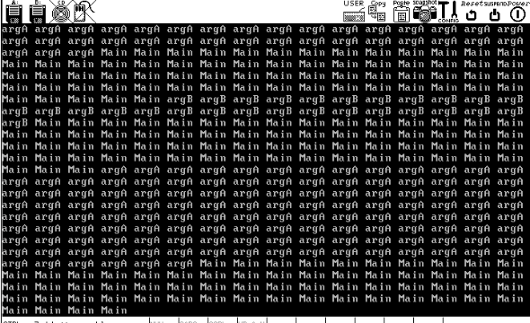

“argA”->“Main”->“argB”->“Main”->“argA”->“main”，
字符串打印顺序不再随线程调度的顺序一致，而且每组字符串的数量较之前关中断的版本多了一倍以上，因此线程阻塞起作用了。

---

---

## 从键盘获取输入

==键盘输入本质上是通过**中断**的方式将按键信息（扫描码）传递给 CPU==

### 原理简介

#### 键盘的工作机制

键盘是一个独立的输入设备，内部有一个称为键盘编码器（通常是 Intel 8048 或其兼容芯片）。当键盘上有按键操作时，编码器会将按键的状态（按下或弹起）报告给主机内部的键盘控制器（通常是 Intel 8042 或其兼容芯片）。

- **8048 芯片**：位于键盘内部，负责检测哪个按键被操作，并将按键的扫描码发送到键盘控制器。
- **8042 芯片**：位于主板上，负责接收来自 8048 的扫描码，解码并保存，然后发送中断信号给中断代理（如 8259A），处理器接收信号后，读取并处理这些扫描码。

#### 扫描码的构成

键盘上的每个键都有一个唯一的编码，即扫描码。扫描码有两种类型：
- **通码（Make Code）**：表示按键被按下。
- **断码（Break Code）**：表示按键被松开。

例如，按下空格键会产生一个通码 0x39，松开时产生断码 0xB9。

#### 键盘扫描码的种类

根据键盘的发展历史，扫描码有三套：
1. **第一套扫描码（Scan Code Set 1）**：最早用于 XT 键盘。
2. **第二套扫描码（Scan Code Set 2）**：常用于现代 AT 键盘。
3. **第三套扫描码（Scan Code Set 3）**：主要用于 IBM PS/2 系列高端键盘。

#### ★★★处理键盘输入的步骤

1. **按键状态变化**：当按键状态改变时，8048 生成对应的扫描码并发送给 8042。
2. **键盘中断处理**：8042 接收到扫描码后，<u>发送中断信号</u>，处理器读取扫描码。
3. **转换为 ASCII 码**：<u>中断处理程序</u>将扫描码转换为相应的 ASCII 码，再由字符处理程序输出到屏幕。

#### 扫描码的通用规律

大部分键的通码和断码关系简单：**断码 = 通码 + 0x80**。特殊键可能需要多字节表示。尽管扫描码与键的位置无关，但为了兼容性，8042 会将接收到的第二套或第三套扫描码转换为第一套。

---

### 8042

#### **计算机系统的分层结构与 8042 的角色**

计算机系统由多个处理器和控制芯片组成，各自负责特定的任务，分担主处理器的工作负担。键盘控制相关的芯片包括 8042 和 8048：

- **8048**：位于键盘内部，是键盘的编码器，负责监控按键，管理 LED 显示（如 NumLock 灯）等。8048 是键盘的“代言人”。
- **8042**：集成在主板南桥芯片中，是键盘控制器（I/O 接口），负责管理键盘与处理器的通信。它是 8048 的代理，通过接口（如 PS/2、USB）与键盘通信，传递键盘的按键数据和状态信息。

####  **8042 的寄存器结构**

8042 包含四个 8 位寄存器，通过两个端口（0x60 和 0x64）进行操作。


- **输出缓冲区（Output Buffer）**：
  - 地址：0x60
  - 操作：只读
  - 功能：用于存储来自 8048 的数据（如按键扫描码、命令应答）。处理器通过 `in` 指令从此寄存器读取数据。在数据读取之前，寄存器不会存入新的扫描码。
- **输入缓冲区（Input Buffer）**：
  - 地址：0x60
  - 操作：只写
  - 功能：用于接收来自处理器的命令或参数。处理器通过 `out` 指令向此寄存器写入数据，以控制 8048 或 8042 自身的工作。
- **状态寄存器（Status Register）**：
  - 地址：0x64
  - 操作：只读
  - 功能：反映 8042 和 8048 的内部工作状态。各位的含义如下：
    - **位 0**：1 表示输出缓冲区已满；处理器读取后自动置 0。
    - **位 1**：1 表示输入缓冲区已满；8042 读取后自动置 0。
    - **位 2**：系统标志位，自检通过后置 1。
    - **位 3**：1 表示输入缓冲区中的内容为命令；0 表示为数据。
    - **位 4**：1 表示键盘启用；0 表示禁用。
    - **位 5**：发送超时。
    - **位 6**：接收超时。
    - **位 7**：奇偶校验错误。
- **控制寄存器（Control Register）**：
  - 地址：0x64
  - 操作：只写
  - 功能：用于控制 8042 的工作模式，每个位设置不同的功能。
    - **位 0**：启用键盘中断。
    - **位 1**：启用鼠标中断。
    - **位 2**：设置状态寄存器的位 2。
    - **位 3**：状态寄存器的位 4 无效。
    - **位 4**：禁止键盘。
    - **位 5**：禁止鼠标。
    - **位 6**：将第二套扫描码转换为第一套。
    - **位 7**：保留位。

#### **8042 的输入与输出操作**

- **作为输入缓冲区**：当处理器要发送数据或命令给 8048 时，数据首先写入 8042 的输入缓冲区，再由 8042 发送至 8048。

- **作为输出缓冲区**：当 8048 完成任务（如按键被按下），会将结果发送到 8042 的输出缓冲区，等待处理器读取。

  

####  **操作指令**

- 使用 `out` 指令将数据写入 0x60 端口时，输入缓冲区被填充。
- 使用 `in` 指令从 0x60 端口读取数据时，输出缓冲区的数据被提取。


---

### 键盘中断处理程序

**1、代码功能**

按下键盘任意键后，屏幕上打印字符k，如果一直按住不松开，那么就连续打印

**2、实现原理**

键盘信号最后都是由中断处理器来处理，最后都是由对应的中断处理函数来处理

**3、代码逻辑**

A、为键盘中断建立中断处理函数

B、设定中断控制器，打开键盘中断信号

#### ▶ 代码

A、kernel.S：增加用汇编模板定义的汇编中断函数处理入口

```c
VECTOR 0x20,ZERO	;时钟中断对应的入口
VECTOR 0x21,ZERO	;键盘中断对应的入口
VECTOR 0x22,ZERO	;级联用的
VECTOR 0x23,ZERO	;串口2对应的入口
VECTOR 0x24,ZERO	;串口1对应的入口
VECTOR 0x25,ZERO	;并口2对应的入口
VECTOR 0x26,ZERO	;软盘对应的入口
VECTOR 0x27,ZERO	;并口1对应的入口
VECTOR 0x28,ZERO	;实时时钟对应的入口
VECTOR 0x29,ZERO	;重定向
VECTOR 0x2a,ZERO	;保留
VECTOR 0x2b,ZERO	;保留
VECTOR 0x2c,ZERO	;ps/2鼠标
VECTOR 0x2d,ZERO	;fpu浮点单元异常
VECTOR 0x2e,ZERO	;硬盘
VECTOR 0x2f,ZERO	;保留
```

B、kerboard.c：写出键盘中断处理函数intr_keyboard_handler；写出键盘初始化函数keyboard_init（调用中断注册函数注册键盘中断处理函数），并将其封装进入init_all

```c
#include "keyboard.h"
#include "print.h"
#include "interrupt.h"
#include "io.h"
#include "global.h"

#define KBD_BUF_PORT 0x60 // 键盘 buffer 寄存器端口号

/* 键盘中断处理程序 */
static void intr_keyboard_handler(void) {
    put_char('k'); // 每次中断打印字符 'k'
    inb(KBD_BUF_PORT); // 读取输出缓冲区寄存器，否则 8042 不再继续响应键盘中断
    return;
}

/* 键盘初始化 */
void keyboard_init() {
    put_str("keyboard init start\n");
    register_handler(0x21, intr_keyboard_handler); // 注册键盘中断处理程序
    put_str("keyboard init done\n");
}
```

C、interrupt.c：修改支持中断数量；修改中断控制器初始化代码pic_inic，只打开键盘中断（键盘中断信号接在主片的IR1引脚上）

D、写出测试代码main.c，就是一个死循环

```c
#include "print.h"
#include "init.h"
#include "thread.h"
#include "interrupt.h"
#include "console.h"
#include "keyboard.h"

void k_thread_a(void*);
void k_thread_b(void*);

int main(void) {
   put_str("I am kernel\n");
   init_all(); //包含对keyboard.c的初始化

   return 0;
}
```


从键盘上每按下一个键，打印一个k，松开按键，打印一个k。

---

---

## 键盘驱动

### 驱动程序

在计算机的分层架构中，硬件位于最底层，操作系统通过驱动程序与硬件交互。硬件虽然为软件提供了接口，但这些接口通常是通过复杂的 I/O 指令、寄存器设置等方式来实现的。这些直接控制硬件的操作对高层软件开发者来说非常复杂且繁琐，因此驱动程序的出现大大简化了这个过程。驱动程序封装了硬件的复杂控制逻辑，提供了一个简洁的接口，供操作系统或应用程序调用，从而实现对硬件的控制和数据交换。

---

### 键盘驱动程序及其实现

**键盘输入本质上是通过中断的方式将按键信息（扫描码）传递给 CPU，驱动程序需要处理这些中断并将扫描码转换为对应的字符或控制行为。**

#### 转义字符的介绍

在处理键盘输入时，字符分为两类：可见字符（如字母、数字等）和控制字符（如回车、退格等）。控制字符是不可见的，但可以用转义字符来表示，比如：

- `\t` 表示水平制表符（Tab 键）。
- `\b` 表示退格键（Backspace）。
- `\033`（八进制）或 `\x1b`（十六进制）表示 ESC 键。

#### ★★★键盘中断处理流程

键盘输入通过中断的方式传递给 CPU，驱动程序需要处理这些中断。以下是中断处理的主要流程：

1. **接收按键的扫描码**：当键盘按键被按下时，会产生一个通码（make code），而释放按键时则会产生一个断码（break code）。
2. **判断按键类型**：通过扫描码判断按键是普通字符键还是控制键。如果是普通字符键，则将其转换为相应的字符；如果是控制键，则触发对应的行为。
3. **映射转换**：通过一个映射表（数组），将扫描码转换为字符或控制行为。例如，按下 `A` 键时，如果 Shift 键被按下，则转换为大写字母 `A`，否则为小写字母 `a`。


#### ▶ 代码

键盘信号最终都会调用键盘中断处理函数处理，我们可以从8042中取出传入的通码、断码信息来还原按键的按下松开信息，以此针对性处理


/device/keyboard.c

```c
#include "keyboard.h"
#include "print.h"
#include "interrupt.h"
#include "io.h"
#include "global.h"

#define KBD_BUF_PORT 0x60   //键盘buffer寄存器端口号为0x60

#define esc '\033'		    //esc 和 delete都没有\转义字符这种形式，用8进制代替
#define delete '\0177'
#define enter '\r'
#define tab '\t'
#define backspace '\b'

#define char_invisible 0    //功能性 不可见字符均设置为0
#define ctrl_l_char char_invisible
#define ctrl_r_char char_invisible 
#define shift_l_char char_invisible
#define shift_r_char char_invisible
#define alt_l_char char_invisible
#define alt_r_char char_invisible
#define caps_lock_char char_invisible

///定义控制字符的通码和断码
#define shift_l_make 0x2a
#define shift_r_make 0x36
#define alt_l_make 0x38
#define alt_r_make 0xe038
#define alt_r_break 0xe0b8
#define ctrl_l_make 0x1d
#define ctrl_r_make 0xe01d
#define ctrl_r_break 0xe09d
#define caps_lock_make 0x3a


//二维数组，用于记录从0x00到0x3a通码对应的按键的两种情况（如0x02，不加shift表示1，加了shift表示！）的ascii码值
//如果没有，则用ascii0替代
char keymap[][2] = {
/* 0x00 */	{0,	0},		
/* 0x01 */	{esc,	esc},		
/* 0x02 */	{'1',	'!'},		
/* 0x03 */	{'2',	'@'},		
/* 0x04 */	{'3',	'#'},		
/* 0x05 */	{'4',	'$'},		
/* 0x06 */	{'5',	'%'},		
/* 0x07 */	{'6',	'^'},		
/* 0x08 */	{'7',	'&'},		
/* 0x09 */	{'8',	'*'},		
/* 0x0A */	{'9',	'('},		
/* 0x0B */	{'0',	')'},		
/* 0x0C */	{'-',	'_'},		
/* 0x0D */	{'=',	'+'},		
/* 0x0E */	{backspace, backspace},	
/* 0x0F */	{tab,	tab},		
/* 0x10 */	{'q',	'Q'},		
/* 0x11 */	{'w',	'W'},		
/* 0x12 */	{'e',	'E'},		
/* 0x13 */	{'r',	'R'},		
/* 0x14 */	{'t',	'T'},		
/* 0x15 */	{'y',	'Y'},		
/* 0x16 */	{'u',	'U'},		
/* 0x17 */	{'i',	'I'},		
/* 0x18 */	{'o',	'O'},		
/* 0x19 */	{'p',	'P'},		
/* 0x1A */	{'[',	'{'},		
/* 0x1B */	{']',	'}'},		
/* 0x1C */	{enter,  enter},
/* 0x1D */	{ctrl_l_char, ctrl_l_char},
/* 0x1E */	{'a',	'A'},		
/* 0x1F */	{'s',	'S'},		
/* 0x20 */	{'d',	'D'},		
/* 0x21 */	{'f',	'F'},		
/* 0x22 */	{'g',	'G'},		
/* 0x23 */	{'h',	'H'},		
/* 0x24 */	{'j',	'J'},		
/* 0x25 */	{'k',	'K'},		
/* 0x26 */	{'l',	'L'},		
/* 0x27 */	{';',	':'},		
/* 0x28 */	{'\'',	'"'},		
/* 0x29 */	{'`',	'~'},		
/* 0x2A */	{shift_l_char, shift_l_char},	
/* 0x2B */	{'\\',	'|'},		
/* 0x2C */	{'z',	'Z'},		
/* 0x2D */	{'x',	'X'},		
/* 0x2E */	{'c',	'C'},		
/* 0x2F */	{'v',	'V'},		
/* 0x30 */	{'b',	'B'},		
/* 0x31 */	{'n',	'N'},		
/* 0x32 */	{'m',	'M'},		
/* 0x33 */	{',',	'<'},		
/* 0x34 */	{'.',	'>'},		
/* 0x35 */	{'/',	'?'},
/* 0x36	*/	{shift_r_char, shift_r_char},	
/* 0x37 */	{'*',	'*'},    	
/* 0x38 */	{alt_l_char, alt_l_char},
/* 0x39 */	{' ',	' '},		
/* 0x3A */	{caps_lock_char, caps_lock_char}
};

int ctrl_status = 0;        //用于记录是否按下ctrl键
int shift_status = 0;       //用于记录是否按下shift
int alt_status = 0;         //用于记录是否按下alt键
int caps_lock_status = 0;   //用于记录是否按下大写锁定
int ext_scancode = 0;       //用于记录是否是扩展码

static void intr_keyboard_handler(void)
{
    int break_code;     //用于判断传入值是否是断码
    uint16_t scancode = inb(KBD_BUF_PORT);  //从8042的0x60取出码值
    if(scancode == 0xe0)	//如果传入是0xe0，说明是处理两字节按键的扫描码，那么就应该立即退出去取出下一个字节
    {
    	ext_scancode = 1;   //打开标记，记录传入的是两字节扫描码
    	return;     //退出
    }
    if(ext_scancode)    //如果能进入这个if，那么ext_scancode==1，说明上次传入的是两字节按键扫描码的第一个字节
    {
        scancode =( (0xe000) | (scancode) );    //合并扫描码，这样两字节的按键的扫描码就得到了完整取出
        ext_scancode = 0;   //关闭记录两字节扫描码的标志
    }

    break_code =( (scancode & 0x0080) != 0);  //断码=通码+0x80，如果是断码，那么&出来结果！=0，那么break_code值为1
    if(break_code)  //如果是断码，就要判断是否是控制按键的断码，如果是，就要将表示他们按下的标志清零，如果不是，就不处理。最后都要退出程序
    {
    	uint16_t make_code = (scancode &= 0xff7f); //将扫描码(现在是断码)还原成通码
    	if(make_code == ctrl_l_make || make_code == ctrl_r_make) 
            ctrl_status = 0;           //判断是否松开了ctrl
    	else if(make_code == shift_l_make || make_code == shift_r_make) 
            shift_status = 0;   //判断是否松开了shift
    	else if(make_code == alt_l_make || make_code == alt_r_make) 
            alt_status = 0;         //判断是否松开了alt
    	return;
    }
    //来到这里，说明不是断码，而是通码，这里的判断是保证我们只处理这些数组中定义了的键，以及右alt和ctrl。
    else if((scancode > 0x00 && scancode < 0x3b) || (scancode == alt_r_make) || (scancode == ctrl_r_make))
    {
    	int shift = 0; //确定是否开启shift的标志，先默认设置成0
    	uint8_t index = (scancode & 0x00ff);    //将扫描码留下低字节，这就是在数组中对应的索引
    
	    if(scancode == ctrl_l_make || scancode == ctrl_r_make)  //如果扫描码是ctrl_l_make，或者ctrl_r_make，说明按下了ctrl    	
	    {
            ctrl_status = 1;
            return;
        }
	    else if(scancode == shift_l_make || scancode == shift_r_make)
        {
            shift_status = 1;
            return;
        }
	    else if(scancode == alt_l_make || scancode == alt_r_make)
        {
            alt_status = 1;
            return;
        }
	    else if(scancode == caps_lock_make) //大写锁定键是按一次，然后取反
        {
            caps_lock_status = !caps_lock_status;
            return;
        }

		if ((scancode < 0x0e) || (scancode == 0x29) || (scancode == 0x1a) || \
			(scancode == 0x1b) || (scancode == 0x2b) || (scancode == 0x27) || \
			(scancode == 0x28) || (scancode == 0x33) || (scancode == 0x34) || (scancode == 0x35)) {  
			/*代表两个字母的键 0x0e 数字'0'~'9',字符'-',字符'='
                           0x29 字符'`'
                           0x1a 字符'['
                           0x1b 字符']'
                           0x2b 字符'\\'
                           0x27 字符';'
                           0x28 字符'\''
                           0x33 字符','
                           0x34 字符'.'
                           0x35 字符'/' 
            */
         	if (shift_status)// 如果同时按下了shift键
            	shift = true;
      	} 
      	else {	  // 默认为字母键
			if(shift_status + caps_lock_status == 1)
            	shift = 1;   //shift和大写锁定，那么判断是否按下了一个，而且不能是同时按下，那么就能确定是要开启shift
      	}

		put_char(keymap[index][shift]); //打印字符
	    return;
    }
    else 
		put_str("unknown key\n");
    return;
}

/* 键盘初始化 */
void keyboard_init() {
   put_str("keyboard init start\n");
   register_handler(0x21, intr_keyboard_handler);
   put_str("keyboard init done\n");
}
```


成功做到从键盘上输入什么，就在页面上打印什么！

---

---

## 环形输入缓冲区

​	环形缓冲区的本质是一个线性存储空间（通常为数组），但通过特殊的操作方式，使其逻辑上形成一个“环”，从而能够无限循环使用。这种结构主要由以下几个关键组件构成：

- **头指针**（Head Pointer）：指向数据写入位置，每次写入后移动到下一个位置。
- **尾指针**（Tail Pointer）：指向数据读取位置，每次读取后移动到下一个位置。
- **互斥锁**（Lock）：用于保证缓冲区操作的线程互斥，防止数据竞争。
- **生产者与消费者**：缓冲区记录了当前因无法操作而休眠的线程，用于协调线程之间的唤醒与阻塞。

```c
// 环形缓冲区
struct ioqueue {
    struct lock lock;                 // 缓冲区的锁，用于保证操作互斥
    struct task_struct* producer;     // 记录在缓冲区满时休眠的生产者
    struct task_struct* consumer;     // 记录在缓冲区空时休眠的消费者
    char buf[bufsize];                // 实际的缓冲区，大小由宏 `bufsize` 定义
    int32_t head;                     // 指向队列的队首，数据写入位置
    int32_t tail;                     // 指向队列的队尾，数据读取位置
};
```

​	通过控制头指针和尾指针在数组中的移动，可以实现数据的循环存取。例如，当头指针到达数组的末尾时，会自动回绕到数组的开头，使得操作环形化。

```c
static int32_t next_pos(int32_t pos) {
    return (pos + 1) % bufsize;  // 计算指针的下一个位置，并实现循环
}
```


如：消费者获取数据函数 `ioq_getchar`

- **功能**：消费者从缓冲区中取出一个数据。

- 操作：

  - 检查缓冲区是否为空；如果为空，则将消费者阻塞，直到被唤醒。
  - 读取尾指针位置的数据，并将尾指针移到下一个位置。
  - 如果之前有生产者在等待，将其唤醒以继续生产数据。

  ```c
  char ioq_getchar(struct ioqueue* ioq) {
      while (ioq_empty(ioq)) {                     // 缓冲区为空
          lock_acquire(&ioq->lock);                // 获取锁
          ioq_wait(&ioq->consumer);                // 消费者休眠
          lock_release(&ioq->lock);                // 释放锁
      }
      char byte = ioq->buf[ioq->tail];             // 读取数据
      ioq->tail = next_pos(ioq->tail);             // 移动尾指针
      if (ioq->producer != NULL) {
          wakeup(&ioq->producer);                  // 唤醒生产者
      }
      return byte;
  }
  ```

其余代码略。

---

### 添加键盘输入缓冲区

核心：

1. **键盘输入作为生产者将数据放入缓冲区。**
2. **两个消费者线程分别从缓冲区读取数据进行处理。**
3. **中断机制确保键盘数据正确进入缓冲区。**
4. **通过环形缓冲区与多线程模型，避免了消费者线程之间的直接冲突**
- 当缓冲区满时，键盘中断程序不会继续向缓冲区添加数据，超出的键盘输入将被丢弃。类似现实中主机发出“嘀嘀”提示音，这里则是简单地忽略多余的输入，防止溢出。
```c
#include "print.h"
#include "init.h"
#include "thread.h"
#include "interrupt.h"
#include "console.h"

/* 临时为测试添加 */
#include "ioqueue.h"
#include "keyboard.h"

void k_thread_a(void*);
void k_thread_b(void*);

int main(void) {
   put_str("I am kernel\n");
   init_all();
   thread_start("consumer_a", 31, k_thread_a, " A_");
   thread_start("consumer_b", 31, k_thread_b, " B_");
   intr_enable();
   while(1); 
   return 0;
}

/* 在线程中运行的函数 */
void k_thread_a(void* arg) {     
   while(1) {
      enum intr_status old_status = intr_disable();
      if (!ioq_empty(&kbd_buf)) {
         console_put_str(arg);
         char byte = ioq_getchar(&kbd_buf);
         console_put_char(byte);
      }
      intr_set_status(old_status);
   }
}

/* 在线程中运行的函数 */
void k_thread_b(void* arg) {     
   while(1) {
      enum intr_status old_status = intr_disable();
      if (!ioq_empty(&kbd_buf)) {
         console_put_str(arg);
         char byte = ioq_getchar(&kbd_buf);
         console_put_char(byte);
      }
      intr_set_status(old_status);
   }
}

```


在键盘上按住k 键不松手，屏幕上一直交替输出“B_k”，和“A_k”。

---

---

---

# GAP

## 键盘输入到打印到屏幕的整个流程


1.**硬件信号的生成（8048 和 8042）：** 键盘输入始于物理按键的按下或释放。按键触发信号，8048（键盘微控制器）生成相应的扫描码，并将扫描码发送给 8042（键盘控制器）。这整个过程完全由硬件控制，不涉及软件干预。

2.**中断控制与中断触发（8259A 与 8042）：**

- 8042 在接收到扫描码后，会通过触发键盘中断（通常是 IRQ1）来通知 CPU 进行处理。
- 中断请求信号发送给 8259A（可编程中断控制器），8259A 将中断请求排列并管理优先级，然后将中断信号传递给 CPU。
- CPU 响应中断请求，通过中断向量表查找相应的中断服务程序（ISR），以处理从键盘控制器接收到的输入。

3.**中断处理与扫描码读取：**

- 在中断服务程序中，操作系统捕获到中断并调度键盘驱动程序。驱动程序读取 8042 中的扫描码，并进行进一步处理。

4.**扫描码解析和字符映射（驱动程序的核心工作）：**

- 键盘驱动程序负责解析扫描码，将其解释为用户预期的字符或操作。例如，驱动程序会判断按键是否与修饰键（如 Shift、Ctrl 等）组合使用，并调整字符映射，处理如大小写转换等内部状态的更新。

5.**输出字符到屏幕或传递到应用层：**

- 最终，转换后的字符或控制命令会传递到应用程序层，如文本编辑器或其他软件，处理如光标移动、字符显示等功能。

---

---

---

# 十一章 用户进程

前面实现的内容中，程序都在最高特权级0级下工作，因此任何程序都可以访问和修改一切的系统资源。

因此，需要对用户程序进行特权级的降级。

## 任务状态段TSS

- TSS 是 CPU 原生支持的硬件机制，用于管理任务的上下文切换。
- **任务切换的核心是通过 TR 寄存器指向不同的 TSS 来实现，TSS 中存储了任务的寄存器快照。**
  - 在任务切换时，CPU 会将当前任务的状态（寄存器组的值）自动保存到当前任务的 TSS 中，同时从新任务的 TSS 中恢复对应的寄存器值，实现任务的上下文切换。
- 这种硬件级的任务切换为多任务操作提供了基础，但现代系统一般还会结合软件层的优化机制进行调度。

### TSS描述符

- TSS 像其他段一样，**是一片内存区域**，因此需要用 TSS 描述符来描述它。
- TSS 描述符**需要在全局描述符表（GDT）中注册**，才能被 CPU 识别和访问。
- 描述符中包含一个繁忙位（B 位），用来标识任务是否正在运行或嵌套调用了其他任务。


### TR寄存器

- TR 是一个专门的寄存器，用于指向当前正在执行任务的 TSS。

- CPU 通过 TR 寄存器判断当前任务及其状态，当任务切换时，TR 指向新的 TSS，完成上下文的保存和恢复。

  

### ★★★内存中的TSS、LDT、GDT


---

---

## 实现用户进程

### 进程和线程的区别

**进程**：**拥有独立的地址空间**，创建进程时**需为其单独创建页表**（页目录表 + 页表）。页目录表存储页目录项 (PDE)，每个 PDE 指向不同的页表。

**线程**：共享进程的地址空间，不需要独立的页表。

**特权级**：内核线程运行在特权级 0，而用户进程运行在特权级 3。为用户进程创建特权级 3 的栈，分配对应的虚拟内存。

---

### 进程控制块 (PCB)

```c
struct task_struct {
    uint32_t* self_kstack;          // 线程的内核栈，每个线程有自己独立的内核栈
    enum task_status status;        // 线程或进程的状态
    char name[16];                  // 线程或进程的名称
    uint8_t priority;               // 线程或进程的优先级
    struct list_elem general_tag;   // 用于一般队列中的结点
    struct list_elem all_list_tag;  // 用于线程队列 thread_all_list 中的结点
    uint32_t* pgdir;                // 进程页表的虚拟地址
    struct virtual_addr userprog_vaddr; // 用户进程的虚拟地址池
    uint32_t stack_magic;           // 栈的边界标记，用于检测栈溢出
};
```

---

### 将用户进程从特权级0改为特权级3（降级）

- CPU 不允许从高特权级转向低特权级，除非是从中断和调用门返回的情况下
- 在这里我们借助**从中断返回**的方式

关键点：

**关键点 1**：必须通过 `intr_exit` 假装从中断返回。`intr_exit` 是一个汇编函数，用于恢复任务上下文状态并退出中断。

**关键点 2**：提前准备好用户进程的栈结构 `struct intr_stack`，将上下文信息填充到栈中，通过 `pop` 操作将数据装载到寄存器。

**关键点 3**：栈中存储的 CS 选择子，其 RPL 必须为 3。RPL (请求者特权级) 代表访问者的特权级，与 CPL（当前特权级）一致，确保合法访问。

**关键点 4**：栈中段寄存器的选择子必须指向 DPL（描述符特权级）为 3 的内存段，限制低特权级任务只能访问低特权级的内存段。

**关键点 5**：`eflags` 中的 IF 位（中断标志）必须为 1，允许中断。

**关键点 6**：`eflags` 中的 IOPL 位（I/O 优先级等级）必须为 0，禁止用户进程直接访问硬件。

> 综上：在特权级 0 环境中，通过 `iretd` 指令返回低特权级，同时利用准备好的栈数据恢复上下文，成功进入特权级 3。

---

### ★★★用户进程创建的流程

#### 进程创建

- 进程的创建由函数 `process_execute` 完成，`process_execute` 的参数是待执行的用户进程 `user_prog`。在整个进程创建流程中，`user_prog` 出现了多次，展示了它在不同阶段是如何被安装和利用的。

- 进程创建的过程是基于线程实现的，涉及到多个线程创建相关的函数：

  - 首先，`process_execute` 调用 `get_kernel_pages` 从物理内存池中申请 1 页内存创建进程的 PCB（Process Control Block），这里的 PCB 实际上是一个线程（thread）。

    -  `get_kernel_pages` 实质是调用`malloc_page`函数，在该函数前后加锁放锁，将其封装成原子操作。

      >  `malloc_page`的原理是三个动作的合成：
      >
      > 1通过vaddr_get在虚拟内存池中申请虚拟地址
      >
      > 2通过palloc在物理内存池中申请物理页
      >
      > 3通过page_table_add将以上得到的虚拟地址和物理地址在页表中完成映射

    - `get_kernel_pages` 内存申请成功返回虚拟地址。

  - 接着，调用 `init_thread` 对该线程进行初始化。

  - 之后，通过 `create_user_vaddr_bitmap` 为用户进程创建用于管理虚拟地址空间的位图。

    - `create_user_vaddr_bitmap`中会调用 `get_kernel_pages` 函数，申请的位图大小范围为4GB虚拟空间中的0x8048000～0xc0000000（几乎就是0～3GB）

      > **申请的位图大小**是用于管理进程**虚拟地址空间的所有内存的大小**，而不是内存池的大小。

  - 通过 `thread_create` 创建线程，这一步将函数 `start_process` 和用户进程 `user_prog` 作为 `kernel_thread` 的参数，以便 `kernel_thread` 能够调用 `start_process(user_prog)`。

  - 然后，调用 `create_page_dir` 为进程创建页表。

  - 最后，通过 `list_append` 将进程的 PCB（即线程）加入到就绪队列和全部队列中。

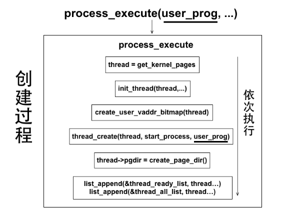

#### 进程执行

- 进程的执行是由时钟中断调用的调度函数 `schedule` 完成的。`schedule` 从就绪队列中获取 PCB，当获取到的是新创建的进程时，该进程就会被执行。
- 在 `schedule` 中，首先通过 `process_activate` 激活进程或线程的相关资源（如页表）。
- 接着，通过 `switch_to` 函数进行进程调度。在创建线程时，已经将 `kernel_thread` 作为 `switch_to` 的返回地址，这意味着 `switch_to` 在退出后会执行 `kernel_thread`，相当于 `switch_to` 调用了 `kernel_thread`。
- `kernel_thread` 会调用 `start_process(user_prog)`，而 `start_process` 的主要任务是构建用户进程的上下文，使 `user_prog` 能够“从中断返回”并进入 3 特权级（用户态）。这里“从中断返回”是为了利用 `iretd` 指令，将 `user_prog` 作为 EIP（指令指针寄存器）的值。
- 最终，`start_process` 跳转到 `intr_exit`（内核汇编代码中的一个函数），利用 `iretd` 指令，使用户进程 `user_prog` 得以在 3 特权级下执行。


---

#### 执行效果

```c
#include "print.h"
#include "init.h"
#include "thread.h"
#include "interrupt.h"
#include "console.h"
#include "process.h"

void k_thread_a(void*);
void k_thread_b(void*);
void u_prog_a(void);
void u_prog_b(void);
int test_var_a = 0, test_var_b = 0;

int main(void) {
   put_str("I am kernel\n");
   init_all();

   thread_start("k_thread_a", 31, k_thread_a, "argA ");
   thread_start("k_thread_b", 31, k_thread_b, "argB ");
   process_execute(u_prog_a, "user_prog_a");
   process_execute(u_prog_b, "user_prog_b");

   intr_enable();
   while(1);
   return 0;
}

/* 在线程中运行的函数 */
void k_thread_a(void* arg) {     
   char* para = arg;
   while(1) {
      console_put_str(" v_a:0x");
      console_put_int(test_var_a);
   }
}

/* 在线程中运行的函数 */
void k_thread_b(void* arg) {     
   char* para = arg;
   while(1) {
      console_put_str(" v_b:0x");
      console_put_int(test_var_b);
   }
}

/* 测试用户进程 */
void u_prog_a(void) {
   while(1) {
      test_var_a++;
   }
}

/* 测试用户进程 */
void u_prog_b(void) {
   while(1) {
      test_var_b++;
   }
}
```


运行一段时间之后，这两个变量的值在用户进程的++下越来越大了。

---

---

---

# 十二章 进一步完善内核

## Linux系统调用

```bash
系统功能调用
├── 用户空间
│   └── 接口函数
│       ├── 提供用户接口
│       ├── 发起系统调用请求
│       └── 与内核交互
└── 内核空间
    └── 该调用对应的实现细节
        ├── 系统调用处理
        ├── 执行具体功能
        └── 资源管理与分配
```

一个系统功能调用分为两部分：

1. 一部分是暴露给用户进程的接口函数，它属于用户空间，此部分只是用户进程使用系统调用的途径，只负责发需求。
2. 另一部分是与之对应的内核具体实现，它属于内核空间，此部分完成的是功能需求，就是我们一直所说的系统调用子功能处理函数。

---

### ★★★系统调用流程

#### 实现流程

1.**中断门**：使用中断门实现系统调用，效仿 Linux，使用 `0x80` 号中断作为入口。

2.**中断描述符表（IDT）**：在 IDT 中安装 `0x80` 号中断的描述符，注册对应的中断处理例程。

3.**系统调用子功能表**：建立系统调用子功能表 `syscall_table`，通过 `eax` 寄存器中的子功能号索引相应的系统调用处理函数。

4.**用户空间系统调用接口**：使用宏实现用户空间的系统调用接口 `_syscall`，支持最多 3 个参数。

- 参数传递方式：
  - `eax` 储存子功能号。
  - `ebx` 储存第 1 个参数。
  - `ecx` 储存第 2 个参数。
  - `edx` 储存第 3 个参数。


> 中断处理函数与中断历程函数的区别：
>
> **中断处理函数**：
>
> - 这是在发生中断时执行的函数，负责处理中断请求。在系统调用的上下文中，中断处理函数是由内核提供的，用于处理用户程序的系统调用请求。具体来说，当用户程序通过 `int 0x80` 发起系统调用时，控制权转移到内核，中断处理函数被调用来执行特定的操作。
>
> **中断历程函数**（通常指中断处理流程）：
>
> - 这是处理系统调用的整个过程，包括保存上下文、处理系统调用、恢复上下文等。在这个过程中，中断处理函数会：
>   - 保存当前进程的状态。
>   - 读取 `eax` 寄存器以获取系统调用号。
>   - 查找对应的处理函数并执行。
>   - 恢复进程状态并返回到用户模式。

> 系统调用子功能表是什么？
>
> 系统调用子功能表（`syscall_table`）是一个数组或哈希表（TinyOS是数组），其中的每个元素对应一个系统调用处理函数。当用户程序发起系统调用时，内核通过 `eax` 寄存器中的系统调用号作为索引，快速查找 `syscall_table` 中对应的处理函数。

---

#### ==用户进程执行系统调用时的流程==

1. 用户进程执行系统调用函数，触发`0x80`中断。
2. CPU 进入内核态，调用中断处理函数。
3. 中断处理函数读取 `eax` 寄存器中的系统调用号。
4. 根据系统调用号在 `syscall_table` 中查找对应的处理函数。
5. 调用处理函数，执行相应的系统调用逻辑。
6. 将结果返回到用户进程，并恢复之前的上下文。

---

#### ▶ 代码（获取pid的系统调用）

**main.c**

```c
#include "print.h"
#include "init.h"
#include "thread.h"
#include "interrupt.h"
#include "console.h"
#include "process.h"
#include "syscall-init.h"
#include "syscall.h"

void k_thread_a(void*);
void k_thread_b(void*);
void u_prog_a(void);
void u_prog_b(void);
int prog_a_pid = 0, prog_b_pid = 0;

int main(void) {
   put_str("I am kernel\n");
   init_all();

   process_execute(u_prog_a, "user_prog_a");
   process_execute(u_prog_b, "user_prog_b");

   intr_enable();
   console_put_str(" main_pid:0x");
   console_put_int(sys_getpid());
   console_put_char('\n');
   thread_start("k_thread_a", 31, k_thread_a, "argA ");
   thread_start("k_thread_b", 31, k_thread_b, "argB ");
   while(1);
   return 0;
}

/* 在线程中运行的函数a */
void k_thread_a(void* arg) {     
   char* para = arg;
   console_put_str(" thread_a_pid:0x");
   console_put_int(sys_getpid());
   console_put_char('\n');
   console_put_str(" prog_a_pid:0x");
   console_put_int(prog_a_pid);
   console_put_char('\n');
   while(1);
}

/* 在线程中运行的函数b */
void k_thread_b(void* arg) {     
   char* para = arg;
   console_put_str(" thread_b_pid:0x");
   console_put_int(sys_getpid());
   console_put_char('\n');
   console_put_str(" prog_b_pid:0x");
   console_put_int(prog_b_pid);
   console_put_char('\n');
   while(1);
}

/* 测试用户进程a */
void u_prog_a(void) {
   prog_a_pid = getpid();
   while(1);
}

/* 测试用户进程b */
void u_prog_b(void) {
   prog_b_pid = getpid();
   while(1);
}
```

**代码中创建了：**

1. 两个**用户进程**：u_prog_a 和 u_prog_b，通过调用**getpid()**来获得自己的进程**pid**，并将pid存储在全局变量 prog_a_pid 和  rog_b_pid中。
2. 两个**内核线程**：k_thread_a和 k_thread_b，通过调用 **sys_getpid()**来获得自己的 **pid**
3. 再加上一个main的主线程，一共三个内核线程，两个用户进程


##### ★★★用户进程和内核线程获取 PID 的流程

**用户进程 `u_prog_a` 和 `u_prog_b`**：

1. 在这两个函数中，通过调用 `getpid()` 来获取自身的 PID。具体实现如下：

   ```c
   prog_a_pid = getpid();
   ```

2. `getpid()` 函数实际上是一个系统调用，它内部会调用 `_syscall0(SYS_GETPID)`，后者会触发 0x80 中断，将控制权转移到内核。

   ```c
   /* 无参数的系统调用 */
   #define _syscall0(NUMBER) ({				       \
      int retval;					               \
      asm volatile (					       \
      "int $0x80"						       \
      : "=a" (retval)					       \
      : "a" (NUMBER)					       \
      : "memory"						       \
      );							       \
      retval;						       \
   })
   ```

3. 在内核中，`syscall_handler` 处理该中断。它根据存在**eax**寄存器中的中断号查找系统调用表`syscall_table`对应的处理函数 `sys_getpid()`，并调用。

   ```assembly
   syscall_handler:
      push 0			           
      push ds
      push es
      push fs
      push gs
      pushad			           
      push 0x80			      
   
      push edx			            ; 系统调用中第3个参数
      push ecx			            ; 系统调用中第2个参数
      push ebx			            ; 系统调用中第1个参数
   
      call [syscall_table + eax*4]	    ; 编译器会在栈中根据C函数声明匹配正确数量的参数
      add esp, 12			        
   
      mov [esp + 8*4], eax	
      jmp intr_exit		        ; intr_exit返回,恢复上下文
   
   ```

4. `sys_getpid()` 的实现如下，`running_thread()` 函数返回当前运行线程的结构体，其中包含其 PID（线程的PID在创建线程的时候就已经被分配了，所以这边只需要获取即可）

   ```c
   uint32_t sys_getpid(void) {
       return running_thread()->pid; // 返回当前任务的 pid
   }
   ```

**内核线程 `k_thread_a` 和 `k_thread_b`**：

- 这些线程同样调用 `sys_getpid()` 以获取自身的 PID：
  ```c
  console_put_int(sys_getpid());
  ```
- 内核线程调用 `sys_getpid()` 过程与用户进程类似，因为它们都是在内核态下运行。


> 综上：可以认为**用户进程**为了获取pid，进行了一系列的函数的调用（进入内核态），最终落到了sys_getpid()函数上；而**内核线程**因为本身就在内核中，优先级高，因此它获取pid可以直接调用sys_getpid()函数


​	从上到下显示了主线程的 pid，其值为 1，线程 thread_a 的 pid 为 0x4，用户进程 prog_a 的 pid 为 0x2，线程 thread_b 的 pid 为 0x5，进程 prog_b 的 pid 为 0x3。根据 pid 的值可以看出，任务创建的顺序和代码顺序是一样的，主线程是最先创建的，因此 pid 为 1，接着是两个用户进程和两个内核线程，至于打印的顺序并不与任务创建顺序一致，这与创建用户进程的步骤较多、实际调度时机和申请锁时的阻塞有关。

---

---

## 用户进程的printf

### 可变参数

可变参数函数允许参数的个数在调用时确定，而不是在编译时固定。这种机制使得函数能够灵活地处理不同数量的输入，比如 `printf`。

C 调用约定

- C 语言采用特定的调用约定：参数从右向左压入栈，由调用者负责清理栈中的参数。这样，调用者可以在函数内获知压入的参数个数。

格式化字符串（TinyOS用到的）

- `printf` 函数的第一个参数是格式化字符串，其中的 `%` 符号用作查找参数的线索。每遇到一个 `%`，函数便可以从栈中读取一个参数。

---

### ★★★printf实现流程(%x)

让我们以打印数字 `1390` 为例，调用 `printf("Value: 0x%x\n", 1390);` 的具体过程如下：

1.**函数调用**

- 用户调用 `printf("Value: 0x%x\n", 1390);`。
- 编译器计算 `1390` 的值，并准备好调用。

2.**`printf` 函数内部**

- 调用 `va_start` 初始化可变参数列表，使其指向 `1390`。

- `printf` 创建一个字符数组 `buf`（假设大小为 1024 字节）。

- 调用 `vsprintf(buf, "Value: 0x%x\n", args);`。

  ```c
  /* 格式化输出字符串format */
  uint32_t printf(const char* format, ...) {
     va_list args;
     va_start(args, format);	       					// 使args指向format
     char buf[1024] = {0};	       					// 用于存储拼接后的字符串
     vsprintf(buf, format, args);
     va_end(args);
     return write(buf); 
  }
  ```

3.**`vsprintf` 处理**

- 在 `vsprintf` 中，开始遍历格式字符串 `"Value: 0x%x\n"`。
- 逐字符复制到 `buf`：复制 `V`、`a`、`l`、`u`、`e`、`:`、` `（空格）等到 `buf`。
  
- 当遇到 `%` 时，识别到格式符 `x`。

  ```c
  /* 将参数ap按照格式format输出到字符串str,并返回替换后str长度 */
  uint32_t vsprintf(char* str, const char* format, va_list ap) {
  	char* buf_ptr = str;
  	const char* index_ptr = format;
  	char index_char = *index_ptr;
  	int32_t arg_int;
  	while(index_char) {
  		if (index_char != '%') {
  			*(buf_ptr++) = index_char;
  			index_char = *(++index_ptr);
  			continue;
  		}
  		index_char = *(++index_ptr);	 			// 得到%后面的字符
  		switch(index_char) {
  		case 'x':
  			arg_int = va_arg(ap, int);
  			itoa(arg_int, &buf_ptr, 16); 	
  			index_char = *(++index_ptr); 			// 跳过格式字符并更新index_char
  			break;
  		}
  	}
  	return strlen(str);
  }
  ```


4.**参数提取**

- 使用 `va_arg` 获取参数，得到 `arg_int = 1390`。

5.**整型转换**

- 调用 `itoa(1390, &buf_ptr, 16)`：
  - `1390 % 16 = 14`（余数为 `14`，表示字符 `E`）。
  - `1390 / 16 = 86`，继续递归。
  - `86 % 16 = 6`（余数为 `6`，表示字符 `6`）。
  - `86 / 16 = 5`，继续递归。
  - `5 % 16 = 5`（余数为 `5`，表示字符 `5`）。
  - `5 / 16 = 0`，结束递归。
  
  ```c
  /* 将整型转换成字符(integer to ascii) */
  static void itoa(uint32_t value, char** buf_ptr_addr, uint8_t base) {
     	uint32_t m = value % base;	                  	// 求模,最先掉下来的是最低位   
     	uint32_t i = value / base;	                  	// 取整
     	if (i) {			                            // 如果倍数不为0则递归调用。
        	itoa(i, buf_ptr_addr, base);
     	}
     	if (m < 10) {     								// 如果余数是0~9
        	*((*buf_ptr_addr)++) = m + '0';	  			// 将数字0~9转换为字符'0'~'9'
     	} 
  	else {	      									// 否则余数是A~F
        	*((*buf_ptr_addr)++) = m - 10 + 'A'; 		// 将数字A~F转换为字符'A'~'F'
     	}
  }
  ```

6.**字符构建**

- 字符顺序是从最低位到最高位，最后的字符顺序是 `5`, `6`, `E`，写入 `buf`：
  - `buf` 更新为 `"Value: 0x56E"`。
  

7.**返回字符串长度**

- `vsprintf` 返回最终字符串的长度（例如，12 字节）。

8.**输出结果**

- `printf` 通过 `write(buf)` 将 `buf` 的内容输出到控制台。

  ```c
  uint32_t sys_write(char* str) {
     	console_put_str(str);
     	return strlen(str);
  }
  ```

> 系统调用writed()的实现过程和pid的类似，最终的sys_write()函数调用的是console_put_str(str)，即前面我们封装的终端打印字符串的函数。

9.**结束**

- `printf` 返回输出的字节数，函数调用结束。

最终输出结果为：`Value: 0x56E`。

---

#### “%c”、“%s”和“%d”
字符串输出 (`%s`)

- 获取参数

  ```c
  arg_str = va_arg(ap, char*);
  ```

- 复制字符串

  ```c
  strcpy(buf_ptr, arg_str);
  buf_ptr += strlen(arg_str);
  ```

单字符输出 (`%c`)

- 获取字符并写入：

  ```c
  *(buf_ptr++) = va_arg(ap, int); // 注意：`char` 会被提升为 `int`
  ```

整数输出 (`%d`)

- 类似%x，只是分割时除数为10

main.c

```c
#include "print.h"
#include "init.h"
#include "thread.h"
#include "interrupt.h"
#include "console.h"
#include "process.h"
#include "syscall-init.h"
#include "syscall.h"
#include "stdio.h"

void k_thread_a(void*);
void k_thread_b(void*);
void u_prog_a(void);
void u_prog_b(void);

int main(void) {
   put_str("I am kernel\n");
   init_all();

   process_execute(u_prog_a, "u_prog_a");
   process_execute(u_prog_b, "u_prog_b");

   console_put_str(" I am main, my pid:0x");
   console_put_int(sys_getpid());
   console_put_char('\n');
   intr_enable();
   thread_start("k_thread_a", 31, k_thread_a, "I am thread_a");
   thread_start("k_thread_b", 31, k_thread_b, "I am thread_b ");
   while(1);
   return 0;
}

/* 在线程中运行的函数 */
void k_thread_a(void* arg) {     
   char* para = arg;
   console_put_str(" I am thread_a, my pid:0x");
   console_put_int(sys_getpid());
   console_put_char('\n');
   while(1);
}

/* 在线程中运行的函数 */
void k_thread_b(void* arg) {     
   char* para = arg;
   console_put_str(" I am thread_b, my pid:0x");
   console_put_int(sys_getpid());
   console_put_char('\n');
   while(1);
}

/* 测试用户进程 */
void u_prog_a(void) {
   char* name = "prog_a";
   printf(" I am %s, my pid:%d%c", name, getpid(),'\n');
   while(1);
}

/* 测试用户进程 */
void u_prog_b(void) {
   char* name = "prog_b";
   printf(" I am %s, my pid:%d%c", name, getpid(), '\n');
   while(1);
}
```


完美。

---

---

## 堆内存管理

### malloc底层原理（arena内存仓库)

Arena 是内存管理中的一个重要结构，它将一大块内存划分为多个小内存块，以满足不同大小内存的分配需求。

> 拿面馆举例子，有的人饭量小，有的人饭量大，面馆就为这两类顾客分别准备了小碗面和大碗面（价格当然也就不同了，不过这不重要），我们只要知道有大碗和小碗两种容量的面。面馆的生意特别火，总是有顾客排队等面，煮面的师傅为了大量且同时供应这两种碗面，用了两口大锅同时煮面条，这两口大锅的容量是一样的，煮的面条数量也是一样。面煮熟之后，第 1 口大锅中的面条专用于供应小碗面，它被平均分成 30 份小碗面，第 2 口大锅专用于供应大碗面，它被平均分成 20 份大碗面，这样同时可以满足 30 位买小碗面的顾客和 20 位买大碗面的顾客。这里的两口大锅可以理解为两种不同规格的 arena，第 1 口锅只供应 30 碗小碗面，如同一种只供应 16 字节大小内存块的 arena，第 2 口锅只供应 20 碗大碗面，如同另一种只供应 32 字节大小内存块的 arena，这两种 arena 的总大小都是一口大锅的容量，但由于各自内存块规格容量的不同，两个 arena 各自容纳的内存块数量也是不同的，内存块的数量等于 arena 内存池区域的大小/内存块规格容量。

​	在内存管理系统中，arena 为任意大小内存的分配提供了统一的接口，它既支持 1024 字节以下的小块内存的分配，又支持大于 1024 字节以上的大块内存，**malloc 函数实际上就是通过 arena 申请这些内存块**。**arena 是个内存仓库，并不直接对外提供内存分配，只有内存块描述符才对外提供内存块**，**内存块描述符将同类 arena 中的空闲内存块汇聚到一起**，作为某一规格内存块的分配入口。因此，内存块描述符与 arena 是一对多的关系，每个 arena 都要与唯一的内存块描述符关联起来，多个同一规格的 arena 为同一规格的内存块描述符供应内存块，它们各自的元信息中用内存块描述符指针指向同一个内存块描述符。

- 内存仓库arena和内存块描述符都是结构体：

```c
/* 内存块描述符 */
struct mem_block_desc {
   uint32_t block_size;		 // 该内存块描述符所管理的内存块的大小
   uint32_t blocks_per_arena;
   struct list free_list;	 // 该链表索引着在arena中大小为block_size的内存块
};
```

```c
/* 内存仓库arena元信息 */
struct arena {
   struct mem_block_desc* desc;	 // 该指针指向此arena关联的mem_block_desc，即mem_block_desc中的链表可以索引到该arena仓库中的所有可用内存块
   uint32_t cnt;
   bool large;		   /* large为ture时,cnt表示的是页框数。否则cnt表示空闲mem_block数量 */
};
```

==arena是一个内存仓库，里面的内存块大小都一样。不同的仓库里面的内存块大小都不同。==

==内存块描述符中有个链表，链接了仓库中同一种大小的内存块==

仓库有多种，

==不同的仓库如果里面的内存块大小相同，他们就是一类仓库，他们都有一个指向同一个内存块描述符的指针==

==如果不同的仓库的内存块大小不同，则指向的内存块描述符也不同==

内存描述符有多种，==分别管理不同大小的内存块==


​	右上角的 A 图是用于处理大于 1024 字节的大内存的 arena，其大小是 1 页框以上，其中的内存池部分并没有划分成多个小内存块，因此 arena 元信息中，内存块描述符指针 mem_block_desc 值为 NULL。

​	左下角的图 B 是被拆分成 64KB 小内存块的 arena，其指针 mem_block_desc 指向规格为 64 字节的内存块描述符，内存块描述符的空闲内存块链表 free_list 将 arena 中可用内存块汇总。

​	我们说过，当一个 arena 中的内存块不够用时，需要用多个 arena 为同一规格内存块“供货”，图 C 描述的就是这种情况。此例的内存块描述符规格是 16 字节，因此与其关联“供货”的 arena 规格也必须是 16 字节。起初是左边那个 arena 为其提供内存块，当它的内存块分配耗尽时，系统又创建右边的 arena（虚线表示的），从而保证该规格的内存块“货源充足”。

---

### ★★★动态内存分配函数sys_malloc()

内核线程调用sys_malloc(63)流程：

- 选择内存池（内核或用户）。
- 根据要申请的内存块的大小，获取对应的内存块描述符。
- 检查内存块描述符结构体中的 `free_list` 是否为空。
- 如果为空，则调用 `malloc_page` 分配一个新页框作为 arena 内存仓库。
- 将 arena 内存仓库中的指针指向对应的内存块描述符，并对仓库进行切割成相同大小的内存块，每切一块，内存描述符中的链表就链接一块。
- 从 `free_list` 链表中取出一个或多个内存块，使之能大于想要malloc的大小。
- 返回内存块指针。

main.c

```c
#include "print.h"
#include "init.h"
#include "thread.h"
#include "interrupt.h"
#include "console.h"
#include "process.h"
#include "syscall-init.h"
#include "syscall.h"
#include "stdio.h"
#include "memory.h"

void k_thread_a(void*);
void k_thread_b(void*);
void u_prog_a(void);
void u_prog_b(void);

int main(void) {
   put_str("I am kernel\n");
   init_all();
   intr_enable();
   thread_start("k_thread_a", 31, k_thread_a, "I am thread_a");
   thread_start("k_thread_b", 31, k_thread_b, "I am thread_b ");
   while(1);
   return 0;
}

/* 在线程中运行的函数 */
void k_thread_a(void* arg) {     
   char* para = arg;
   void* addr = sys_malloc(33);
   console_put_str(" I am thread_a, sys_malloc(33), addr is 0x");
   console_put_int((int)addr);
   console_put_char('\n');
   while(1);
}

/* 在线程中运行的函数 */
void k_thread_b(void* arg) {     
   char* para = arg;
   void* addr = sys_malloc(63);
   console_put_str(" I am thread_b, sys_malloc(63), addr is 0x");
   console_put_int((int)addr);
   console_put_char('\n');
   while(1);
}

/* 测试用户进程 */
void u_prog_a(void) {
   char* name = "prog_a";
   printf(" I am %s, my pid:%d%c", name, getpid(),'\n');
   while(1);
}

/* 测试用户进程 */
void u_prog_b(void) {
   char* name = "prog_b";
   printf(" I am %s, my pid:%d%c", name, getpid(), '\n');
   while(1);
}
```

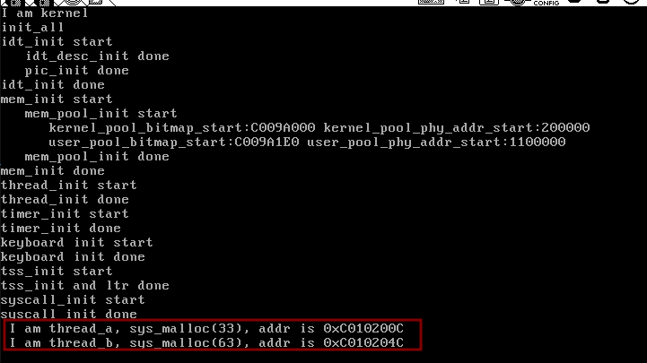

---

